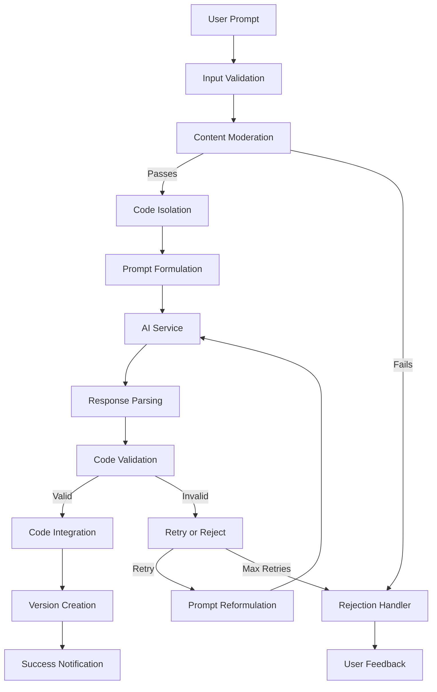
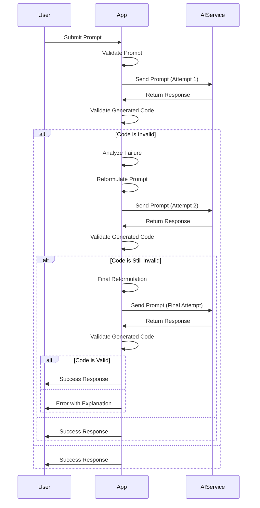
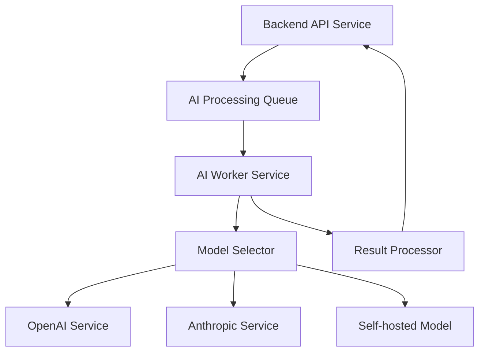
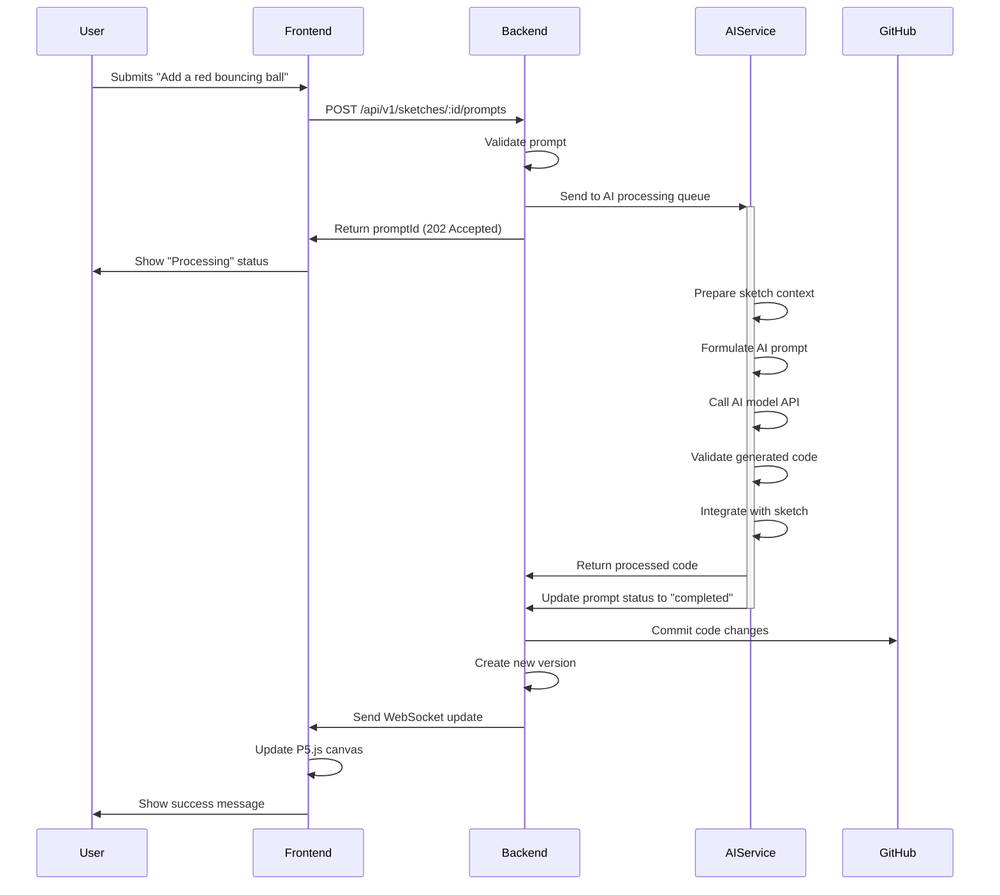

# AI Integration Strategy

This document outlines the strategy for integrating AI capabilities into the Sketchy Chain application, focusing on safely and effectively processing user prompts to modify P5.js sketches.

## Overview

The AI integration is a core component of the application, enabling natural language prompts to be transformed into valid P5.js code modifications. The system must ensure that:

1. User prompts only modify the drawing code, not application code
2. Generated code is safe, valid, and doesn't introduce security vulnerabilities
3. The original sketch structure is preserved
4. Inappropriate or destructive prompts are rejected
5. The AI provides helpful error messages when prompts cannot be processed



## Prompt Processing Pipeline

The prompt processing pipeline consists of several stages that transform a user's natural language input into valid P5.js code modifications.

### 1. Input Validation and Preprocessing

Before sending prompts to the AI service, the application performs initial validation:

- **Length Validation**: Ensures the prompt is between 3-500 characters
- **Basic Content Filtering**: Rejects obviously inappropriate content
- **Keyword Scanning**: Identifies attempts to inject malicious code or modify application structure
- **Context Enrichment**: Adds metadata about the current sketch state

```javascript
function validatePrompt(prompt, sketchId) {
  // Check length
  if (prompt.length < 3 || prompt.length > 500) {
    return {
      isValid: false,
      reason: `Prompt must be between 3 and 500 characters (currently ${prompt.length})`
    };
  }
  
  // Check for obvious malicious content
  const dangerousPatterns = [
    /eval\s*\(/i,
    /document\.location/i,
    /window\.location/i,
    /fetch\s*\(/i,
    /XMLHttpRequest/i,
    /<script>/i
  ];
  
  for (const pattern of dangerousPatterns) {
    if (pattern.test(prompt)) {
      return {
        isValid: false,
        reason: "Prompt contains potentially unsafe code patterns"
      };
    }
  }
  
  return {
    isValid: true,
    enrichedPrompt: enrichPromptWithContext(prompt, sketchId)
  };
}
```

### 2. Content Moderation

All prompts undergo content moderation to ensure they comply with application policies:

- **Text Classification**: Using machine learning models to detect inappropriate content
- **Profanity Filtering**: Blocking offensive language
- **Intent Analysis**: Identifying destructive intentions
- **Threshold-Based Approach**: Setting conservative thresholds for rejection

```javascript
async function moderateContent(prompt) {
  // Get moderation scores from service
  const moderationResponse = await moderationService.analyzeText(prompt);
  
  // Check against thresholds
  const violatedCategories = [];
  
  if (moderationResponse.sexual > 0.3) violatedCategories.push('sexual content');
  if (moderationResponse.hate > 0.3) violatedCategories.push('hateful content');
  if (moderationResponse.violence > 0.4) violatedCategories.push('violent content');
  if (moderationResponse.selfHarm > 0.4) violatedCategories.push('self-harm content');
  
  if (violatedCategories.length > 0) {
    return {
      isAppropriate: false,
      reason: `Prompt contains inappropriate content (${violatedCategories.join(', ')})`
    };
  }
  
  return {
    isAppropriate: true
  };
}
```

### 3. Code Isolation

To ensure the AI only modifies drawing code and not application structure, we implement a code isolation strategy:

- **Code Parsing**: Extracting setup() and draw() functions from the sketch
- **Template Creation**: Creating a template that preserves the original structure
- **Function Isolation**: Focusing AI modifications on specific functions only
- **Structural Preservation**: Ensuring global variables and function signatures remain intact

```javascript
function isolateDrawingCode(sketchCode) {
  // Parse the sketch code to extract key components
  const setupMatch = sketchCode.match(/function\s+setup\s*\(\)\s*\{([\s\S]*?)\}/);
  const drawMatch = sketchCode.match(/function\s+draw\s*\(\)\s*\{([\s\S]*?)\}/);
  
  // Extract global variables
  const globalVars = extractGlobalVariables(sketchCode);
  
  // Create isolated sections
  const setupBody = setupMatch ? setupMatch[1].trim() : '';
  const drawBody = drawMatch ? drawMatch[1].trim() : '';
  
  return {
    globals: globalVars,
    setup: setupBody,
    draw: drawBody,
    fullCode: sketchCode
  };
}
```

### 4. Prompt Formulation

Crafting an effective prompt for the AI is crucial for obtaining useful code modifications:

- **Clear Instructions**: Explicitly stating what the AI should and shouldn't modify
- **Context Provision**: Including relevant parts of the existing code
- **Constraints Specification**: Setting boundaries for the types of changes allowed
- **Example Format**: Showing the expected response format

Here's our base prompt template:

```
You are a P5.js code generator that helps modify sketches based on user requests.

CURRENT SKETCH:
```javascript
// Global variables
{globals}

function setup() {
  {setup}
}

function draw() {
  {draw}
}
```

USER REQUEST: {userPrompt}

INSTRUCTIONS:
1. Modify ONLY the code inside the setup() and draw() functions, and add any necessary global variables.
2. NEVER modify the canvas creation (createCanvas) parameters.
3. Keep the core functionality of the sketch intact while adding the requested features.
4. Your response should contain ONLY valid P5.js code for the modified sketch.
5. If the request would require destructive changes to the sketch's main elements, politely explain why instead of providing code.

RESPONSE FORMAT:
```javascript
// Global variables
{modified_globals}

function setup() {
  {modified_setup}
}

function draw() {
  {modified_draw}
}
```
```

## AI Model Selection

The application is designed to work with several AI models, with the ability to switch between them based on performance, cost, and availability.

### Primary Model Recommendations

1. **OpenAI GPT-4**
   - Pros: Excellent code generation, strong understanding of P5.js
   - Cons: Higher cost, potential rate limiting

2. **Anthropic Claude**
   - Pros: Good code understanding, consistent formatting
   - Cons: May require more detailed instructions

3. **Meta Llama 3**
   - Pros: Open model with fewer restrictions, can be self-hosted
   - Cons: May require more prompt engineering

### Model Configuration

For each model, we use specific configurations to optimize for P5.js code generation:

```javascript
const modelConfigurations = {
  'gpt-4': {
    temperature: 0.2,  // Lower temperature for more deterministic code generation
    max_tokens: 2048,  // Sufficient for most sketch modifications
    stop_sequences: ["```"],  // Stop at the end of code blocks
    system_prompt: P5JS_SYSTEM_PROMPT,
  },
  'claude-3': {
    temperature: 0.3,
    max_tokens: 2500,
    stop_sequences: ["```"],
    system_prompt: P5JS_SYSTEM_PROMPT_CLAUDE,
  },
  'llama-3': {
    temperature: 0.25,
    max_tokens: 3000,
    stop_sequences: ["```"],
    system_prompt: P5JS_SYSTEM_PROMPT_LLAMA,
  }
};
```

## Response Processing and Validation

After receiving the AI's response, we process and validate the generated code:

### 1. Response Extraction

```javascript
function extractCodeFromResponse(aiResponse) {
  // Extract code blocks from the response
  const codeBlockRegex = /```(?:javascript)?([\s\S]*?)```/;
  const match = aiResponse.match(codeBlockRegex);
  
  if (!match) {
    return {
      success: false,
      error: "No code block found in AI response"
    };
  }
  
  return {
    success: true,
    code: match[1].trim()
  };
}
```

### 2. Code Validation

We perform several validation checks on the generated code:

- **Syntax Validation**: Ensuring the code is valid JavaScript
- **P5.js API Validation**: Checking that only valid P5.js functions are used
- **Security Scanning**: Looking for potentially dangerous code patterns
- **Structure Validation**: Ensuring required functions exist and maintain proper structure

```javascript
async function validateGeneratedCode(code) {
  // Check for syntax errors
  try {
    new Function(code);
  } catch (error) {
    return {
      isValid: false,
      error: `Syntax error: ${error.message}`
    };
  }
  
  // Check for dangerous patterns
  const securityScanResult = scanCodeForSecurity(code);
  if (!securityScanResult.isPassing) {
    return {
      isValid: false,
      error: `Security violation: ${securityScanResult.reason}`
    };
  }
  
  // Validate structure
  if (!code.includes('function setup()') || !code.includes('function draw()')) {
    return {
      isValid: false,
      error: "Missing required setup() or draw() functions"
    };
  }
  
  return {
    isValid: true,
    processedCode: code
  };
}
```

### 3. Sandbox Testing

For additional safety, we test the code in a sandboxed environment before applying it to the actual sketch:

- **Isolated Execution**: Running the code in a controlled environment
- **Error Capturing**: Detecting runtime errors before they affect users
- **Performance Checking**: Ensuring the code doesn't create performance issues
- **Canvas Output Validation**: Verifying the sketch produces visual output

```javascript
function sandboxTest(code) {
  return new Promise((resolve) => {
    // Create a sandboxed iframe
    const sandbox = document.createElement('iframe');
    sandbox.style.display = 'none';
    document.body.appendChild(sandbox);
    
    // Set timeout for long-running code
    const timeout = setTimeout(() => {
      cleanup();
      resolve({
        isPassing: false,
        error: "Code execution timed out"
      });
    }, 5000);
    
    // Track errors
    let hasErrors = false;
    let errorMessage = '';
    
    // Setup error handler
    sandbox.contentWindow.onerror = (message) => {
      hasErrors = true;
      errorMessage = message;
    };
    
    // Inject P5.js and the code
    const doc = sandbox.contentWindow.document;
    doc.open();
    doc.write(`
      <script src="https://cdn.jsdelivr.net/npm/p5@1.4.0/lib/p5.js"></script>
      <script>
        // Override potentially dangerous functions
        window.fetch = null;
        window.XMLHttpRequest = null;
        window.WebSocket = null;
        window.localStorage = null;
        window.sessionStorage = null;
        
        // Capture console errors
        const originalConsoleError = console.error;
        console.error = function(...args) {
          window.onerror(args.join(' '));
          originalConsoleError.apply(console, args);
        };
        
        // Add test code
        ${code}
        
        // Add test harness
        let setupCalled = false;
        let drawCalled = false;
        
        const originalSetup = window.setup;
        window.setup = function() {
          setupCalled = true;
          return originalSetup();
        };
        
        const originalDraw = window.draw;
        window.draw = function() {
          drawCalled = true;
          return originalDraw();
        };
        
        // Signal completion after a few frames
        setTimeout(() => {
          window.parent.postMessage({
            setupCalled,
            drawCalled,
            hasErrors,
            errorMessage
          }, '*');
        }, 1000);
      </script>
    `);
    doc.close();
    
    // Listen for results
    window.addEventListener('message', (event) => {
      const result = event.data;
      cleanup();
      
      resolve({
        isPassing: result.setupCalled && result.drawCalled && !result.hasErrors,
        error: result.errorMessage || null
      });
    }, { once: true });
    
    // Cleanup function
    function cleanup() {
      clearTimeout(timeout);
      document.body.removeChild(sandbox);
    }
  });
}
```

## Code Integration Strategy

Once validated, the new code must be integrated with the existing sketch:

### 1. Code Merging

```javascript
function mergeGeneratedCode(originalCode, generatedCode) {
  // Parse both code blocks
  const original = isolateDrawingCode(originalCode);
  const generated = isolateDrawingCode(generatedCode);
  
  // Merge global variables
  const mergedGlobals = mergeGlobalVariables(original.globals, generated.globals);
  
  // Create the merged code
  return `
// Global variables
${mergedGlobals}

function setup() {
  ${generated.setup}
}

function draw() {
  ${generated.draw}
}

// Additional functions from original sketch
${extractAdditionalFunctions(originalCode)}
  `.trim();
}
```

### 2. Diff Generation

For version history and transparency, we generate a diff between the original and modified code:

```javascript
function generateDiff(originalCode, newCode) {
  // Use a diff library to create a unified diff
  const diff = createUnifiedDiff(originalCode, newCode);
  
  return {
    diff,
    summary: summarizeDiff(diff)
  };
}
```

## Error Handling and Retry Strategy

To improve success rates, we implement a retry strategy for failed AI generations:



### Adaptive Prompt Refinement

For failed generations, we refine the prompt based on the specific error:

```javascript
function refinePromptBasedOnError(originalPrompt, error, attempt) {
  let refinedPrompt = originalPrompt;
  
  // Add more specific instructions based on error type
  if (error.includes('syntax error')) {
    refinedPrompt += `\n\nIMPORTANT: The previous attempt had a syntax error. Please ensure all brackets, parentheses, and semicolons are properly balanced and that the code is valid JavaScript.`;
  } else if (error.includes('security violation')) {
    refinedPrompt += `\n\nIMPORTANT: The previous attempt contained security issues. Please avoid using any network requests, DOM manipulation, or eval() functions. Stick to pure P5.js drawing functions.`;
  } else if (error.includes('missing required functions')) {
    refinedPrompt += `\n\nIMPORTANT: Your response MUST include both setup() and draw() functions. Please ensure both are present in your code.`;
  }
  
  // For final attempts, be even more explicit
  if (attempt >= 2) {
    refinedPrompt += `\n\nThis is the final attempt. Please focus only on making minimal, safe changes to fulfill the request. When in doubt, prioritize working code over perfectly implementing the request.`;
  }
  
  return refinedPrompt;
}
```

## User Feedback Mechanisms

Providing clear feedback to users is essential for a good experience:

### Success Feedback

- Clear indication that the prompt was processed successfully
- Visual highlighting of what changed in the sketch
- Brief summary of the modifications made

### Error Feedback

- Clear explanation of why the prompt was rejected
- Specific guidance on how to modify the prompt
- Suggestions for alternative approaches
- Option to report false rejections

```javascript
function generateUserFeedback(result) {
  if (result.success) {
    return {
      type: 'success',
      message: 'Your prompt was successfully applied!',
      details: {
        summary: result.summary,
        changedElements: result.changedElements,
        commitUrl: result.commitUrl
      }
    };
  } else {
    return {
      type: 'error',
      message: `Unable to process your prompt: ${result.error}`,
      details: {
        reason: result.reason,
        suggestions: generateSuggestions(result.error),
        canReport: shouldAllowReporting(result.error)
      }
    };
  }
}

function generateSuggestions(error) {
  // Provide helpful suggestions based on error type
  const suggestions = [];
  
  if (error.includes('inappropriate content')) {
    suggestions.push('Please use appropriate language and concepts');
    suggestions.push('Focus on visual or interactive elements instead');
  } else if (error.includes('syntax error')) {
    suggestions.push('Try describing the change in simpler terms');
    suggestions.push('Focus on what you want to see, not how to code it');
  } else if (error.includes('too destructive')) {
    suggestions.push('Request smaller, incremental changes instead');
    suggestions.push('Specify which parts of the sketch you want to preserve');
  }
  
  return suggestions;
}
```

## Technical Implementation

### Service Architecture

The AI integration is implemented as a separate microservice to allow for:

- Independent scaling based on demand
- Isolation of AI-specific dependencies
- Flexible deployment options
- Easier integration with multiple AI providers



### Worker Implementation

The AI worker processes prompts from a queue:

```javascript
class AIWorker {
  constructor(options) {
    this.models = options.models;
    this.defaultModel = options.defaultModel;
    this.queue = options.queue;
    this.maxRetries = options.maxRetries || 3;
  }
  
  async start() {
    this.queue.process(async (job) => {
      const { promptId, sketchId, text, attempt = 0 } = job.data;
      
      try {
        // Select model
        const model = this.selectModel(job.data);
        
        // Get sketch code
        const sketch = await this.getSketch(sketchId);
        
        // Process prompt
        const result = await this.processPrompt(text, sketch.currentCode, model, attempt);
        
        if (result.success) {
          // Apply successful result
          await this.applyResult(promptId, sketchId, result);
          return { success: true, result };
        } else if (attempt < this.maxRetries) {
          // Retry with refined prompt
          const refinedPrompt = refinePromptBasedOnError(text, result.error, attempt + 1);
          
          // Add new job to queue with incremented attempt count
          await this.queue.add({
            promptId,
            sketchId,
            text: refinedPrompt,
            attempt: attempt + 1
          });
          
          return { success: false, status: 'retrying', attempt: attempt + 1 };
        } else {
          // Max retries reached, report failure
          await this.reportFailure(promptId, result.error);
          return { success: false, error: result.error };
        }
      } catch (error) {
        console.error(`Worker error processing prompt ${promptId}:`, error);
        await this.reportFailure(promptId, error.message);
        return { success: false, error: error.message };
      }
    });
  }
  
  // Additional methods for processing, model selection, etc.
}
```

## Example Workflows

### Successful Prompt Processing



### Failed Prompt Processing

```mermaid
sequenceDiagram
    participant User
    participant Frontend
    participant Backend
    participant AIService
    
    User->>Frontend: Submits "Delete everything and add fireworks"
    Frontend->>Backend: POST /api/v1/sketches/:id/prompts
    Backend->>Backend: Validate prompt
    Backend->>+AIService: Send to AI processing queue
    Backend->>Frontend: Return promptId (202 Accepted)
    Frontend->>User: Show "Processing" status
    
    AIService->>AIService: Prepare sketch context
    AIService->>AIService: Formulate AI prompt
    AIService->>AIService: Call AI model API
    AIService->>AIService: Detect destructive change
    
    AIService->>AIService: Retry with refined prompt
    AIService->>AIService: Call AI model API
    AIService->>AIService: Still too destructive
    
    AIService->>Backend: Return error details
    AIService->>-Backend: Update prompt status to "rejected"
    
    Backend->>Frontend: Send WebSocket update
    Frontend->>User: Show error with explanation:
    Frontend->>User: "This prompt would remove too much existing content.
                     Please try a more specific change that preserves
                     the current elements."
```

## Cost Optimization Strategies

AI API usage can be expensive, so we implement several strategies to optimize costs:

1. **Caching**: Similar prompts may generate similar code changes
2. **Batching**: Group multiple prompts for similar sketches
3. **Model Selection**: Use cheaper models for simpler prompts
4. **Token Optimization**: Minimize context provided to the AI
5. **Retry Limits**: Strict limits on retry attempts
6. **Usage Quotas**: Limits for anonymous users

```javascript
const costOptimizationConfig = {
  // Cache configuration
  promptCache: {
    enabled: true,
    ttl: 60 * 60 * 24, // 24 hours
    similarityThreshold: 0.85 // Jaccard similarity for considering prompts similar
  },
  
  // Model selection strategy
  modelSelection: {
    defaultModel: 'gpt-4',
    fallbackModel: 'gpt-3.5-turbo',
    simpleSketches: 'gpt-3.5-turbo', // Use cheaper model for simple sketches
    complexSketches: 'gpt-4' // Use more powerful model for complex sketches
  },
  
  // Usage quotas
  quotas: {
    anonymous: {
      promptsPerHour: 5,
      tokenBudget: 20000
    },
    registered: {
      promptsPerHour: 20,
      tokenBudget: 100000
    }
  }
};
```

## Security Considerations

### Prompt Injection Prevention

To prevent prompt injection attacks, we implement:

1. **Input Sanitization**: Removing or escaping special characters
2. **Contextual Boundaries**: Clear separation between instructions and user input
3. **Prompt Templates**: Fixed templates that are hard to override
4. **Response Validation**: Strict validation of AI outputs regardless of prompt

### Code Safety Scanning

We use multiple layers of defense to ensure generated code is safe:

1. **Static Analysis**: Using tools like ESLint to detect potentially dangerous patterns
2. **Runtime Sandboxing**: Testing code in an isolated environment
3. **API Allowlisting**: Only permitting known safe P5.js functions
4. **Content Security Policy**: Preventing execution of inline scripts

### Monitoring and Alerting

We implement monitoring to detect and respond to potential abuse:

1. **Prompt Analysis**: Analyzing patterns of rejected prompts
2. **User Behavior Monitoring**: Identifying suspicious usage patterns
3. **Anomaly Detection**: Alerting on unusual activity
4. **Content Flagging**: System for reporting inappropriate content

## Appendix: AI Provider Integration

### OpenAI Integration

```javascript
async function callOpenAI(prompt, model = 'gpt-4') {
  const openai = new OpenAI(process.env.OPENAI_API_KEY);
  
  const response = await openai.chat.completions.create({
    model,
    messages: [
      {
        role: 'system',
        content: modelConfigurations[model].system_prompt
      },
      {
        role: 'user',
        content: prompt
      }
    ],
    temperature: modelConfigurations[model].temperature,
    max_tokens: modelConfigurations[model].max_tokens,
    stop: modelConfigurations[model].stop_sequences
  });
  
  return response.choices[0].message.content;
}
```

### Anthropic Integration

```javascript
async function callAnthropic(prompt, model = 'claude-3') {
  const anthropic = new Anthropic(process.env.ANTHROPIC_API_KEY);
  
  const response = await anthropic.messages.create({
    model,
    system: modelConfigurations[model].system_prompt,
    messages: [
      {
        role: 'user',
        content: prompt
      }
    ],
    temperature: modelConfigurations[model].temperature,
    max_tokens: modelConfigurations[model].max_tokens,
    stop_sequences: modelConfigurations[model].stop_sequences
  });
  
  return response.content[0].text;
}
```

### Self-hosted Model Integration

```javascript
async function callSelfHostedModel(prompt, model = 'llama-3') {
  const response = await fetch(process.env.SELF_HOSTED_MODEL_ENDPOINT, {
    method: 'POST',
    headers: {
      'Content-Type': 'application/json',
      'Authorization': `Bearer ${process.env.SELF_HOSTED_MODEL_KEY}`
    },
    body: JSON.stringify({
      prompt: `${modelConfigurations[model].system_prompt}\n\n${prompt}`,
      temperature: modelConfigurations[model].temperature,
      max_tokens: modelConfigurations[model].max_tokens,
      stop: modelConfigurations[model].stop_sequences
    })
  });
  
  const data = await response.json();
  return data.generated_text;
}