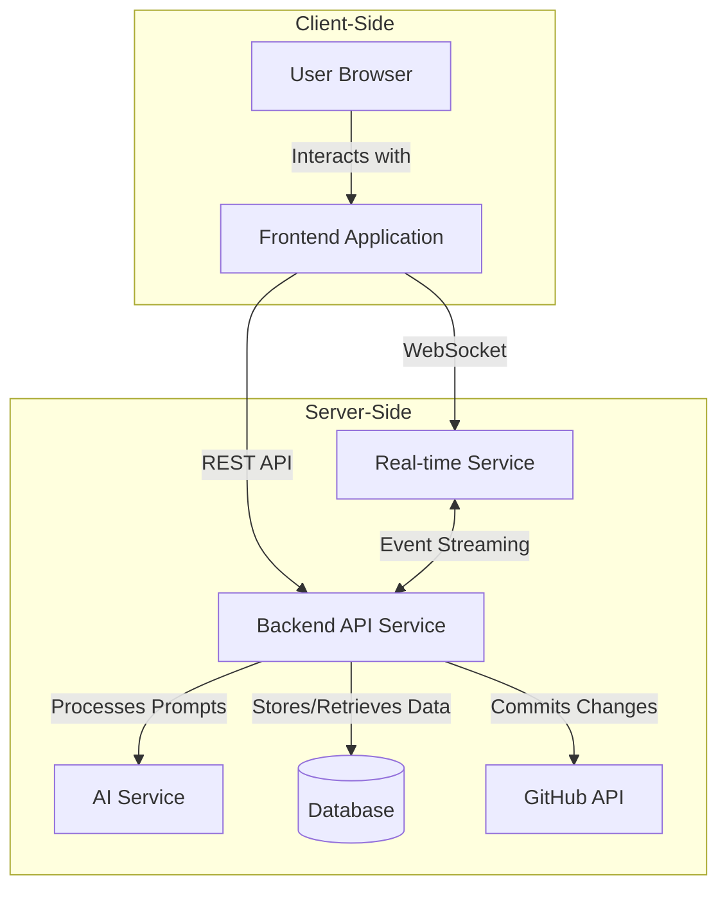
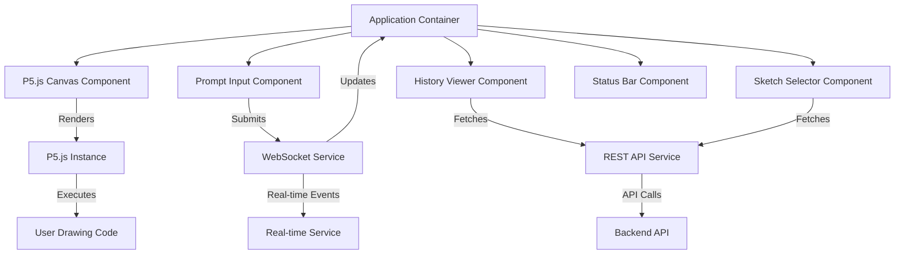
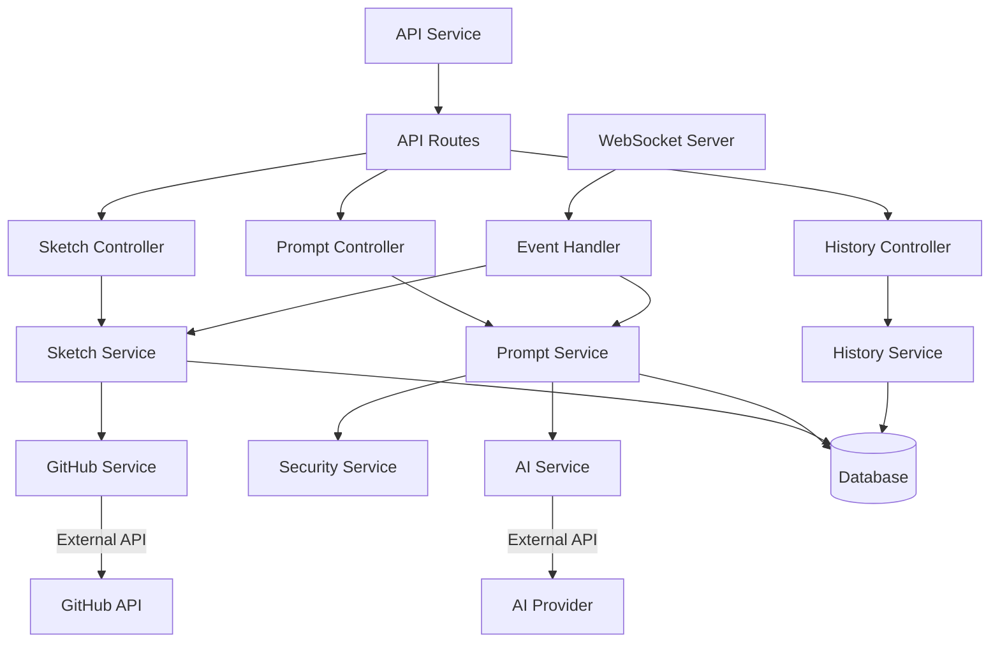
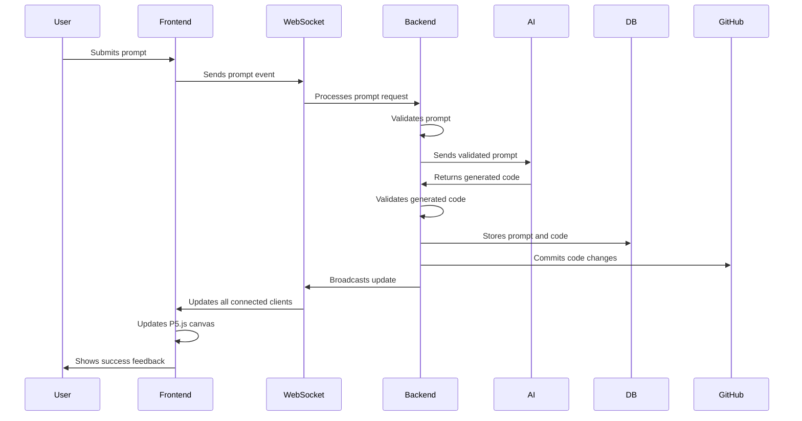
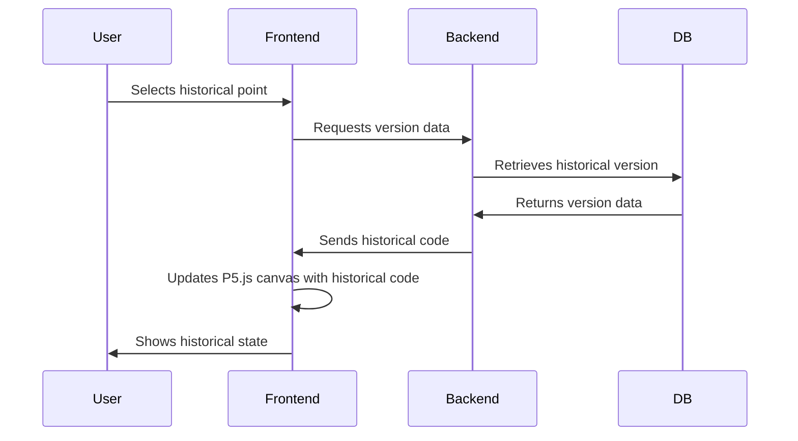
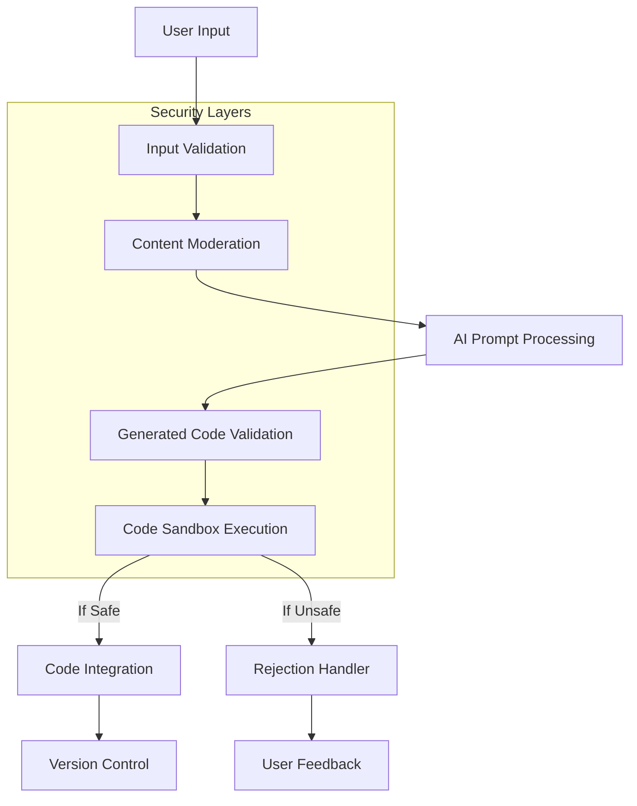
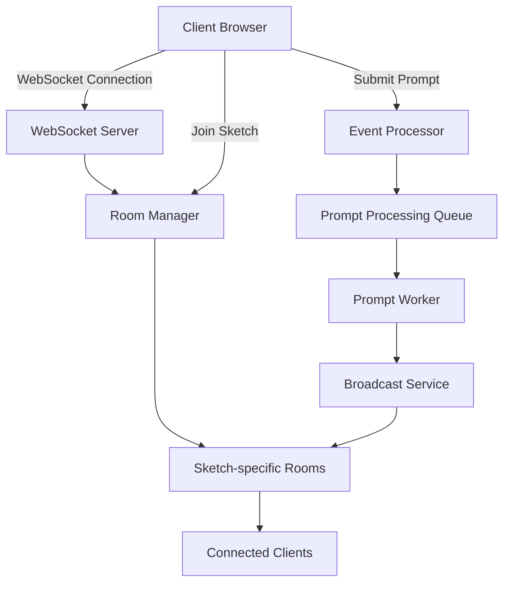
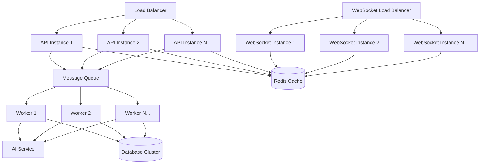

# SketchyChain - System Architecture

## Overview

SketchyChain is a collaborative web application that allows users to modify P5.js sketches through AI-processed text prompts. The system architecture is designed to handle real-time collaboration, persistent storage of sketches and their history, and secure integration with AI services and GitHub.



## Component Architecture

### Frontend Application

The frontend is a single-page application that handles rendering the P5.js sketch, collecting user prompts, and displaying the history of changes.



**Key Frontend Components:**

1. **P5.js Canvas Component**
   - Manages the P5.js instance
   - Handles rendering of the sketch
   - Isolates drawing code from application code

2. **Prompt Input Component**
   - Provides interface for entering text prompts
   - Shows processing status and feedback
   - Implements input validation

3. **History Viewer Component**
   - Displays timeline of prompts and changes
   - Enables navigation through sketch history
   - Shows visual previews of past states

4. **Sketch Selector Component**
   - Lists available sketches
   - Allows creation of new sketches
   - Provides filtering and sorting options

5. **WebSocket Service**
   - Manages real-time connections
   - Handles event subscriptions
   - Implements reconnection logic

### Backend Architecture

The backend consists of a Node.js API service, a real-time WebSocket service, and connections to external services for AI processing and GitHub integration.



**Key Backend Components:**

1. **API Service**
   - RESTful endpoints for CRUD operations
   - Request validation and error handling
   - Authentication (for future expansion)

2. **WebSocket Server**
   - Real-time event broadcasting
   - Room-based subscriptions for sketches
   - Connection management

3. **Sketch Service**
   - Manages sketch creation and retrieval
   - Handles code parsing and validation
   - Integrates with GitHub service

4. **Prompt Service**
   - Processes user prompts
   - Coordinates with AI service
   - Manages prompt validation and filtering

5. **History Service**
   - Tracks sketch versions and changes
   - Implements efficient storage and retrieval
   - Provides version comparison functionality

6. **Security Service**
   - Validates and sanitizes user inputs
   - Prevents code injection attacks
   - Implements content moderation

7. **AI Service**
   - Interfaces with external AI providers
   - Formats prompts for optimal processing
   - Parses and validates AI responses

8. **GitHub Service**
   - Manages repository connections
   - Handles commit operations
   - Implements error recovery

## Data Flow

### Prompt Submission Flow



### History Navigation Flow



## Technology Stack

### Frontend
- **Framework**: React.js
- **P5.js Integration**: p5.js library with instance mode
- **State Management**: Redux or Context API
- **WebSocket Client**: Socket.IO client
- **UI Components**: Material-UI or similar component library
- **Build Tools**: Webpack, Babel

### Backend
- **Runtime**: Node.js
- **API Framework**: Express.js
- **Real-time Server**: Socket.IO
- **API Documentation**: Swagger/OpenAPI
- **Logging**: Winston or similar

### Database
- **Primary Database**: MongoDB (for flexible schema support)
- **Caching Layer**: Redis (for real-time data and session management)

### External Integrations
- **AI Service**: OpenAI API, Anthropic API, or custom implementation
- **GitHub API**: Official GitHub REST API with OAuth authentication
- **Content Moderation**: TensorFlow.js or external moderation API

### DevOps & Infrastructure
- **Containerization**: Docker
- **Orchestration**: Docker Compose (development), Kubernetes (production)
- **CI/CD**: GitHub Actions
- **Monitoring**: Prometheus, Grafana
- **Hosting**: AWS, Google Cloud, or similar cloud provider

## Security Architecture



## Real-time Collaboration Architecture



## Scalability Considerations

The architecture is designed to scale horizontally by:

1. **Stateless API Services**: Multiple instances can be deployed behind a load balancer
2. **Separated WebSocket Servers**: Dedicated for real-time communication, can scale independently
3. **Queue-based Processing**: Prompt processing uses queues to manage load spikes
4. **Database Sharding**: Sketches can be sharded by ID for horizontal scaling
5. **Caching Layer**: Reduces database load for frequently accessed content
6. **CDN Integration**: Static assets and historical sketches can be cached at the edge



## GitHub Integration Architecture

```mermaid
graph TD
    PromptService[Prompt Service] -->|Approved Code Change| GitHubService[GitHub Service]
    
    GitHubService --> AuthManager[Authentication Manager]
    GitHubService --> RepoManager[Repository Manager]
    GitHubService --> CommitManager[Commit Manager]
    
    AuthManager -->|OAuth Token| GitHubAPI[GitHub API]
    RepoManager -->|Repo Operations| GitHubAPI
    CommitManager -->|Create Commits| GitHubAPI
    
    CommitManager --> CommitQueue[Commit Queue]
    CommitQueue --> RetryHandler[Retry Handler]
    
    RetryHandler -->|Retry Failed Commits| GitHubAPI
    RetryHandler -->|Persistent Failures| AlertSystem[Alert System]