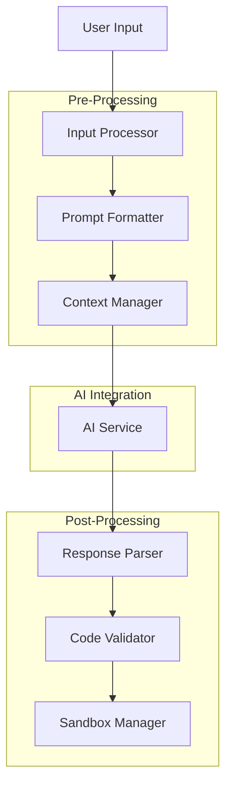
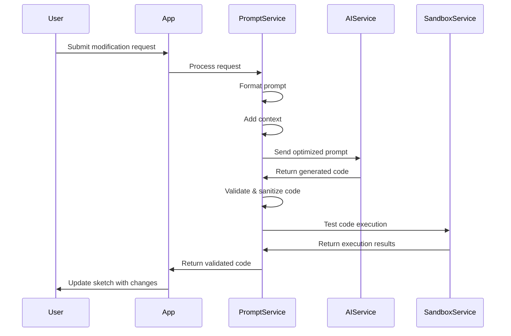
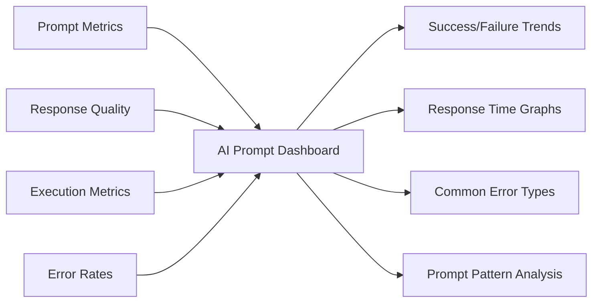

# AI Prompt Optimization and Processing Guidelines

## Overview

This document provides technical guidelines for optimizing AI prompts and processing responses in the SketchyChain application. It outlines best practices for constructing effective prompts, validating inputs and outputs, handling edge cases, and integrating AI-generated code safely and efficiently.

## Prompt Engineering Architecture



## Prompt Construction Guidelines

### Prompt Structure

The structure of a prompt significantly impacts the quality and consistency of AI-generated P5.js code. Use the following template structure:

```
[System Context]
You are helping to generate P5.js code for a sketch based on the following requirements.

[Sketch Context]
Current P5.js sketch:
```javascript
{existing_sketch_code}
```

[Instruction]
{user_instruction}

[Output Format]
Generate only valid P5.js code that implements the requested changes.
Do not include explanations or markdown formatting in your response.
Your response should be pure JavaScript code that can be directly executed in a P5.js environment.
```

### Input Validation and Pre-processing

Before sending prompts to the AI service, validate and pre-process user inputs:

1. **Sanitize Inputs**: Remove potential harmful characters or patterns
2. **Normalize Text**: Convert to consistent format (lowercase, trim whitespace)
3. **Extract Keywords**: Identify key action words or technical terms
4. **Detect Intent**: Categorize the type of modification requested
5. **Filter Content**: Apply content moderation to reject inappropriate requests

### Context Management

Maintain appropriate context to help the AI generate relevant and coherent code:

1. **Sketch History**: Include relevant parts of the sketch's evolution
2. **State Tracking**: Maintain knowledge of sketch's current capabilities
3. **Variable Registry**: Track existing variables, functions, and their purposes
4. **Visual Elements**: Maintain a record of visual elements currently in the sketch
5. **Recent Changes**: Highlight recent modifications to maintain consistency

### Prompt Optimization Strategies

| Strategy | Description | Example |
|----------|-------------|---------|
| **Explicit Instructions** | Be clear and specific about the desired outcome | "Add a red circle at coordinates (200, 200) with a diameter of 50 pixels" |
| **Constrained Outputs** | Specify the expected format and limitations | "Only modify the draw() function. Keep all other code unchanged." |
| **Example-driven** | Provide examples of similar functionality | "Add collision detection similar to: `if(dist(circle1.x, circle1.y, circle2.x, circle2.y) < radius1 + radius2)`" |
| **Step-by-step** | Break complex requests into ordered steps | "First, create a new array to store particles. Then, implement a function to update each particle's position." |
| **Technical Framing** | Use technical terminology for precision | "Implement a perlin noise flow field with vectors normalized to magnitude 1.0" |

## AI Service Integration

### Request-Response Flow



### AI Service Selection Guidelines

When selecting or configuring an AI service for code generation, consider these factors:

1. **Model Capabilities**:
   - Code generation proficiency
   - Context window size
   - Fine-tuning capabilities
   - Temperature and sampling parameters

2. **Technical Requirements**:
   - Latency expectations (<2 seconds preferred)
   - Token limit requirements (min 8K tokens)
   - Rate limiting considerations
   - Fallback mechanisms

3. **Integration Options**:
   - REST API vs. SDK implementation
   - Streaming vs. non-streaming responses
   - Authentication methods
   - Error handling patterns

### Recommended AI Service Configuration

| Parameter | Recommended Value | Reasoning |
|-----------|------------------|-----------|
| Model | GPT-4 or similar code-capable model | Strong code generation capabilities |
| Temperature | 0.2 - 0.4 | Low temperature for deterministic, predictable results |
| Top-P | 0.95 | Allow some creativity while maintaining coherence |
| Max Tokens | 2048 | Sufficient for most P5.js code responses |
| Presence Penalty | 0.0 | Neutral presence penalty for code generation |
| Frequency Penalty | 0.2 | Slight penalty to avoid repetitive code patterns |
| Context Window | 8K minimum | Sufficient to include sketch history and context |

## Response Processing Guidelines

### Code Extraction

Extract clean, executable code from AI responses:

1. **Pattern Recognition**: Use regex patterns to identify code blocks
2. **Comment Handling**: Preserve helpful comments, remove explanatory ones
3. **Format Normalization**: Standardize whitespace, semicolons, and brackets
4. **Import Management**: Identify and handle any external library imports

```javascript
// Example extraction function
function extractCodeFromResponse(aiResponse) {
  // Remove markdown code block syntax if present
  let code = aiResponse.replace(/```javascript|```js|```/g, '');
  
  // Trim whitespace
  code = code.trim();
  
  // Remove explanatory text outside of code
  if (code.includes('function setup()') || code.includes('function draw()')) {
    // Extract just the code part using regex
    const codeMatch = code.match(/(?:\/\/.*\n)*(?:function \w+\(\)[\s\S]*)/);
    if (codeMatch) {
      code = codeMatch[0];
    }
  }
  
  return code;
}
```

### Code Validation and Safety

Implement multi-layered validation for AI-generated code:

1. **Syntax Validation**: Ensure code is syntactically correct
2. **Static Analysis**: Check for dangerous patterns or API calls
3. **Structural Validation**: Verify required P5.js structure (setup/draw)
4. **Resource Estimation**: Predict potential resource usage
5. **Execution Testing**: Test in sandbox before integration

```javascript
// Example validation pipeline
const validationPipeline = [
  validateSyntax,         // Check for syntax errors
  validateStructure,      // Ensure proper P5.js structure
  detectDangerousAPIs,    // Check for forbidden API calls
  estimateResourceUsage,  // Predict memory and CPU usage
  testExecution           // Run in sandbox to verify behavior
];

function validateGeneratedCode(code) {
  for (const validator of validationPipeline) {
    const result = validator(code);
    if (!result.success) {
      return {
        valid: false,
        error: result.error,
        stage: result.stage
      };
    }
  }
  
  return {
    valid: true,
    optimizedCode: applyOptimizations(code)
  };
}
```

### Code Integration

Guidelines for integrating AI-generated code with existing sketch code:

1. **Targeted Insertion**: Add code at specific points rather than full replacement
2. **Merge Strategy**: Use intelligent merging for complex modifications
3. **Variable Preservation**: Maintain existing variable names and values
4. **Function Enhancement**: Extend existing functions rather than rewriting
5. **State Management**: Preserve application state during code updates

## P5.js-Specific Optimization

### Code Structure Patterns

Encourage the AI to generate well-structured P5.js code:

```javascript
// Preferred structure pattern
let sketch = function(p) {
  // Sketch-wide variables
  let x = 0;
  let y = 0;
  
  // Setup function
  p.setup = function() {
    p.createCanvas(400, 400);
    // Additional setup...
  };
  
  // Draw function
  p.draw = function() {
    p.background(220);
    // Drawing code...
  };
  
  // Event handlers
  p.mousePressed = function() {
    // Handle mouse press
  };
  
  // Custom functions
  function helperFunction() {
    // Helper functionality
  }
};

// Create instance
new p5(sketch);
```

### Performance Considerations

Guide the AI to generate performant P5.js code:

1. **Loop Optimization**: Minimize operations in draw() loop
2. **DOM Operations**: Reduce DOM manipulations
3. **Variable Declarations**: Keep declarations outside of loops
4. **Array Operations**: Use efficient array methods
5. **Rendering Techniques**: Suggest appropriate rendering strategies

```javascript
// Example prompt for performance-oriented code
"Generate P5.js code for a particle system with 100 particles, 
optimizing for performance by:
1. Pre-allocating the particle array
2. Using vectors for calculations
3. Minimizing object creation in the draw loop
4. Using appropriate scoping for variables
5. Employing efficient rendering techniques"
```

### Common Patterns and Approaches

Catalog of effective patterns to guide AI code generation:

| Pattern | Description | Example Prompt Fragment |
|---------|-------------|-------------------------|
| Object-Oriented | Using classes for complex elements | "Create a Particle class with position, velocity, and update method" |
| Functional | Using functions for transformations | "Implement a pure function that calculates the next position" |
| Array-based | Using arrays for collections | "Store the circles in an array and iterate through it for updates" |
| State Machine | Managing different application states | "Implement three states: IDLE, PLAYING, and GAMEOVER with transitions" |
| Event-Driven | Responding to user interactions | "Add event handlers for mousePressed and keyPressed to control the character" |

## Error Handling and Recovery

### AI Service Failures

Strategies for handling AI service issues:

1. **Retry Logic**: Implement exponential backoff for temporary failures
2. **Fallback Content**: Provide alternative responses for service outages
3. **Degraded Mode**: Offer limited functionality when AI is unavailable
4. **User Communication**: Clear error messages explaining the situation
5. **Telemetry**: Log failures for analysis and improvement

### Response Quality Issues

Handling suboptimal AI responses:

1. **Quality Assessment**: Score responses based on relevance and correctness
2. **Refinement Requests**: Send follow-up prompts to improve low-quality responses
3. **Human Fallback**: Escalate to human review for persistent issues
4. **Alternative Phrasings**: Try rephrasing the original prompt
5. **Feedback Loop**: Track successful prompts for future optimization

## Implementation Examples

### Example: Adding a New Visual Element

**User Request:** "Add a bouncing red ball to the sketch"

**Formatted Prompt:**
```
You are helping to generate P5.js code for a sketch based on the following requirements.

Current P5.js sketch:
```javascript
function setup() {
  createCanvas(400, 400);
}

function draw() {
  background(220);
  circle(mouseX, mouseY, 50);
}
```

The user wants to add a bouncing red ball to the sketch.

Generate only valid P5.js code that implements the requested changes.
Do not include explanations or markdown formatting in your response.
Your response should be pure JavaScript code that can be directly executed in a P5.js environment.
```

**Expected AI Response:**
```javascript
let ball = {
  x: 200,
  y: 100,
  diameter: 30,
  speedX: 3,
  speedY: 2
};

function setup() {
  createCanvas(400, 400);
}

function draw() {
  background(220);
  
  // Draw user-controlled circle
  circle(mouseX, mouseY, 50);
  
  // Draw the bouncing ball
  fill(255, 0, 0);
  circle(ball.x, ball.y, ball.diameter);
  
  // Update ball position
  ball.x += ball.speedX;
  ball.y += ball.speedY;
  
  // Bounce off edges
  if (ball.x + ball.diameter/2 > width || ball.x - ball.diameter/2 < 0) {
    ball.speedX *= -1;
  }
  if (ball.y + ball.diameter/2 > height || ball.y - ball.diameter/2 < 0) {
    ball.speedY *= -1;
  }
}
```

### Example: Fixing a Bug

**User Request:** "Fix the collision detection so circles don't overlap"

**Formatted Prompt:**
```
You are helping to generate P5.js code for a sketch based on the following requirements.

Current P5.js sketch:
```javascript
let circles = [];

function setup() {
  createCanvas(400, 400);
  for (let i = 0; i < 10; i++) {
    circles.push({
      x: random(width),
      y: random(height),
      radius: random(10, 30),
      dx: random(-2, 2),
      dy: random(-2, 2)
    });
  }
}

function draw() {
  background(220);
  
  for (let circle of circles) {
    // Move circles
    circle.x += circle.dx;
    circle.y += circle.dy;
    
    // Bounce off walls
    if (circle.x < 0 || circle.x > width) circle.dx *= -1;
    if (circle.y < 0 || circle.y > height) circle.dy *= -1;
    
    // Check collisions - this isn't working correctly
    for (let other of circles) {
      if (circle !== other) {
        let d = dist(circle.x, circle.y, other.x, other.y);
        if (d < circle.radius + other.radius) {
          // This isn't preventing overlap
          circle.dx *= -1;
          circle.dy *= -1;
        }
      }
    }
    
    // Draw circle
    ellipse(circle.x, circle.y, circle.radius * 2);
  }
}
```

The user wants to fix the collision detection so circles don't overlap.

Generate only valid P5.js code that implements the requested changes.
Do not include explanations or markdown formatting in your response.
Your response should be pure JavaScript code that can be directly executed in a P5.js environment.
```

**Expected AI Response:**
```javascript
let circles = [];

function setup() {
  createCanvas(400, 400);
  for (let i = 0; i < 10; i++) {
    circles.push({
      x: random(width),
      y: random(height),
      radius: random(10, 30),
      dx: random(-2, 2),
      dy: random(-2, 2)
    });
  }
}

function draw() {
  background(220);
  
  // Update positions
  for (let circle of circles) {
    circle.x += circle.dx;
    circle.y += circle.dy;
    
    // Bounce off walls
    if (circle.x - circle.radius < 0 || circle.x + circle.radius > width) circle.dx *= -1;
    if (circle.y - circle.radius < 0 || circle.y + circle.radius > height) circle.dy *= -1;
  }
  
  // Check collisions (separate from movement)
  for (let i = 0; i < circles.length; i++) {
    for (let j = i + 1; j < circles.length; j++) {
      let circle = circles[i];
      let other = circles[j];
      
      let dx = other.x - circle.x;
      let dy = other.y - circle.y;
      let distance = sqrt(dx * dx + dy * dy);
      let minDist = circle.radius + other.radius;
      
      // Check for collision
      if (distance < minDist) {
        // Calculate collision response
        let angle = atan2(dy, dx);
        let targetX = circle.x + cos(angle) * minDist;
        let targetY = circle.y + sin(angle) * minDist;
        let ax = (targetX - other.x) * 0.05;
        let ay = (targetY - other.y) * 0.05;
        
        // Apply forces to separate circles
        circle.dx -= ax;
        circle.dy -= ay;
        other.dx += ax;
        other.dy += ay;
        
        // Exchange velocity components to simulate bounce
        let tempDx = circle.dx;
        let tempDy = circle.dy;
        circle.dx = other.dx;
        circle.dy = other.dy;
        other.dx = tempDx;
        other.dy = tempDy;
      }
    }
  }
  
  // Draw circles
  for (let circle of circles) {
    ellipse(circle.x, circle.y, circle.radius * 2);
  }
}
```

## Metrics and Monitoring

### Prompt Performance Metrics

Track these key metrics to optimize prompt effectiveness:

1. **Success Rate**: Percentage of prompts that generate usable code
2. **Rejection Rate**: Percentage of responses rejected by validation
3. **Iteration Count**: Number of refinement attempts needed
4. **Response Latency**: Time from prompt submission to usable code
5. **Code Quality Score**: Automated assessment of generated code quality

### Monitoring Dashboard



## Best Practices Summary

1. **Start Specific**: Begin with clear, explicit instructions
2. **Provide Context**: Include relevant information about the current sketch
3. **Use Technical Language**: Be precise with technical terminology
4. **Structure Strategically**: Organize prompts in a consistent format
5. **Validate Thoroughly**: Implement multi-layered validation for responses
6. **Handle Failures**: Implement robust error recovery mechanisms
7. **Optimize Iteratively**: Continuously refine prompt templates based on performance
8. **Monitor Performance**: Track metrics to identify improvement opportunities

## Appendix: Prompt Templates

### Basic Modification Template

```
You are helping to generate P5.js code for a sketch based on the following requirements.

Current P5.js sketch:
```javascript
{existing_sketch_code}
```

The user wants to {modification_request}.

Generate only valid P5.js code that implements the requested changes.
Do not include explanations or markdown formatting in your response.
Your response should be pure JavaScript code that can be directly executed in a P5.js environment.
```

### Advanced Feature Addition Template

```
You are helping to generate P5.js code for a sketch based on the following requirements.

Current P5.js sketch:
```javascript
{existing_sketch_code}
```

Existing functionality:
- {feature_1}
- {feature_2}
- {feature_3}

The user wants to add {new_feature_description} with these specifications:
1. {specification_1}
2. {specification_2}
3. {specification_3}

Technical constraints:
- {constraint_1}
- {constraint_2}

Generate only valid P5.js code that implements the requested changes.
Focus on performance and maintainability.
Do not include explanations or markdown formatting in your response.
Your response should be pure JavaScript code that can be directly executed in a P5.js environment.
```

### Bug Fix Template

```
You are helping to generate P5.js code for a sketch based on the following requirements.

Current P5.js sketch with a bug:
```javascript
{existing_sketch_code}
```

Bug description:
{detailed_bug_description}

Expected behavior:
{expected_behavior}

Generate only valid P5.js code that fixes the described bug.
Do not include explanations or markdown formatting in your response.
Your response should be pure JavaScript code that can be directly executed in a P5.js environment.