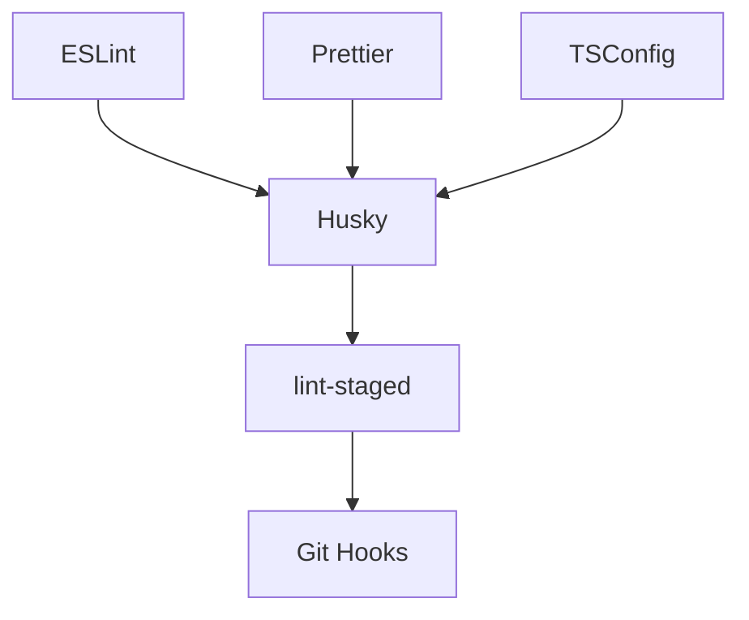
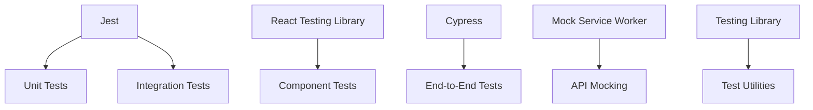
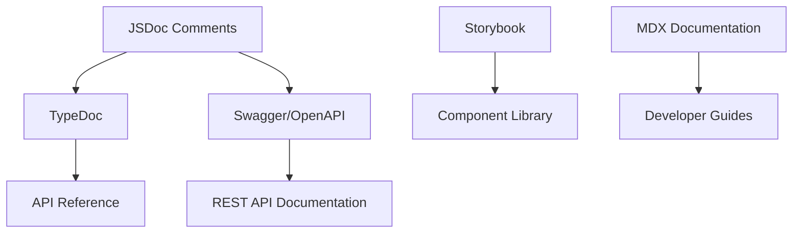
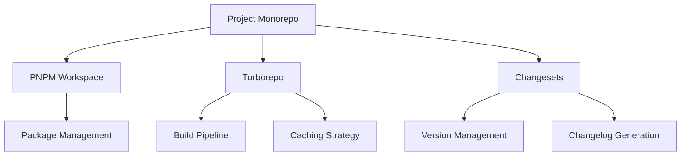
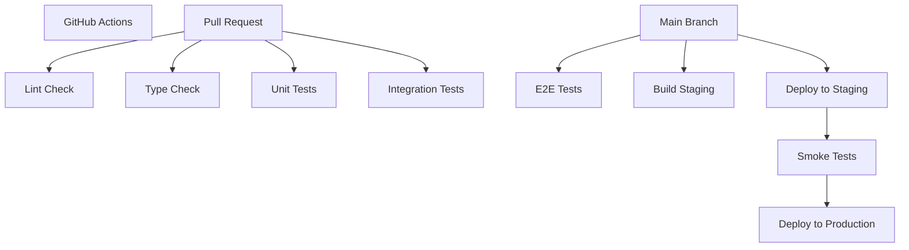
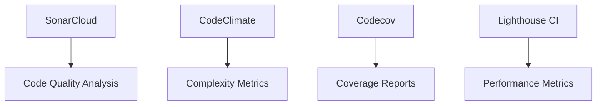
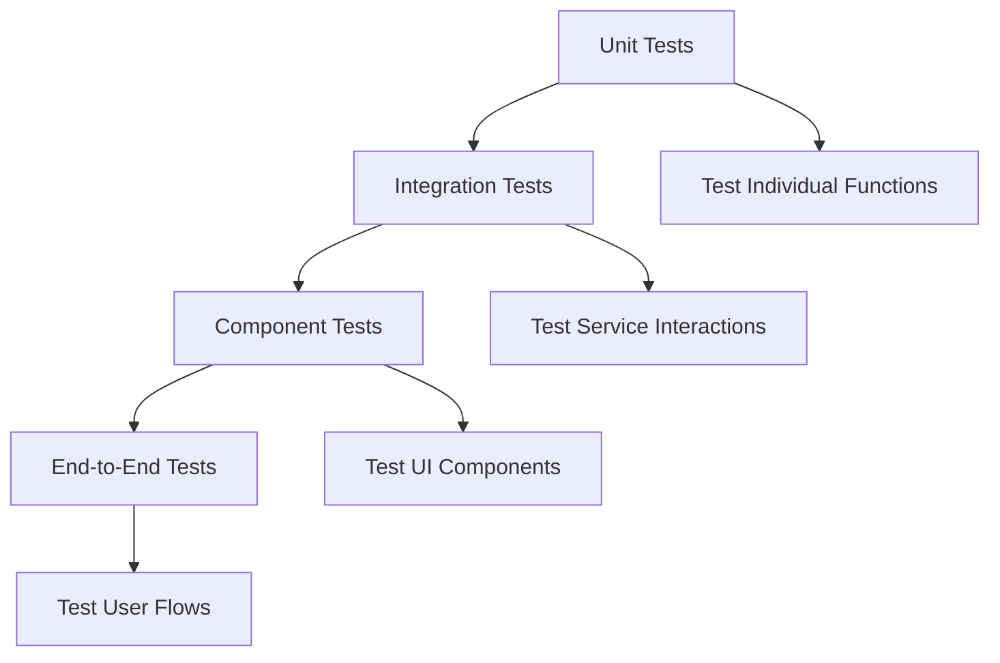

# Developer Experience Tooling

This document outlines the comprehensive developer experience (DevX) tooling strategy for the Sketchy Chain application. It includes linting configurations, testing frameworks, documentation generation, and developer workflow optimizations to ensure code quality, maintainability, and productivity.

## Objectives

1. **Code Quality**: Enforce consistent coding standards across all repositories
2. **Test Coverage**: Establish comprehensive testing practices
3. **Documentation**: Ensure well-documented codebase and APIs
4. **Developer Productivity**: Optimize workflows and reduce friction
5. **Onboarding Efficiency**: Enable new team members to be productive quickly

## Language-specific Tooling

### JavaScript/TypeScript

#### Linting and Formatting



**ESLint Configuration**

```json
// .eslintrc.js
module.exports = {
  "root": true,
  "parser": "@typescript-eslint/parser",
  "parserOptions": {
    "ecmaVersion": 2021,
    "sourceType": "module",
    "ecmaFeatures": {
      "jsx": true
    },
    "project": "./tsconfig.json"
  },
  "env": {
    "browser": true,
    "node": true,
    "jest": true
  },
  "extends": [
    "eslint:recommended",
    "plugin:@typescript-eslint/recommended",
    "plugin:react/recommended",
    "plugin:react-hooks/recommended",
    "plugin:jsx-a11y/recommended",
    "plugin:import/errors",
    "plugin:import/warnings",
    "plugin:import/typescript",
    "plugin:promise/recommended",
    "prettier"
  ],
  "plugins": [
    "@typescript-eslint",
    "react",
    "react-hooks",
    "jsx-a11y",
    "import",
    "promise"
  ],
  "rules": {
    // Custom rules tailored for the project
    "@typescript-eslint/explicit-function-return-type": ["error", {
      "allowExpressions": true,
      "allowTypedFunctionExpressions": true
    }],
    "@typescript-eslint/no-unused-vars": ["error", {
      "argsIgnorePattern": "^_",
      "varsIgnorePattern": "^_"
    }],
    "react/prop-types": "off", // TypeScript handles this
    "react/react-in-jsx-scope": "off", // Not needed in React 17+
    "import/order": ["error", {
      "groups": ["builtin", "external", "internal", "parent", "sibling", "index"],
      "newlines-between": "always",
      "alphabetize": { "order": "asc", "caseInsensitive": true }
    }]
  },
  "settings": {
    "react": {
      "version": "detect"
    },
    "import/resolver": {
      "typescript": {}
    }
  }
}
```

**Prettier Configuration**

```json
// .prettierrc
{
  "printWidth": 100,
  "tabWidth": 2,
  "useTabs": false,
  "semi": true,
  "singleQuote": true,
  "trailingComma": "es5",
  "bracketSpacing": true,
  "jsxBracketSameLine": false,
  "arrowParens": "always",
  "endOfLine": "lf"
}
```

**TSConfig Base**

```json
// tsconfig.base.json
{
  "compilerOptions": {
    "target": "ES2020",
    "module": "ESNext",
    "moduleResolution": "node",
    "lib": ["DOM", "DOM.Iterable", "ESNext"],
    "jsx": "react-jsx",
    "strict": true,
    "esModuleInterop": true,
    "skipLibCheck": true,
    "forceConsistentCasingInFileNames": true,
    "noImplicitReturns": true,
    "noFallthroughCasesInSwitch": true,
    "noUnusedLocals": true,
    "noUnusedParameters": true,
    "resolveJsonModule": true,
    "declaration": true,
    "sourceMap": true
  }
}
```

**Husky and lint-staged Configuration**

```json
// .husky/pre-commit
#!/bin/sh
. "$(dirname "$0")/_/husky.sh"

npx lint-staged

// package.json (lint-staged config)
{
  "lint-staged": {
    "*.{js,jsx,ts,tsx}": [
      "eslint --fix",
      "prettier --write"
    ],
    "*.{json,md,yml,yaml}": [
      "prettier --write"
    ]
  }
}
```

#### Testing Framework



**Jest Configuration**

```javascript
// jest.config.js
module.exports = {
  preset: 'ts-jest',
  testEnvironment: 'jsdom',
  roots: ['<rootDir>/src'],
  transform: {
    '^.+\\.tsx?$': 'ts-jest',
  },
  setupFilesAfterEnv: ['<rootDir>/src/setupTests.ts'],
  moduleNameMapper: {
    '^@/(.*)$': '<rootDir>/src/$1',
    '\\.(css|less|sass|scss)$': 'identity-obj-proxy',
    '\\.(gif|ttf|eot|svg|png)$': '<rootDir>/test/__mocks__/fileMock.js',
  },
  coverageDirectory: 'coverage',
  collectCoverageFrom: [
    'src/**/*.{js,jsx,ts,tsx}',
    '!src/**/*.d.ts',
    '!src/mocks/**',
    '!src/types/**',
    '!src/**/types.ts',
    '!src/**/index.ts',
  ],
  coverageThreshold: {
    global: {
      statements: 80,
      branches: 75,
      functions: 80,
      lines: 80,
    },
  },
  testMatch: ['**/__tests__/**/*.+(ts|tsx|js)', '**/?(*.)+(spec|test).+(ts|tsx|js)'],
};
```

**Cypress Configuration**

```javascript
// cypress.config.ts
import { defineConfig } from 'cypress';

export default defineConfig({
  e2e: {
    baseUrl: 'http://localhost:3000',
    supportFile: 'cypress/support/e2e.ts',
    specPattern: 'cypress/e2e/**/*.cy.{js,jsx,ts,tsx}',
    video: false,
    screenshotOnRunFailure: true,
    viewportWidth: 1280,
    viewportHeight: 720,
  },
  component: {
    devServer: {
      framework: 'react',
      bundler: 'vite',
    },
    specPattern: 'src/**/*.cy.{js,jsx,ts,tsx}',
  },
});
```

### Node.js Backend

#### Testing Framework

```javascript
// jest.config.js (backend)
module.exports = {
  preset: 'ts-jest',
  testEnvironment: 'node',
  roots: ['<rootDir>/src'],
  transform: {
    '^.+\\.tsx?$': 'ts-jest',
  },
  moduleNameMapper: {
    '^@/(.*)$': '<rootDir>/src/$1',
  },
  coverageDirectory: 'coverage',
  collectCoverageFrom: [
    'src/**/*.{js,ts}',
    '!src/**/*.d.ts',
    '!src/types/**',
    '!src/**/index.ts',
  ],
  testMatch: ['**/__tests__/**/*.+(ts|js)', '**/?(*.)+(spec|test).+(ts|js)'],
};
```

## Documentation Generation



### API Documentation

**OpenAPI/Swagger Configuration**

```javascript
// swagger.config.js
module.exports = {
  definition: {
    openapi: '3.0.0',
    info: {
      title: 'Sketchy Chain API',
      version: '1.0.0',
      description: 'API for the Sketchy Chain application',
      contact: {
        name: 'API Support',
        email: 'support@aipromptdesigner.com',
      },
    },
    servers: [
      {
        url: 'http://localhost:4000',
        description: 'Development server',
      },
      {
        url: 'https://api.aipromptdesigner.com',
        description: 'Production server',
      },
    ],
    components: {
      securitySchemes: {
        bearerAuth: {
          type: 'http',
          scheme: 'bearer',
          bearerFormat: 'JWT',
        },
      },
    },
  },
  apis: ['./src/routes/*.ts', './src/models/*.ts'],
};
```

**TypeDoc Configuration**

```json
// typedoc.json
{
  "entryPoints": ["src/index.ts"],
  "out": "docs/api",
  "exclude": ["**/__tests__/**", "**/*.test.ts", "**/*.spec.ts"],
  "excludePrivate": true,
  "excludeProtected": false,
  "theme": "default",
  "categorizeByGroup": true,
  "categoryOrder": ["Core", "Models", "Services", "Utilities", "*"],
  "readme": "none",
  "name": "Sketchy Chain API",
  "includeVersion": true
}
```

### Frontend Component Documentation

**Storybook Configuration**

```javascript
// .storybook/main.js
module.exports = {
  stories: ['../src/**/*.stories.mdx', '../src/**/*.stories.@(js|jsx|ts|tsx)'],
  addons: [
    '@storybook/addon-links',
    '@storybook/addon-essentials',
    '@storybook/addon-interactions',
    '@storybook/addon-a11y',
    '@storybook/addon-coverage',
  ],
  framework: {
    name: '@storybook/react-vite',
    options: {},
  },
  docs: {
    autodocs: true,
  },
  staticDirs: ['../public'],
};
```

## Monorepo Structure and Tooling



**PNPM Workspace Configuration**

```yaml
# pnpm-workspace.yaml
packages:
  - 'packages/*'
  - 'apps/*'
```

**Turborepo Configuration**

```json
// turbo.json
{
  "$schema": "https://turborepo.org/schema.json",
  "pipeline": {
    "build": {
      "dependsOn": ["^build"],
      "outputs": ["dist/**", "build/**"]
    },
    "test": {
      "dependsOn": ["^build"],
      "outputs": []
    },
    "lint": {
      "outputs": []
    },
    "dev": {
      "cache": false
    },
    "clean": {
      "cache": false
    }
  }
}
```

**Changesets Configuration**

```json
// .changeset/config.json
{
  "$schema": "https://unpkg.com/@changesets/config@2.3.0/schema.json",
  "changelog": "@changesets/cli/changelog",
  "commit": false,
  "fixed": [],
  "linked": [],
  "access": "restricted",
  "baseBranch": "main",
  "updateInternalDependencies": "patch",
  "ignore": []
}
```

## CI/CD Integration



**GitHub Actions Workflow**

```yaml
# .github/workflows/ci.yml
name: CI

on:
  push:
    branches: [main]
  pull_request:
    branches: [main]

jobs:
  validate:
    runs-on: ubuntu-latest
    steps:
      - uses: actions/checkout@v3
      - uses: pnpm/action-setup@v2
        with:
          version: 8
      - uses: actions/setup-node@v3
        with:
          node-version: '18'
          cache: 'pnpm'
      - name: Install dependencies
        run: pnpm install
      - name: Lint
        run: pnpm run lint
      - name: Type check
        run: pnpm run type-check
      - name: Unit tests
        run: pnpm run test
      - name: Build
        run: pnpm run build

  e2e:
    needs: validate
    if: github.event_name == 'push' && github.ref == 'refs/heads/main'
    runs-on: ubuntu-latest
    steps:
      - uses: actions/checkout@v3
      - uses: pnpm/action-setup@v2
        with:
          version: 8
      - uses: actions/setup-node@v3
        with:
          node-version: '18'
          cache: 'pnpm'
      - name: Install dependencies
        run: pnpm install
      - name: Build
        run: pnpm run build
      - name: E2E tests
        run: pnpm run test:e2e

  deploy-staging:
    needs: e2e
    if: github.event_name == 'push' && github.ref == 'refs/heads/main'
    runs-on: ubuntu-latest
    steps:
      - uses: actions/checkout@v3
      - name: Deploy to staging
        run: |
          # Deployment steps for staging environment

  smoke-tests:
    needs: deploy-staging
    if: github.event_name == 'push' && github.ref == 'refs/heads/main'
    runs-on: ubuntu-latest
    steps:
      - uses: actions/checkout@v3
      - name: Run smoke tests against staging
        run: |
          # Smoke test steps

  deploy-production:
    needs: smoke-tests
    if: github.event_name == 'push' && github.ref == 'refs/heads/main'
    runs-on: ubuntu-latest
    steps:
      - uses: actions/checkout@v3
      - name: Deploy to production
        run: |
          # Deployment steps for production environment
```

## Code Quality Metrics and Monitoring



**SonarCloud Configuration**

```yaml
# sonar-project.properties
sonar.projectKey=ai-prompt-designer
sonar.organization=ai-prompt-designer

sonar.sources=.
sonar.exclusions=**/*.test.ts,**/*.spec.ts,**/__tests__/**,**/node_modules/**,**/coverage/**
sonar.test.inclusions=**/*.test.ts,**/*.spec.ts,**/__tests__/**
sonar.javascript.lcov.reportPaths=./coverage/lcov.info
sonar.typescript.tsconfigPath=./tsconfig.json
```

**Codecov Configuration**

```yaml
# codecov.yml
codecov:
  require_ci_to_pass: yes

coverage:
  precision: 2
  round: down
  range: "70...100"
  status:
    project:
      default:
        target: 80%
        threshold: 1%
    patch:
      default:
        target: 80%
        threshold: 1%

parsers:
  gcov:
    branch_detection:
      conditional: yes
      loop: yes
      method: no
      macro: no

comment:
  layout: "reach,diff,flags,files,footer"
  behavior: default
  require_changes: no
```

## Developer Environment Setup

### VSCode Configuration

**Recommended Extensions**

```json
// .vscode/extensions.json
{
  "recommendations": [
    "dbaeumer.vscode-eslint",
    "esbenp.prettier-vscode",
    "ms-vsliveshare.vsliveshare",
    "streetsidesoftware.code-spell-checker",
    "editorconfig.editorconfig",
    "github.vscode-pull-request-github",
    "eamodio.gitlens",
    "mikestead.dotenv",
    "yzhang.markdown-all-in-one",
    "redhat.vscode-yaml"
  ]
}
```

**Workspace Settings**

```json
// .vscode/settings.json
{
  "editor.formatOnSave": true,
  "editor.codeActionsOnSave": {
    "source.fixAll.eslint": true
  },
  "editor.defaultFormatter": "esbenp.prettier-vscode",
  "eslint.validate": [
    "javascript",
    "javascriptreact",
    "typescript",
    "typescriptreact"
  ],
  "typescript.tsdk": "node_modules/typescript/lib",
  "typescript.enablePromptUseWorkspaceTsdk": true,
  "[javascript]": {
    "editor.defaultFormatter": "esbenp.prettier-vscode"
  },
  "[typescript]": {
    "editor.defaultFormatter": "esbenp.prettier-vscode"
  },
  "[json]": {
    "editor.defaultFormatter": "esbenp.prettier-vscode"
  },
  "[yaml]": {
    "editor.defaultFormatter": "esbenp.prettier-vscode"
  },
  "cSpell.words": [
    "pnpm",
    "turborepo",
    "openapi",
    "typedoc",
    "storybook",
    "changesets",
    "sonarcloud"
  ]
}
```

### Development Container

**Dev Container Configuration**

```json
// .devcontainer/devcontainer.json
{
  "name": "Sketchy Chain Dev Environment",
  "image": "mcr.microsoft.com/devcontainers/javascript-node:18",
  "features": {
    "ghcr.io/devcontainers/features/github-cli:1": {},
    "ghcr.io/devcontainers/features/docker-in-docker:2": {}
  },
  "forwardPorts": [3000, 4000, 4001, 6006],
  "postCreateCommand": "npm install -g pnpm && pnpm install",
  "customizations": {
    "vscode": {
      "extensions": [
        "dbaeumer.vscode-eslint",
        "esbenp.prettier-vscode",
        "ms-vsliveshare.vsliveshare",
        "streetsidesoftware.code-spell-checker",
        "editorconfig.editorconfig",
        "github.vscode-pull-request-github",
        "eamodio.gitlens",
        "mikestead.dotenv",
        "yzhang.markdown-all-in-one"
      ],
      "settings": {
        "editor.formatOnSave": true,
        "editor.codeActionsOnSave": {
          "source.fixAll.eslint": true
        }
      }
    }
  }
}
```

## Onboarding Documentation

### New Developer Setup Guide

```markdown
# Developer Onboarding

## Prerequisites

- Node.js v18 or later
- PNPM v8 or later
- Docker and Docker Compose
- Git

## Initial Setup

1. Clone the repository:
   ```bash
   git clone https://github.com/ai-prompt-designer/ai-prompt-designer.git
   cd ai-prompt-designer
   ```

2. Install dependencies:
   ```bash
   pnpm install
   ```

3. Set up environment variables:
   ```bash
   cp .env.example .env
   # Edit .env with your local configuration
   ```

4. Start the development environment:
   ```bash
   pnpm dev
   ```

## Development Workflow

1. Create a new branch for your feature:
   ```bash
   git checkout -b feature/your-feature-name
   ```

2. Make your changes and follow the coding standards.

3. Run tests to ensure your changes don't break existing functionality:
   ```bash
   pnpm test
   ```

4. Create a changeset for your changes:
   ```bash
   pnpm changeset
   ```

5. Push your branch and create a pull request.

## Available Scripts

- `pnpm dev` - Start the development server
- `pnpm build` - Build all packages and applications
- `pnpm test` - Run all tests
- `pnpm lint` - Lint all files
- `pnpm storybook` - Start Storybook for component development
- `pnpm docs` - Generate API documentation
```

## Testing Strategy

### Testing Levels



### Test Coverage Requirements

| Component | Unit Tests | Integration Tests | E2E Tests |
|-----------|------------|-------------------|-----------|
| Core Libraries | 90% | 80% | N/A |
| API Services | 85% | 75% | Key flows |
| UI Components | 85% | 70% | Key flows |
| Utility Functions | 95% | N/A | N/A |

### Testing Best Practices

1. **Unit Tests**:
   - Focus on testing business logic
   - Mock external dependencies
   - Test edge cases and error scenarios
   - Keep tests simple and focused

2. **Integration Tests**:
   - Test interactions between services
   - Use in-memory databases where appropriate
   - Focus on API contracts and boundaries

3. **Component Tests**:
   - Test component rendering
   - Test user interactions
   - Verify accessibility compliance
   - Test component props and states

4. **E2E Tests**:
   - Focus on critical user journeys
   - Test against realistic environments
   - Include visual regression tests
   - Monitor performance metrics

## Continuous Improvement

### Code Quality Monitoring

1. **Regular Metrics Review**:
   - Review code coverage trends
   - Track technical debt metrics
   - Analyze complexity hotspots

2. **Developer Feedback Loops**:
   - Regular retrospectives
   - Tooling satisfaction surveys
   - Process improvement workshops

3. **Automation Improvements**:
   - Identify manual processes to automate
   - Optimize CI/CD pipeline performance
   - Reduce development environment setup time

## Conclusion

This developer experience tooling strategy establishes a solid foundation for maintaining code quality, productivity, and collaboration across the Sketchy Chain project. By implementing these tools and practices, we ensure consistency, reliability, and efficiency in the development process.

The tools and configurations should be regularly reviewed and updated to incorporate best practices and new technologies that can further improve the developer experience.