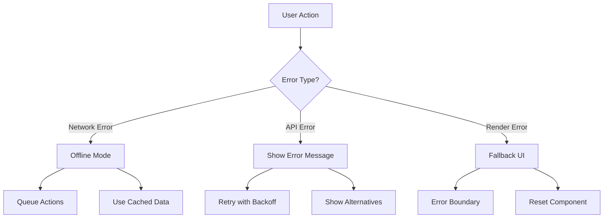
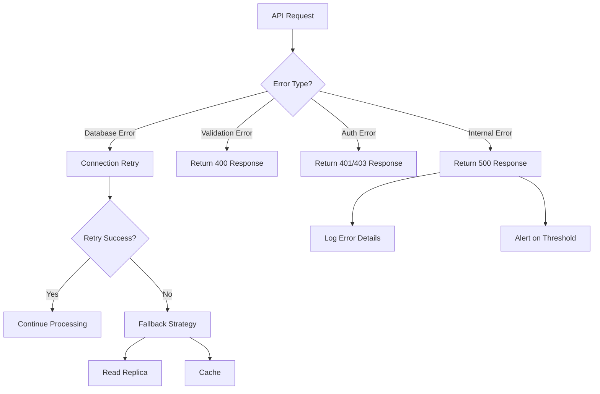
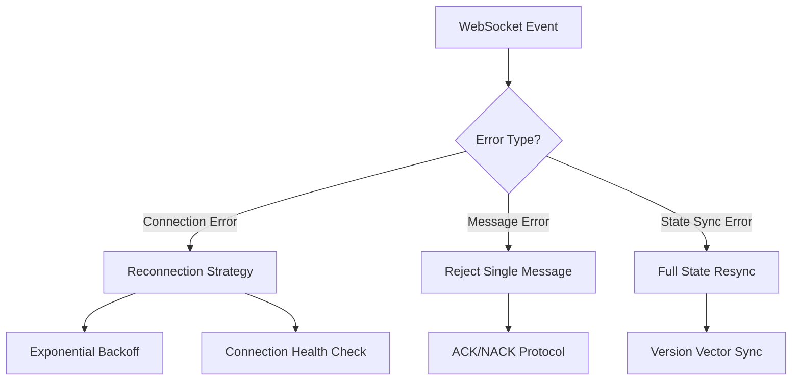
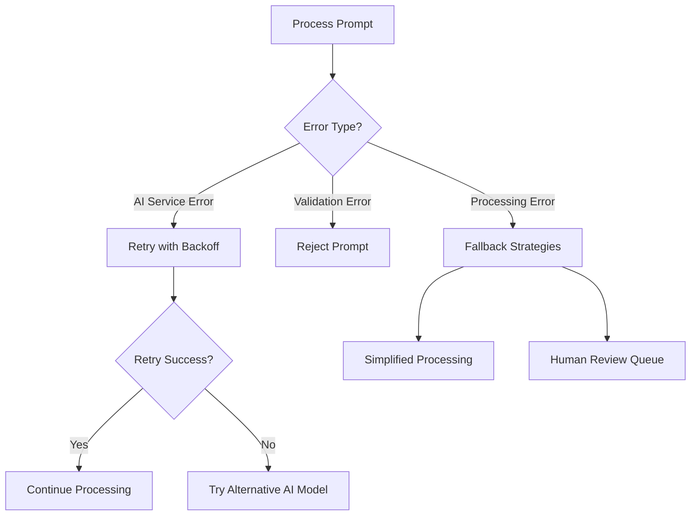
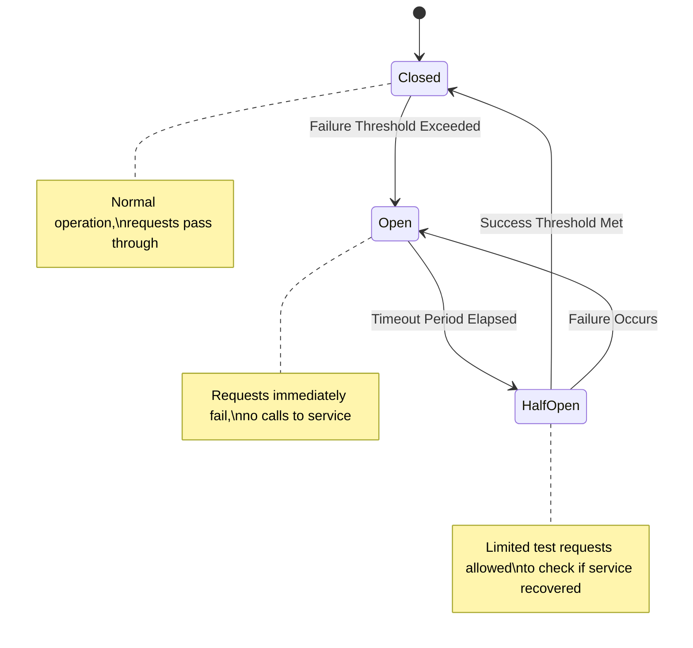
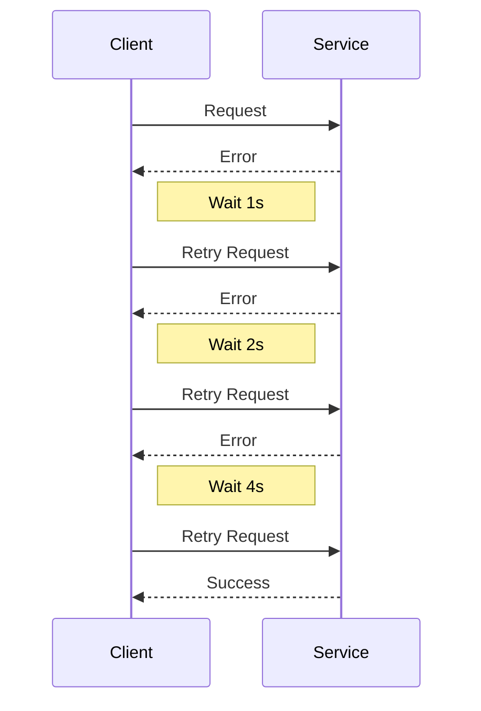
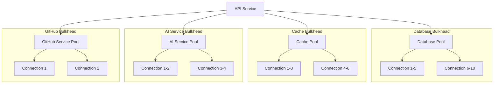
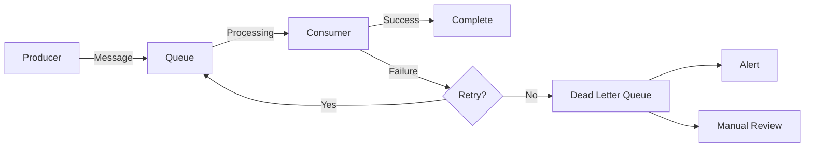

# Error Handling and Recovery Strategy

This document outlines the comprehensive error handling and recovery strategy for the Sketchy Chain application across all services. The strategy aims to ensure system resilience, minimize user impact during failures, and provide clear paths to recovery.

## Error Handling Principles

1. **Fail gracefully**: When errors occur, the system should degrade functionality rather than crash completely
2. **Provide meaningful feedback**: Users should receive clear, actionable information about errors
3. **Preserve data integrity**: Ensure that errors don't corrupt data or leave the system in an inconsistent state
4. **Automate recovery**: Where possible, implement automatic recovery mechanisms
5. **Learn from failures**: Log comprehensive error information for analysis and improvement
6. **Anticipate failures**: Design components with the assumption that dependencies will fail
7. **Contain failures**: Use bulkheads and circuit breakers to prevent cascading failures

## Error Categories

| Category | Description | Examples | Priority |
|----------|-------------|----------|----------|
| **Infrastructure** | Hardware, network, or hosting platform failures | Network partition, VM termination, disk failure | P1 |
| **Dependency** | External service or system dependency failures | AI service outage, GitHub API rate limiting, database unavailability | P1 |
| **Application** | Bugs or failures in application code | Unhandled exceptions, memory leaks, race conditions | P2 |
| **Data** | Data corruption, integrity violations, or format issues | Invalid database state, schema violations | P1 |
| **Configuration** | Incorrect system configuration or environment setup | Missing environment variables, invalid configuration values | P2 |
| **Security** | Security-related failures or breaches | Authentication failures, DDoS attacks, injection attempts | P1 |
| **Resource** | Resource exhaustion or limitation issues | Out of memory, disk space, connection limits reached | P2 |
| **User** | Invalid user inputs or actions | Malformed inputs, excessive requests | P3 |

## Service-Specific Error Handling

### Frontend Application



**Key Strategies:**

1. **Error Boundaries**: Implement React error boundaries to prevent entire UI crashes
2. **Offline Mode**: Support limited functionality when backend services are unavailable
3. **Retry Mechanisms**: Automatically retry failed API requests with exponential backoff
4. **Graceful Degradation**: Disable features that depend on failing services
5. **Progressive Enhancement**: Build core functionality that works without advanced features
6. **Cached Responses**: Use cached data when fresh data is unavailable
7. **Meaningful Error Messages**: Provide user-friendly error messages with actionable steps

### Backend API Service



**Key Strategies:**

1. **Input Validation**: Validate all inputs early to prevent downstream errors
2. **Database Resilience**: Implement connection pooling, retry logic, and read replica fallbacks
3. **Consistent Error Responses**: Use standardized error response format across all endpoints
4. **Transactional Integrity**: Ensure ACID compliance for critical operations
5. **Rate Limiting**: Implement adaptive rate limiting to prevent resource exhaustion
6. **Timeout Management**: Set appropriate timeouts for all external calls
7. **Circuit Breakers**: Implement circuit breakers for external service calls
8. **Idempotent Operations**: Design API operations to be safely retryable

### WebSocket Server



**Key Strategies:**

1. **Reconnection Protocol**: Clear protocol for client reconnection with exponential backoff
2. **Message Acknowledgment**: Implement acknowledgment system for critical messages
3. **State Synchronization**: Mechanism to resynchronize client state after disconnection
4. **Heartbeat Mechanism**: Regular heartbeats to detect zombie connections
5. **Message Queuing**: Queue messages for disconnected clients up to a reasonable limit
6. **Connection Limits**: Enforce per-user connection limits to prevent resource exhaustion
7. **Graceful Degradation**: Fall back to polling API if WebSocket connection fails repeatedly

### AI Worker Service



**Key Strategies:**

1. **Retry Mechanisms**: Implement intelligent retry for transient AI service failures
2. **Model Fallbacks**: Fall back to alternative AI models when primary model fails
3. **Queue Management**: Ensure prompt queue is persistent and can survive service restarts
4. **Partial Results**: Return partial or previous results when complete processing fails
5. **Timeout Handling**: Set appropriate timeouts and handle long-running processes
6. **Prompt Validation**: Validate prompts before sending to AI service to catch issues early
7. **Result Verification**: Verify AI results meet quality thresholds before accepting
8. **Dead Letter Queue**: Move repeatedly failed prompts to a dead letter queue for analysis

## Error Recovery Patterns

### Circuit Breaker Pattern



**Implementation:**

```javascript
class CircuitBreaker {
  constructor(options = {}) {
    this.failureThreshold = options.failureThreshold || 5;
    this.resetTimeout = options.resetTimeout || 30000; // 30 seconds
    this.successThreshold = options.successThreshold || 2;
    
    this.state = 'CLOSED';
    this.failureCount = 0;
    this.successCount = 0;
    this.nextAttempt = Date.now();
  }
  
  async execute(fn) {
    if (this.state === 'OPEN') {
      if (Date.now() > this.nextAttempt) {
        this.state = 'HALF-OPEN';
      } else {
        throw new Error('Circuit is OPEN');
      }
    }
    
    try {
      const result = await fn();
      
      if (this.state === 'HALF-OPEN') {
        this.successCount++;
        if (this.successCount >= this.successThreshold) {
          this.reset();
        }
      }
      
      return result;
    } catch (error) {
      this.failureCount++;
      
      if (this.state === 'HALF-OPEN' || this.failureCount >= this.failureThreshold) {
        this.state = 'OPEN';
        this.nextAttempt = Date.now() + this.resetTimeout;
      }
      
      throw error;
    }
  }
  
  reset() {
    this.state = 'CLOSED';
    this.failureCount = 0;
    this.successCount = 0;
  }
}
```

### Retry with Exponential Backoff



**Implementation:**

```javascript
async function retryWithBackoff(fn, maxRetries = 5, initialBackoff = 1000, maxBackoff = 30000) {
  let retries = 0;
  let backoff = initialBackoff;
  
  while (true) {
    try {
      return await fn();
    } catch (error) {
      retries++;
      
      if (retries >= maxRetries) {
        throw error;
      }
      
      // Add jitter to prevent all clients retrying simultaneously
      const jitter = Math.random() * 0.3 + 0.85; // 0.85-1.15
      const actualBackoff = Math.min(backoff * jitter, maxBackoff);
      
      console.log(`Retry ${retries} after ${actualBackoff}ms`);
      await new Promise(resolve => setTimeout(resolve, actualBackoff));
      
      // Exponential backoff
      backoff = backoff * 2;
    }
  }
}
```

### Bulkhead Pattern

Isolate components to prevent cascading failures.



**Implementation:**

```javascript
class BulkheadPool {
  constructor(options = {}) {
    this.maxConcurrent = options.maxConcurrent || 10;
    this.maxWaiting = options.maxWaiting || 20;
    this.timeout = options.timeout || 5000;
    
    this.executing = 0;
    this.queue = [];
  }
  
  async execute(fn) {
    // Reject immediately if queue is full
    if (this.queue.length >= this.maxWaiting) {
      throw new Error('Bulkhead queue is full');
    }
    
    // Create a promise that will resolve when execution is allowed
    return new Promise((resolve, reject) => {
      const timeoutId = setTimeout(() => {
        // Remove from queue if still waiting
        const index = this.queue.indexOf(queuedExecution);
        if (index !== -1) {
          this.queue.splice(index, 1);
          reject(new Error('Bulkhead execution timed out while queued'));
        }
      }, this.timeout);
      
      const queuedExecution = {
        fn,
        resolve,
        reject,
        timeoutId
      };
      
      this.queue.push(queuedExecution);
      this.processQueue();
    });
  }
  
  processQueue() {
    // If at capacity or no items in queue, do nothing
    if (this.executing >= this.maxConcurrent || this.queue.length === 0) {
      return;
    }
    
    // Get the next item from the queue
    const { fn, resolve, reject, timeoutId } = this.queue.shift();
    
    // Clear the timeout since we're now executing
    clearTimeout(timeoutId);
    
    // Increment executing count
    this.executing++;
    
    // Execute the function
    Promise.resolve().then(() => fn())
      .then(result => {
        this.executing--;
        this.processQueue();
        resolve(result);
      })
      .catch(error => {
        this.executing--;
        this.processQueue();
        reject(error);
      });
  }
}
```

### Dead Letter Queue



## Error Logging and Observability

1. **Structured Error Logging**: Log errors with structured context including:
   - Error type and message
   - Stack trace
   - Request ID for correlation
   - User/session ID (if applicable)
   - Relevant business context (e.g., sketchId, promptId)
   - System context (service, instance, environment)

2. **Log Levels**: Use appropriate log levels based on error severity:
   - ERROR: Unexpected errors that require attention
   - WARN: Handled errors that might indicate issues
   - INFO: Expected errors (like validation failures)

3. **Error Metrics**: Track error-related metrics:
   - Error rates by service/endpoint
   - Error types and frequencies
   - Recovery success rates
   - Retry counts

4. **Distributed Tracing**: Implement distributed tracing to trace error paths across services

5. **Health Checks**: Include error-related information in health check endpoints

## Service-Specific Recovery Plans

### Database Recovery

| Failure Scenario | Detection | Automated Recovery | Manual Recovery | Prevention |
|------------------|-----------|-------------------|-----------------|------------|
| Connection failure | Connection errors | Retry with exponential backoff | Investigate network/firewall issues | Connection pooling, monitoring |
| Query timeout | Slow query logs | Retry with circuit breaker | Optimize query, add indexes | Query timeouts, monitoring |
| Replication lag | Lag metrics | Read from primary until recovered | Investigate replication issues | Monitor lag, alert thresholds |
| Data corruption | Integrity checks | Switch to backup replica | Restore from backup | Regular backups, integrity checks |
| Resource exhaustion | Resource metrics | Scale up resources | Optimize queries, add capacity | Capacity planning, monitoring |

### AI Service Recovery

| Failure Scenario | Detection | Automated Recovery | Manual Recovery | Prevention |
|------------------|-----------|-------------------|-----------------|------------|
| Service unavailable | API errors | Try alternative model/provider | Investigate outage | Multi-provider strategy |
| Rate limiting | 429 responses | Implement adaptive throttling | Increase rate limits | Rate limit monitoring, queueing |
| Timeout | Request timeouts | Retry with simpler prompt | Optimize prompts | Timeout configuration |
| Low quality results | Quality metrics | Fall back to simpler model | Review prompt design | Quality testing, monitoring |
| Model hallucination | Validation rules | Reject results, retry | Update validation rules | Content validation, testing |

### GitHub Integration Recovery

| Failure Scenario | Detection | Automated Recovery | Manual Recovery | Prevention |
|------------------|-----------|-------------------|-----------------|------------|
| API rate limiting | 403 responses | Implement token bucket, retry | Request limit increase | Rate monitoring, multiple tokens |
| Authentication failure | 401 responses | Refresh token if possible | Update credentials | Token rotation, monitoring |
| Repository unavailable | 404 responses | Retry with exponential backoff | Verify repository configuration | Repository validation |
| Commit conflicts | Error responses | Fetch latest, rebase, retry | Manually resolve conflicts | Frequent commits, isolated changes |

### WebSocket Recovery

| Failure Scenario | Detection | Automated Recovery | Manual Recovery | Prevention |
|------------------|-----------|-------------------|-----------------|------------|
| Connection drop | Heartbeat failure | Client reconnection with backoff | Investigate network issues | Connection quality monitoring |
| Server restart | Service events | Reconnect, resync state | Verify server health | Rolling updates, connection draining |
| Message loss | Sequence gaps | Request missing messages | Reload client | Message acknowledgment protocol |
| Connection overload | Connection metrics | Implement load shedding | Scale up capacity | Connection limits, monitoring |

## Recovery Testing Strategy

1. **Fault Injection Testing**: Systematically inject faults to test recovery mechanisms
   - Network partitions
   - Service unavailability
   - Resource exhaustion
   - Data corruption

2. **Chaos Engineering**: Regularly run controlled chaos experiments
   - Random instance termination
   - Database failovers
   - Network latency injection
   - Dependency failures

3. **Load Testing with Failures**: Test recovery under load conditions
   - Spike testing during simulated failures
   - Recovery time measurement
   - Performance impact analysis

4. **Recovery Drills**: Regular team exercises for recovery procedures
   - Simulate major outages
   - Practice coordination and communication
   - Document and improve recovery playbooks

## Implementation Roadmap

1. **Phase 1: Basic Error Handling**
   - Implement standardized error handling in all services
   - Establish error logging standards
   - Create basic retry mechanisms
   - Develop initial alert thresholds

2. **Phase 2: Advanced Recovery Patterns**
   - Implement circuit breakers
   - Add bulkhead patterns
   - Create fallback strategies
   - Develop dead letter queues

3. **Phase 3: Observability and Testing**
   - Implement comprehensive error metrics
   - Add distributed tracing for errors
   - Develop fault injection testing
   - Create recovery playbooks

4. **Phase 4: Continuous Improvement**
   - Regular recovery testing
   - Error pattern analysis
   - Recovery time optimization
   - Automation of common recovery procedures