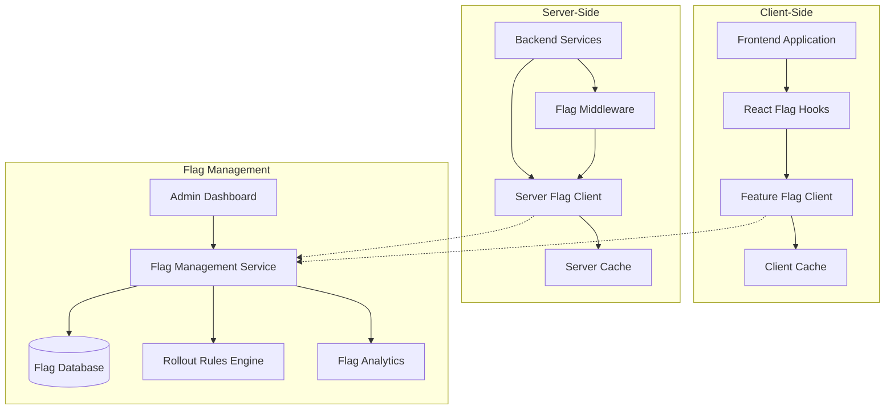
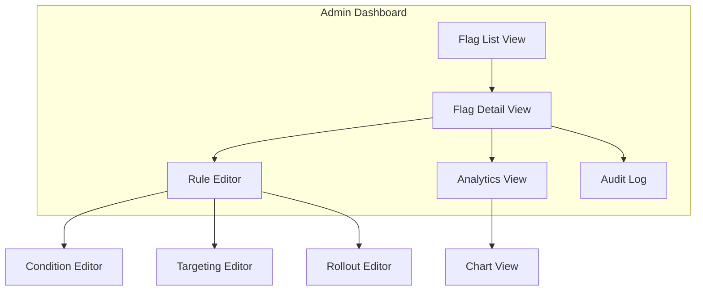

# Feature Flag System Architecture

This document outlines the architecture for a comprehensive feature flag system for the Sketchy Chain application. The system enables controlled, gradual rollout of new functionality, A/B testing, and provides kill switches for emergency scenarios.

## Objectives

1. **Gradual Rollouts**: Enable percentage-based or targeted rollout of new features
2. **Risk Mitigation**: Provide ability to quickly disable problematic features
3. **Testing in Production**: Support A/B testing and experimentation
4. **Customization**: Allow feature availability by user segment, location, or device
5. **Separation of Concerns**: Decouple deployment from feature release
6. **Analytics**: Enable tracking of feature usage and impact

## System Architecture



## Core Components

### Flag Management Service

The Flag Management Service is a dedicated microservice responsible for:

1. Storing and retrieving feature flag configurations
2. Evaluating flag rules for specific contexts
3. Providing real-time flag updates
4. Collecting usage analytics
5. Exposing management APIs

**API Endpoints:**

```
GET  /api/v1/flags                 # Get all flags
GET  /api/v1/flags/:key            # Get specific flag details
GET  /api/v1/flags/evaluate        # Evaluate flags for a context
POST /api/v1/flags                 # Create a new flag
PUT  /api/v1/flags/:key            # Update a flag
POST /api/v1/flags/:key/archive    # Archive a flag
POST /api/v1/flags/:key/restore    # Restore an archived flag
GET  /api/v1/audit                 # Get flag change history
GET  /api/v1/analytics/:key        # Get flag usage analytics
```

### Flag Data Model

```javascript
// Feature flag schema
{
  "key": "new-prompt-ui",            // Unique identifier
  "name": "New Prompt UI",           // Display name
  "description": "Redesigned prompt input interface with AI suggestions",
  "enabled": true,                   // Master toggle
  "archived": false,                 // Whether flag is archived
  "permanent": false,                // Whether flag is permanent
  "defaultValue": false,             // Default value if rules don't match
  
  "rules": [
    {
      "id": "rule1",
      "name": "Internal Users",
      "priority": 100,
      "conditions": [
        { 
          "attribute": "email", 
          "operator": "endsWith", 
          "value": "@aipromptdesigner.com" 
        }
      ],
      "value": true
    },
    {
      "id": "rule2",
      "name": "Beta Users",
      "priority": 80,
      "conditions": [
        { 
          "attribute": "userGroup", 
          "operator": "equals", 
          "value": "beta" 
        }
      ],
      "value": true
    },
    {
      "id": "rule3",
      "name": "Percentage Rollout",
      "priority": 60,
      "conditions": [],
      "value": true,
      "rollout": {
        "seed": "new-prompt-ui",      // Ensures consistent bucketing
        "percentage": 25,             // Rollout percentage (0-100)
        "attribute": "userId"         // Attribute to use for bucketing
      }
    }
  ],
  
  "tags": ["ui", "prompt", "beta"],
  "createdBy": "jane.doe",
  "createdAt": "2025-09-01T12:00:00Z",
  "modifiedBy": "john.smith",
  "modifiedAt": "2025-09-15T14:30:00Z",
  
  "environments": {
    "development": {
      "enabled": true,
      "rules": "inherited"
    },
    "staging": {
      "enabled": true,
      "rules": "inherited"
    },
    "production": {
      "enabled": true,
      "rules": "inherited"
    }
  }
}
```

### Client-Side Implementation

#### React Integration

```tsx
// src/hooks/useFeatureFlag.ts
import { useState, useEffect } from 'react';
import flagClient from '../services/flagClient';

export function useFeatureFlag(flagKey: string, defaultValue: boolean = false): boolean {
  const [flagValue, setFlagValue] = useState<boolean>(
    // Initialize with cached value if available, otherwise use default
    flagClient.getBooleanValue(flagKey, defaultValue)
  );
  
  useEffect(() => {
    // Subscribe to flag changes
    const unsubscribe = flagClient.subscribe(flagKey, (newValue) => {
      setFlagValue(newValue);
    });
    
    // Record flag evaluation for analytics
    flagClient.recordEvaluation(flagKey, flagValue);
    
    return () => {
      unsubscribe();
    };
  }, [flagKey]);
  
  return flagValue;
}
```

#### Component Usage

```tsx
// src/components/PromptInput.tsx
import React from 'react';
import { useFeatureFlag } from '../hooks/useFeatureFlag';
import { OldPromptUI } from './OldPromptUI';
import { NewPromptUI } from './NewPromptUI';

export const PromptInput: React.FC = () => {
  const useNewUI = useFeatureFlag('new-prompt-ui', false);
  
  return useNewUI ? <NewPromptUI /> : <OldPromptUI />;
};
```

#### Conditional Feature Component

```tsx
// src/components/FeatureFlag.tsx
import React from 'react';
import { useFeatureFlag } from '../hooks/useFeatureFlag';

interface FeatureFlagProps {
  flag: string;
  fallback?: React.ReactNode;
  children: React.ReactNode;
}

export const FeatureFlag: React.FC<FeatureFlagProps> = ({ 
  flag, 
  fallback = null, 
  children 
}) => {
  const enabled = useFeatureFlag(flag, false);
  
  return enabled ? <>{children}</> : <>{fallback}</>;
};
```

```tsx
// Usage in components
<FeatureFlag flag="enhanced-history-view">
  <EnhancedHistoryView />
</FeatureFlag>
```

### Server-Side Implementation

#### Express Middleware

```typescript
// src/middleware/featureFlag.ts
import { Request, Response, NextFunction } from 'express';
import flagClient from '../services/serverFlagClient';

export function requireFeature(flagKey: string) {
  return (req: Request, res: Response, next: NextFunction) => {
    const context = {
      userId: req.user?.id,
      userGroup: req.user?.group,
      email: req.user?.email,
      ip: req.ip,
      // Add additional context as needed
    };
    
    const enabled = flagClient.getBooleanValue(flagKey, false, context);
    
    if (enabled) {
      return next();
    } else {
      return res.status(404).json({
        error: {
          code: 'feature_not_available',
          message: 'This feature is not available'
        }
      });
    }
  };
}
```

#### Route Protection

```typescript
// src/routes/api.ts
import { Router } from 'express';
import { requireFeature } from '../middleware/featureFlag';
import * as promptController from '../controllers/promptController';

const router = Router();

// Base endpoints available to everyone
router.get('/sketches', promptController.listSketches);
router.get('/sketches/:id', promptController.getSketch);

// Feature-flagged endpoints
router.post(
  '/sketches/:id/ai-suggestions',
  requireFeature('ai-prompt-suggestions'),
  promptController.getAISuggestions
);

router.get(
  '/sketches/:id/performance-metrics',
  requireFeature('sketch-performance-metrics'),
  promptController.getPerformanceMetrics
);

export default router;
```

#### Conditional Logic in Services

```typescript
// src/services/promptService.ts
import flagClient from './serverFlagClient';

export async function processPrompt(sketchId: string, promptText: string, context: any) {
  // Get context for flag evaluation
  const flagContext = {
    userId: context.userId,
    userGroup: context.userGroup,
    sketchId,
    // Add additional context as needed
  };
  
  // Check if enhanced prompt processing is enabled
  const useEnhancedProcessing = flagClient.getBooleanValue(
    'enhanced-prompt-processing',
    false,
    flagContext
  );
  
  if (useEnhancedProcessing) {
    return await enhancedPromptProcessing(sketchId, promptText);
  } else {
    return await standardPromptProcessing(sketchId, promptText);
  }
}
```

### Flag Client SDK

```typescript
// src/services/flagClient.ts
import EventEmitter from 'eventemitter3';

class FlagClient {
  private flags: Record<string, any> = {};
  private context: Record<string, any> = {};
  private emitter = new EventEmitter();
  private pollingInterval: number = 30000; // 30 seconds
  private pollingTimer: NodeJS.Timeout | null = null;
  
  constructor() {
    // Initialize with bootstrap data if available
    if (window.__INITIAL_FLAGS__) {
      this.flags = window.__INITIAL_FLAGS__;
    }
    
    this.startPolling();
  }
  
  // Set user/session context for evaluation
  public setContext(context: Record<string, any>): void {
    this.context = { ...this.context, ...context };
    this.refreshFlags(); // Re-fetch flags with new context
  }
  
  // Get a boolean flag value
  public getBooleanValue(key: string, defaultValue: boolean = false): boolean {
    // Return cached value if available
    if (this.flags[key] !== undefined) {
      return this.flags[key] === true;
    }
    
    // Return default if not in cache
    return defaultValue;
  }
  
  // Get a string flag value
  public getStringValue(key: string, defaultValue: string = ''): string {
    if (this.flags[key] !== undefined) {
      return String(this.flags[key]);
    }
    
    return defaultValue;
  }
  
  // Get a numeric flag value
  public getNumberValue(key: string, defaultValue: number = 0): number {
    if (this.flags[key] !== undefined && !isNaN(Number(this.flags[key]))) {
      return Number(this.flags[key]);
    }
    
    return defaultValue;
  }
  
  // Get a JSON flag value
  public getJsonValue<T>(key: string, defaultValue: T): T {
    if (this.flags[key] !== undefined) {
      return this.flags[key] as T;
    }
    
    return defaultValue;
  }
  
  // Subscribe to flag changes
  public subscribe(key: string, callback: (value: any) => void): () => void {
    this.emitter.on(`flag:${key}`, callback);
    
    return () => {
      this.emitter.off(`flag:${key}`, callback);
    };
  }
  
  // Record flag evaluation for analytics
  public recordEvaluation(key: string, value: any): void {
    // Send to analytics endpoint
    fetch('/api/v1/flags/analytics', {
      method: 'POST',
      headers: { 'Content-Type': 'application/json' },
      body: JSON.stringify({
        flagKey: key,
        value,
        timestamp: new Date().toISOString(),
        context: this.context
      }),
      // Use beacon API for exit pages
      keepalive: true
    }).catch(err => console.error('Failed to record flag evaluation:', err));
  }
  
  // Refresh flags from server
  private async refreshFlags(): Promise<void> {
    try {
      const response = await fetch('/api/v1/flags/evaluate', {
        method: 'POST',
        headers: { 'Content-Type': 'application/json' },
        body: JSON.stringify(this.context)
      });
      
      if (!response.ok) {
        throw new Error('Failed to fetch feature flags');
      }
      
      const newFlags = await response.json();
      
      // Find changed flags
      Object.keys(newFlags).forEach(key => {
        if (this.flags[key] !== newFlags[key]) {
          // Emit change events
          this.emitter.emit(`flag:${key}`, newFlags[key]);
        }
      });
      
      // Update local cache
      this.flags = newFlags;
      
      // Store in localStorage for persistence
      localStorage.setItem('feature_flags', JSON.stringify({
        flags: this.flags,
        timestamp: new Date().toISOString()
      }));
    } catch (error) {
      console.error('Error refreshing feature flags:', error);
    }
  }
  
  private startPolling(): void {
    this.refreshFlags(); // Initial fetch
    
    this.pollingTimer = setInterval(() => {
      this.refreshFlags();
    }, this.pollingInterval);
  }
  
  public stopPolling(): void {
    if (this.pollingTimer) {
      clearInterval(this.pollingTimer);
      this.pollingTimer = null;
    }
  }
}

export default new FlagClient();
```

## Rules Evaluation Engine

The rules evaluation engine determines whether a feature flag should be enabled for a given context.

```typescript
// Flag Management Service - Rule Evaluator
function evaluateRules(flag: Flag, context: Context): boolean {
  // If flag is disabled globally, return false
  if (!flag.enabled) {
    return false;
  }
  
  // Sort rules by priority (highest first)
  const sortedRules = [...flag.rules].sort((a, b) => b.priority - a.priority);
  
  // Evaluate each rule in priority order
  for (const rule of sortedRules) {
    // Check if all conditions match
    const conditionsMatch = rule.conditions.every(condition => {
      const contextValue = context[condition.attribute];
      
      switch (condition.operator) {
        case 'equals':
          return contextValue === condition.value;
        case 'notEquals':
          return contextValue !== condition.value;
        case 'contains':
          return String(contextValue).includes(String(condition.value));
        case 'notContains':
          return !String(contextValue).includes(String(condition.value));
        case 'startsWith':
          return String(contextValue).startsWith(String(condition.value));
        case 'endsWith':
          return String(contextValue).endsWith(String(condition.value));
        case 'greaterThan':
          return Number(contextValue) > Number(condition.value);
        case 'lessThan':
          return Number(contextValue) < Number(condition.value);
        case 'in':
          return Array.isArray(condition.value) && condition.value.includes(contextValue);
        case 'notIn':
          return Array.isArray(condition.value) && !condition.value.includes(contextValue);
        default:
          return false;
      }
    });
    
    // If conditions don't match, continue to next rule
    if (!conditionsMatch) {
      continue;
    }
    
    // If this rule has a percentage rollout
    if (rule.rollout) {
      // Compute hash based on the seed and the user attribute
      const hashAttribute = context[rule.rollout.attribute] || '';
      const hashInput = `${rule.rollout.seed}:${hashAttribute}`;
      const hashValue = hashString(hashInput);
      
      // Normalize to percentage (0-100)
      const bucket = hashValue % 100;
      
      // If user is within the rollout percentage
      if (bucket < rule.rollout.percentage) {
        return rule.value === true;
      } else {
        continue; // Try next rule
      }
    } else {
      // No rollout, just return the rule's value
      return rule.value === true;
    }
  }
  
  // If no rules matched, return default value
  return flag.defaultValue === true;
}

// Simple hashing function for consistent bucketing
function hashString(str: string): number {
  let hash = 0;
  for (let i = 0; i < str.length; i++) {
    hash = ((hash << 5) - hash) + str.charCodeAt(i);
    hash |= 0; // Convert to 32-bit integer
  }
  return Math.abs(hash);
}
```

## Admin Interface

The admin interface allows developers and product managers to manage feature flags.



### Key Admin Features

1. **Flag List View**:
   - List all flags with status indicators
   - Filter by tag, status, or search term
   - Quick toggle for enabling/disabling flags
   - Create new flags

2. **Flag Detail View**:
   - Edit flag metadata (name, description, default value)
   - Manage rules and targeting
   - View analytics and usage
   - View audit history

3. **Rule Editor**:
   - Create and edit rules with conditions
   - Set rule priorities
   - Configure percentage rollouts
   - Test rules against sample contexts

4. **Analytics View**:
   - View flag usage metrics
   - Track impact on key performance indicators
   - Monitor error rates related to flags
   - Compare metrics for users with/without features

5. **Audit Log**:
   - Track all changes to flags
   - Record who made changes and when
   - Allow restoring previous versions

## Flag Types and Use Cases

### 1. Release Flags

Used for controlling the rollout of new features.

```tsx
// Example: New AI Prompt Suggestions
<FeatureFlag flag="ai-prompt-suggestions">
  <AISuggestions sketchId={sketchId} />
</FeatureFlag>
```

### 2. Experiment Flags

Used for A/B testing different implementations.

```tsx
// Example: Testing different UI layouts
function SketchGallery() {
  const useGridLayout = useFeatureFlag('sketch-gallery-grid-layout');
  
  return (
    <div className={`gallery ${useGridLayout ? 'grid-layout' : 'list-layout'}`}>
      {/* Gallery content */}
    </div>
  );
}
```

### 3. Operational Flags

Used for controlling system behavior without code changes.

```typescript
// Example: Controlling rate limiting
function getRateLimit(userId: string) {
  const useStrictRateLimiting = flagClient.getBooleanValue(
    'strict-rate-limiting',
    false,
    { userId }
  );
  
  return useStrictRateLimiting ? 10 : 50; // requests per minute
}
```

### 4. Permission Flags

Used for controlling access to features based on user attributes.

```typescript
// Example: Premium features
router.get(
  '/api/v1/advanced-analytics',
  requireFeature('advanced-analytics'),
  analyticsController.getAdvancedAnalytics
);
```

## Implementation Strategy

### Phase 1: Foundation (Month 1)

1. **Core Infrastructure**:
   - Implement feature flag database schema
   - Create flag management service
   - Build basic rule evaluation engine
   - Set up flag caching and polling

2. **Client SDK**:
   - Develop client-side SDK
   - Create React hooks and components
   - Implement server-side SDK
   - Add Express middleware

### Phase 2: Administration (Month 2)

1. **Admin Interface**:
   - Build flag list and detail views
   - Create rule editor
   - Implement basic analytics
   - Add audit logging

2. **Developer Tools**:
   - Create local flag override tools
   - Implement testing utilities
   - Add documentation

### Phase 3: Advanced Capabilities (Month 3+)

1. **Analytics Integration**:
   - Track flag usage metrics
   - Integrate with application monitoring
   - Implement A/B testing analytics

2. **Targeting Enhancements**:
   - Add advanced targeting rules
   - Implement context-aware evaluation
   - Create user segmentation tools

## Performance Considerations

### Client-Side Performance

1. **Minimize Network Requests**:
   - Bundle flags in initial page load
   - Use polling with appropriate intervals
   - Implement efficient delta updates

2. **Caching Strategy**:
   - Cache flags in localStorage
   - Use memory cache for rapid access
   - Implement cache invalidation strategy

3. **Evaluation Optimization**:
   - Optimize rule evaluation algorithm
   - Cache evaluation results
   - Use lazy loading for complex rules

### Server-Side Performance

1. **Distributed Caching**:
   - Use Redis for flag caching
   - Implement efficient cache invalidation
   - Set appropriate TTL values

2. **Database Optimization**:
   - Index flag keys and related fields
   - Use efficient queries for rule evaluation
   - Implement query caching

3. **Flag Service Scaling**:
   - Horizontally scale flag service
   - Implement circuit breaking for resilience
   - Use CDN for static flag configurations

## Integration with Other Systems

### Monitoring Integration

```typescript
// Integrate with monitoring system
import { metrics } from '../services/monitoring';

// Inside flag client
public getBooleanValue(key: string, defaultValue: boolean = false): boolean {
  const value = this.flags[key] !== undefined ? this.flags[key] === true : defaultValue;
  
  // Record metric
  metrics.recordFlagEvaluation({
    flag: key,
    value: value,
    evaluationType: this.flags[key] !== undefined ? 'explicit' : 'default'
  });
  
  return value;
}
```

### Analytics Integration

```typescript
// Track feature adoption metrics
function trackFeatureUsage(featureKey: string, action: string, metadata: object = {}) {
  analytics.track('feature_usage', {
    feature: featureKey,
    action,
    enabled: flagClient.getBooleanValue(featureKey, false),
    ...metadata
  });
}

// Usage
function AdvancedEditor() {
  const hasFeature = useFeatureFlag('advanced-editor');
  
  useEffect(() => {
    trackFeatureUsage('advanced-editor', 'view');
  }, []);
  
  function handleEdit() {
    trackFeatureUsage('advanced-editor', 'edit');
    // Edit logic
  }
  
  return hasFeature ? <AdvancedEditorImpl onEdit={handleEdit} /> : <BasicEditor />;
}
```

### CI/CD Pipeline Integration

```yaml
# GitHub Actions workflow with feature flag verification
name: CI/CD Pipeline

on:
  push:
    branches: [ main ]
  pull_request:
    branches: [ main ]

jobs:
  # Other jobs omitted for brevity
  
  verify-feature-flags:
    runs-on: ubuntu-latest
    steps:
      - uses: actions/checkout@v3
      - name: Verify feature flag references
        run: |
          # Ensure all feature flags are defined
          node scripts/verify-feature-flags.js
  
  # If code references a feature flag that doesn't exist in the database,
  # this step will fail, preventing deployment of broken code
```

## Testing Strategy

### Unit Testing Flags

```typescript
// Example unit test for flag integration
import { render, screen } from '@testing-library/react';
import { FlagProvider } from '../src/providers/FlagProvider';
import { PromptInput } from '../src/components/PromptInput';

describe('PromptInput with feature flags', () => {
  test('should show new UI when flag is enabled', () => {
    // Mock flags
    const flags = {
      'new-prompt-ui': true
    };
    
    render(
      <FlagProvider initialFlags={flags}>
        <PromptInput />
      </FlagProvider>
    );
    
    // Assert new UI is rendered
    expect(screen.getByTestId('new-prompt-ui')).toBeInTheDocument();
  });
  
  test('should show old UI when flag is disabled', () => {
    // Mock flags
    const flags = {
      'new-prompt-ui': false
    };
    
    render(
      <FlagProvider initialFlags={flags}>
        <PromptInput />
      </FlagProvider>
    );
    
    // Assert old UI is rendered
    expect(screen.getByTestId('old-prompt-ui')).toBeInTheDocument();
  });
});
```

### Integration Testing

```typescript
// Example integration test with feature flags
describe('Prompt API with feature flags', () => {
  beforeEach(() => {
    // Mock feature flag service
    jest.spyOn(flagClient, 'getBooleanValue').mockImplementation(
      (key, defaultValue) => {
        if (key === 'enhanced-prompt-processing') {
          return true;
        }
        return defaultValue;
      }
    );
  });
  
  test('should use enhanced processing when flag is enabled', async () => {
    const processSpy = jest.spyOn(promptService, 'enhancedPromptProcessing');
    
    await request(app)
      .post('/api/v1/sketches/123/prompts')
      .send({ text: 'Test prompt' })
      .expect(200);
    
    expect(processSpy).toHaveBeenCalled();
  });
});
```

## Best Practices

1. **Naming Conventions**:
   - Use consistent naming pattern: `feature-area-description`
   - Include purpose in flag key: `enable-new-prompt-ui`
   - Document flags with clear descriptions

2. **Flag Lifecycle Management**:
   - Define clear purpose and success metrics for each flag
   - Set expiration dates for temporary flags
   - Regularly clean up unused flags
   - Archive flags rather than deleting them

3. **Security Considerations**:
   - Restrict admin access with proper authentication
   - Implement audit logging for flag changes
   - Validate flag evaluation requests
   - Consider encryption for sensitive targeting rules

4. **Deployment Strategy**:
   - Use feature flags for every significant change
   - Default new features to OFF in production
   - Implement emergency kill switches for critical features
   - Test flag behavior before deployment

## Conclusion

This feature flag system architecture provides a robust foundation for safely and gradually rolling out new functionality in the Sketchy Chain application. By implementing this system, we enable:

1. **Reduced Risk**: New features can be tested with a small subset of users before wide release
2. **Increased Flexibility**: Product decisions can be made without requiring code changes
3. **Better Experimentation**: A/B testing becomes a core capability
4. **Improved Reliability**: Problematic features can be quickly disabled without redeployment
5. **Enhanced Collaboration**: Product and engineering teams can work more independently

The implementation plan provides a phased approach to building this system, starting with the core infrastructure and gradually adding more advanced capabilities. With proper integration into the development workflow, feature flags will become a powerful tool for continuous delivery and innovation.