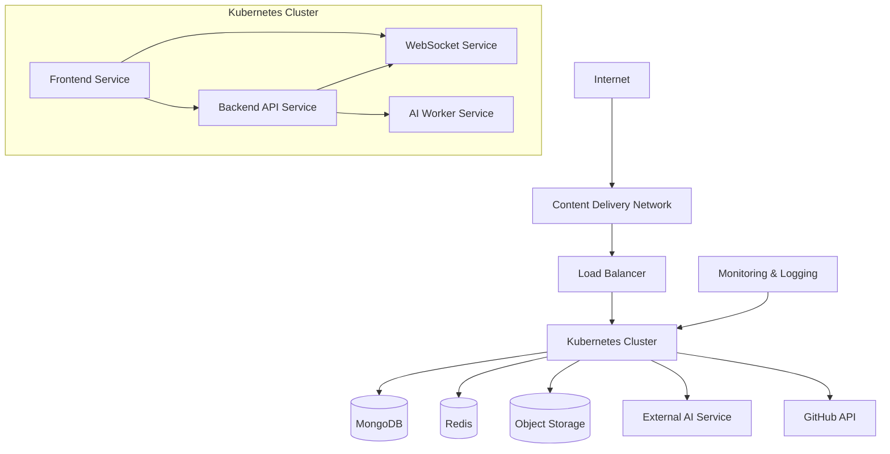

# Infrastructure as Code Templates for Deployment Environments

## Overview

This document provides Infrastructure as Code (IaC) templates for deploying the SketchyChain application across development, staging, and production environments. These templates enable consistent, repeatable, and version-controlled infrastructure provisioning, reducing manual configuration and ensuring environment parity.

## Infrastructure Architecture

The application uses a cloud-native architecture deployed on Kubernetes:



## Environment Strategy

The application uses three distinct environments:

| Environment | Purpose | Scale | Data | Access |
|-------------|---------|-------|------|--------|
| Development | Active development, feature testing | Minimal | Synthetic | Development team |
| Staging | Pre-release testing, integration testing | Production-like | Anonymized clone | Dev + QA + Product |
| Production | Live application | Full scale | Real data | Public + Internal teams |

## Terraform Modules Structure

```
terraform/
├── modules/
│   ├── networking/        # VPC, subnets, security groups
│   ├── kubernetes/        # Kubernetes cluster
│   ├── database/          # MongoDB instances
│   ├── cache/             # Redis instances
│   ├── storage/           # Object storage buckets
│   ├── monitoring/        # Monitoring and alerting
│   └── cdn/               # Content delivery network
├── environments/
│   ├── dev/               # Development environment
│   ├── staging/           # Staging environment
│   └── production/        # Production environment
└── variables/             # Shared variable definitions
```

## Core Infrastructure Templates

### Base Network Configuration

```hcl
# modules/networking/main.tf

variable "environment" {
  description = "Deployment environment"
  type        = string
}

variable "region" {
  description = "AWS region"
  type        = string
}

variable "vpc_cidr" {
  description = "CIDR block for VPC"
  type        = string
}

resource "aws_vpc" "main" {
  cidr_block           = var.vpc_cidr
  enable_dns_support   = true
  enable_dns_hostnames = true

  tags = {
    Name        = "sketchychain-vpc-${var.environment}"
    Environment = var.environment
  }
}

resource "aws_subnet" "public" {
  count             = 3
  vpc_id            = aws_vpc.main.id
  cidr_block        = cidrsubnet(var.vpc_cidr, 8, count.index)
  availability_zone = data.aws_availability_zones.available.names[count.index]
  map_public_ip_on_launch = true

  tags = {
    Name        = "sketchychain-public-subnet-${count.index}-${var.environment}"
    Environment = var.environment
  }
}

resource "aws_subnet" "private" {
  count             = 3
  vpc_id            = aws_vpc.main.id
  cidr_block        = cidrsubnet(var.vpc_cidr, 8, count.index + 3)
  availability_zone = data.aws_availability_zones.available.names[count.index]

  tags = {
    Name        = "sketchychain-private-subnet-${count.index}-${var.environment}"
    Environment = var.environment
  }
}

resource "aws_internet_gateway" "main" {
  vpc_id = aws_vpc.main.id

  tags = {
    Name        = "sketchychain-igw-${var.environment}"
    Environment = var.environment
  }
}

resource "aws_nat_gateway" "main" {
  count         = 3
  allocation_id = aws_eip.nat[count.index].id
  subnet_id     = aws_subnet.public[count.index].id

  tags = {
    Name        = "sketchychain-nat-${count.index}-${var.environment}"
    Environment = var.environment
  }
}

# Security groups, route tables, etc. would follow here
```

### Kubernetes Cluster

```hcl
# modules/kubernetes/main.tf

variable "environment" {
  description = "Deployment environment"
  type        = string
}

variable "cluster_name" {
  description = "Name of the EKS cluster"
  type        = string
}

variable "vpc_id" {
  description = "VPC ID where the cluster will be deployed"
  type        = string
}

variable "subnet_ids" {
  description = "Subnet IDs where the cluster will be deployed"
  type        = list(string)
}

variable "node_instance_types" {
  description = "Instance types for the EKS nodes"
  type        = list(string)
}

variable "node_desired_capacity" {
  description = "Desired number of nodes in the EKS cluster"
  type        = number
}

variable "node_max_capacity" {
  description = "Maximum number of nodes in the EKS cluster"
  type        = number
}

variable "node_min_capacity" {
  description = "Minimum number of nodes in the EKS cluster"
  type        = number
}

resource "aws_eks_cluster" "main" {
  name     = var.cluster_name
  role_arn = aws_iam_role.eks_cluster.arn
  version  = "1.23"

  vpc_config {
    subnet_ids              = var.subnet_ids
    endpoint_private_access = true
    endpoint_public_access  = true
    security_group_ids      = [aws_security_group.eks_cluster.id]
  }

  depends_on = [
    aws_iam_role_policy_attachment.eks_cluster_policy,
  ]

  tags = {
    Environment = var.environment
  }
}

resource "aws_eks_node_group" "main" {
  cluster_name    = aws_eks_cluster.main.name
  node_group_name = "${var.cluster_name}-node-group"
  node_role_arn   = aws_iam_role.eks_nodes.arn
  subnet_ids      = var.subnet_ids
  instance_types  = var.node_instance_types

  scaling_config {
    desired_size = var.node_desired_capacity
    max_size     = var.node_max_capacity
    min_size     = var.node_min_capacity
  }

  depends_on = [
    aws_iam_role_policy_attachment.eks_node_policy,
    aws_iam_role_policy_attachment.eks_cni_policy,
    aws_iam_role_policy_attachment.eks_container_registry,
  ]

  tags = {
    Environment = var.environment
  }
}

# IAM roles and policies, security groups would follow here
```

### MongoDB Database

```hcl
# modules/database/main.tf

variable "environment" {
  description = "Deployment environment"
  type        = string
}

variable "vpc_id" {
  description = "VPC ID where the database will be deployed"
  type        = string
}

variable "subnet_ids" {
  description = "Subnet IDs where the database will be deployed"
  type        = list(string)
}

variable "instance_class" {
  description = "Instance class for the DocumentDB cluster instances"
  type        = string
}

variable "instance_count" {
  description = "Number of instances in the DocumentDB cluster"
  type        = number
}

resource "aws_docdb_cluster" "main" {
  cluster_identifier      = "sketchychain-docdb-${var.environment}"
  engine                  = "docdb"
  master_username         = "sketchychain_app"
  master_password         = random_password.db_password.result
  db_subnet_group_name    = aws_docdb_subnet_group.main.name
  vpc_security_group_ids  = [aws_security_group.docdb.id]
  backup_retention_period = var.environment == "production" ? 7 : 1
  preferred_backup_window = "07:00-09:00"
  skip_final_snapshot     = var.environment != "production"

  tags = {
    Name        = "sketchychain-docdb-${var.environment}"
    Environment = var.environment
  }
}

resource "aws_docdb_cluster_instance" "cluster_instances" {
  count              = var.instance_count
  identifier         = "sketchychain-docdb-${var.environment}-${count.index}"
  cluster_identifier = aws_docdb_cluster.main.id
  instance_class     = var.instance_class

  tags = {
    Name        = "sketchychain-docdb-instance-${count.index}-${var.environment}"
    Environment = var.environment
  }
}

resource "aws_docdb_subnet_group" "main" {
  name       = "sketchychain-docdb-subnet-group-${var.environment}"
  subnet_ids = var.subnet_ids

  tags = {
    Name        = "sketchychain-docdb-subnet-group-${var.environment}"
    Environment = var.environment
  }
}

# Security groups, passwords, IAM roles would follow here
```

### Redis Cache

```hcl
# modules/cache/main.tf

variable "environment" {
  description = "Deployment environment"
  type        = string
}

variable "vpc_id" {
  description = "VPC ID where the Redis cache will be deployed"
  type        = string
}

variable "subnet_ids" {
  description = "Subnet IDs where the Redis cache will be deployed"
  type        = list(string)
}

variable "node_type" {
  description = "Instance type for Redis cache nodes"
  type        = string
}

resource "aws_elasticache_replication_group" "main" {
  replication_group_id          = "sketchychain-redis-${var.environment}"
  replication_group_description = "SketchyChain Redis cluster for ${var.environment}"
  node_type                     = var.node_type
  number_cache_clusters         = var.environment == "production" ? 3 : 1
  parameter_group_name          = "default.redis6.x"
  subnet_group_name             = aws_elasticache_subnet_group.main.name
  security_group_ids            = [aws_security_group.redis.id]
  port                          = 6379
  multi_az_enabled              = var.environment == "production"
  automatic_failover_enabled    = var.environment == "production"

  tags = {
    Name        = "sketchychain-redis-${var.environment}"
    Environment = var.environment
  }
}

resource "aws_elasticache_subnet_group" "main" {
  name       = "sketchychain-redis-subnet-group-${var.environment}"
  subnet_ids = var.subnet_ids

  tags = {
    Name        = "sketchychain-redis-subnet-group-${var.environment}"
    Environment = var.environment
  }
}

# Security groups would follow here
```

## Kubernetes Application Manifests

### Namespace Configuration

```yaml
# kubernetes/base/namespace.yaml
apiVersion: v1
kind: Namespace
metadata:
  name: sketchychain
  labels:
    name: sketchychain
---
apiVersion: v1
kind: ResourceQuota
metadata:
  name: sketchychain-quota
  namespace: sketchychain
spec:
  hard:
    pods: "50"
    requests.cpu: "10"
    requests.memory: 20Gi
    limits.cpu: "20"
    limits.memory: 40Gi
```

### Frontend Deployment

```yaml
# kubernetes/base/frontend/deployment.yaml
apiVersion: apps/v1
kind: Deployment
metadata:
  name: frontend
  namespace: sketchychain
spec:
  replicas: 2
  selector:
    matchLabels:
      app: frontend
  template:
    metadata:
      labels:
        app: frontend
    spec:
      containers:
      - name: frontend
        image: ${REGISTRY_URL}/sketchychain-frontend:${IMAGE_TAG}
        ports:
        - containerPort: 80
        env:
        - name: NODE_ENV
          value: ${ENVIRONMENT}
        - name: API_URL
          value: http://backend:4000
        - name: WS_URL
          value: ws://websocket:4001
        resources:
          requests:
            memory: "256Mi"
            cpu: "200m"
          limits:
            memory: "512Mi"
            cpu: "500m"
        readinessProbe:
          httpGet:
            path: /health
            port: 80
          initialDelaySeconds: 5
          periodSeconds: 10
        livenessProbe:
          httpGet:
            path: /health
            port: 80
          initialDelaySeconds: 15
          periodSeconds: 20
---
apiVersion: v1
kind: Service
metadata:
  name: frontend
  namespace: sketchychain
spec:
  selector:
    app: frontend
  ports:
  - port: 80
    targetPort: 80
  type: ClusterIP
```

### Backend API Deployment

```yaml
# kubernetes/base/backend/deployment.yaml
apiVersion: apps/v1
kind: Deployment
metadata:
  name: backend
  namespace: sketchychain
spec:
  replicas: 3
  selector:
    matchLabels:
      app: backend
  template:
    metadata:
      labels:
        app: backend
    spec:
      containers:
      - name: backend
        image: ${REGISTRY_URL}/sketchychain-backend:${IMAGE_TAG}
        ports:
        - containerPort: 4000
        env:
        - name: NODE_ENV
          value: ${ENVIRONMENT}
        - name: MONGODB_URI
          valueFrom:
            secretKeyRef:
              name: database-credentials
              key: mongodb-uri
        - name: REDIS_URI
          valueFrom:
            secretKeyRef:
              name: redis-credentials
              key: redis-uri
        - name: WS_SERVICE_URL
          value: http://websocket:4001
        - name: AI_SERVICE_API_KEY
          valueFrom:
            secretKeyRef:
              name: external-api-credentials
              key: ai-service-api-key
        - name: GITHUB_API_TOKEN
          valueFrom:
            secretKeyRef:
              name: external-api-credentials
              key: github-api-token
        resources:
          requests:
            memory: "512Mi"
            cpu: "250m"
          limits:
            memory: "1Gi"
            cpu: "500m"
        readinessProbe:
          httpGet:
            path: /health
            port: 4000
          initialDelaySeconds: 5
          periodSeconds: 10
        livenessProbe:
          httpGet:
            path: /health
            port: 4000
          initialDelaySeconds: 15
          periodSeconds: 20
---
apiVersion: v1
kind: Service
metadata:
  name: backend
  namespace: sketchychain
spec:
  selector:
    app: backend
  ports:
  - port: 4000
    targetPort: 4000
  type: ClusterIP
```

### WebSocket Service

```yaml
# kubernetes/base/websocket/deployment.yaml
apiVersion: apps/v1
kind: Deployment
metadata:
  name: websocket
  namespace: sketchychain
spec:
  replicas: 3
  selector:
    matchLabels:
      app: websocket
  template:
    metadata:
      labels:
        app: websocket
    spec:
      containers:
      - name: websocket
        image: ${REGISTRY_URL}/sketchychain-websocket:${IMAGE_TAG}
        ports:
        - containerPort: 4001
        env:
        - name: NODE_ENV
          value: ${ENVIRONMENT}
        - name: REDIS_URI
          valueFrom:
            secretKeyRef:
              name: redis-credentials
              key: redis-uri
        resources:
          requests:
            memory: "512Mi"
            cpu: "250m"
          limits:
            memory: "1Gi"
            cpu: "500m"
        readinessProbe:
          httpGet:
            path: /health
            port: 4001
          initialDelaySeconds: 5
          periodSeconds: 10
        livenessProbe:
          httpGet:
            path: /health
            port: 4001
          initialDelaySeconds: 15
          periodSeconds: 20
---
apiVersion: v1
kind: Service
metadata:
  name: websocket
  namespace: sketchychain
spec:
  selector:
    app: websocket
  ports:
  - port: 4001
    targetPort: 4001
  type: ClusterIP
```

### AI Worker Service

```yaml
# kubernetes/base/ai-worker/deployment.yaml
apiVersion: apps/v1
kind: Deployment
metadata:
  name: ai-worker
  namespace: sketchychain
spec:
  replicas: 2
  selector:
    matchLabels:
      app: ai-worker
  template:
    metadata:
      labels:
        app: ai-worker
    spec:
      containers:
      - name: ai-worker
        image: ${REGISTRY_URL}/sketchychain-ai-worker:${IMAGE_TAG}
        env:
        - name: NODE_ENV
          value: ${ENVIRONMENT}
        - name: MONGODB_URI
          valueFrom:
            secretKeyRef:
              name: database-credentials
              key: mongodb-uri
        - name: REDIS_URI
          valueFrom:
            secretKeyRef:
              name: redis-credentials
              key: redis-uri
        - name: AI_SERVICE_API_KEY
          valueFrom:
            secretKeyRef:
              name: external-api-credentials
              key: ai-service-api-key
        resources:
          requests:
            memory: "1Gi"
            cpu: "500m"
          limits:
            memory: "2Gi"
            cpu: "1000m"
```

### Ingress Configuration

```yaml
# kubernetes/base/ingress.yaml
apiVersion: networking.k8s.io/v1
kind: Ingress
metadata:
  name: sketchychain-ingress
  namespace: sketchychain
  annotations:
    kubernetes.io/ingress.class: "nginx"
    nginx.ingress.kubernetes.io/ssl-redirect: "true"
    cert-manager.io/cluster-issuer: "letsencrypt-prod"
spec:
  tls:
  - hosts:
    - ${DOMAIN_NAME}
    secretName: sketchychain-tls
  rules:
  - host: ${DOMAIN_NAME}
    http:
      paths:
      - path: /api
        pathType: Prefix
        backend:
          service:
            name: backend
            port:
              number: 4000
      - path: /socket.io
        pathType: Prefix
        backend:
          service:
            name: websocket
            port:
              number: 4001
      - path: /
        pathType: Prefix
        backend:
          service:
            name: frontend
            port:
              number: 80
```

## Environment-Specific Configurations with Kustomize

### Base Configuration

```
kubernetes/
├── base/                  # Base configurations
│   ├── kustomization.yaml
│   ├── namespace.yaml
│   ├── frontend/
│   │   ├── deployment.yaml
│   │   └── service.yaml
│   ├── backend/
│   │   ├── deployment.yaml
│   │   └── service.yaml
│   ├── websocket/
│   │   ├── deployment.yaml
│   │   └── service.yaml
│   ├── ai-worker/
│   │   └── deployment.yaml
│   └── ingress.yaml
├── overlays/              # Environment-specific overrides
│   ├── dev/
│   │   ├── kustomization.yaml
│   │   ├── replicas.yaml
│   │   ├── resources.yaml
│   │   └── configmap.yaml
│   ├── staging/
│   │   ├── kustomization.yaml
│   │   ├── replicas.yaml
│   │   ├── resources.yaml
│   │   └── configmap.yaml
│   └── production/
│       ├── kustomization.yaml
│       ├── replicas.yaml
│       ├── resources.yaml
│       ├── hpa.yaml
│       └── configmap.yaml
```

### Base Kustomization

```yaml
# kubernetes/base/kustomization.yaml
apiVersion: kustomize.config.k8s.io/v1beta1
kind: Kustomization
resources:
- namespace.yaml
- frontend/deployment.yaml
- frontend/service.yaml
- backend/deployment.yaml
- backend/service.yaml
- websocket/deployment.yaml
- websocket/service.yaml
- ai-worker/deployment.yaml
- ingress.yaml
```

### Production Environment Kustomization

```yaml
# kubernetes/overlays/production/kustomization.yaml
apiVersion: kustomize.config.k8s.io/v1beta1
kind: Kustomization
namespace: sketchychain
bases:
- ../../base
patchesStrategicMerge:
- replicas.yaml
- resources.yaml
resources:
- hpa.yaml
configMapGenerator:
- name: sketchychain-config
  literals:
  - NODE_ENV=production
  - DOMAIN_NAME=app.sketchychain.com
  - LOG_LEVEL=info
secretGenerator:
- name: database-credentials
  files:
  - mongodb-uri=secrets/mongodb-uri
- name: redis-credentials
  files:
  - redis-uri=secrets/redis-uri
- name: external-api-credentials
  files:
  - ai-service-api-key=secrets/ai-service-api-key
  - github-api-token=secrets/github-api-token
images:
- name: ${REGISTRY_URL}/sketchychain-frontend
  newTag: ${IMAGE_TAG}
- name: ${REGISTRY_URL}/sketchychain-backend
  newTag: ${IMAGE_TAG}
- name: ${REGISTRY_URL}/sketchychain-websocket
  newTag: ${IMAGE_TAG}
- name: ${REGISTRY_URL}/sketchychain-ai-worker
  newTag: ${IMAGE_TAG}
```

### Production Horizontal Pod Autoscaler

```yaml
# kubernetes/overlays/production/hpa.yaml
apiVersion: autoscaling/v2
kind: HorizontalPodAutoscaler
metadata:
  name: frontend-hpa
  namespace: sketchychain
spec:
  scaleTargetRef:
    apiVersion: apps/v1
    kind: Deployment
    name: frontend
  minReplicas: 3
  maxReplicas: 10
  metrics:
  - type: Resource
    resource:
      name: cpu
      target:
        type: Utilization
        averageUtilization: 70
---
apiVersion: autoscaling/v2
kind: HorizontalPodAutoscaler
metadata:
  name: backend-hpa
  namespace: sketchychain
spec:
  scaleTargetRef:
    apiVersion: apps/v1
    kind: Deployment
    name: backend
  minReplicas: 3
  maxReplicas: 15
  metrics:
  - type: Resource
    resource:
      name: cpu
      target:
        type: Utilization
        averageUtilization: 70
---
apiVersion: autoscaling/v2
kind: HorizontalPodAutoscaler
metadata:
  name: websocket-hpa
  namespace: sketchychain
spec:
  scaleTargetRef:
    apiVersion: apps/v1
    kind: Deployment
    name: websocket
  minReplicas: 3
  maxReplicas: 15
  metrics:
  - type: Resource
    resource:
      name: cpu
      target:
        type: Utilization
        averageUtilization: 70
---
apiVersion: autoscaling/v2
kind: HorizontalPodAutoscaler
metadata:
  name: ai-worker-hpa
  namespace: sketchychain
spec:
  scaleTargetRef:
    apiVersion: apps/v1
    kind: Deployment
    name: ai-worker
  minReplicas: 2
  maxReplicas: 10
  metrics:
  - type: Resource
    resource:
      name: cpu
      target:
        type: Utilization
        averageUtilization: 70
```

## Monitoring and Logging Configuration

### Prometheus Operator CustomResources

```yaml
# kubernetes/monitoring/service-monitors.yaml
apiVersion: monitoring.coreos.com/v1
kind: ServiceMonitor
metadata:
  name: sketchychain-backend
  namespace: monitoring
spec:
  selector:
    matchLabels:
      app: backend
  namespaceSelector:
    matchNames:
      - sketchychain
  endpoints:
  - port: http
    interval: 15s
    path: /metrics
---
apiVersion: monitoring.coreos.com/v1
kind: ServiceMonitor
metadata:
  name: sketchychain-websocket
  namespace: monitoring
spec:
  selector:
    matchLabels:
      app: websocket
  namespaceSelector:
    matchNames:
      - sketchychain
  endpoints:
  - port: http
    interval: 15s
    path: /metrics
```

### Grafana Dashboard ConfigMap

```yaml
# kubernetes/monitoring/grafana-dashboard.yaml
apiVersion: v1
kind: ConfigMap
metadata:
  name: sketchychain-dashboard
  namespace: monitoring
  labels:
    grafana_dashboard: "1"
data:
  sketchychain-dashboard.json: |-
    {
      "annotations": {
        "list": []
      },
      "editable": true,
      "gnetId": null,
      "graphTooltip": 0,
      "id": null,
      "links": [],
      "panels": [
        {
          "datasource": "Prometheus",
          "fieldConfig": {
            "defaults": {},
            "overrides": []
          },
          "gridPos": {
            "h": 8,
            "w": 12,
            "x": 0,
            "y": 0
          },
          "id": 1,
          "options": {},
          "pluginVersion": "7.5.6",
          "targets": [
            {
              "expr": "sum(rate(http_requests_total{namespace=\"sketchychain\"}[5m])) by (service)",
              "interval": "",
              "legendFormat": "{{service}}",
              "refId": "A"
            }
          ],
          "title": "HTTP Request Rate",
          "type": "timeseries"
        },
        {
          "datasource": "Prometheus",
          "fieldConfig": {
            "defaults": {},
            "overrides": []
          },
          "gridPos": {
            "h": 8,
            "w": 12,
            "x": 12,
            "y": 0
          },
          "id": 2,
          "options": {},
          "pluginVersion": "7.5.6",
          "targets": [
            {
              "expr": "sum(rate(http_request_duration_seconds_sum{namespace=\"sketchychain\"}[5m])) by (service) / sum(rate(http_request_duration_seconds_count{namespace=\"sketchychain\"}[5m])) by (service)",
              "interval": "",
              "legendFormat": "{{service}}",
              "refId": "A"
            }
          ],
          "title": "Average Response Time",
          "type": "timeseries"
        }
      ],
      "schemaVersion": 27,
      "style": "dark",
      "tags": [
        "sketchychain"
      ],
      "title": "SketchyChain Dashboard",
      "uid": "sketchychain"
    }
```

### Fluent Bit for Logging

```yaml
# kubernetes/monitoring/fluent-bit-config.yaml
apiVersion: v1
kind: ConfigMap
metadata:
  name: fluent-bit-config
  namespace: logging
data:
  fluent-bit.conf: |-
    [SERVICE]
        Flush         1
        Log_Level     info
        Daemon        off
        Parsers_File  parsers.conf

    [INPUT]
        Name              tail
        Tag               kube.*
        Path              /var/log/containers/sketchychain-*.log
        Parser            docker
        DB                /var/log/flb_kube.db
        Mem_Buf_Limit     5MB
        Skip_Long_Lines   On
        Refresh_Interval  10

    [FILTER]
        Name                kubernetes
        Match               kube.*
        Kube_URL            https://kubernetes.default.svc:443
        Kube_CA_File        /var/run/secrets/kubernetes.io/serviceaccount/ca.crt
        Kube_Token_File     /var/run/secrets/kubernetes.io/serviceaccount/token
        Merge_Log           On
        K8S-Logging.Parser  On
        K8S-Logging.Exclude Off

    [OUTPUT]
        Name            es
        Match           *
        Host            ${ELASTICSEARCH_HOST}
        Port            ${ELASTICSEARCH_PORT}
        Index           sketchychain
        Type            _doc
        HTTP_User       ${ELASTICSEARCH_USER}
        HTTP_Passwd     ${ELASTICSEARCH_PASSWORD}
        tls             On
        tls.verify      Off
```

## Secrets Management with External Secrets Operator

```yaml
# kubernetes/external-secrets/external-secrets.yaml
apiVersion: external-secrets.io/v1beta1
kind: ExternalSecret
metadata:
  name: database-credentials
  namespace: sketchychain
spec:
  refreshInterval: "15m"
  secretStoreRef:
    name: aws-secretsmanager
    kind: ClusterSecretStore
  target:
    name: database-credentials
    creationPolicy: Owner
  data:
  - secretKey: mongodb-uri
    remoteRef:
      key: sketchychain/${ENVIRONMENT}/mongodb-uri
---
apiVersion: external-secrets.io/v1beta1
kind: ExternalSecret
metadata:
  name: redis-credentials
  namespace: sketchychain
spec:
  refreshInterval: "15m"
  secretStoreRef:
    name: aws-secretsmanager
    kind: ClusterSecretStore
  target:
    name: redis-credentials
    creationPolicy: Owner
  data:
  - secretKey: redis-uri
    remoteRef:
      key: sketchychain/${ENVIRONMENT}/redis-uri
---
apiVersion: external-secrets.io/v1beta1
kind: ExternalSecret
metadata:
  name: external-api-credentials
  namespace: sketchychain
spec:
  refreshInterval: "15m"
  secretStoreRef:
    name: aws-secretsmanager
    kind: ClusterSecretStore
  target:
    name: external-api-credentials
    creationPolicy: Owner
  data:
  - secretKey: ai-service-api-key
    remoteRef:
      key: sketchychain/${ENVIRONMENT}/ai-service-api-key
  - secretKey: github-api-token
    remoteRef:
      key: sketchychain/${ENVIRONMENT}/github-api-token
```

## CI/CD Pipeline Integration

### GitHub Actions Workflow

```yaml
# .github/workflows/deploy.yaml
name: Deploy Application

on:
  push:
    branches:
      - main
      - develop
    tags:
      - 'v*'

jobs:
  build-and-push:
    name: Build and Push Images
    runs-on: ubuntu-latest
    outputs:
      image_tag: ${{ steps.set-image-tag.outputs.tag }}
    steps:
      - name: Checkout code
        uses: actions/checkout@v3

      - name: Set up Docker Buildx
        uses: docker/setup-buildx-action@v2

      - name: Configure AWS credentials
        uses: aws-actions/configure-aws-credentials@v1
        with:
          aws-access-key-id: ${{ secrets.AWS_ACCESS_KEY_ID }}
          aws-secret-access-key: ${{ secrets.AWS_SECRET_ACCESS_KEY }}
          aws-region: ${{ secrets.AWS_REGION }}

      - name: Login to Amazon ECR
        id: login-ecr
        uses: aws-actions/amazon-ecr-login@v1

      - name: Set image tag
        id: set-image-tag
        run: |
          if [[ $GITHUB_REF == refs/tags/* ]]; then
            TAG=${GITHUB_REF#refs/tags/}
          else
            TAG=$(echo ${GITHUB_SHA} | cut -c1-8)
          fi
          echo "::set-output name=tag::${TAG}"

      - name: Build and push frontend image
        uses: docker/build-push-action@v3
        with:
          context: ./frontend
          file: ./frontend/Dockerfile
          push: true
          tags: ${{ steps.login-ecr.outputs.registry }}/sketchychain-frontend:${{ steps.set-image-tag.outputs.tag }}

      - name: Build and push backend image
        uses: docker/build-push-action@v3
        with:
          context: ./backend
          file: ./backend/Dockerfile
          push: true
          tags: ${{ steps.login-ecr.outputs.registry }}/sketchychain-backend:${{ steps.set-image-tag.outputs.tag }}

      - name: Build and push websocket image
        uses: docker/build-push-action@v3
        with:
          context: ./websocket
          file: ./websocket/Dockerfile
          push: true
          tags: ${{ steps.login-ecr.outputs.registry }}/sketchychain-websocket:${{ steps.set-image-tag.outputs.tag }}

      - name: Build and push ai-worker image
        uses: docker/build-push-action@v3
        with:
          context: ./ai-worker
          file: ./ai-worker/Dockerfile
          push: true
          tags: ${{ steps.login-ecr.outputs.registry }}/sketchychain-ai-worker:${{ steps.set-image-tag.outputs.tag }}

  deploy:
    name: Deploy to Kubernetes
    needs: build-and-push
    runs-on: ubuntu-latest
    steps:
      - name: Checkout code
        uses: actions/checkout@v3

      - name: Configure AWS credentials
        uses: aws-actions/configure-aws-credentials@v1
        with:
          aws-access-key-id: ${{ secrets.AWS_ACCESS_KEY_ID }}
          aws-secret-access-key: ${{ secrets.AWS_SECRET_ACCESS_KEY }}
          aws-region: ${{ secrets.AWS_REGION }}

      - name: Install kubectl
        uses: azure/setup-kubectl@v1

      - name: Update kubeconfig
        run: |
          aws eks update-kubeconfig --name sketchychain-cluster-${{ github.ref == 'refs/heads/main' && 'production' || 'staging' }}

      - name: Install kustomize
        run: |
          curl -s "https://raw.githubusercontent.com/kubernetes-sigs/kustomize/master/hack/install_kustomize.sh" | bash
          sudo mv kustomize /usr/local/bin/

      - name: Deploy to environment
        run: |
          if [[ $GITHUB_REF == refs/heads/main ]]; then
            ENVIRONMENT="production"
            DOMAIN="app.sketchychain.com"
          elif [[ $GITHUB_REF == refs/heads/develop ]]; then
            ENVIRONMENT="staging"
            DOMAIN="staging.sketchychain.com"
          else
            ENVIRONMENT="dev"
            DOMAIN="dev.sketchychain.com"
          fi
          
          cd kubernetes/overlays/${ENVIRONMENT}
          
          # Set image tags and other variables
          kustomize edit set image ${ECR_REGISTRY}/sketchychain-frontend:${{ needs.build-and-push.outputs.image_tag }}
          kustomize edit set image ${ECR_REGISTRY}/sketchychain-backend:${{ needs.build-and-push.outputs.image_tag }}
          kustomize edit set image ${ECR_REGISTRY}/sketchychain-websocket:${{ needs.build-and-push.outputs.image_tag }}
          kustomize edit set image ${ECR_REGISTRY}/sketchychain-ai-worker:${{ needs.build-and-push.outputs.image_tag }}
          
          # Deploy using kustomize
          kustomize build | kubectl apply -f -
          
          # Wait for deployment to complete
          kubectl rollout status deployment/frontend -n sketchychain
          kubectl rollout status deployment/backend -n sketchychain
          kubectl rollout status deployment/websocket -n sketchychain
          kubectl rollout status deployment/ai-worker -n sketchychain
```

## Environment Deployment Configurations

### Development Environment

```hcl
# terraform/environments/dev/main.tf

module "networking" {
  source = "../../modules/networking"
  
  environment = "dev"
  region      = "us-west-2"
  vpc_cidr    = "10.0.0.0/16"
}

module "kubernetes" {
  source = "../../modules/kubernetes"
  
  environment           = "dev"
  cluster_name          = "sketchychain-dev"
  vpc_id                = module.networking.vpc_id
  subnet_ids            = module.networking.private_subnet_ids
  node_instance_types   = ["t3.medium"]
  node_desired_capacity = 2
  node_max_capacity     = 4
  node_min_capacity     = 1
}

module "database" {
  source = "../../modules/database"
  
  environment     = "dev"
  vpc_id          = module.networking.vpc_id
  subnet_ids      = module.networking.private_subnet_ids
  instance_class  = "db.t3.medium"
  instance_count  = 1
}

module "cache" {
  source = "../../modules/cache"
  
  environment = "dev"
  vpc_id      = module.networking.vpc_id
  subnet_ids  = module.networking.private_subnet_ids
  node_type   = "cache.t3.small"
}

module "monitoring" {
  source = "../../modules/monitoring"
  
  environment     = "dev"
  vpc_id          = module.networking.vpc_id
  eks_cluster_name = module.kubernetes.cluster_name
}

# Development-specific overrides
locals {
  dev_tags = {
    Environment = "dev"
    Project     = "sketchychain"
    ManagedBy   = "terraform"
  }
}
```

### Production Environment

```hcl
# terraform/environments/production/main.tf

module "networking" {
  source = "../../modules/networking"
  
  environment = "production"
  region      = "us-west-2"
  vpc_cidr    = "10.0.0.0/16"
}

module "kubernetes" {
  source = "../../modules/kubernetes"
  
  environment           = "production"
  cluster_name          = "sketchychain-production"
  vpc_id                = module.networking.vpc_id
  subnet_ids            = module.networking.private_subnet_ids
  node_instance_types   = ["m5.xlarge"]
  node_desired_capacity = 5
  node_max_capacity     = 20
  node_min_capacity     = 3
}

module "database" {
  source = "../../modules/database"
  
  environment     = "production"
  vpc_id          = module.networking.vpc_id
  subnet_ids      = module.networking.private_subnet_ids
  instance_class  = "db.r5.large"
  instance_count  = 3
}

module "cache" {
  source = "../../modules/cache"
  
  environment = "production"
  vpc_id      = module.networking.vpc_id
  subnet_ids  = module.networking.private_subnet_ids
  node_type   = "cache.m5.large"
}

module "storage" {
  source = "../../modules/storage"
  
  environment = "production"
  buckets = {
    assets = {
      versioning = true
      lifecycle_rules = [
        {
          id     = "expire-old-versions"
          enabled = true
          noncurrent_version_expiration = {
            days = 90
          }
        }
      ]
    },
    backups = {
      versioning = true
      lifecycle_rules = [
        {
          id     = "expire-old-backups"
          enabled = true
          expiration = {
            days = 365
          }
        }
      ]
    }
  }
}

module "monitoring" {
  source = "../../modules/monitoring"
  
  environment      = "production"
  vpc_id           = module.networking.vpc_id
  eks_cluster_name = module.kubernetes.cluster_name
  retention_days   = 30
  alerting_enabled = true
  pagerduty_endpoint = var.pagerduty_endpoint
}

module "cdn" {
  source = "../../modules/cdn"
  
  environment  = "production"
  domain_name  = "app.sketchychain.com"
  origin_domain = module.kubernetes.load_balancer_hostname
}

# Production-specific overrides
locals {
  production_tags = {
    Environment = "production"
    Project     = "sketchychain"
    ManagedBy   = "terraform"
    Backup      = "daily"
    Security    = "high"
  }
}
```

## Disaster Recovery Configuration

### Database Backup

```hcl
# modules/backup/main.tf

resource "aws_backup_vault" "sketchychain" {
  name = "sketchychain-backup-vault-${var.environment}"
  tags = {
    Environment = var.environment
  }
}

resource "aws_backup_plan" "sketchychain" {
  name = "sketchychain-backup-plan-${var.environment}"

  rule {
    rule_name         = "daily-backup"
    target_vault_name = aws_backup_vault.sketchychain.name
    schedule          = "cron(0 5 * * ? *)" # 5 AM UTC daily

    lifecycle {
      delete_after    = var.environment == "production" ? 365 : 30
    }
  }

  rule {
    rule_name         = "weekly-backup"
    target_vault_name = aws_backup_vault.sketchychain.name
    schedule          = "cron(0 0 ? * SUN *)" # Midnight UTC on Sundays

    lifecycle {
      delete_after    = var.environment == "production" ? 730 : 60
    }
  }

  tags = {
    Environment = var.environment
  }
}

resource "aws_backup_selection" "sketchychain" {
  name         = "sketchychain-resources-${var.environment}"
  iam_role_arn = aws_iam_role.backup_role.arn
  plan_id      = aws_backup_plan.sketchychain.id

  resources = [
    var.docdb_arn
  ]
}
```

## Conclusion

This document has provided a comprehensive set of Infrastructure as Code templates for deploying the SketchyChain application. These templates enable consistent, repeatable deployments across development, staging, and production environments, with appropriate scaling, monitoring, and security configurations for each environment.

Key features of the infrastructure design include:

1. **Modular Architecture**: Terraform modules for core infrastructure components
2. **Kubernetes Deployment**: Kustomize-based deployment for application components
3. **Environment-specific Configurations**: Separate configurations for dev, staging, and production
4. **Monitoring and Logging**: Built-in observability with Prometheus, Grafana, and Fluent Bit
5. **Security**: Secret management with External Secrets Operator
6. **CI/CD Integration**: GitHub Actions workflow for automated deployment
7. **Scalability**: Auto-scaling configurations for production workloads
8. **Disaster Recovery**: Backup and restore capabilities

The templates are designed to be extensible and customizable for specific organizational requirements while providing a solid foundation for deploying the application in a cloud-native environment.