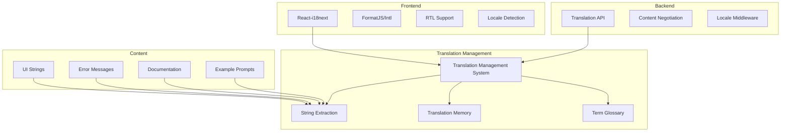
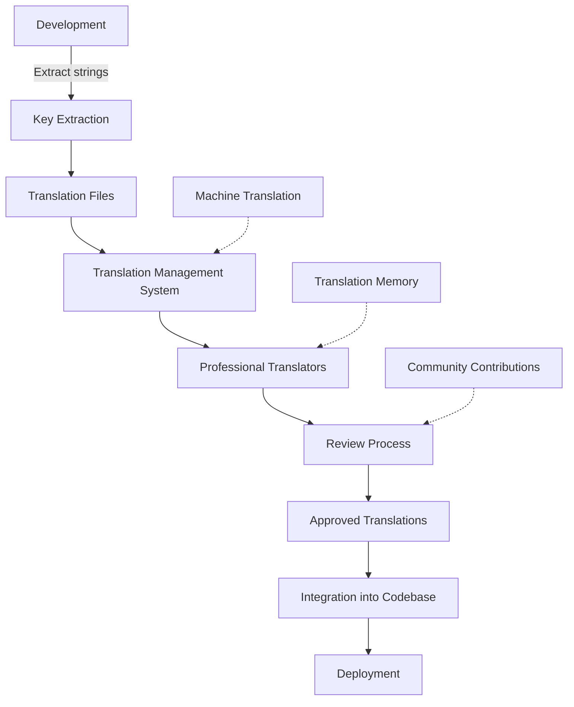

# Localization and Internationalization Strategy

This document outlines the comprehensive strategy for localizing and internationalizing the Sketchy Chain application to support a global user base. The strategy addresses translation management, content formatting, cultural considerations, technical implementation, and testing methodologies.

## Objectives

1. **Global Accessibility**: Make the application accessible to users worldwide
2. **Cultural Relevance**: Ensure content is culturally appropriate and relevant
3. **Consistent Experience**: Maintain a consistent user experience across all languages
4. **Scalable Approach**: Implement a system that can scale to support many languages
5. **Maintainable Codebase**: Design for ease of maintenance and updates

## Supported Languages

### Phase 1 (Initial Launch)

- English (en-US) - Primary development language
- Spanish (es-ES)
- French (fr-FR)
- German (de-DE)
- Japanese (ja-JP)

### Phase 2 (Expansion)

- Chinese (Simplified) (zh-CN)
- Portuguese (pt-BR)
- Russian (ru-RU)
- Korean (ko-KR)
- Italian (it-IT)

### Phase 3 (Further Expansion)

- Arabic (ar-SA) - Requires RTL support
- Hindi (hi-IN)
- Dutch (nl-NL)
- Turkish (tr-TR)
- Polish (pl-PL)

## Architecture Overview



## Technical Implementation

### Frontend Internationalization

#### React-i18next Configuration

```typescript
// i18n.ts
import i18n from 'i18next';
import { initReactI18next } from 'react-i18next';
import Backend from 'i18next-http-backend';
import LanguageDetector from 'i18next-browser-languagedetector';

i18n
  // Load translations from backend
  .use(Backend)
  // Detect user language
  .use(LanguageDetector)
  // Pass the i18n instance to react-i18next
  .use(initReactI18next)
  // Initialize i18next
  .init({
    fallbackLng: 'en-US',
    supportedLngs: ['en-US', 'es-ES', 'fr-FR', 'de-DE', 'ja-JP'],
    debug: process.env.NODE_ENV === 'development',
    
    interpolation: {
      escapeValue: false, // React already safes from XSS
    },
    
    // Backend configuration
    backend: {
      loadPath: '/locales/{{lng}}/{{ns}}.json',
    },
    
    // Namespace configuration
    ns: ['common', 'sketch', 'prompt', 'errors', 'onboarding'],
    defaultNS: 'common',
    
    // Detection options
    detection: {
      order: ['querystring', 'cookie', 'localStorage', 'navigator', 'htmlTag'],
      caches: ['localStorage', 'cookie'],
      lookupQuerystring: 'lng',
      lookupCookie: 'i18next',
      lookupLocalStorage: 'i18nextLng',
    },
  });

export default i18n;
```

#### Component Usage Example

```tsx
// TranslatedComponent.tsx
import React from 'react';
import { useTranslation } from 'react-i18next';

export const PromptInput: React.FC = () => {
  const { t } = useTranslation(['prompt', 'common']);
  
  return (
    <div>
      <label htmlFor="prompt-input">{t('prompt:input.label')}</label>
      <input 
        id="prompt-input" 
        placeholder={t('prompt:input.placeholder')}
        aria-describedby="prompt-help" 
      />
      <p id="prompt-help">{t('prompt:input.help')}</p>
      <button type="submit">{t('common:buttons.submit')}</button>
    </div>
  );
};
```

#### Date, Time, and Number Formatting

Using the Intl API for consistent formatting across locales:

```tsx
// FormattedDate.tsx
import React from 'react';

interface FormattedDateProps {
  date: Date;
  locale: string;
}

export const FormattedDate: React.FC<FormattedDateProps> = ({ date, locale }) => {
  const formattedDate = new Intl.DateTimeFormat(locale, {
    year: 'numeric',
    month: 'long',
    day: 'numeric',
    hour: 'numeric',
    minute: 'numeric',
  }).format(date);
  
  return <span>{formattedDate}</span>;
};

// FormattedNumber.tsx
import React from 'react';

interface FormattedNumberProps {
  value: number;
  locale: string;
  style?: 'decimal' | 'percent' | 'currency';
  currency?: string;
}

export const FormattedNumber: React.FC<FormattedNumberProps> = ({ 
  value, 
  locale, 
  style = 'decimal',
  currency,
}) => {
  const options: Intl.NumberFormatOptions = { style };
  if (style === 'currency' && currency) {
    options.currency = currency;
  }
  
  const formattedNumber = new Intl.NumberFormat(locale, options).format(value);
  
  return <span>{formattedNumber}</span>;
};
```

#### RTL Support Implementation

```tsx
// RTLWrapper.tsx
import React, { useEffect } from 'react';
import { useTranslation } from 'react-i18next';

const RTL_LANGUAGES = ['ar-SA', 'he-IL', 'fa-IR'];

interface RTLWrapperProps {
  children: React.ReactNode;
}

export const RTLWrapper: React.FC<RTLWrapperProps> = ({ children }) => {
  const { i18n } = useTranslation();
  
  useEffect(() => {
    const isRTL = RTL_LANGUAGES.includes(i18n.language);
    document.documentElement.dir = isRTL ? 'rtl' : 'ltr';
    document.body.setAttribute('dir', isRTL ? 'rtl' : 'ltr');
  }, [i18n.language]);
  
  return <>{children}</>;
};

// App.tsx
import React from 'react';
import { RTLWrapper } from './RTLWrapper';

export const App: React.FC = () => {
  return (
    <RTLWrapper>
      <div className="app-container">
        {/* App content */}
      </div>
    </RTLWrapper>
  );
};
```

#### CSS for RTL Support

```scss
// _rtl.scss
[dir="rtl"] {
  // Flip padding and margins
  .with-padding-left {
    padding-left: 0;
    padding-right: 16px;
  }
  
  // Flip flexbox directions
  .flex-row {
    flex-direction: row-reverse;
  }
  
  // Flip positions
  .positioned-right {
    right: auto;
    left: 16px;
  }
  
  // Flip text alignment
  .text-right {
    text-align: left;
  }
  
  .text-left {
    text-align: right;
  }
  
  // Flip icons
  .icon-arrow-right {
    transform: scaleX(-1);
  }
}
```

### Backend Internationalization

#### Express.js Middleware

```typescript
// localeMiddleware.ts
import { Request, Response, NextFunction } from 'express';
import acceptLanguage from 'accept-language';

// Configure supported languages
acceptLanguage.languages(['en-US', 'es-ES', 'fr-FR', 'de-DE', 'ja-JP']);

export const localeMiddleware = (req: Request, res: Response, next: NextFunction) => {
  // Get locale from query parameter, cookie, or Accept-Language header
  const locale = 
    req.query.locale as string || 
    req.cookies.locale || 
    acceptLanguage.get(req.headers['accept-language']) || 
    'en-US';
  
  // Set locale on request object
  req.locale = locale;
  
  // Set Content-Language header
  res.setHeader('Content-Language', locale);
  
  // Store locale in cookie for future requests
  if (!req.cookies.locale) {
    res.cookie('locale', locale, { maxAge: 365 * 24 * 60 * 60 * 1000 }); // 1 year
  }
  
  next();
};

// Add locale to request interface
declare global {
  namespace Express {
    interface Request {
      locale: string;
    }
  }
}
```

#### Server-Side Translation

```typescript
// i18n.ts (server)
import i18next from 'i18next';
import Backend from 'i18next-fs-backend';
import path from 'path';

i18next
  .use(Backend)
  .init({
    fallbackLng: 'en-US',
    supportedLngs: ['en-US', 'es-ES', 'fr-FR', 'de-DE', 'ja-JP'],
    backend: {
      loadPath: path.join(__dirname, '../locales/{{lng}}/{{ns}}.json'),
    },
    ns: ['api', 'errors', 'emails'],
    defaultNS: 'api',
  });

export default i18next;

// API error response example
import { Request, Response } from 'express';
import i18next from './i18n';

export const errorHandler = (err: any, req: Request, res: Response) => {
  const locale = req.locale || 'en-US';
  
  const errorResponse = {
    code: err.code || 'internal_error',
    message: i18next.t(`errors:${err.code || 'internal_error'}`, { lng: locale }),
    details: err.details || {},
  };
  
  res.status(err.status || 500).json({ error: errorResponse });
};
```

## Translation Management System (TMS)

### Translation Workflow



### Translation File Structure

```
/locales
├── en-US/
│   ├── common.json
│   ├── sketch.json
│   ├── prompt.json
│   ├── errors.json
│   ├── onboarding.json
│   ├── api.json
│   └── emails.json
├── es-ES/
│   ├── common.json
│   ├── sketch.json
│   └── ...
└── ...
```

### Sample Translation Files

```json
// en-US/common.json
{
  "navigation": {
    "home": "Home",
    "gallery": "Sketch Gallery",
    "profile": "My Profile",
    "settings": "Settings"
  },
  "buttons": {
    "submit": "Submit",
    "cancel": "Cancel",
    "save": "Save",
    "delete": "Delete"
  },
  "footer": {
    "terms": "Terms of Service",
    "privacy": "Privacy Policy",
    "copyright": "© {{year}} Sketchy Chain"
  }
}

// es-ES/common.json
{
  "navigation": {
    "home": "Inicio",
    "gallery": "Galería de Bocetos",
    "profile": "Mi Perfil",
    "settings": "Configuración"
  },
  "buttons": {
    "submit": "Enviar",
    "cancel": "Cancelar",
    "save": "Guardar",
    "delete": "Eliminar"
  },
  "footer": {
    "terms": "Términos de Servicio",
    "privacy": "Política de Privacidad",
    "copyright": "© {{year}} Sketchy Chain"
  }
}
```

### Key Extraction Tools

For automatic extraction of translation keys from source code:

```bash
# Using i18next-scanner
i18next-scanner --config i18next-scanner.config.js 'src/**/*.{js,jsx,ts,tsx}'
```

Configuration for the scanner:

```javascript
// i18next-scanner.config.js
module.exports = {
  input: [
    'src/**/*.{js,jsx,ts,tsx}',
    '!src/**/*.test.{js,jsx,ts,tsx}',
    '!**/node_modules/**',
  ],
  output: './public/locales/',
  options: {
    debug: true,
    removeUnusedKeys: true,
    sort: true,
    func: {
      list: ['t', 'i18next.t', 'i18n.t'],
      extensions: ['.js', '.jsx', '.ts', '.tsx'],
    },
    trans: {
      component: 'Trans',
      extensions: ['.js', '.jsx', '.ts', '.tsx'],
    },
    lngs: ['en-US', 'es-ES', 'fr-FR', 'de-DE', 'ja-JP'],
    ns: [
      'common',
      'sketch',
      'prompt',
      'errors',
      'onboarding',
      'api',
      'emails',
    ],
    defaultLng: 'en-US',
    defaultNs: 'common',
    defaultValue: '',
    resource: {
      loadPath: '{{lng}}/{{ns}}.json',
      savePath: '{{lng}}/{{ns}}.json',
      jsonIndent: 2,
      lineEnding: '\n',
    },
    nsSeparator: ':',
    keySeparator: '.',
    pluralSeparator: '_',
    contextSeparator: '_',
  },
};
```

## Cultural Considerations

### Content Adaptation Strategy

1. **Example Prompts and Demonstrations**:
   - Create locale-specific examples that resonate with the target audience
   - Adapt content references to be culturally relevant
   - Ensure examples don't contain culturally offensive material

2. **Visual Assets**:
   - Design icons and imagery that work cross-culturally
   - Avoid culturally specific symbols that may be misinterpreted
   - Create alternative assets for cultures with specific requirements

3. **Color Schemes**:
   - Be aware of color symbolism across cultures
   - Provide alternative themes for cultures where specific colors may have negative connotations
   - Ensure sufficient contrast for all users regardless of locale

4. **User-Generated Content Moderation**:
   - Implement locale-specific content moderation rules
   - Train content moderators on cultural sensitivities for each supported locale
   - Develop region-specific prohibited content policies

### AI Model Localization Considerations

1. **Prompt Templates**:
   - Develop locale-specific prompt templates that work best with AI models for that language
   - Account for language-specific grammar and syntax in prompt construction
   - Test prompt effectiveness across languages

2. **Model Selection**:
   - Use language-specific models when available for better results
   - Fall back to multilingual models with appropriate language indicators
   - Track and compare performance across languages

3. **Response Processing**:
   - Implement language-specific post-processing for AI responses
   - Account for different sentence structures and formatting requirements
   - Handle language-specific code comments and conventions

## Testing Strategy

### Internationalization Testing Framework

```typescript
// i18n.test.ts
import i18next from 'i18next';
import fs from 'fs';
import path from 'path';

const SUPPORTED_LANGUAGES = ['en-US', 'es-ES', 'fr-FR', 'de-DE', 'ja-JP'];
const NAMESPACES = ['common', 'sketch', 'prompt', 'errors', 'onboarding', 'api', 'emails'];

describe('i18n translations', () => {
  // Ensure all languages have the same keys as the default language
  test.each(SUPPORTED_LANGUAGES.filter(lng => lng !== 'en-US'))(
    'Language %s has all the same keys as en-US',
    (lng) => {
      NAMESPACES.forEach(ns => {
        const enPath = path.join(__dirname, `../public/locales/en-US/${ns}.json`);
        const lngPath = path.join(__dirname, `../public/locales/${lng}/${ns}.json`);
        
        const enTranslations = JSON.parse(fs.readFileSync(enPath, 'utf8'));
        const lngTranslations = JSON.parse(fs.readFileSync(lngPath, 'utf8'));
        
        // Get all keys recursively
        const getAllKeys = (obj, prefix = '') => {
          return Object.keys(obj).reduce((keys, key) => {
            const currentKey = prefix ? `${prefix}.${key}` : key;
            if (typeof obj[key] === 'object' && obj[key] !== null) {
              return [...keys, ...getAllKeys(obj[key], currentKey)];
            }
            return [...keys, currentKey];
          }, []);
        };
        
        const enKeys = getAllKeys(enTranslations).sort();
        const lngKeys = getAllKeys(lngTranslations).sort();
        
        // Check if any keys are missing in the target language
        const missingKeys = enKeys.filter(key => !lngKeys.includes(key));
        
        expect(missingKeys).toEqual([]);
      });
    }
  );
  
  // Ensure no placeholder texts are in production translations
  test.each(SUPPORTED_LANGUAGES)(
    'Language %s has no placeholder texts',
    (lng) => {
      NAMESPACES.forEach(ns => {
        const lngPath = path.join(__dirname, `../public/locales/${lng}/${ns}.json`);
        const lngTranslations = JSON.parse(fs.readFileSync(lngPath, 'utf8'));
        
        // Check for placeholder texts recursively
        const findPlaceholders = (obj, prefix = '') => {
          return Object.keys(obj).reduce((placeholders, key) => {
            const currentKey = prefix ? `${prefix}.${key}` : key;
            if (typeof obj[key] === 'object' && obj[key] !== null) {
              return [...placeholders, ...findPlaceholders(obj[key], currentKey)];
            }
            if (typeof obj[key] === 'string') {
              // Check for common placeholder patterns
              const isPlaceholder = 
                obj[key] === '' || 
                obj[key].includes('TODO') || 
                obj[key].includes('TRANSLATE') || 
                obj[key].includes('[[') ||
                obj[key].includes('__');
              
              return isPlaceholder 
                ? [...placeholders, { key: currentKey, value: obj[key] }]
                : placeholders;
            }
            return placeholders;
          }, []);
        };
        
        const placeholders = findPlaceholders(lngTranslations);
        
        expect(placeholders).toEqual([]);
      });
    }
  );
});
```

### UI Testing for Different Locales

```typescript
// RTL.test.tsx
import React from 'react';
import { render, screen } from '@testing-library/react';
import { I18nextProvider } from 'react-i18next';
import i18n from '../src/i18n';
import App from '../src/App';

// Create a wrapper for rendering with a specific locale
const renderWithLocale = (ui, locale) => {
  i18n.changeLanguage(locale);
  return render(
    <I18nextProvider i18n={i18n}>
      {ui}
    </I18nextProvider>
  );
};

describe('RTL Support', () => {
  test('sets RTL direction for Arabic', () => {
    renderWithLocale(<App />, 'ar-SA');
    
    // Check document direction
    expect(document.documentElement.dir).toBe('rtl');
    expect(document.body.getAttribute('dir')).toBe('rtl');
    
    // Check specific component alignment
    const rightAlignedElement = screen.getByTestId('should-be-right-aligned');
    const computedStyle = window.getComputedStyle(rightAlignedElement);
    expect(computedStyle.textAlign).toBe('right');
  });
  
  test('sets LTR direction for English', () => {
    renderWithLocale(<App />, 'en-US');
    
    expect(document.documentElement.dir).toBe('ltr');
    expect(document.body.getAttribute('dir')).toBe('ltr');
    
    const leftAlignedElement = screen.getByTestId('should-be-left-aligned');
    const computedStyle = window.getComputedStyle(leftAlignedElement);
    expect(computedStyle.textAlign).toBe('left');
  });
});
```

### Visual Testing Across Locales

```javascript
// cypress/e2e/localization.cy.js
describe('Localization Visual Tests', () => {
  const languages = ['en-US', 'es-ES', 'fr-FR', 'de-DE', 'ja-JP', 'ar-SA'];
  
  languages.forEach(language => {
    it(`renders properly in ${language}`, () => {
      // Visit app with language parameter
      cy.visit(`/?lng=${language}`);
      
      // Take screenshots of key pages
      cy.get('[data-testid="landing-page"]').should('be.visible');
      cy.screenshot(`landing-${language}`);
      
      cy.get('[data-testid="nav-gallery"]').click();
      cy.get('[data-testid="gallery-page"]').should('be.visible');
      cy.screenshot(`gallery-${language}`);
      
      // Test specific components
      cy.get('[data-testid="prompt-input"]').should('be.visible');
      cy.screenshot(`prompt-input-${language}`);
      
      // Test text overflow
      cy.get('[data-testid="menu-items"] .menu-item').each($el => {
        const overflowY = window.getComputedStyle($el[0]).overflowY;
        const isClipped = overflowY === 'hidden' && $el[0].scrollHeight > $el[0].clientHeight;
        expect(isClipped).to.equal(false, 'Text should not be clipped or overflow its container');
      });
    });
  });
});
```

## Language Detection and Selection

### User Language Preferences

1. **Initial Detection**:
   - Browser language (navigator.language)
   - Accept-Language header
   - GeoIP-based detection (optional)

2. **User Selection**:
   - Language selector in UI
   - Persistent preference storage in localStorage/cookie
   - Option to reset to browser default

3. **Implementation**:

```tsx
// LanguageSelector.tsx
import React from 'react';
import { useTranslation } from 'react-i18next';

const LANGUAGES = [
  { code: 'en-US', name: 'English', nativeName: 'English' },
  { code: 'es-ES', name: 'Spanish', nativeName: 'Español' },
  { code: 'fr-FR', name: 'French', nativeName: 'Français' },
  { code: 'de-DE', name: 'German', nativeName: 'Deutsch' },
  { code: 'ja-JP', name: 'Japanese', nativeName: '日本語' },
  { code: 'ar-SA', name: 'Arabic', nativeName: 'العربية' }
];

export const LanguageSelector: React.FC = () => {
  const { i18n } = useTranslation();
  
  const changeLanguage = (event: React.ChangeEvent<HTMLSelectElement>) => {
    const newLanguage = event.target.value;
    i18n.changeLanguage(newLanguage);
    
    // Store preference
    localStorage.setItem('userLanguagePreference', newLanguage);
    document.cookie = `locale=${newLanguage}; max-age=${60*60*24*365}; path=/`;
  };
  
  return (
    <div className="language-selector">
      <select 
        value={i18n.language} 
        onChange={changeLanguage}
        aria-label="Select language"
      >
        {LANGUAGES.map(({ code, name, nativeName }) => (
          <option key={code} value={code}>
            {nativeName} ({name})
          </option>
        ))}
      </select>
    </div>
  );
};
```

## Content Formatting

### Date and Time Formatting

```tsx
// DateTimeFormatter.tsx
import React from 'react';
import { useTranslation } from 'react-i18next';

type DateTimeFormat = 'short' | 'medium' | 'long' | 'full';

interface DateTimeFormatterProps {
  date: Date | string | number;
  format?: DateTimeFormat;
  dateOnly?: boolean;
  timeOnly?: boolean;
}

export const DateTimeFormatter: React.FC<DateTimeFormatterProps> = ({
  date,
  format = 'medium',
  dateOnly = false,
  timeOnly = false,
}) => {
  const { i18n } = useTranslation();
  const dateValue = date instanceof Date ? date : new Date(date);
  
  const options: Intl.DateTimeFormatOptions = {
    ...(dateOnly ? {} : { 
      hour: format === 'short' ? 'numeric' : '2-digit',
      minute: '2-digit',
      second: format === 'full' ? '2-digit' : undefined,
    }),
    ...(timeOnly ? {} : {
      year: 'numeric',
      month: format === 'short' ? 'numeric' : format === 'medium' ? 'short' : 'long',
      day: 'numeric',
    }),
  };
  
  const formattedDateTime = new Intl.DateTimeFormat(
    i18n.language, 
    options
  ).format(dateValue);
  
  return <time dateTime={dateValue.toISOString()}>{formattedDateTime}</time>;
};
```

### Number and Currency Formatting

```tsx
// NumberFormatter.tsx
import React from 'react';
import { useTranslation } from 'react-i18next';

interface NumberFormatterProps {
  value: number;
  style?: 'decimal' | 'percent' | 'currency';
  currency?: string;
  minimumFractionDigits?: number;
  maximumFractionDigits?: number;
}

export const NumberFormatter: React.FC<NumberFormatterProps> = ({
  value,
  style = 'decimal',
  currency = 'USD',
  minimumFractionDigits,
  maximumFractionDigits,
}) => {
  const { i18n } = useTranslation();
  
  const options: Intl.NumberFormatOptions = {
    style,
    ...(style === 'currency' ? { currency } : {}),
    ...(minimumFractionDigits !== undefined ? { minimumFractionDigits } : {}),
    ...(maximumFractionDigits !== undefined ? { maximumFractionDigits } : {}),
  };
  
  const formattedValue = new Intl.NumberFormat(
    i18n.language,
    options
  ).format(value);
  
  return <span>{formattedValue}</span>;
};
```

## Implementation Roadmap

### Phase 1: Foundation (Month 1-2)

1. **Technical Setup**:
   - Implement basic i18n framework
   - Create translation files structure
   - Set up language detection and switching

2. **English Content**:
   - Extract all UI strings to translation files
   - Add context comments for translators
   - Implement formatters for dates, numbers, etc.

3. **Development Workflow**:
   - Set up string extraction tools
   - Create developer documentation
   - Implement translation key validation

### Phase 2: First Languages (Month 3-4)

1. **Initial Translations**:
   - Translate content to Phase 1 languages
   - Implement professional translation review process
   - Test UI with translated content

2. **UI Adjustments**:
   - Fix text overflow issues
   - Adjust layouts for different text lengths
   - Implement responsive design improvements

3. **QA and Testing**:
   - Conduct visual testing
   - Test functionality in all languages
   - Fix language-specific issues

### Phase 3: Expansion (Month 5-6)

1. **Additional Languages**:
   - Add Phase 2 languages
   - Implement RTL support for Arabic
   - Test with expanded language set

2. **Cultural Adaptation**:
   - Create localized example prompts
   - Adapt content for cultural relevance
   - Implement locale-specific business rules

3. **Performance Optimization**:
   - Implement lazy loading of translations
   - Optimize bundle size for multiple languages
   - Improve loading times

### Phase 4: Advanced Features (Month 7+)

1. **Community Translation**:
   - Implement community contribution platform
   - Set up translation validation process
   - Create translator recognition system

2. **Machine Translation**:
   - Integrate machine translation for new content
   - Implement human review workflow
   - Set up continuous translation process

3. **Analytics and Optimization**:
   - Track language usage metrics
   - Identify and fix underperforming translations
   - Optimize based on user feedback

## Measuring Success

### Key Performance Indicators (KPIs)

1. **User Engagement Metrics**:
   - User retention by language
   - Session duration by language
   - Feature usage by language

2. **Translation Quality Metrics**:
   - Translation error rates
   - Support requests related to language issues
   - Community feedback on translations

3. **Technical Performance**:
   - Loading time by locale
   - Translation coverage percentage
   - Bundle size impact

## Conclusion

This comprehensive localization and internationalization strategy provides a solid foundation for expanding the Sketchy Chain application to a global audience. By following this approach, we ensure that users from different regions and language backgrounds will have a consistent, high-quality experience.

The implementation follows best practices for scalability, maintainability, and cultural sensitivity. Regular testing and continuous improvement will help refine the localization process as the application grows and evolves.

As the user base expands internationally, this strategy will allow the application to adapt to new markets while maintaining a cohesive brand identity and user experience.