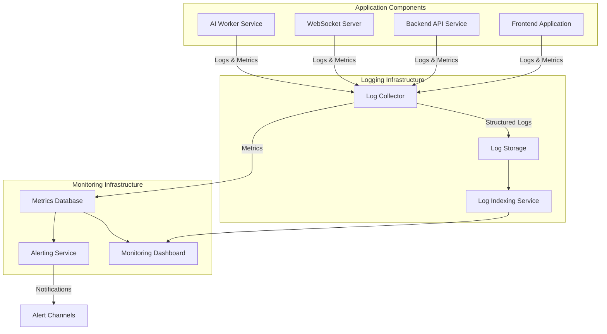

# Logging and Monitoring Architecture

This document outlines the logging and monitoring architecture for the Sketchy Chain application, specifying the metrics to track, logging standards, alerting thresholds, and visualization dashboards.

## Objectives

The logging and monitoring system aims to:

1. Provide comprehensive visibility into system performance and health
2. Enable early detection of issues before they impact users
3. Support troubleshooting and root cause analysis
4. Collect data for business analytics and user behavior insights
5. Monitor security-related events and potential threats
6. Track resource utilization for capacity planning

## Architecture Overview



## Logging Standards

### Log Levels

| Level | Description | Examples |
|-------|-------------|----------|
| ERROR | System errors that require immediate attention | Database connection failures, API service unavailable |
| WARN | Potential issues that don't stop functionality | Rate limiting applied, retry attempts |
| INFO | Normal operational events | User actions, system state changes |
| DEBUG | Detailed information for troubleshooting | Function parameters, intermediate states |
| TRACE | Highly detailed debugging information | Only enabled in development or for specific issues |

### Log Format

All logs will use a structured JSON format with the following fields:

```json
{
  "timestamp": "2025-10-18T22:15:30.456Z", // ISO 8601 format with milliseconds
  "level": "INFO",
  "service": "api-service", // Service/component name
  "instance": "api-1", // Container/instance ID
  "traceId": "abc123", // Request correlation ID
  "userId": "user123", // Optional user identifier
  "sessionId": "session456", // Optional session identifier
  "message": "Human-readable message",
  "context": {
    // Additional contextual information
    "requestId": "req789",
    "path": "/api/v1/sketches",
    "method": "POST",
    "duration": 123, // in milliseconds
    "statusCode": 201
  },
  "tags": ["api", "sketch-creation"] // Categorization tags
}
```

### Correlation Tracking

- Each incoming request generates a unique `traceId`
- The `traceId` is passed through all services involved in processing the request
- This enables end-to-end tracking of request flow through the system

## Key Metrics by Component

### System-Wide Metrics

| Metric | Description | Collection Method |
|--------|-------------|-------------------|
| Service Uptime | Uptime percentage by service | Heartbeat/healthcheck |
| Error Rate | Errors per minute by service | Log analysis |
| Request Volume | Requests per minute | Application instrumentation |
| Response Time | Average, p95, p99 latencies | Application instrumentation |
| Active Users | Concurrent users in the system | WebSocket connections + API activity |

### Frontend Metrics

| Metric | Description | Collection Method |
|--------|-------------|-------------------|
| Page Load Time | Time to fully render key pages | Browser performance API |
| First Contentful Paint | Time to render first content | Browser performance API |
| DOM Size | Number of DOM elements | Browser performance API |
| JS Errors | Client-side JavaScript errors | Window.onerror handler |
| Resource Timing | Loading time for key resources | Resource Timing API |
| User Interactions | Clicks, navigation events | Custom event tracking |

### Backend API Metrics

| Metric | Description | Collection Method |
|--------|-------------|-------------------|
| Request Rate | Requests per second by endpoint | API middleware |
| Status Code Distribution | Count of responses by status code | API middleware |
| Request Duration | Time to process requests by endpoint | API middleware |
| Database Query Time | Time spent on database operations | ORM instrumentation |
| Cache Hit Rate | Percentage of cache hits vs. misses | Cache service instrumentation |
| Authentication Rate | Successful vs. failed authentication attempts | Auth service logs |
| Rate Limiting Events | Number of rate-limited requests | Rate limiter middleware |

### WebSocket Metrics

| Metric | Description | Collection Method |
|--------|-------------|-------------------|
| Active Connections | Current number of WebSocket connections | WebSocket server stats |
| Message Rate | Messages sent/received per second | WebSocket server instrumentation |
| Connection Duration | Average time connections stay open | WebSocket server instrumentation |
| Reconnection Rate | Frequency of client reconnections | Custom tracking |
| Broadcast Time | Time to broadcast messages to all clients | Custom measurement |
| Message Size | Average and maximum message size | Message analysis |

### AI Worker Metrics

| Metric | Description | Collection Method |
|--------|-------------|-------------------|
| Queue Depth | Number of prompts waiting for processing | Queue service stats |
| Processing Time | Time to process prompts | Worker instrumentation |
| AI Service Latency | Time spent waiting for AI service response | API client instrumentation |
| Success Rate | Percentage of successfully processed prompts | Worker logs |
| Token Usage | Number of AI tokens used | AI service response |
| Prompt Rejection Rate | Percentage of prompts rejected | Content moderation service |

### Infrastructure Metrics

| Metric | Description | Collection Method |
|--------|-------------|-------------------|
| CPU Usage | CPU utilization by service | Host metrics |
| Memory Usage | Memory consumption by service | Host metrics |
| Disk I/O | Disk read/write operations | Host metrics |
| Network I/O | Network traffic in/out | Host metrics |
| Container Restarts | Number of container restarts | Orchestration platform |
| Database Connections | Active and idle connections | Database metrics |

## Alert Thresholds and Definitions

### Critical Alerts (P1)

| Alert | Definition | Threshold | Response Time |
|-------|------------|-----------|---------------|
| Service Down | Service health check fails | 3 consecutive failures | Immediate (24/7) |
| High Error Rate | Error rate exceeds threshold | >5% of requests for 5 minutes | Immediate (24/7) |
| Database Unavailable | Database connection failures | Any connection failure lasting >30 seconds | Immediate (24/7) |
| API Latency Spike | API response time significantly increased | p95 latency >2s for 5 minutes | Immediate (24/7) |
| Security Breach Detected | Security monitoring detects potential breach | Any verified security incident | Immediate (24/7) |

### Major Alerts (P2)

| Alert | Definition | Threshold | Response Time |
|-------|------------|-----------|---------------|
| High Resource Usage | CPU/Memory usage exceeding threshold | >85% for 10 minutes | <30 minutes |
| Degraded Performance | Response time increased but not critical | p95 latency >1s for 10 minutes | <1 hour |
| Elevated Error Rate | Error rate above normal but not critical | >2% of requests for 10 minutes | <1 hour |
| Queue Backup | Processing queue growing abnormally | >100 items for 15 minutes | <1 hour |
| AI Service Issues | AI service returning errors | >10% error rate for 10 minutes | <1 hour |

### Minor Alerts (P3)

| Alert | Definition | Threshold | Response Time |
|-------|------------|-----------|---------------|
| Increased Resource Usage | Resource usage trending upward | >70% for 30 minutes | <4 hours |
| Slow Database Queries | Database queries taking longer than expected | Any query >1s for 10 minutes | <4 hours |
| Cache Performance | Cache hit rate dropping | <80% hit rate for 30 minutes | Next business day |
| Prompt Rejection Increase | More prompts being rejected than usual | >15% rejection rate for 30 minutes | Next business day |
| WebSocket Reconnects | Clients frequently reconnecting | Reconnect rate >5% for 30 minutes | Next business day |

## Monitoring Dashboard Layout

### Main Overview Dashboard

The main dashboard provides an at-a-glance view of the entire system health:

```
+-------------------------------------------------------------------------+
|                         SYSTEM HEALTH OVERVIEW                           |
+-------------------------------------------------------------------------+
|                                                                         |
| Service Status            Active Users          Current Error Rate      |
| [Status indicators]       [User count chart]    [Error rate chart]      |
|                                                                         |
+-------------------------------------------------------------------------+
|                                                                         |
| Response Time (p95)       Request Volume        CPU & Memory Usage      |
| [Response time chart]     [Request chart]       [Resource usage chart]  |
|                                                                         |
+-------------------------------------------------------------------------+
|                                                                         |
| Recent Alerts             AI Service Status     Active WebSocket Conn.  |
| [Alert list]              [AI status chart]     [Connection chart]      |
|                                                                         |
+-------------------------------------------------------------------------+
```

### Service-Specific Dashboards

Each service (Frontend, Backend, WebSocket, AI Worker) will have a dedicated dashboard with detailed metrics specific to that service.

### Special-Purpose Dashboards

1. **Security Dashboard**: Focused on security events, login attempts, content moderation
2. **User Activity Dashboard**: User behavior, feature usage, retention metrics
3. **Performance Dashboard**: Detailed latency breakdown, resource utilization, bottlenecks
4. **Business Metrics Dashboard**: Sketch creation, prompt submission, user engagement

## Log Retention and Storage

| Log Type | Retention Period | Storage Tier | Notes |
|----------|------------------|--------------|-------|
| Error Logs | 90 days | Hot storage | Immediately searchable |
| Application Logs | 30 days | Hot storage | Immediately searchable |
| Access Logs | 90 days | Hot storage (7 days), Cold storage (83 days) | Older logs may have retrieval delay |
| Security Logs | 1 year | Hot storage (30 days), Cold storage (11 months) | Compliance requirement |
| Debug Logs | 7 days | Hot storage | Only collected when debugging enabled |
| Metrics | 1 year | Time-series database with downsampling | High-resolution for 30 days, aggregated after |

## Implementation Technologies

### Recommended Stack

1. **Log Collection**: Fluent Bit/Fluentd
2. **Log Storage/Analysis**: Elasticsearch or Loki
3. **Metrics Collection**: Prometheus
4. **Visualization**: Grafana
5. **Alerting**: Alertmanager with PagerDuty/Slack integration
6. **APM**: Elastic APM or Datadog
7. **Distributed Tracing**: Jaeger or Zipkin

### Application Instrumentation

1. **Node.js Services**: Winston for logging, Prometheus client for metrics
2. **Frontend**: OpenTelemetry instrumentation for browser metrics
3. **Database**: Database-specific monitoring extensions
4. **Infrastructure**: Node exporter for host metrics

## Implementation Phases

1. **Phase 1: Core Logging Infrastructure**
   - Set up centralized logging with basic indexing
   - Implement structured logging in all services
   - Create basic health monitoring dashboard

2. **Phase 2: Comprehensive Metrics**
   - Add detailed instrumentation to all services
   - Set up metrics database and collection
   - Create service-specific dashboards

3. **Phase 3: Alerting and On-call**
   - Define and implement alert rules
   - Set up notification channels and escalation
   - Create runbooks for common alerts

4. **Phase 4: Advanced Analysis**
   - Implement distributed tracing
   - Create advanced business intelligence dashboards
   - Set up anomaly detection and predictive alerting

## Security Considerations

1. Sensitive information should be scrubbed from logs (PII, credentials)
2. Log access should be restricted and audited
3. Encryption should be used for log transmission and storage
4. Log tampering detection should be implemented
5. Compliance requirements (GDPR, etc.) must be considered

## Disaster Recovery

1. Logging infrastructure should be deployed across multiple availability zones
2. Critical alerts should have multiple notification paths
3. Monitoring system failures should have separate alerting mechanisms
4. Periodic testing of alerting and escalation procedures

## Maintenance and Evolution

1. Regular review of alert thresholds to minimize alert fatigue
2. Periodic addition of new metrics as the application evolves
3. Dashboard refinement based on actual operational needs
4. Capacity planning for log storage and processing