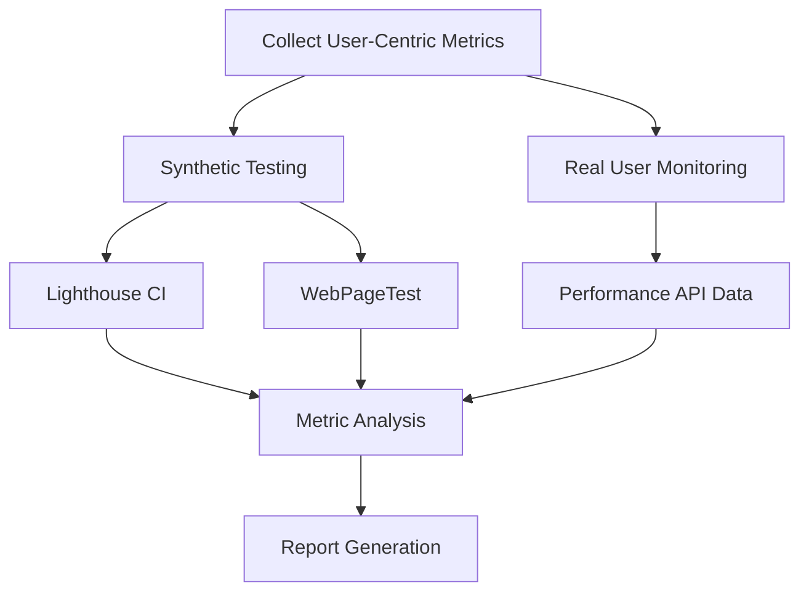
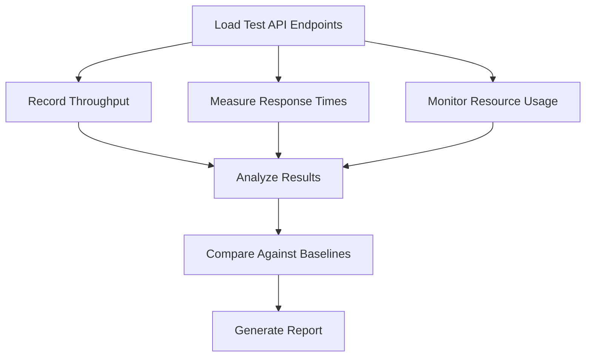
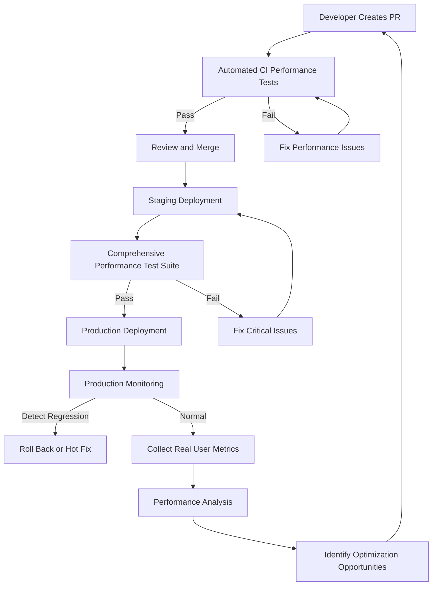

# Performance Benchmarking Suite and Acceptance Criteria

This document outlines the comprehensive performance benchmarking strategy for the Sketchy Chain application, including key metrics, testing methodologies, tools, acceptance criteria, and continuous monitoring approaches.

## Objectives

1. **Establish Baselines**: Define performance baselines for all critical system components
2. **Set Standards**: Create clear, measurable performance targets for the application
3. **Enable Monitoring**: Implement ongoing performance monitoring for early detection of regressions
4. **Provide Feedback**: Create a system for rapid performance feedback during development
5. **Ensure Quality**: Define acceptance criteria that must be met before deployment

## Key Performance Metrics

### User-Centric Metrics

| Metric | Description | Primary Tool | Critical Threshold |
|--------|-------------|--------------|-------------------|
| Time to Interactive (TTI) | Time until the UI becomes fully interactive | Lighthouse | ≤ 3.5 seconds |
| First Contentful Paint (FCP) | Time for first content to appear | Lighthouse | ≤ 1.5 seconds |
| Largest Contentful Paint (LCP) | Time for largest content element to appear | Lighthouse | ≤ 2.5 seconds |
| Cumulative Layout Shift (CLS) | Measure of visual stability | Lighthouse | ≤ 0.1 |
| First Input Delay (FID) | Time from first interaction to response | Lighthouse | ≤ 100 ms |
| Total Blocking Time (TBT) | Time main thread is blocked | Lighthouse | ≤ 300 ms |
| P95 Response Time | 95th percentile of all API response times | Custom Monitoring | ≤ 500 ms |
| P99 Response Time | 99th percentile of all API response times | Custom Monitoring | ≤ 1500 ms |
| P5.js Frame Rate | Frame rate of rendered P5.js sketches | Custom Instrumentation | ≥ 30 fps |

### System Metrics

| Metric | Description | Tool | Critical Threshold |
|--------|-------------|------|-------------------|
| API Throughput | Requests per second handled by backend | k6 | ≥ 500 rps at < 500ms |
| WebSocket Message Rate | Messages per second through WebSocket service | k6 | ≥ 1000 mps at < 100ms |
| Database Query Time | Average query execution time | MongoDB Profiler | ≤ 50 ms |
| Prompt Processing Time | Time to process a prompt end-to-end | Custom Instrumentation | ≤ 10 seconds |
| CPU Utilization | Percent of CPU used under load | Prometheus | ≤ 70% sustained |
| Memory Usage | Percent of available memory used | Prometheus | ≤ 75% sustained |
| Connection Pool Utilization | Database connection utilization | Custom Monitoring | ≤ 70% sustained |
| Cache Hit Rate | Percentage of cache hits vs. total lookups | Redis Metrics | ≥ 85% |

### Bundle and Resource Metrics

| Metric | Description | Tool | Critical Threshold |
|--------|-------------|------|-------------------|
| Initial Bundle Size | Size of initial JS bundle | Webpack Bundle Analyzer | ≤ 250 KB (gzipped) |
| Total Page Weight | Total size of all resources | Lighthouse | ≤ 1.5 MB |
| Time to First Byte (TTFB) | Time to begin receiving response | WebPageTest | ≤ 600 ms |
| Resource Count | Number of distinct resources loaded | Lighthouse | ≤ 50 requests |
| Image Optimization | Properly sized, compressed images | Lighthouse | 100% compliance |
| Third-Party Impact | Performance impact of third-party code | WebPageTest | ≤ 300 ms |

## Benchmarking Methodology

### Frontend Performance



1. **Synthetic Testing Approach**:
   - Run Lighthouse audits in CI pipeline for each PR
   - Conduct WebPageTest runs for detailed analysis
   - Create performance budgets for critical metrics
   - Test on simulated slow connections (3G, 4G)
   - Test on low-end device profiles

2. **Real User Monitoring (RUM)**:
   - Collect performance data from actual users
   - Track by device type, connection type, and location
   - Establish percentile distributions (p50, p75, p95)
   - Monitor for significant deviations from baseline

### Backend Performance



1. **API Load Testing**:
   - Define test scenarios for typical user workflows
   - Create varying load patterns (steady, spike, ramp-up)
   - Test individual endpoints and integrated flows
   - Measure throughput, response times, and error rates
   - Monitor resource utilization during tests

2. **Database Performance**:
   - Profile query execution times
   - Test with realistic data volumes
   - Measure index effectiveness
   - Analyze query plans
   - Test read/write performance separately

### Real-time Services

1. **WebSocket Performance**:
   - Test with simulated concurrent users
   - Measure message throughput
   - Analyze latency distribution
   - Test reconnection scenarios
   - Evaluate scaling behavior

2. **Prompt Processing Pipeline**:
   - Measure end-to-end processing time
   - Test with varying prompt complexity
   - Evaluate AI service response times
   - Measure queue processing throughput
   - Test failure and retry scenarios

## Testing Environments

### Local Development Benchmarking

```typescript
// Example performance test script for local development
import { chromium } from 'playwright';
import { startMeasure, endMeasure, reportMetrics } from './perfUtils';

async function runPerformanceTest() {
  const browser = await chromium.launch();
  const page = await browser.newPage();
  
  // Navigate and measure page load
  startMeasure('page-load');
  await page.goto('http://localhost:3000');
  endMeasure('page-load');
  
  // Measure sketch loading time
  startMeasure('sketch-load');
  await page.click('[data-testid="sketch-thumbnail"]');
  await page.waitForSelector('[data-testid="p5-canvas"]', { state: 'visible' });
  endMeasure('sketch-load');
  
  // Measure prompt submission time
  startMeasure('prompt-submission');
  await page.fill('[data-testid="prompt-input"]', 'Add a red circle that moves');
  await page.click('[data-testid="submit-prompt"]');
  await page.waitForSelector('[data-testid="success-notification"]', { state: 'visible' });
  endMeasure('prompt-submission');
  
  await browser.close();
  
  // Report metrics
  reportMetrics();
}

runPerformanceTest();
```

### CI Environment Benchmarking

```yaml
# GitHub Action for performance testing
name: Performance Testing

on:
  pull_request:
    branches: [ main, develop ]
  push:
    branches: [ main, develop ]

jobs:
  lighthouse:
    runs-on: ubuntu-latest
    steps:
      - uses: actions/checkout@v3
      - name: Build application
        run: |
          npm ci
          npm run build
          npm run start-prod & npx wait-on http://localhost:3000
      - name: Run Lighthouse CI
        uses: treosh/lighthouse-ci-action@v9
        with:
          urls: |
            http://localhost:3000
            http://localhost:3000/gallery
          uploadArtifacts: true
          temporaryPublicStorage: true
          budgetPath: ./.github/lighthouse-budget.json
          
  api-load-test:
    runs-on: ubuntu-latest
    steps:
      - uses: actions/checkout@v3
      - name: Start services in test mode
        run: docker-compose -f docker-compose.test.yml up -d
      - name: Wait for services to be ready
        run: ./scripts/wait-for-services.sh
      - name: Run k6 load tests
        uses: grafana/k6-action@v0.2.0
        with:
          filename: ./performance/api-load-test.js
```

### Production-Like Testing

1. **Staging Environment Tests**:
   - Run comprehensive tests in staging environment
   - Use production-like data volumes
   - Test with simulated traffic patterns
   - Monitor resource utilization
   - Validate scaling behavior

2. **Canary Deployment Analysis**:
   - Compare performance metrics between canary and stable versions
   - Analyze performance impact on real users
   - Establish automatic rollback triggers for performance degradation

## Benchmarking Tools

### Frontend Tools

1. **Lighthouse CI**:
   - Automated performance audits
   - Performance scoring
   - Accessibility analysis
   - Best practices validation

2. **WebPageTest**:
   - Detailed waterfall analysis
   - Multiple location testing
   - Connection speed simulation
   - Visual comparison testing

3. **Performance Budget Tooling**:

```json
// .github/lighthouse-budget.json
{
  "performance": 90,
  "accessibility": 90,
  "best-practices": 90,
  "seo": 90,
  "resource-summary": [
    {
      "resourceType": "total",
      "budget": 1500
    },
    {
      "resourceType": "script",
      "budget": 300
    },
    {
      "resourceType": "image",
      "budget": 300
    }
  ],
  "timing": [
    {
      "metric": "interactive",
      "budget": 3500
    },
    {
      "metric": "first-contentful-paint",
      "budget": 1500
    },
    {
      "metric": "largest-contentful-paint",
      "budget": 2500
    }
  ]
}
```

### Backend Tools

1. **k6 Load Testing**:

```javascript
// performance/api-load-test.js
import http from 'k6/http';
import { check, sleep } from 'k6';

export const options = {
  stages: [
    { duration: '1m', target: 100 }, // Ramp up to 100 users
    { duration: '5m', target: 100 }, // Stay at 100 users for 5 minutes
    { duration: '1m', target: 200 }, // Ramp up to 200 users
    { duration: '5m', target: 200 }, // Stay at 200 users for 5 minutes
    { duration: '1m', target: 0 },   // Ramp down to 0 users
  ],
  thresholds: {
    http_req_duration: ['p(95)<500'], // 95% of requests must finish within 500ms
    http_req_failed: ['rate<0.01'],   // Less than 1% of requests should fail
  },
};

export default function() {
  // Test gallery listing endpoint
  const galleryResponse = http.get('http://localhost:4000/api/v1/sketches');
  check(galleryResponse, {
    'gallery status is 200': (r) => r.status === 200,
    'gallery response time < 300ms': (r) => r.timings.duration < 300,
  });
  
  sleep(1);
  
  // Test sketch detail endpoint
  const sketchId = '60f7a9b8c9e4d42b3c5a2e1f'; // Example sketch ID
  const sketchResponse = http.get(`http://localhost:4000/api/v1/sketches/${sketchId}`);
  check(sketchResponse, {
    'sketch detail status is 200': (r) => r.status === 200,
    'sketch detail response time < 200ms': (r) => r.timings.duration < 200,
  });
  
  sleep(1);
}
```

2. **Artillery.io**:

```yaml
# performance/websocket-test.yaml
config:
  target: "ws://localhost:4001"
  phases:
    - duration: 60
      arrivalRate: 5
      rampTo: 50
      name: "Ramp up to 50 connections/second"
    - duration: 300
      arrivalRate: 50
      name: "Sustained load"
  ws:
    rejectUnauthorized: false
  
scenarios:
  - engine: "ws"
    flow:
      - think: 1
      - send: 
          json:
            type: "subscribe"
            room: "sketch:60f7a9b8c9e4d42b3c5a2e1f"
      - think: 2
      - loop:
          - send:
              json:
                type: "heartbeat"
          - think: 10
        count: 6
```

## Continuous Performance Monitoring

### Real-time Dashboards

1. **Frontend Performance Dashboard**:
   - Real user metrics by page
   - Performance trends over time
   - Percentile distributions
   - Device and browser breakdown

2. **API Performance Dashboard**:
   - Endpoint response times
   - Request volumes
   - Error rates
   - Resource utilization

3. **Alert Configuration**:

```yaml
# prometheus/alerts.yaml
groups:
- name: performance_alerts
  rules:
  - alert: HighAPILatency
    expr: histogram_quantile(0.95, sum(rate(http_request_duration_seconds_bucket{job="api"}[5m])) by (le, endpoint)) > 0.5
    for: 5m
    labels:
      severity: warning
    annotations:
      summary: "High API latency on {{ $labels.endpoint }}"
      description: "95th percentile latency is above 500ms for {{ $labels.endpoint }}"
      
  - alert: LowCacheHitRate
    expr: rate(redis_keyspace_hits_total[5m]) / (rate(redis_keyspace_hits_total[5m]) + rate(redis_keyspace_misses_total[5m])) < 0.85
    for: 15m
    labels:
      severity: warning
    annotations:
      summary: "Cache hit rate is below target"
      description: "Redis cache hit rate has been below 85% for 15 minutes"
```

### Performance Regression Detection

1. **Automated Comparison**:
   - Compare performance metrics between releases
   - Flag statistically significant degradations
   - Track long-term trends

2. **Anomaly Detection**:
   - Implement ML-based anomaly detection
   - Identify unusual patterns in metrics
   - Correlate across multiple indicators

```python
# Example anomaly detection script
import pandas as pd
from prophet import Prophet
from prometheus_api_client import PrometheusConnect

# Connect to Prometheus
prom = PrometheusConnect(url="http://prometheus:9090")

# Get response time data
query = 'histogram_quantile(0.95, sum(rate(http_request_duration_seconds_bucket{job="api"}[1h])) by (le))'
response_times = prom.custom_query(query=query)

# Format data for Prophet
df = pd.DataFrame(response_times)
df.columns = ['ds', 'y']

# Create and fit model
model = Prophet()
model.fit(df)

# Make predictions
future = model.make_future_dataframe(periods=24, freq='H')
forecast = model.predict(future)

# Detect anomalies
actual_data = df[df['ds'] >= forecast['ds'].min()]
forecast_subset = forecast[forecast['ds'].isin(actual_data['ds'])]
actual_data = actual_data.reset_index(drop=True)
forecast_subset = forecast_subset.reset_index(drop=True)

# Compare actual vs predicted
anomalies = pd.DataFrame()
anomalies['ds'] = actual_data['ds']
anomalies['actual'] = actual_data['y']
anomalies['predicted'] = forecast_subset['yhat']
anomalies['lower'] = forecast_subset['yhat_lower']
anomalies['upper'] = forecast_subset['yhat_upper']
anomalies['anomaly'] = (actual_data['y'] < forecast_subset['yhat_lower']) | (actual_data['y'] > forecast_subset['yhat_upper'])

# Alert on anomalies
anomalies[anomalies['anomaly'] == True]
```

## Acceptance Criteria

### Frontend Acceptance Criteria

| Metric | Target for Desktop | Target for Mobile | Target for Low-End Devices |
|--------|-------------------|-------------------|----------------------------|
| Time to Interactive | ≤ 2.5s | ≤ 3.5s | ≤ 5s |
| First Contentful Paint | ≤ 1s | ≤ 1.5s | ≤ 2s |
| Largest Contentful Paint | ≤ 1.5s | ≤ 2.5s | ≤ 4s |
| Cumulative Layout Shift | ≤ 0.1 | ≤ 0.1 | ≤ 0.1 |
| First Input Delay | ≤ 100ms | ≤ 100ms | ≤ 200ms |
| Lighthouse Performance Score | ≥ 90 | ≥ 85 | ≥ 75 |
| P5.js Sketch Frame Rate | ≥ 60fps | ≥ 30fps | ≥ 20fps |

### Backend Acceptance Criteria

| API Endpoint | Average Response Time | P95 Response Time | Throughput Target |
|--------------|------------------------|-------------------|-------------------|
| GET /api/v1/sketches | ≤ 100ms | ≤ 300ms | ≥ 500 rps |
| GET /api/v1/sketches/:id | ≤ 100ms | ≤ 200ms | ≥ 500 rps |
| GET /api/v1/sketches/:id/versions | ≤ 150ms | ≤ 300ms | ≥ 300 rps |
| GET /api/v1/prompts/:id | ≤ 100ms | ≤ 200ms | ≥ 300 rps |
| POST /api/v1/sketches | ≤ 200ms | ≤ 500ms | ≥ 100 rps |
| POST /api/v1/sketches/:id/prompts | ≤ 200ms | ≤ 500ms | ≥ 200 rps |

### WebSocket Acceptance Criteria

| Metric | Target |
|--------|--------|
| Connection Establishment Time | ≤ 300ms |
| Message Delivery Time (within datacenter) | ≤ 50ms |
| Message Delivery Time (globally) | ≤ 300ms |
| Connection Capacity per Instance | ≥ 5,000 concurrent connections |
| Message Throughput per Instance | ≥ 10,000 messages per second |

### AI Processing Acceptance Criteria

| Metric | Target |
|--------|--------|
| End-to-End Prompt Processing Time | ≤ 5s for simple prompts, ≤ 10s for complex prompts |
| Queue Wait Time | ≤ 1s during normal load, ≤ 5s during peak load |
| Processing Success Rate | ≥ 95% |
| Concurrent Processing Capacity | ≥ 50 prompts per minute per worker instance |

### Database Acceptance Criteria

| Metric | Target |
|--------|--------|
| Read Query Time (simple) | ≤ 20ms |
| Read Query Time (complex) | ≤ 100ms |
| Write Operation Time | ≤ 50ms |
| Index Size | ≤ 10% of data size |
| Connection Utilization | ≤ 70% during peak load |

### Release Acceptance Gates

Before a new version can be deployed to production, it must meet the following criteria:

1. **No Performance Regression**:
   - All critical metrics must be within 5% of the previous release or better
   - Any regression > 5% requires explicit approval and justification

2. **Performance Budget Compliance**:
   - Must pass all Lighthouse performance budgets
   - Total bundle size must not exceed limits
   - All resource constraints must be met

3. **Load Testing Success**:
   - Must handle target load with error rate < 1%
   - Response times must meet P95 targets under full load
   - Must demonstrate successful scaling behavior

## Performance Testing Workflow



## Benchmarking Environment Specifications

### Local Development Benchmarking

- **Hardware**: Baseline MacBook Pro (2.6 GHz 6-Core Intel Core i7, 16GB RAM)
- **Browser**: Chrome latest, headless mode
- **Network**: Simulated Fast 4G (20 Mbps, 40ms RTT)
- **Database**: Local MongoDB container with limited resources (1 CPU, 2GB RAM)

### CI Environment Benchmarking

- **Hardware**: GitHub-hosted runner (2-core CPU, 7GB RAM)
- **Browser**: Chrome latest, headless mode
- **Network**: Simulated network conditions:
  * Desktop: Cable (5 Mbps, 28ms RTT)
  * Mobile: 4G (1.5 Mbps, 300ms RTT)
- **Load**: Simulated with virtual users

### Production-Like Benchmarking

- **Hardware**: AWS instances matching production specifications
- **Environment**: Complete application stack deployed in isolation
- **Data**: Production-like dataset (anonymized if necessary)
- **Network**: Real network conditions with global testing points
- **Duration**: Extended tests (24+ hours) for stability assessment

## Implementation Plan

### Phase 1: Foundation (Month 1)

1. **Baseline Measurements**:
   - Establish current performance metrics
   - Document existing performance issues
   - Set up basic monitoring infrastructure

2. **CI Integration**:
   - Implement Lighthouse CI
   - Set up basic load testing in CI
   - Create initial performance budgets

3. **Tooling Setup**:
   - Configure monitoring dashboards
   - Implement custom instrumentation
   - Create developer performance testing tools

### Phase 2: Comprehensive Suite (Months 2-3)

1. **Advanced Test Scenarios**:
   - Develop detailed user flow tests
   - Create comprehensive API load tests
   - Implement WebSocket testing

2. **Expanded Monitoring**:
   - Set up real user monitoring
   - Configure detailed alerting
   - Implement anomaly detection

3. **Documentation & Training**:
   - Create performance testing guides
   - Train team on performance testing tools
   - Establish performance review process

### Phase 3: Optimization & Automation (Months 4+)

1. **Automated Analysis**:
   - Implement automated regression detection
   - Create performance impact reports for PRs
   - Develop trend analysis tools

2. **Continuous Improvement**:
   - Regular performance optimization sprints
   - Ongoing refinement of benchmarks
   - Adaptation to new browser capabilities

3. **Advanced Techniques**:
   - Implement predictive performance modeling
   - Create advanced simulation capabilities
   - Develop custom performance visualization tools

## Conclusion

This performance benchmarking suite establishes comprehensive standards, methodologies, and tools for measuring, monitoring, and maintaining the performance of the Sketchy Chain application. By adhering to these guidelines and acceptance criteria, the development team can ensure a high-quality user experience even as the application scales and evolves.

Regular performance testing and monitoring will help identify issues early, guide optimization efforts, and verify that changes do not negatively impact user experience. The automated tools and integration with CI/CD processes will make performance a core part of the development workflow rather than an afterthought.

As the application grows, this benchmarking suite should evolve to address new challenges, technologies, and user expectations. Performance optimization should be viewed as an ongoing process with continuous refinement of both the application and the benchmarking approach itself.