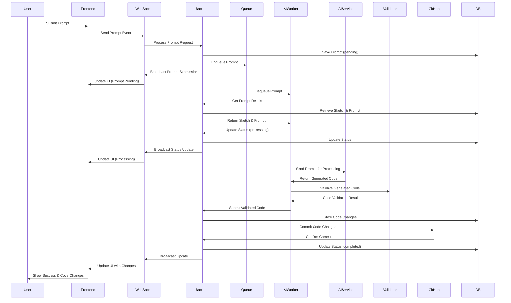
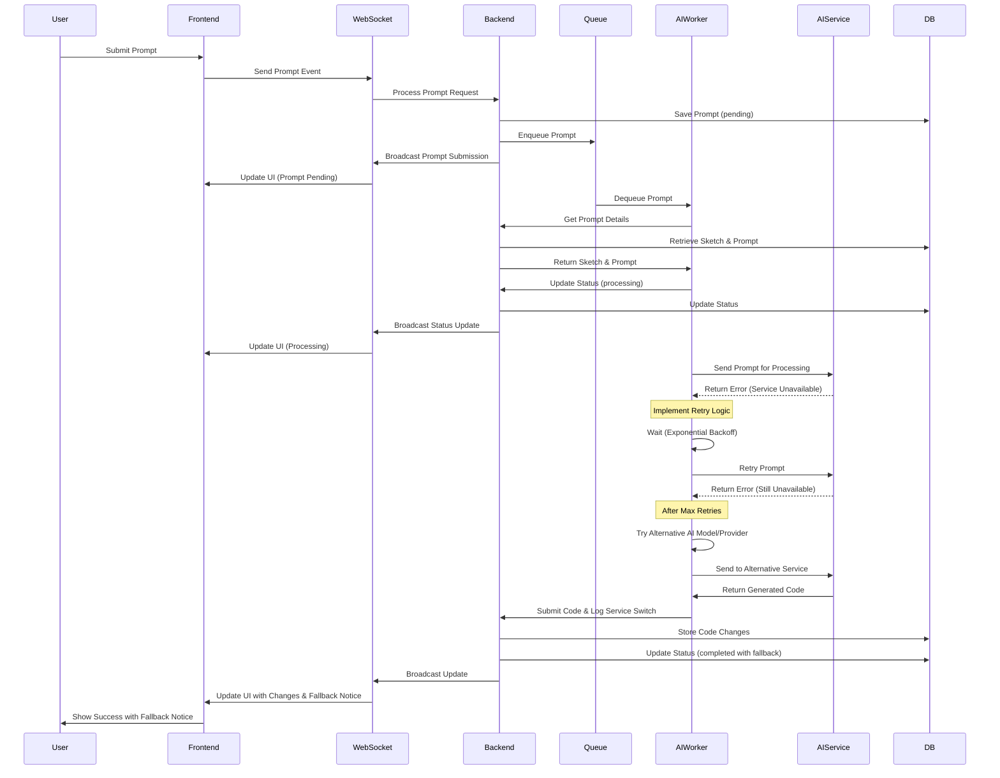
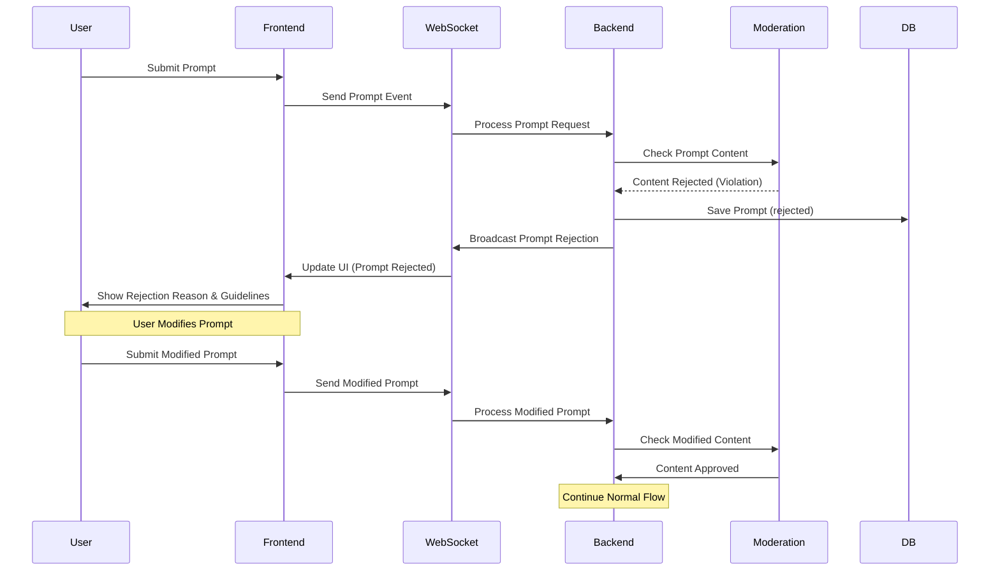
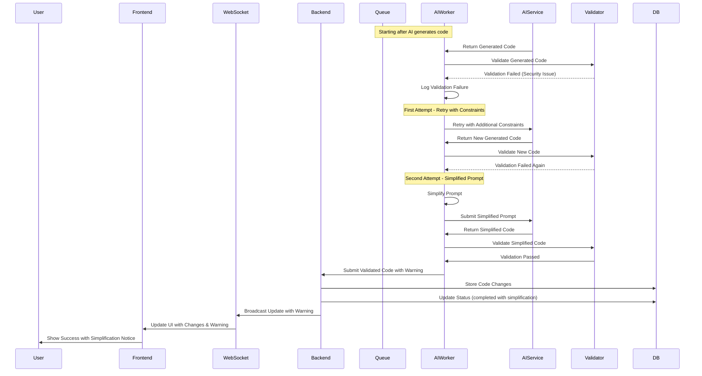
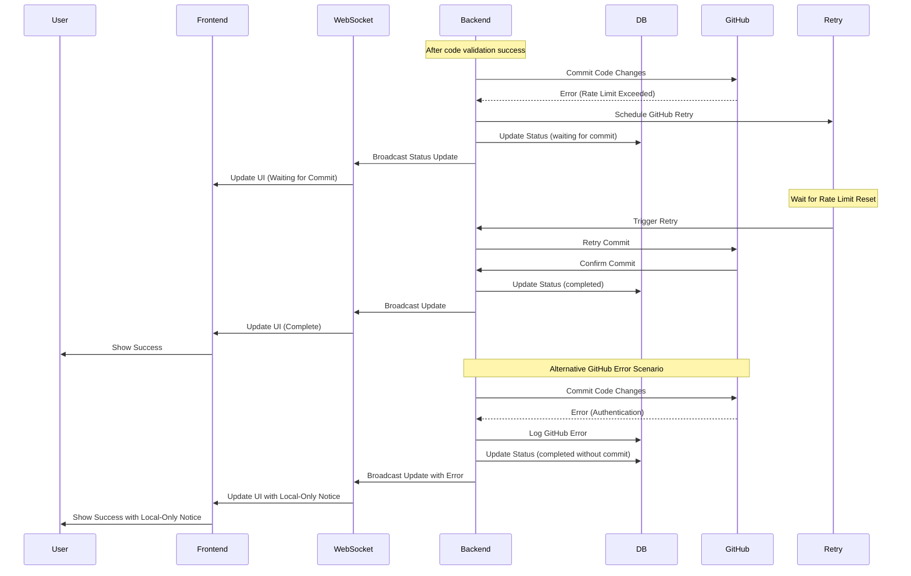
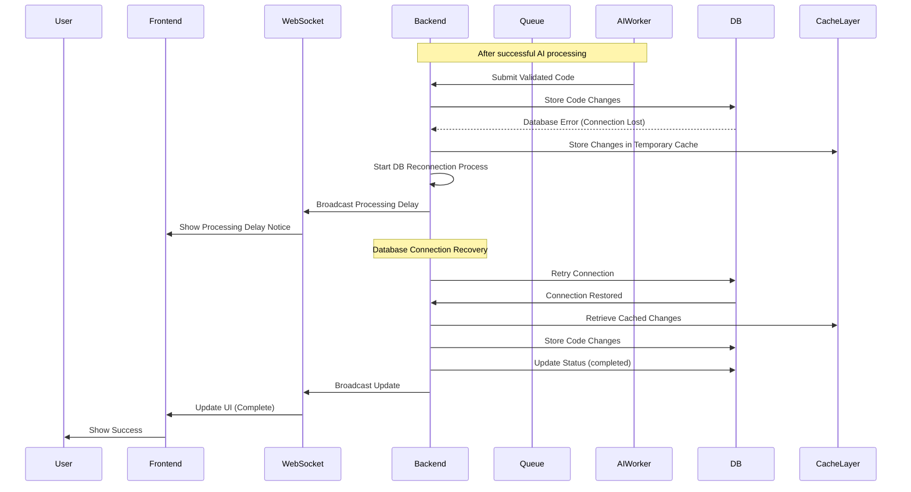
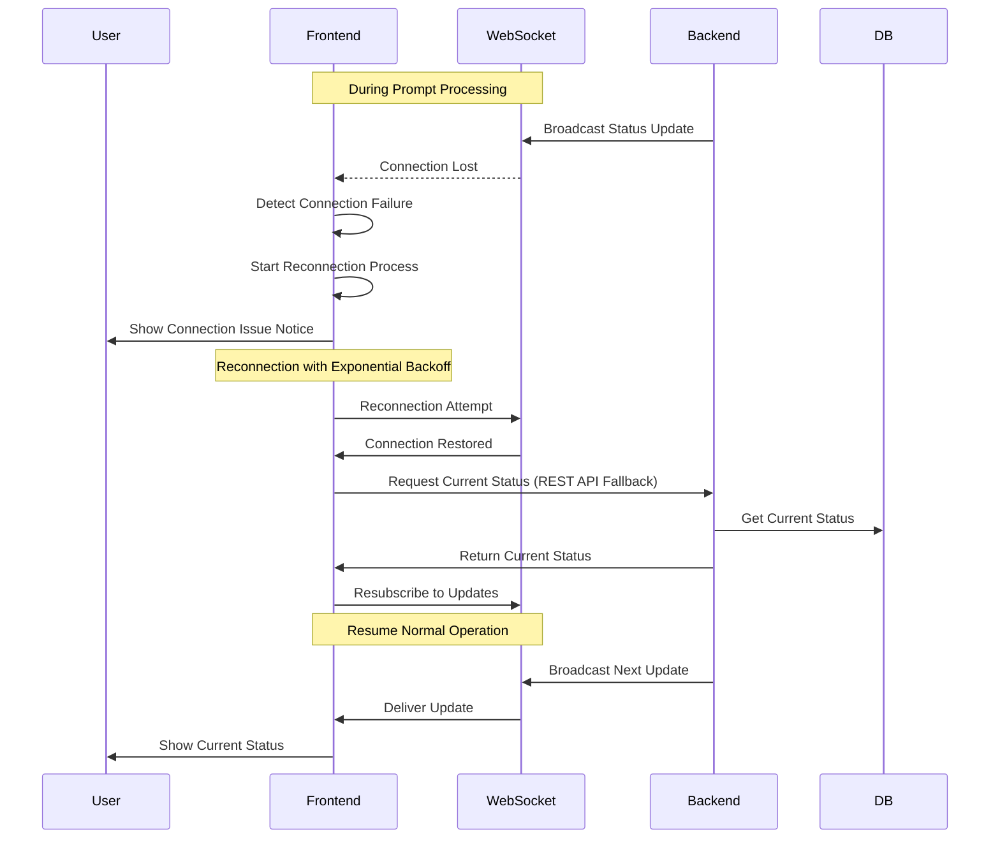
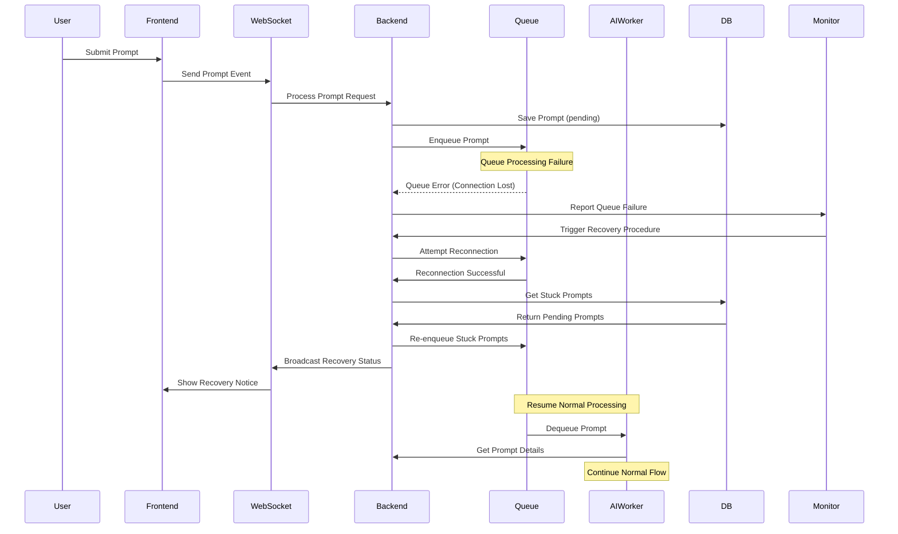
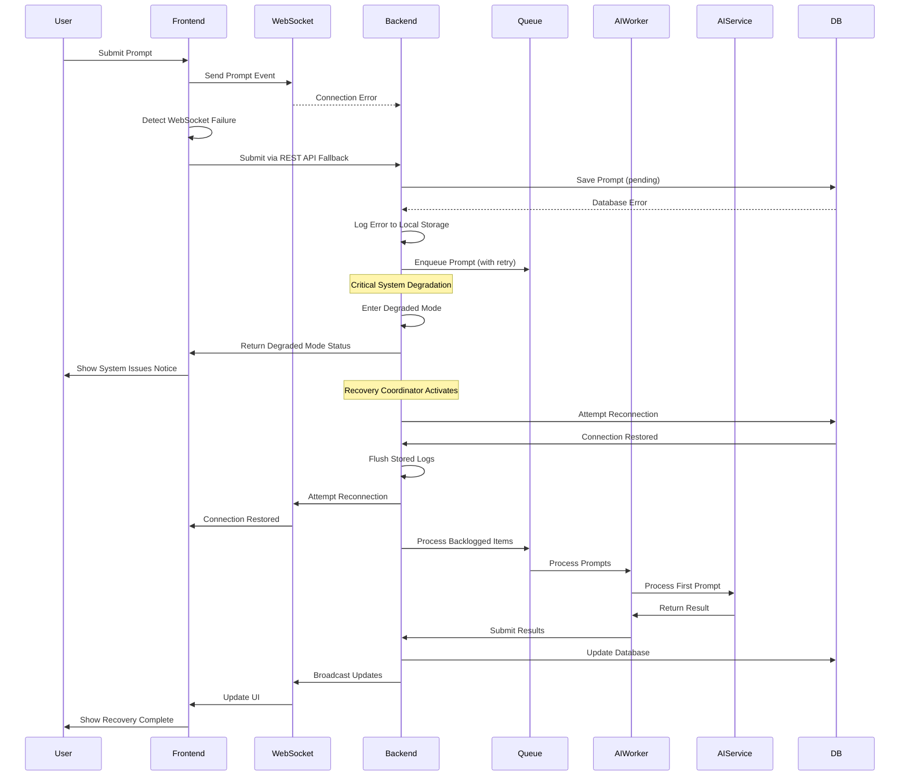

# Prompt Processing Error Recovery Sequences

This document provides detailed sequence diagrams for handling various error scenarios that can occur during prompt processing in the Sketchy Chain application. For each error scenario, we outline the detection, recovery steps, and final state.

## Table of Contents

1. [Normal Prompt Processing Flow](#normal-prompt-processing-flow)
2. [AI Service Unavailability](#ai-service-unavailability)
3. [Content Moderation Rejection](#content-moderation-rejection)
4. [Code Validation Failure](#code-validation-failure)
5. [GitHub Integration Error](#github-integration-error)
6. [Database Error During Processing](#database-error-during-processing)
7. [WebSocket Communication Failure](#websocket-communication-failure)
8. [Prompt Queue Processing Error](#prompt-queue-processing-error)
9. [Multiple Concurrent Failures](#multiple-concurrent-failures)
10. [Recovery Strategy Matrix](#recovery-strategy-matrix)

## Normal Prompt Processing Flow

This diagram shows the expected flow when everything works correctly:

## AI Service Unavailability

When the AI service is unavailable or returns an error:

## Content Moderation Rejection

When content moderation rejects a prompt:

## Code Validation Failure

When generated code fails validation:

## GitHub Integration Error

When GitHub integration fails:

## Database Error During Processing

When database errors occur during processing:

## WebSocket Communication Failure

When WebSocket connection fails during processing:

## Prompt Queue Processing Error

When the prompt queue processing fails:

## Multiple Concurrent Failures

Handling scenario with multiple simultaneous failures:

## Recovery Strategy Matrix

| Error Type | Detection Method | Initial Action | Recovery Strategy | Fallback Option | User Communication |
|------------|------------------|----------------|-------------------|-----------------|-------------------|
| AI Service Unavailable | API Error Response | Retry | Exponential backoff with 3 attempts | Alternative AI model/provider | "We're using an alternative AI model" |
| Content Moderation Rejection | Moderation API response | Reject prompt | Provide specific violation details | Suggest edits to user | "Your prompt wasn't accepted because..." |
| Code Validation Failure | Validation error | Retry with constraints | Simplify prompt and regenerate | Manual review queue | "We simplified your request for security" |
| GitHub Integration Error | GitHub API error | Temporarily store locally | Retry after rate limit reset | Skip GitHub integration | "Changes saved locally only" |
| Database Error | Database exception | Cache in memory/Redis | Reconnect with exponential backoff | Write to fallback store | "Processing your request (temporary delay)" |
| WebSocket Failure | Connection timeout | Reconnect | Exponential backoff reconnection | REST API polling | "Reconnecting to server..." |
| Queue Processing Error | Queue exception | Local processing | Reconnect to queue service | Direct processing | "System recovering, brief delay" |
| Multiple Failures | System monitoring | Degraded mode | Staged recovery sequence | Maintenance mode | "System experiencing issues" |

This matrix provides a quick reference for handling different error types across the prompt processing workflow.