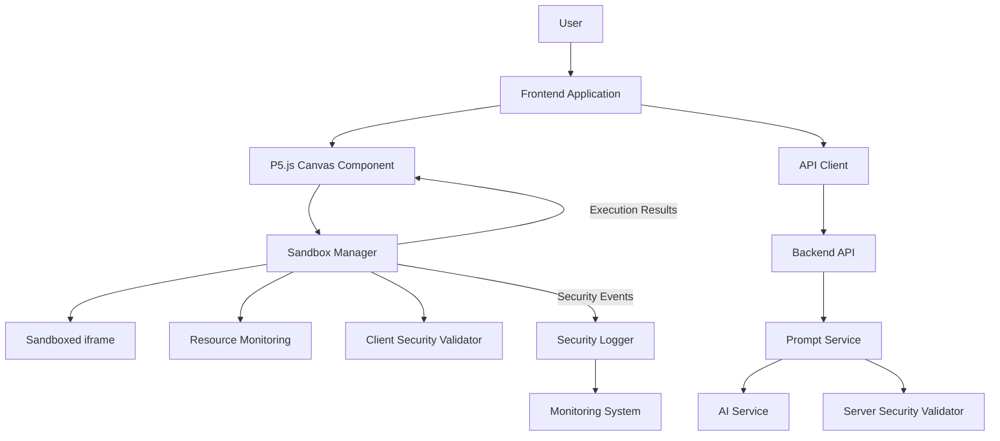
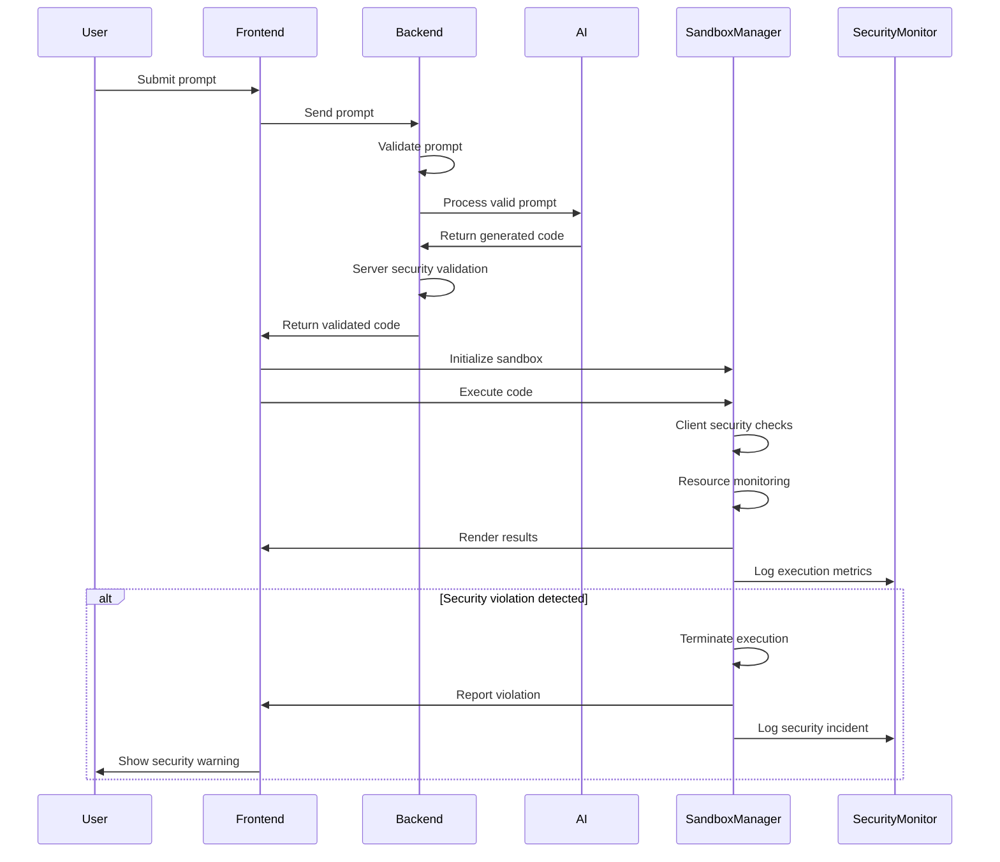

# P5.js Sandbox Integration Architecture

## Overview

This document outlines the architecture for integrating the validated P5.js sandbox isolation mechanism into the main SketchyChain application. The sandbox is a critical security component that allows for safe execution of user-influenced code generated from AI prompts.

## Integration Objectives

1. **Seamless Security**: Integrate sandbox security without degrading user experience
2. **Layered Protection**: Combine client-side and server-side validation
3. **Performance Optimization**: Ensure minimal impact on application performance
4. **Monitoring Capability**: Enable detection and alerting of security incidents
5. **Extensibility**: Support future security enhancements and features

## System Architecture



## Component Details

### Sandbox Manager

The Sandbox Manager is the core integration component that bridges the P5.js Canvas Component with the sandboxed execution environment.

**Responsibilities:**
- Create and manage the sandboxed iframe
- Load and execute P5.js code safely
- Monitor resource usage and execution
- Terminate problematic code execution
- Report security events

**Integration Points:**
- Integrates with P5.js Canvas Component to display rendered output
- Interfaces with client-side security validation
- Reports telemetry and security events to monitoring systems

### Client-Side Security Validation

Pre-execution validation occurs before code is sent to the sandbox.

**Validation Checks:**
- Static code analysis for dangerous patterns
- Restricted API usage detection
- Resource usage estimation

### Server-Side Security Validation

Secondary validation layer that occurs before AI-generated code is sent to the client.

**Validation Checks:**
- Deep code analysis
- Content policy compliance
- Historical pattern matching
- Rate limiting and abuse detection

### Security Logger and Monitoring

Dedicated system for tracking security-related events and anomalies.

**Features:**
- Real-time security event dashboard
- Alerting for suspicious activities
- Aggregation of security metrics
- Trend analysis for preemptive action

## Integration Workflow



## Performance Considerations

### Initialization Strategy
- Lazy-load sandbox components only when needed
- Pre-initialize sandbox for active sketches
- Cache commonly used resources

### Resource Management
- Implement memory limits per sketch
- Set execution time boundaries
- Throttle CPU-intensive operations

### Rendering Optimization
- Use requestAnimationFrame for efficient rendering
- Implement drawing optimization when possible
- Provide throttling for complex animations

## Security Event Handling

### Event Types
1. **Execution Timeout**: Script execution exceeded time limit
2. **Memory Threshold**: Memory usage approached or exceeded limits
3. **API Violation**: Attempt to access restricted API
4. **Infinite Loop**: Detection of potential infinite loop
5. **DOM Escape**: Attempt to access parent document

### Response Actions
1. **Terminate**: Immediately terminate the execution
2. **Log**: Record detailed information about the incident
3. **Alert**: Notify system administrators for severe violations
4. **Block**: Temporarily prevent further executions from same source
5. **Analyze**: Submit code for further security analysis

## Implementation Phases

### Phase 1: Core Integration
- Integrate basic sandbox functionality
- Implement core security validations
- Create basic monitoring and logging

### Phase 2: Enhanced Security
- Add advanced security validation rules
- Implement comprehensive monitoring
- Develop security dashboards and alerting

### Phase 3: Performance Optimization
- Optimize sandbox initialization
- Implement caching strategies
- Fine-tune resource limits

### Phase 4: Advanced Features
- Add selective API allowlisting
- Implement granular permission system
- Create user-specific security profiles

## Testing Requirements

### Security Testing
- Penetration testing of sandbox isolation
- Fuzzing of input values
- Simulated attack scenarios
- Cross-browser security verification

### Performance Testing
- Load testing with multiple simultaneous sandboxes
- Memory leak detection
- CPU utilization profiling
- Rendering performance benchmarks

### Integration Testing
- End-to-end workflow testing
- Error handling verification
- Browser compatibility testing

## Appendix: Sandbox API

### SandboxManager Interface

```typescript
interface SandboxManager {
  // Core methods
  initialize(config: SandboxConfig): Promise<void>;
  execute(code: string): Promise<ExecutionResult>;
  terminate(): void;
  
  // Status and monitoring
  getStatus(): SandboxStatus;
  getResourceUsage(): ResourceMetrics;
  
  // Event subscription
  onViolation(callback: (event: SecurityEvent) => void): void;
  onComplete(callback: (result: ExecutionResult) => void): void;
  onError(callback: (error: Error) => void): void;
}

interface SandboxConfig {
  maxExecutionTime: number; // milliseconds
  maxMemoryUsage: number; // bytes
  allowedAPIs: string[]; // whitelist of allowed APIs
  enableLogging: boolean;
  securityLevel: 'strict' | 'moderate' | 'relaxed';
}

interface ExecutionResult {
  success: boolean;
  output: any;
  executionTime: number;
  memoryUsed: number;
  errors?: Error[];
  securityViolations?: SecurityEvent[];
}

interface SecurityEvent {
  type: 'api_access' | 'memory_limit' | 'execution_timeout' | 'infinite_loop' | 'dom_access';
  severity: 'low' | 'medium' | 'high' | 'critical';
  details: any;
  timestamp: number;
}