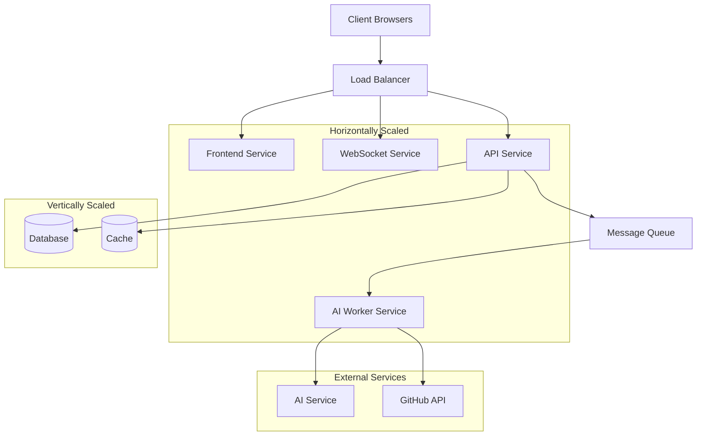

# Scaling Strategy

This document outlines the comprehensive scaling strategy for the Sketchy Chain application, including trigger points, resource allocation guidelines, and implementation approaches for handling increased load and user growth.

## Scaling Objectives

1. **Maintain Performance**: Ensure response times stay below defined thresholds as load increases
2. **Support User Growth**: Scale smoothly to accommodate growing user base
3. **Handle Load Spikes**: Adapt to sudden increases in traffic without service degradation
4. **Optimize Resources**: Balance performance needs with cost efficiency
5. **Ensure Reliability**: Maintain high availability during scaling operations

## System Components and Scaling Approaches



## Key Scaling Metrics and Thresholds

### Global Metrics

| Metric | Warning Threshold | Scaling Trigger | Critical Threshold | Primary Action |
|--------|-------------------|-----------------|-------------------|----------------|
| Overall CPU Usage | >60% for 5min | >70% for 5min | >85% for 5min | Scale out |
| Overall Memory Usage | >60% for 5min | >75% for 5min | >85% for 5min | Scale out |
| Request Latency (p95) | >500ms for 5min | >800ms for 5min | >1.2s for 5min | Scale out |
| Error Rate | >1% for 5min | >2% for 5min | >5% for 5min | Investigate & scale |
| Active Users | >75% of capacity | >85% of capacity | >95% of capacity | Scale out |

### Frontend Service

| Metric | Warning Threshold | Scaling Trigger | Critical Threshold |
|--------|-------------------|-----------------|-------------------|
| Requests/Second | >100 per instance | >150 per instance | >200 per instance |
| Response Time | >200ms (p95) | >350ms (p95) | >500ms (p95) |
| CPU Utilization | >60% for 3min | >70% for 3min | >85% for 3min |
| Memory Utilization | >70% for 3min | >80% for 3min | >90% for 3min |
| Connection Count | >800 per instance | >1000 per instance | >1200 per instance |

### WebSocket Service

| Metric | Warning Threshold | Scaling Trigger | Critical Threshold |
|--------|-------------------|-----------------|-------------------|
| Active Connections | >1000 per instance | >1500 per instance | >2000 per instance |
| Messages/Second | >1000 per instance | >1500 per instance | >2000 per instance |
| CPU Utilization | >60% for 3min | >70% for 3min | >85% for 3min |
| Memory Utilization | >70% for 3min | >80% for 3min | >90% for 3min |
| Connection Growth Rate | >10% per minute | >20% per minute | >30% per minute |

### API Service

| Metric | Warning Threshold | Scaling Trigger | Critical Threshold |
|--------|-------------------|-----------------|-------------------|
| Requests/Second | >200 per instance | >300 per instance | >400 per instance |
| Response Time | >250ms (p95) | >400ms (p95) | >600ms (p95) |
| CPU Utilization | >60% for 3min | >70% for 3min | >85% for 3min |
| Memory Utilization | >70% for 3min | >80% for 3min | >90% for 3min |
| Database Connection Usage | >70% of pool | >80% of pool | >90% of pool |

### AI Worker Service

| Metric | Warning Threshold | Scaling Trigger | Critical Threshold |
|--------|-------------------|-----------------|-------------------|
| Queue Depth | >50 items | >100 items | >200 items |
| Processing Time | >2s per item (avg) | >5s per item (avg) | >10s per item (avg) |
| CPU Utilization | >70% for 3min | >80% for 3min | >90% for 3min |
| Memory Utilization | >70% for 3min | >80% for 3min | >90% for 3min |
| Error Rate | >2% for 5min | >5% for 5min | >10% for 5min |

### Database (MongoDB)

| Metric | Warning Threshold | Scaling Trigger | Critical Threshold |
|--------|-------------------|-----------------|-------------------|
| Connections | >60% of max | >75% of max | >90% of max |
| Query Response Time | >50ms (p95) | >100ms (p95) | >200ms (p95) |
| Disk IOPS | >70% of provisioned | >85% of provisioned | >95% of provisioned |
| Storage Utilization | >70% | >80% | >90% |
| Replication Lag | >10 seconds | >30 seconds | >60 seconds |

### Cache (Redis)

| Metric | Warning Threshold | Scaling Trigger | Critical Threshold |
|--------|-------------------|-----------------|-------------------|
| Memory Utilization | >70% | >80% | >90% |
| Eviction Rate | >0 for 5min | >100/sec for 5min | >1000/sec for 5min |
| Command Processing | >1ms (p95) | >5ms (p95) | >10ms (p95) |
| Connections | >60% of max | >75% of max | >90% of max |
| Hit Rate | <80% for 15min | <70% for 15min | <50% for 15min |

## Scaling Strategies by Component

### Frontend Service

**Scaling Approach**: Horizontal scaling with auto-scaling

**Auto-scaling Configuration**:
- Minimum instances: 2
- Maximum instances: 10
- Scale out: When CPU > 70% or Memory > 80% for 3 minutes
- Scale in: When CPU < 30% and Memory < 50% for 10 minutes
- Cool-down period: 5 minutes

**Resource Allocation**:
- Initial Size: t3.medium (2 vCPU, 4GB RAM)
- Scaling Size: Same instance type
- Load balancer: Application Load Balancer with sticky sessions

**Special Considerations**:
- Use CDN for static assets
- Implement client-side caching strategies
- Consider geographic distribution for multi-region deployments

### WebSocket Service

**Scaling Approach**: Horizontal scaling with auto-scaling

**Auto-scaling Configuration**:
- Minimum instances: 2
- Maximum instances: 8
- Scale out: When active connections > 1500 per instance or CPU > 70% for 3 minutes
- Scale in: When active connections < 700 per instance and CPU < 40% for 10 minutes
- Cool-down period: 5 minutes

**Resource Allocation**:
- Initial Size: t3.medium (2 vCPU, 4GB RAM)
- Scaling Size: Same instance type
- Connection distribution: Redis-based socket.io adapter for sticky sessions

**Special Considerations**:
- Implement connection draining during scale-in
- Use Redis adapter for Socket.IO to share state across instances
- Monitor WebSocket reconnection rates during scaling events

### API Service

**Scaling Approach**: Horizontal scaling with auto-scaling

**Auto-scaling Configuration**:
- Minimum instances: 2
- Maximum instances: 12
- Scale out: When RPS > 300 per instance or CPU > 70% for 3 minutes
- Scale in: When RPS < 150 per instance and CPU < 40% for 10 minutes
- Cool-down period: 5 minutes

**Resource Allocation**:
- Initial Size: t3.medium (2 vCPU, 4GB RAM)
- Scaling Size: Same instance type for predictable loads, t3.large for spiky traffic
- Database connections: Maximum 50 per instance, connection pooling

**Special Considerations**:
- Implement circuit breakers for external dependencies
- Use caching strategies to reduce database load
- Configure proper connection pool settings

### AI Worker Service

**Scaling Approach**: Horizontal scaling with queue-based auto-scaling

**Auto-scaling Configuration**:
- Minimum instances: 2
- Maximum instances: 20
- Scale out: When queue depth > 100 items or CPU > 80% for 3 minutes
- Scale in: When queue depth < 10 items and CPU < 50% for 10 minutes
- Cool-down period: 3 minutes

**Resource Allocation**:
- Initial Size: c5.large (2 vCPU, 4GB RAM)
- Scaling Size: Same instance type, with option to use c5.xlarge for complex prompts
- AI Service connections: Maximum 10 concurrent connections per instance

**Special Considerations**:
- Implement priority queuing for different prompt types
- Use circuit breakers for AI service calls
- Consider specialized instances for GPU acceleration if needed

### Database (MongoDB)

**Scaling Approach**: Vertical scaling with horizontal read scaling

**Scaling Triggers**:
- Vertical scaling: When CPU > 75% for 15 minutes or connections > 75% of max
- Read replica addition: When read query volume > 5000 per second or replication lag > 30 seconds

**Resource Allocation**:
- Primary instance: Start with m5.large, scale up to m5.2xlarge
- Read replicas: Same size as primary
- Sharding: Implement when dataset exceeds 80% of 100GB

**Special Considerations**:
- Use MongoDB Atlas or similar managed service for easier scaling
- Implement query optimization and indexing strategy
- Monitor and tune read/write distribution

### Cache (Redis)

**Scaling Approach**: Vertical scaling with clustering

**Scaling Triggers**:
- Vertical scaling: When memory utilization > 80% or CPU > 75% for 15 minutes
- Cluster expansion: When memory utilization > 80% across cluster average

**Resource Allocation**:
- Initial Size: cache.m5.large (2 vCPU, 6.38GB RAM)
- Scaling Size: Up to cache.m5.2xlarge (8 vCPU, 27.9GB RAM)
- Cluster: Start with 3 nodes, scale to 6 nodes

**Special Considerations**:
- Use Redis Enterprise or AWS ElastiCache for easier management
- Implement proper key expiration policies
- Monitor eviction rates and adjust TTLs as needed

## Load Testing and Capacity Planning

### User Load Modeling

Estimate of system requirements based on active user scenarios:

| User Type | Behavior Pattern | Resource Impact |
|-----------|------------------|-----------------|
| Casual Viewer | Views sketches, minimal interaction | Low: 1 WebSocket conn, ~5 API calls/session |
| Active Contributor | Views and submits prompts | Medium: 1 WebSocket conn, ~20 API calls/session, 1-5 prompts/session |
| Power User | Constant interaction, frequent prompts | High: 1-3 WebSocket conns, ~50 API calls/session, 5-20 prompts/session |

### Expected Resource Consumption

| Component | Per User Resource | 100 Concurrent Users | 1,000 Concurrent Users | 10,000 Concurrent Users |
|-----------|-------------------|----------------------|------------------------|-------------------------|
| Frontend | Negligible | 1 instance | 2 instances | 5-8 instances |
| WebSocket | 1 conn, ~1MB mem | 2 instances | 3-4 instances | 8-12 instances |
| API | ~2 RPS peak | 2 instances | 4-6 instances | 10-15 instances |
| Worker | 0.2 jobs/min/user | 2 instances | 5-8 instances | 15-25 instances |
| Database | ~10 ops/sec/user | m5.large | m5.xlarge | m5.4xlarge + read replicas |
| Cache | ~50MB/user | cache.m5.large | cache.m5.xlarge | cache.m5.2xlarge cluster |

### Load Testing Methodology

1. **Baseline Testing**:
   - Establish performance baselines at 25%, 50%, 75% expected capacity
   - Measure response times, error rates, resource utilization

2. **Stress Testing**:
   - Push system to 150% expected capacity
   - Identify bottlenecks and failure points
   - Validate auto-scaling triggers

3. **Soak Testing**:
   - Maintain 80% capacity for 24+ hours
   - Monitor for memory leaks, performance degradation
   - Validate stability of scaling policies

4. **Spike Testing**:
   - Simulate sudden user influx (0% to 100% in 5 minutes)
   - Measure recovery time and service impact
   - Validate protection mechanisms

## Scaling Trigger Implementation

### Auto-Scaling Policies (AWS Example)

```yaml
# Frontend Service Auto-Scaling Policy
Resources:
  FrontendScalingPolicy:
    Type: AWS::AutoScaling::ScalingPolicy
    Properties:
      AutoScalingGroupName: !Ref FrontendAutoScalingGroup
      PolicyType: TargetTrackingScaling
      TargetTrackingConfiguration:
        PredefinedMetricSpecification:
          PredefinedMetricType: ASGAverageCPUUtilization
        TargetValue: 70.0
        
  FrontendScaleOnConnections:
    Type: AWS::AutoScaling::ScalingPolicy
    Properties:
      AutoScalingGroupName: !Ref FrontendAutoScalingGroup
      PolicyType: StepScaling
      AdjustmentType: ChangeInCapacity
      MetricAggregationType: Average
      StepAdjustments:
        - MetricIntervalLowerBound: 0
          MetricIntervalUpperBound: 500
          ScalingAdjustment: 1
        - MetricIntervalLowerBound: 500
          ScalingAdjustment: 2

# WebSocket Service Auto-Scaling Policy
  WebSocketScalingPolicy:
    Type: AWS::AutoScaling::ScalingPolicy
    Properties:
      AutoScalingGroupName: !Ref WebSocketAutoScalingGroup
      PolicyType: TargetTrackingScaling
      TargetTrackingConfiguration:
        CustomizedMetricSpecification:
          MetricName: ActiveConnections
          Namespace: CustomMetrics/WebSocket
          Dimensions:
            - Name: AutoScalingGroupName
              Value: !Ref WebSocketAutoScalingGroup
        TargetValue: 1500.0

# AI Worker Service Auto-Scaling Policy
  WorkerQueueScalingPolicy:
    Type: AWS::AutoScaling::ScalingPolicy
    Properties:
      AutoScalingGroupName: !Ref WorkerAutoScalingGroup
      PolicyType: StepScaling
      AdjustmentType: ChangeInCapacity
      MetricAggregationType: Average
      StepAdjustments:
        - MetricIntervalLowerBound: 0
          MetricIntervalUpperBound: 100
          ScalingAdjustment: 1
        - MetricIntervalLowerBound: 100
          MetricIntervalUpperBound: 500
          ScalingAdjustment: 2
        - MetricIntervalLowerBound: 500
          ScalingAdjustment: 4
```

### Database Scaling Alerts (Prometheus Example)

```yaml
groups:
- name: database_scaling
  rules:
  - alert: DatabaseCpuHighUtilization
    expr: avg_over_time(mongodb_cpu_usage[15m]) > 75
    for: 15m
    labels:
      severity: warning
      scaling_action: vertical
    annotations:
      summary: "MongoDB CPU utilization high"
      description: "MongoDB CPU utilization has been above 75% for 15 minutes"
      
  - alert: DatabaseConnectionsHigh
    expr: mongodb_connections_current / mongodb_connections_available > 0.75
    for: 15m
    labels:
      severity: warning
      scaling_action: vertical
    annotations:
      summary: "MongoDB connections approaching limit"
      description: "MongoDB connections are above 75% of maximum"
      
  - alert: DatabaseReadReplicaLag
    expr: mongodb_replication_lag > 30
    for: 5m
    labels:
      severity: warning
      scaling_action: add_replica
    annotations:
      summary: "MongoDB replication lag high"
      description: "MongoDB replication lag is above 30 seconds"
```

### Cache Scaling Alerts (Prometheus Example)

```yaml
groups:
- name: redis_scaling
  rules:
  - alert: RedisMemoryUtilizationHigh
    expr: redis_memory_used_bytes / redis_memory_max_bytes > 0.8
    for: 15m
    labels:
      severity: warning
      scaling_action: vertical
    annotations:
      summary: "Redis memory utilization high"
      description: "Redis memory utilization has been above 80% for 15 minutes"
      
  - alert: RedisEvictionRateHigh
    expr: rate(redis_evicted_keys[5m]) > 100
    for: 5m
    labels:
      severity: warning
      scaling_action: vertical
    annotations:
      summary: "Redis eviction rate high"
      description: "Redis is evicting more than 100 keys per second"
```

## Resource Allocation Guidelines

### Initial Deployment

For a new deployment supporting up to 500 concurrent users:

| Component | Instance Type | Count | Sizing Rationale |
|-----------|---------------|-------|------------------|
| Frontend | t3.medium | 2 | Minimal CPU/memory needs, redundancy |
| WebSocket | t3.medium | 2 | Connection handling requires more memory |
| API | t3.medium | 2 | Balanced CPU/memory for request processing |
| Worker | c5.large | 2 | More CPU for AI request processing |
| Database | m5.large | 1 + replica | Balance of compute and memory for queries |
| Cache | cache.m5.large | 3-node cluster | Memory-optimized for caching needs |

### Scaling to 5,000 Concurrent Users

| Component | Instance Type | Count | Scaling Action |
|-----------|---------------|-------|---------------|
| Frontend | t3.medium | 4-6 | Horizontal scaling |
| WebSocket | t3.large | 6-8 | Upgrade instance type + horizontal scaling |
| API | t3.large | 8-10 | Upgrade instance type + horizontal scaling |
| Worker | c5.xlarge | 10-15 | Upgrade instance type + horizontal scaling |
| Database | m5.2xlarge | 1 + 3 replicas | Vertical scaling + add read replicas |
| Cache | cache.m5.xlarge | 6-node cluster | Vertical scaling + cluster expansion |

### Scaling to 50,000+ Concurrent Users

| Component | Instance Type | Count | Scaling Action |
|-----------|---------------|-------|---------------|
| Frontend | t3.large | 15+ | Region-based deployment, CDN |
| WebSocket | c5.xlarge | 25+ | Upgrade to compute-optimized |
| API | c5.xlarge | 30+ | Upgrade to compute-optimized |
| Worker | c5.2xlarge | 40+ | Significant horizontal scaling |
| Database | Sharded cluster | Multiple shards | Implement sharding strategy |
| Cache | Multi-region cluster | Multiple clusters | Distributed caching architecture |

## Cost Optimization Strategies

### Reserved Capacity

1. **Baseline Reservation**:
   - Reserve capacity for minimum expected load (e.g., 2 instances of each service)
   - Use 1-year or 3-year reserved instances for cost savings
   
2. **Burst Capacity**:
   - Use on-demand or spot instances for handling traffic spikes
   - Configure auto-scaling to prefer spot instances when available

### Resource Efficiency

1. **Right-sizing**:
   - Regularly review instance utilization metrics
   - Downsize over-provisioned instances
   - Use monitoring data to adjust reserved capacity

2. **Scheduled Scaling**:
   - Analyze usage patterns to identify predictable load variations
   - Implement time-based scaling for known peak/off-peak periods

```yaml
# Example AWS Scheduled Scaling Action
ScheduledScalingDown:
  Type: AWS::AutoScaling::ScheduledAction
  Properties:
    AutoScalingGroupName: !Ref WebSocketAutoScalingGroup
    DesiredCapacity: 2
    MinSize: 2
    MaxSize: 4
    Recurrence: "0 0 * * *"  # Midnight UTC every day

ScheduledScalingUp:
  Type: AWS::AutoScaling::ScheduledAction
  Properties:
    AutoScalingGroupName: !Ref WebSocketAutoScalingGroup
    DesiredCapacity: 4
    MinSize: 2
    MaxSize: 8
    Recurrence: "0 12 * * *"  # Noon UTC every day
```

### Optimizing External Services

1. **AI Service Optimization**:
   - Implement prompt engineering best practices
   - Batch similar requests when possible
   - Monitor token usage and optimize prompts

2. **Database Optimization**:
   - Implement query optimization and indexing
   - Use caching effectively to reduce database load
   - Consider database proxy for connection pooling

## Scaling Implementation Roadmap

### Phase 1: Foundation (Month 1)

1. **Establish Baseline Metrics**:
   - Implement comprehensive monitoring
   - Gather baseline performance data
   - Define initial scaling thresholds

2. **Basic Auto-scaling**:
   - Configure simple CPU/memory-based auto-scaling
   - Implement load balancing
   - Set up database read replicas

### Phase 2: Optimization (Months 2-3)

1. **Advanced Scaling Rules**:
   - Implement custom metrics-based scaling
   - Set up queue-based worker scaling
   - Configure scheduled scaling for predicted patterns

2. **Load Testing**:
   - Conduct thorough load testing
   - Refine scaling thresholds
   - Identify bottlenecks

### Phase 3: Advanced Scaling (Months 4-6)

1. **Database Scaling**:
   - Implement connection pooling
   - Prepare sharding strategy
   - Set up automated backup scaling

2. **Geographic Distribution**:
   - Implement CDN for static assets
   - Prepare multi-region deployment strategy
   - Set up cross-region monitoring

## Monitoring and Continuous Improvement

1. **Scaling Effectiveness Metrics**:
   - Scale event frequency
   - Time to scale out/in
   - Resource utilization post-scaling
   - Cost per user

2. **Regular Review Process**:
   - Monthly review of scaling metrics
   - Quarterly optimization of scaling policies
   - Bi-annual full-scale load testing

3. **Automated Optimization**:
   - Implement ML-based prediction for load patterns
   - Automate threshold adjustments based on actual traffic
   - Develop cost-aware scaling algorithms

## Conclusion

This scaling strategy provides a comprehensive approach to ensuring the Sketchy Chain application can scale effectively as user demand grows. By implementing these guidelines and regularly reviewing performance metrics, the application will maintain performance while optimizing resource usage and costs.

The combination of horizontal scaling for stateless components, vertical scaling for databases, and intelligent auto-scaling policies will allow the system to handle both gradual growth and unexpected traffic spikes. Regular testing and optimization will ensure the scaling strategy remains effective as the application evolves.