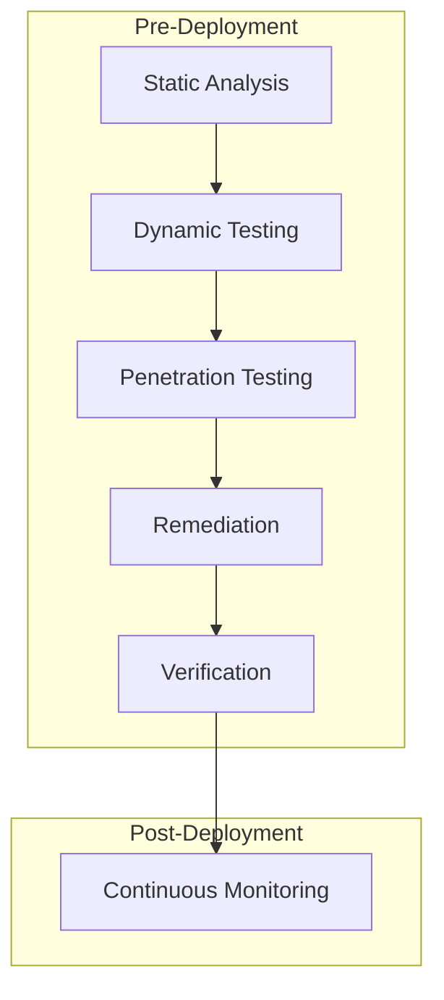
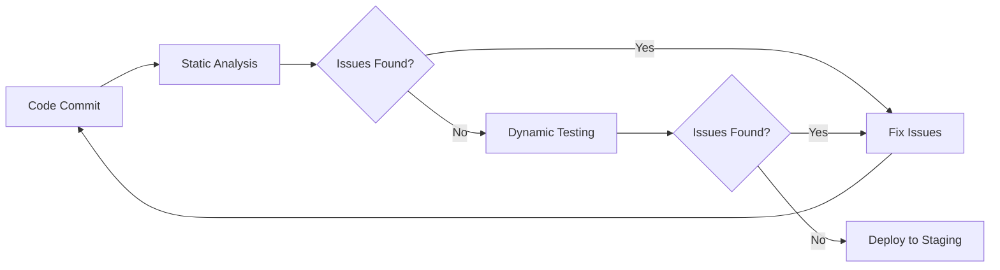
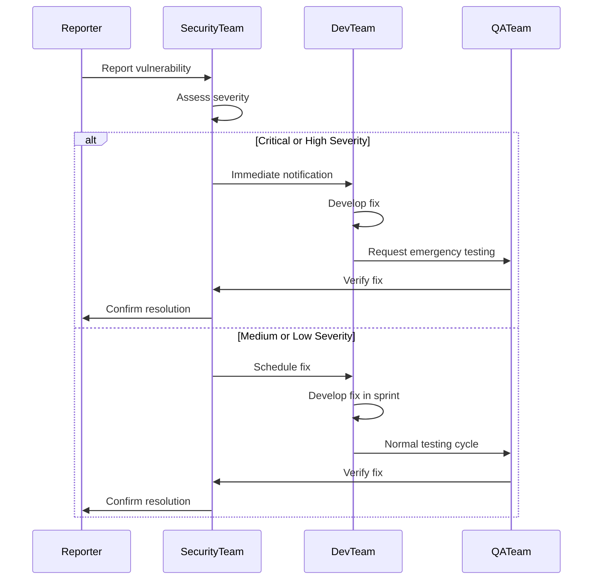
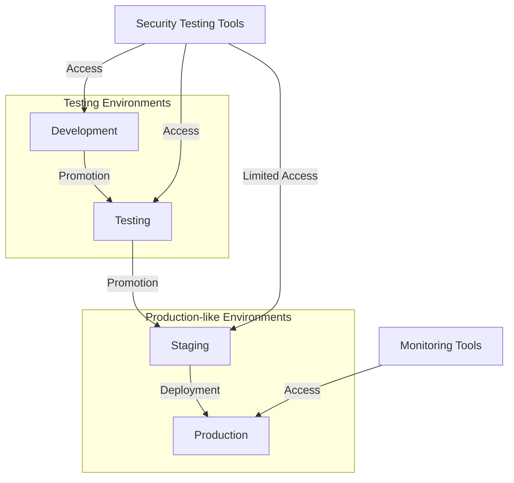

# Security Testing and Validation Framework

## Overview

This document outlines a comprehensive security testing and validation framework for the SketchyChain application. Given the application's nature of processing user inputs and executing dynamically generated code, a robust security testing strategy is essential to identify and mitigate potential vulnerabilities.

## Security Testing Objectives

1. **Verify Isolation**: Ensure the P5.js sandbox effectively isolates executing code
2. **Validate Input Processing**: Confirm all user inputs are properly validated and sanitized
3. **Assess Authentication**: Evaluate the security of any authentication mechanisms
4. **Test Authorization**: Verify proper access controls are in place
5. **Evaluate Data Protection**: Ensure sensitive data is properly protected
6. **Verify API Security**: Validate the security of all API endpoints
7. **Assess Infrastructure**: Evaluate the security of the underlying infrastructure

## Testing Methodology

The security testing methodology follows a layered approach:



### Layer 1: Static Analysis

**Tools and Techniques:**
- Automated code scanning (SAST)
- Dependency vulnerability checking
- Code quality analysis
- Architecture risk analysis
- Threat modeling

**Key Focus Areas:**
- Known vulnerability patterns
- Input validation issues
- Authentication weaknesses
- Authorization flaws
- Cryptographic issues
- Configuration errors

### Layer 2: Dynamic Testing

**Tools and Techniques:**
- Dynamic Application Security Testing (DAST)
- API security testing
- Fuzz testing
- Injection testing
- Session management testing

**Key Focus Areas:**
- Input validation and sanitization
- Cross-site scripting (XSS)
- Cross-site request forgery (CSRF)
- Injection attacks (SQL, NoSQL, command)
- Insecure direct object references

### Layer 3: Penetration Testing

**Tools and Techniques:**
- Manual penetration testing
- Specialized sandbox escape testing
- Privilege escalation attempts
- Social engineering simulations

**Key Focus Areas:**
- P5.js sandbox escape attempts
- Authentication bypass
- Authorization bypass
- Business logic flaws
- Advanced persistent threats

## P5.js Sandbox Security Testing

### Sandbox Escape Testing

**Test Cases:**
1. **DOM Access Attempts**: Try to access parent window objects
2. **Network Request Bypasses**: Attempt to make network requests via alternative methods
3. **Script Injection**: Test injection of scripts that attempt to break out of the sandbox
4. **Resource Exhaustion**: Test code that attempts to exhaust browser resources
5. **Frame Navigation**: Attempt to navigate the frame to different origins

**Testing Matrix:**

| Test Category | Test Case | Expected Outcome | Pass Criteria |
|---------------|-----------|-------------------|--------------|
| DOM Access | Access parent window | Access denied | Error thrown or access prevented |
| DOM Access | Modify parent DOM | Modification blocked | No changes to parent DOM |
| Network | Direct XHR requests | Request blocked | Error thrown or request fails |
| Network | WebSocket connection | Connection blocked | Error thrown or connection fails |
| Network | Fetch API usage | Fetch blocked | Error thrown or fetch fails |
| Resource | Infinite loop | Loop detection & termination | Script terminates within timeout |
| Resource | Memory exhaustion | Memory limitation | Script terminates before browser crash |
| Navigation | Frame redirection | Navigation blocked | Frame remains on original content |
| Storage | LocalStorage access | Access denied | Error thrown or access fails |
| Storage | IndexedDB access | Access denied | Error thrown or access fails |

### Code Execution Testing

**Test Cases:**
1. **Valid P5.js Code**: Verify legitimate code executes correctly
2. **Malformed Code**: Test handling of syntactically incorrect code
3. **Resource-Intensive Code**: Test handling of performance-heavy code
4. **Mixed Safe/Unsafe Code**: Test code with both legitimate and potentially malicious parts
5. **Edge Case Handling**: Test boundary conditions and unusual code patterns

## Security Testing Automation

### Continuous Integration Tests



**Automated Test Suite:**
1. **Security Linting**: ESLint security plugins, SonarQube
2. **Dependency Scanning**: npm audit, Snyk
3. **Static Analysis**: CodeQL, SonarQube
4. **API Testing**: Automated OWASP ZAP scans
5. **Sandbox Testing**: Custom test suite for sandbox security

### Scheduled Security Tests

| Test Type | Frequency | Tools | Responsible Team |
|-----------|-----------|-------|-----------------|
| Vulnerability Scanning | Weekly | OWASP ZAP, Nessus | Security Team |
| Dependency Audit | Daily | npm audit, Snyk | Development Team |
| Penetration Testing | Quarterly | Manual testing, Burp Suite | External Security Team |
| Configuration Audit | Monthly | Cloud security scanners | DevOps Team |
| Sandbox Escape Testing | Bi-weekly | Custom test suite | Security Team |

## Security Acceptance Criteria

### P5.js Sandbox Security Requirements

1. **Complete Isolation**: No access to parent window or DOM
2. **Network Restriction**: No ability to make network requests
3. **Resource Control**: Protection against resource exhaustion attacks
4. **Error Containment**: Errors must not propagate to parent application
5. **Input Validation**: All code must be validated before execution

### API Security Requirements

1. **Input Validation**: All inputs must be validated and sanitized
2. **Authentication**: All authenticated endpoints must verify credentials
3. **Authorization**: Access must be restricted based on permissions
4. **Rate Limiting**: Protection against brute force and DoS attacks
5. **Error Handling**: Secure error handling without information leakage

### Infrastructure Security Requirements

1. **Network Security**: Proper segmentation and firewall rules
2. **Access Control**: Least privilege access to all systems
3. **Encryption**: Data in transit and at rest must be encrypted
4. **Patching**: Systems must be regularly patched
5. **Monitoring**: Security monitoring and alerting must be in place

## Vulnerability Management

### Security Issue Severity Classification

| Level | Description | Response Time | Examples |
|-------|-------------|---------------|----------|
| Critical | Severe impact, immediate exploitation risk | Immediate (same day) | Remote code execution, authentication bypass |
| High | Significant impact, active exploitation risk | 1-3 days | SQL injection, XSS with session hijacking |
| Medium | Moderate impact, limited exploitation | 1-2 weeks | Non-sensitive information disclosure, limited XSS |
| Low | Minimal impact, difficult exploitation | Next release cycle | UI redressing, minor configuration issues |

### Incident Response Process



## Security Testing Tools

### Recommended Tools Stack

| Category | Tool | Purpose |
|----------|------|---------|
| Static Analysis | SonarQube | Code quality and security analysis |
| Static Analysis | ESLint + security plugins | JavaScript security linting |
| Dependency Scanning | npm audit | Node.js dependency vulnerabilities |
| Dependency Scanning | Snyk | Comprehensive dependency security |
| Dynamic Testing | OWASP ZAP | Web application security scanning |
| Penetration Testing | Burp Suite | Manual and semi-automated testing |
| Infrastructure | Cloud security tools | Infrastructure security scanning |
| Custom Testing | Sandbox Test Suite | P5.js sandbox security verification |

### Custom Sandbox Testing Tool

A custom testing tool will be developed to automatically validate the security of the P5.js sandbox:

**Features:**
- Automated testing of sandbox security boundaries
- Verification of resource limiting functionality
- Evaluation of sandbox isolation effectiveness
- Reporting of potential security weaknesses

## Security Testing Environments

### Environment Setup

| Environment | Purpose | Access | Data |
|-------------|---------|--------|------|
| Development | Initial testing | Development team | Synthetic test data |
| Testing | Focused security testing | Dev + Security teams | Anonymized test data |
| Staging | Pre-production validation | Dev + Security + QA | Production-like data |
| Production | Continuous monitoring | Limited access | Real data |

### Environment Isolation

Testing environments must be properly isolated to prevent cross-contamination and ensure accurate test results:



## Security Testing Documentation

### Required Documentation

1. **Test Plans**: Detailed security test plans for each feature
2. **Test Cases**: Specific security test cases with steps and expected results
3. **Test Results**: Documentation of test execution and findings
4. **Remediation Plans**: Plans for addressing identified vulnerabilities
5. **Security Sign-off**: Formal security approval before deployment

### Documentation Templates

**Security Test Case Template:**
```
Test Case ID: [Unique ID]
Test Objective: [What is being tested]
Security Requirement: [Related security requirement]
Preconditions: [Required setup]
Test Steps:
  1. [Step 1]
  2. [Step 2]
  3. ...
Expected Results: [What should happen]
Actual Results: [What actually happened]
Status: [Pass/Fail]
Severity: [Critical/High/Medium/Low]
Remediation: [Required fixes if failed]
```

## Training and Awareness

### Security Training Requirements

| Role | Training Focus | Frequency |
|------|----------------|-----------|
| Developers | Secure coding, OWASP Top 10 | Quarterly |
| QA Team | Security testing techniques | Quarterly |
| DevOps | Infrastructure security | Bi-annually |
| Product Managers | Security requirements | Annually |

## Compliance and Standards

The security testing framework adheres to the following standards and best practices:

1. OWASP Testing Guide
2. NIST Cybersecurity Framework
3. CWE/SANS Top 25 Most Dangerous Software Errors
4. OWASP Top 10 Web Application Security Risks
5. OWASP API Security Top 10

## Continuous Improvement

The security testing framework will be regularly reviewed and updated:

1. Review after each major security incident
2. Quarterly assessment of testing effectiveness
3. Annual comprehensive review of the entire framework
4. Updates based on new threat intelligence
5. Adjustments for new technologies and architecture changes

## Appendix: P5.js Sandbox Security Test Cases

Below are detailed test cases specifically for the P5.js sandbox security testing:

### DOM Isolation Test Cases

1. **Parent Window Access**
   ```javascript
   function setup() {
     createCanvas(400, 400);
     try {
       let parent = window.parent;
       text("Accessed parent: " + (parent !== undefined), 50, 50);
     } catch (e) {
       text("Correctly blocked: " + e.message, 50, 50);
     }
   }
   ```

2. **Document Manipulation**
   ```javascript
   function setup() {
     createCanvas(400, 400);
     try {
       let doc = window.document;
       doc.body.style.backgroundColor = 'red';
       text("Modified document", 50, 50);
     } catch (e) {
       text("Correctly blocked: " + e.message, 50, 50);
     }
   }
   ```

### Network Access Test Cases

1. **XHR Request**
   ```javascript
   function setup() {
     createCanvas(400, 400);
     try {
       let xhr = new XMLHttpRequest();
       xhr.open('GET', 'https://example.com');
       xhr.send();
       text("Sent XHR request", 50, 50);
     } catch (e) {
       text("Correctly blocked: " + e.message, 50, 50);
     }
   }
   ```

2. **Fetch API**
   ```javascript
   function setup() {
     createCanvas(400, 400);
     try {
       fetch('https://example.com')
         .then(response => text("Fetch succeeded", 50, 50))
         .catch(error => text("Fetch error: " + error.message, 50, 50));
     } catch (e) {
       text("Correctly blocked: " + e.message, 50, 50);
     }
   }
   ```

### Resource Exhaustion Test Cases

1. **Infinite Loop**
   ```javascript
   function setup() {
     createCanvas(400, 400);
     text("Starting infinite loop...", 50, 50);
     while (true) {
       // Infinite loop
     }
     text("Loop completed (should never reach here)", 50, 100);
   }
   ```

2. **Memory Allocation**
   ```javascript
   function setup() {
     createCanvas(400, 400);
     text("Allocating large arrays...", 50, 50);
     let arrays = [];
     try {
       for (let i = 0; i < 1000; i++) {
         arrays.push(new Array(1000000).fill(0));
       }
       text("Allocation succeeded", 50, 100);
     } catch (e) {
       text("Allocation failed: " + e.message, 50, 100);
     }
   }