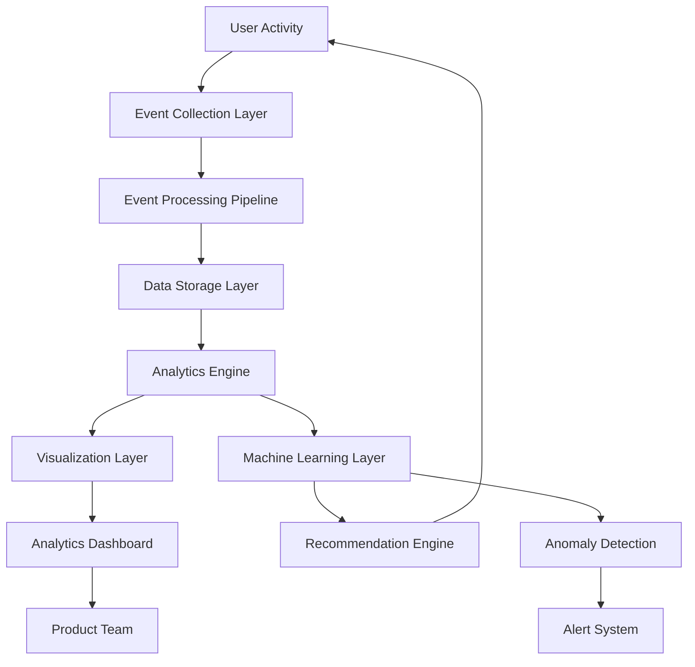
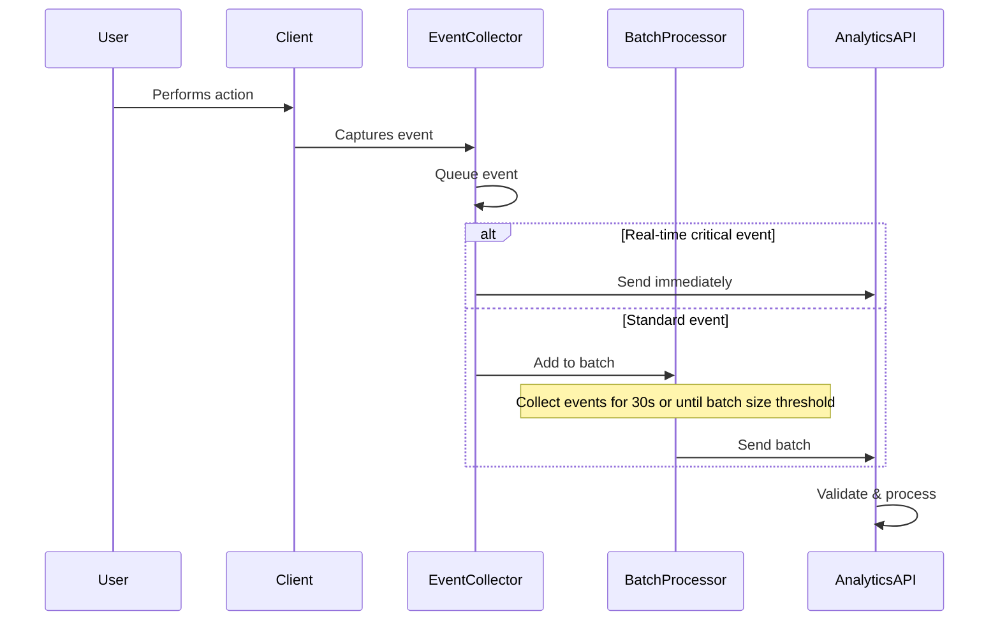
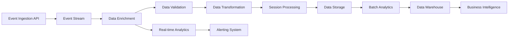
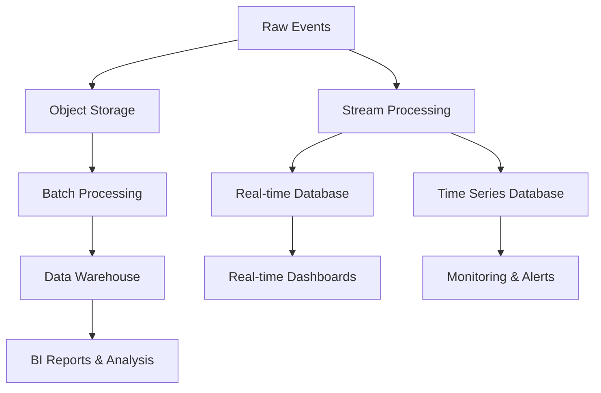
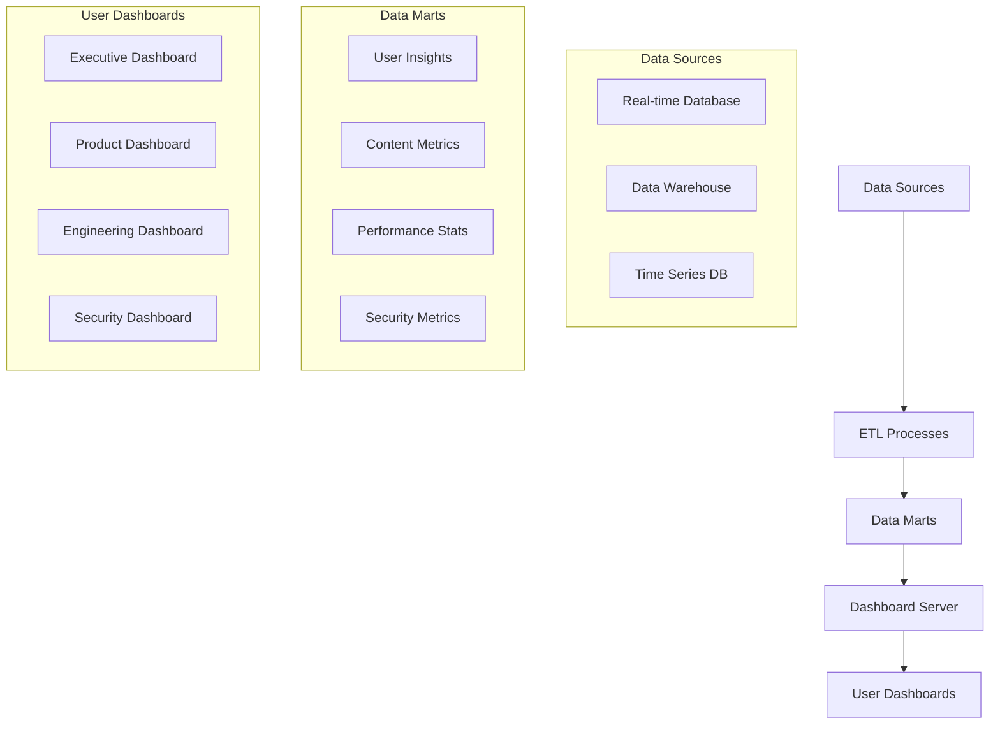
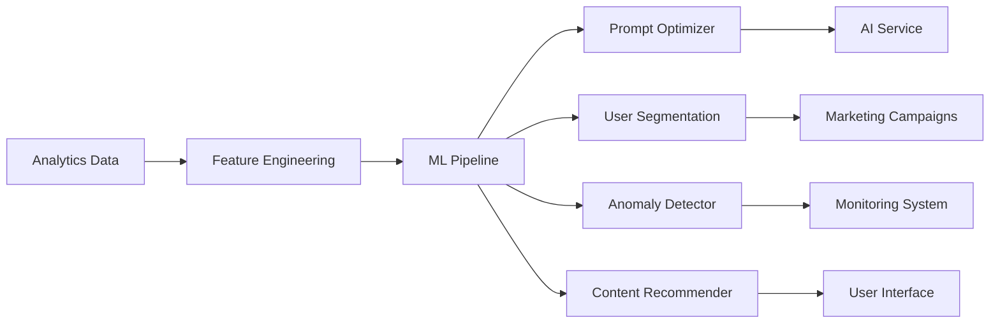
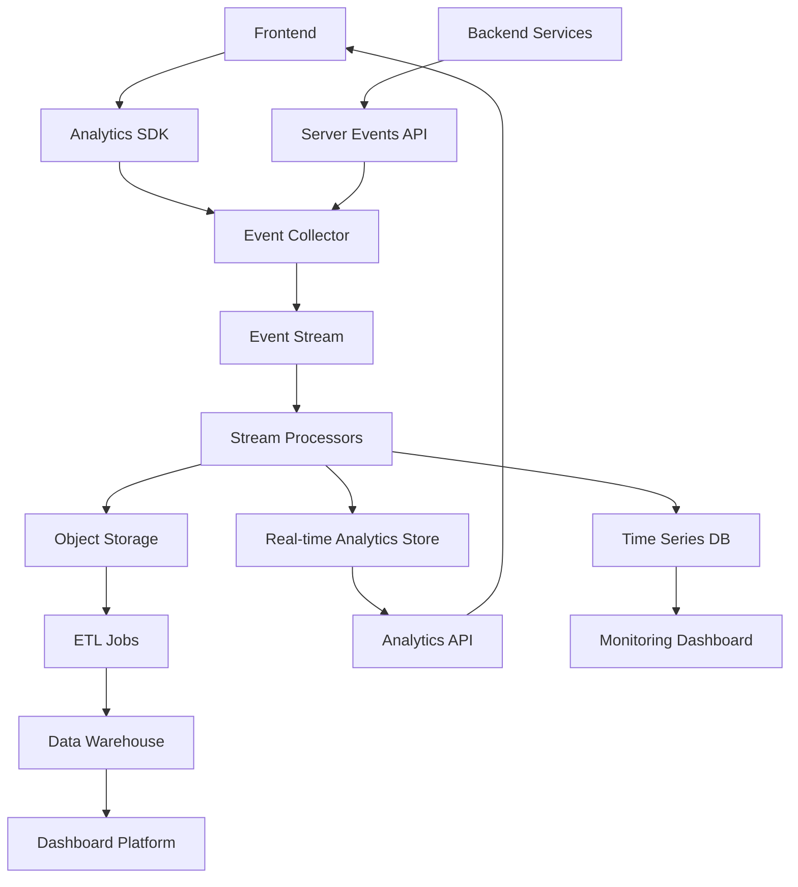

# User Activity Analytics and Insights Architecture

## Overview

This document outlines the architecture for collecting, processing, analyzing, and visualizing user activity data within the SketchyChain application. The analytics system is designed to provide valuable insights into how users interact with the application, identify usage patterns, measure feature engagement, and inform product improvements.

## Objectives

1. **Usage Understanding**: Gain insights into how users interact with the application
2. **Feature Engagement**: Measure which features are most/least used
3. **Performance Monitoring**: Track system performance from the user perspective
4. **Behavior Patterns**: Identify common user workflows and patterns
5. **Quality Improvement**: Use data to improve AI prompt effectiveness
6. **Collaboration Insights**: Understand how users collaborate on sketches
7. **Conversion Optimization**: Identify where users drop off or encounter issues

## Analytics Architecture Overview



## Data Collection Strategy

### Event Types

The following event categories will be tracked:

1. **User Session Events**
   - Session start/end
   - User identification (anonymous ID)
   - Device and browser information
   - Geographic location (country level)

2. **Prompt Events**
   - Prompt submission
   - Prompt processing time
   - Prompt success/failure
   - Prompt modifications/iterations
   - Prompt categorization (feature request, bug fix, etc.)

3. **Sketch Events**
   - Sketch creation
   - Sketch viewing
   - Sketch modification
   - Canvas interactions
   - Execution performance metrics

4. **Collaboration Events**
   - Multiple users joining a sketch
   - Interaction patterns between users
   - Collaborative session duration
   - User contribution distribution

5. **Feature Usage Events**
   - History navigation
   - Code viewing
   - Settings changes
   - Tool selection

6. **Error Events**
   - Client-side errors
   - Failed prompts
   - Performance issues
   - Security violations

### Event Schema

Standard event schema:

```json
{
  "event_id": "unique-event-identifier",
  "event_type": "category:action",
  "timestamp": "ISO-8601 timestamp",
  "session_id": "session-identifier",
  "user_id": "anonymous-user-id",
  "sketch_id": "sketch-identifier",
  "properties": {
    "property1": "value1",
    "property2": "value2",
    ...
  },
  "metadata": {
    "client_timestamp": "ISO-8601 timestamp",
    "app_version": "1.0.0",
    "platform_info": {
      "browser": "Chrome",
      "version": "96.0.4664.110",
      "os": "Windows",
      "device_type": "desktop"
    }
  }
}
```

### Collection Implementation



**Client-Side Collection:**
- Lightweight JavaScript SDK for event tracking
- Batching mechanism to reduce network requests
- Retry mechanism for failed submissions
- Privacy controls and data anonymization
- Consent management integration

**Server-Side Collection:**
- Automatic logging of API requests and responses
- System event tracking
- Performance metrics collection
- Security event monitoring
- Integration with application logging

## Data Processing Pipeline

### Architecture



### Processing Stages

1. **Event Ingestion**
   - High-throughput API endpoint
   - Initial validation and schema checking
   - Rate limiting and abuse prevention
   - Event buffering for reliability

2. **Data Enrichment**
   - Add contextual information
   - Resolve references (user, sketch, etc.)
   - Geolocation lookup
   - Feature flagging context

3. **Data Validation**
   - Deep schema validation
   - Type checking
   - Required field verification
   - Anomaly detection

4. **Data Transformation**
   - Normalization
   - Standardization
   - Aggregation
   - Sessionization

5. **Stream Processing**
   - Real-time analytics computation
   - Trend detection
   - Anomaly recognition
   - Alert triggering

## Data Storage Architecture

The analytics system uses a multi-layered storage approach to balance performance, cost, and query flexibility:



### Storage Layers

1. **Raw Event Storage**
   - Technology: Object storage (S3, GCS)
   - Purpose: Immutable record of all events
   - Retention: 90 days for raw events
   - Format: Compressed JSON files organized by date

2. **Real-time Analytics Storage**
   - Technology: In-memory database (Redis)
   - Purpose: Support real-time dashboards and monitoring
   - Retention: 24 hours of recent activity
   - Format: Optimized for rapid retrieval of current metrics

3. **Time Series Database**
   - Technology: InfluxDB or similar
   - Purpose: Store performance metrics and usage trends
   - Retention: 30 days of full resolution, 1 year downsampled
   - Format: Optimized for time-based queries and aggregations

4. **Analytics Data Warehouse**
   - Technology: BigQuery, Snowflake or similar
   - Purpose: Long-term storage and complex analysis
   - Retention: 1+ years
   - Format: Structured tables optimized for analytical queries

### Data Models

Key data models in the analytics warehouse:

1. **Sessions**
   ```
   session_id (PK)
   user_id
   start_time
   end_time
   duration
   device_info
   geo_location
   entry_point
   exit_point
   session_depth
   ```

2. **Events**
   ```
   event_id (PK)
   session_id (FK)
   user_id
   event_type
   timestamp
   sketch_id
   properties (JSON)
   ```

3. **Users**
   ```
   user_id (PK)
   first_seen
   last_seen
   session_count
   total_prompts
   successful_prompts
   favorite_features (JSON)
   ```

4. **Sketches**
   ```
   sketch_id (PK)
   creator_user_id
   creation_time
   last_modified
   collaborator_count
   prompt_count
   view_count
   complexity_score
   ```

5. **Prompts**
   ```
   prompt_id (PK)
   sketch_id (FK)
   user_id (FK)
   timestamp
   prompt_text
   processing_time
   success_status
   error_type
   ```

## Analytics and Insights Engine

### Key Metrics and Dimensions

**User Engagement Metrics:**
- Daily/Monthly Active Users (DAU/MAU)
- Average session duration
- Session frequency
- Retention rates (1-day, 7-day, 28-day)
- Feature adoption rate

**Content Creation Metrics:**
- Sketches created per user
- Prompts submitted per sketch
- Prompt success rate
- Code complexity over time
- Iteration depth (modifications per sketch)

**Collaboration Metrics:**
- Collaborators per sketch
- Collaboration session duration
- Contribution distribution
- Communication patterns
- Collaborative iteration speed

**Performance Metrics:**
- Prompt processing time
- Rendering performance
- Error rates
- API response times
- Resource utilization

**Key Analysis Dimensions:**
- Time (hour, day, week, month)
- User segments (new vs. returning)
- Geographic region
- Device type / browser
- Entry point
- Sketch complexity
- Prompt category

### Analysis Capabilities

1. **Funnel Analysis**
   - Track conversion through key user journeys
   - Identify drop-off points
   - Compare conversion rates across segments

2. **Cohort Analysis**
   - Group users by common characteristics
   - Track behavior changes over time
   - Identify successful user patterns

3. **Retention Analysis**
   - Measure user return rates
   - Identify features that drive retention
   - Compare retention across user segments

4. **A/B Testing Framework**
   - Test UI variations
   - Evaluate prompt optimization strategies
   - Compare feature implementations

5. **Anomaly Detection**
   - Identify unusual usage patterns
   - Detect potential security issues
   - Discover performance problems

6. **Predictive Analytics**
   - Forecast usage trends
   - Predict resource requirements
   - Identify users at risk of churning

## Visualization and Reporting

### Dashboard Architecture



### Dashboard Types

1. **Executive Dashboard**
   - High-level KPIs
   - User growth metrics
   - Overall system health
   - Strategic insights

2. **Product Dashboard**
   - Feature usage metrics
   - User engagement details
   - Retention metrics
   - A/B test results

3. **Engineering Dashboard**
   - Performance metrics
   - Error rates
   - API usage
   - Resource utilization

4. **Security Dashboard**
   - Security events
   - Suspicious activities
   - Rate limiting metrics
   - Content moderation stats

### Visualization Components

Standard visualization components include:

- Time series charts
- Funnel visualizations
- Heat maps
- User flow diagrams
- Cohort grids
- Geographic maps
- Real-time counters
- Anomaly indicators

## Machine Learning Applications

Analytics data will feed machine learning models to drive system improvements:



### ML Models

1. **Prompt Effectiveness Predictor**
   - Predicts likelihood of prompt success
   - Suggests improvements to user prompts
   - Identifies patterns in successful prompts

2. **User Segmentation Model**
   - Clusters users by behavior patterns
   - Identifies power users and their characteristics
   - Recognizes users who may need assistance

3. **Content Recommendation Engine**
   - Suggests relevant sketches to explore
   - Recommends techniques based on user history
   - Promotes collaborative opportunities

4. **Anomaly Detection System**
   - Identifies unusual user behavior
   - Detects potential security threats
   - Flags performance anomalies

5. **Churn Prediction Model**
   - Identifies users at risk of abandoning the platform
   - Suggests intervention strategies
   - Measures effectiveness of retention efforts

## Privacy and Compliance

### Data Privacy Measures

1. **Data Minimization**
   - Collect only necessary data
   - Aggregate when possible
   - Anonymize personal identifiers

2. **Consent Management**
   - Clear user consent process
   - Granular opt-out options
   - Preference management interface

3. **Data Retention Policies**
   - Defined retention periods by data type
   - Automated data purging
   - Archiving strategies

4. **Access Controls**
   - Role-based access to analytics
   - Audit logging for data access
   - Principle of least privilege

### Compliance Framework

Ensuring compliance with:
- GDPR (General Data Protection Regulation)
- CCPA (California Consumer Privacy Act)
- COPPA (Children's Online Privacy Protection Act)
- Industry-specific regulations as applicable

## Implementation Phases

### Phase 1: Foundation (1-2 months)
- Basic event tracking infrastructure
- Core event definitions
- Simple dashboards for key metrics
- Data warehouse setup

### Phase 2: Enhanced Analytics (2-3 months)
- Expanded event tracking
- Advanced dashboards
- Initial segmentation capabilities
- A/B testing framework

### Phase 3: Advanced Insights (3-4 months)
- Machine learning integration
- Predictive analytics
- Advanced visualization
- Automated insights

### Phase 4: Closed Loop Optimization (2-3 months)
- Recommendation systems
- Automated optimization
- Advanced anomaly detection
- Personalization features

## Technical Implementation

### Technologies

| Component | Recommended Technologies | Alternatives |
|-----------|--------------------------|--------------|
| Event Collection | Google Analytics 4, Segment | Amplitude, Mixpanel |
| Stream Processing | Apache Kafka, AWS Kinesis | Google Pub/Sub, Azure Event Hubs |
| Real-time Analytics | Apache Flink, Spark Streaming | AWS Kinesis Analytics, Google Dataflow |
| Data Storage | BigQuery, Snowflake | AWS Redshift, Azure Synapse |
| Visualization | Looker, Tableau | Power BI, Grafana |
| ML Platform | TensorFlow, AWS SageMaker | Google Vertex AI, Azure ML |

### Integration Architecture



## Metrics and Success Criteria

### Key Performance Indicators

1. **System KPIs**
   - Event collection reliability (>99.9%)
   - Data freshness (<5 minutes for dashboards)
   - Query performance (<3 seconds for dashboards)
   - System uptime (>99.9%)

2. **Business KPIs**
   - Data-driven decision coverage (% of features)
   - Insight action rate (% of insights actioned)
   - Time to insight (detection to decision)
   - Analytics adoption (% of team using data)

### Success Metrics

| Metric | Target | Method |
|--------|--------|--------|
| Data Reliability | >99.9% | Event sampling and validation |
| Coverage | >95% of key user actions | Audit of tracked events |
| Insight Quality | >80% accuracy | Validation against outcomes |
| Decision Impact | >30% improvement | A/B testing with controls |

## Operational Considerations

### Monitoring and Alerting

The analytics system itself will be monitored for:
- Data collection pipeline health
- Processing lag and backlog
- Storage capacity and usage
- Query performance
- System errors and failures

### Disaster Recovery

1. **Backup Strategy**
   - Daily snapshots of data warehouse
   - Continuous backup of event streams
   - Geo-redundant storage for critical data

2. **Recovery Procedures**
   - Event replay capabilities
   - Point-in-time recovery options
   - Failover for critical components

3. **Business Continuity**
   - Degraded mode operation plan
   - Alternative data sources for critical metrics
   - Manual reporting fallbacks

## Conclusion

The user activity analytics architecture provides a comprehensive framework for collecting, processing, analyzing, and acting upon user behavior data within the SketchyChain application. By implementing this architecture, the application will gain valuable insights into user behavior, enabling data-driven improvements to the user experience, feature set, and overall product quality.

This analytics system is designed to be scalable, flexible, and privacy-conscious, supporting the application's growth while maintaining high standards for data security and user privacy.