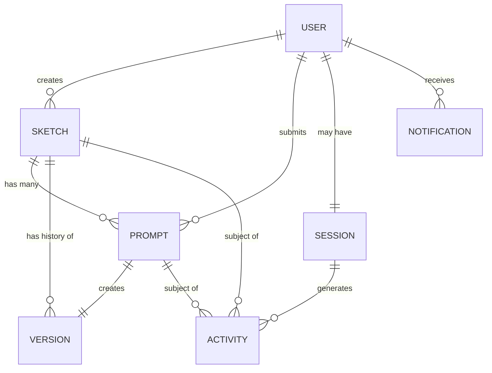

# Data Models and Schemas

This document defines the data models and schemas for the Sketchy Chain application. Since we're using MongoDB as our primary database, the schemas are presented in a document-oriented format.

## Core Models

### Sketch Model

The Sketch model represents a P5.js sketch that users can collaborate on.

```javascript
{
  _id: ObjectId,                 // Unique identifier for the sketch
  title: String,                 // User-friendly title for the sketch
  description: String,           // Optional description of the sketch
  currentCode: String,           // Current P5.js drawing code
  baseTemplate: String,          // Initial P5.js template code (never modified)
  isActive: Boolean,             // Whether the sketch is active/archived
  created: {
    timestamp: Date,             // When the sketch was created
    ipAddress: String            // IP address of the creator (for anonymous users)
  },
  lastModified: {
    timestamp: Date,             // When the sketch was last modified
    promptId: ObjectId           // Reference to the last prompt that modified the sketch
  },
  statistics: {
    promptCount: Number,         // Total number of prompts processed
    viewCount: Number,           // Total number of views
    contributorCount: Number,    // Total number of unique contributors
    lastActivity: Date           // Timestamp of last activity
  },
  settings: {
    canvasWidth: Number,         // Width of the P5.js canvas
    canvasHeight: Number,        // Height of the P5.js canvas
    frameRate: Number,           // Target frame rate for the sketch
    isPublic: Boolean,           // Whether the sketch is publicly accessible
    allowAnonymous: Boolean      // Whether anonymous contributions are allowed
  },
  repository: {
    owner: String,               // GitHub repository owner
    name: String,                // GitHub repository name
    branch: String,              // GitHub branch name
    path: String                 // Path to the sketch file in the repository
  },
  tags: [String]                 // Array of tags/categories for the sketch
}
```

### Prompt Model

The Prompt model represents a text prompt submitted by a user and its processing results.

```javascript
{
  _id: ObjectId,                 // Unique identifier for the prompt
  sketchId: ObjectId,            // Reference to the associated sketch
  text: String,                  // The actual prompt text entered by the user
  status: {
    code: String,                // Status code: 'pending', 'processing', 'completed', 'failed', 'rejected'
    message: String              // Optional status message, especially for failures
  },
  contributor: {
    ipAddress: String,           // IP address of the contributor
    userId: ObjectId,            // Optional reference to a user (if authenticated)
    nickname: String             // Optional display name for the contributor
  },
  timestamps: {
    submitted: Date,             // When the prompt was submitted
    processed: Date,             // When the prompt was fully processed
    applied: Date                // When the prompt was applied to the sketch
  },
  processing: {
    aiResponse: String,          // Raw response from the AI
    validationResult: Object,    // Result of code validation
    moderationFlags: Object,     // Content moderation flags/scores
    generationAttempts: Number   // Number of attempts to generate valid code
  },
  codeChanges: {
    before: String,              // Drawing code before the change
    after: String,               // Drawing code after the change
    diff: String                 // Unified diff of the changes
  },
  commit: {
    sha: String,                 // GitHub commit SHA
    url: String,                 // GitHub commit URL
    status: String               // Commit status: 'pending', 'success', 'failed'
  },
  metadata: {
    processingTime: Number,      // Time taken to process the prompt (ms)
    aiModel: String,             // AI model used for processing
    aiTokens: Number             // Tokens used in AI processing
  }
}
```

### Version Model

The Version model represents a specific point in the sketch's history, created whenever a prompt is successfully applied.

```javascript
{
  _id: ObjectId,                 // Unique identifier for the version
  sketchId: ObjectId,            // Reference to the associated sketch
  promptId: ObjectId,            // Reference to the prompt that created this version
  sequence: Number,              // Sequential version number (1, 2, 3, etc.)
  code: String,                  // The full P5.js drawing code at this version
  timestamp: Date,               // When this version was created
  contributor: {
    ipAddress: String,           // IP address of the contributor
    userId: ObjectId,            // Optional reference to a user
    nickname: String             // Optional display name
  },
  promptText: String,            // Copied prompt text for quick reference
  thumbnail: {
    dataUrl: String,             // Base64 encoded thumbnail image
    width: Number,               // Thumbnail width
    height: Number               // Thumbnail height
  },
  commit: {
    sha: String,                 // GitHub commit SHA
    url: String                  // GitHub commit URL
  }
}
```

### User Model (Optional)

The User model represents registered users (optional feature for future expansion).

```javascript
{
  _id: ObjectId,                 // Unique identifier for the user
  username: String,              // Username (unique)
  email: String,                 // Email address (unique)
  passwordHash: String,          // Hashed password
  profile: {
    displayName: String,         // Display name
    bio: String,                 // User biography
    avatarUrl: String,           // URL to user avatar
    website: String              // User's website
  },
  stats: {
    sketchesCreated: Number,     // Number of sketches created
    promptsSubmitted: Number,    // Number of prompts submitted
    joinedDate: Date             // When the user joined
  },
  preferences: {
    theme: String,               // UI theme preference
    canvasDefaults: Object,      // Default canvas settings
    notifications: Boolean       // Notification preferences
  },
  github: {
    username: String,            // GitHub username
    accessToken: String          // GitHub OAuth access token (encrypted)
  },
  roles: [String],               // User roles (e.g., 'user', 'moderator', 'admin')
  lastActive: Date               // When the user was last active
}
```

## Supporting Models

### Session Model

The Session model tracks active user sessions for anonymous and authenticated users.

```javascript
{
  _id: ObjectId,                 // Unique identifier for the session
  sessionId: String,             // Client-side session identifier
  ipAddress: String,             // IP address of the user
  userId: ObjectId,              // Optional reference to a user (if authenticated)
  nickname: String,              // Temporary nickname for anonymous users
  userAgent: String,             // User agent string
  isActive: Boolean,             // Whether the session is still active
  created: Date,                 // When the session was created
  lastActive: Date,              // When the session was last active
  currentSketch: ObjectId        // Currently active sketch for this session
}
```

### Activity Model

The Activity model tracks user actions for analytics and monitoring.

```javascript
{
  _id: ObjectId,                 // Unique identifier for the activity
  sessionId: String,             // Reference to the session
  userId: ObjectId,              // Optional reference to a user
  timestamp: Date,               // When the activity occurred
  type: String,                  // Type of activity ('view', 'create', 'prompt', 'navigate')
  details: {
    sketchId: ObjectId,          // Optional reference to a sketch
    promptId: ObjectId,          // Optional reference to a prompt
    action: String,              // Specific action taken
    target: String,              // Target of the action
    metadata: Object             // Additional metadata about the activity
  }
}
```

### Notification Model

The Notification model manages notifications for users (future feature).

```javascript
{
  _id: ObjectId,                 // Unique identifier for the notification
  userId: ObjectId,              // Reference to the target user
  type: String,                  // Notification type
  message: String,               // Notification message
  isRead: Boolean,               // Whether the notification has been read
  created: Date,                 // When the notification was created
  relatedTo: {
    sketchId: ObjectId,          // Optional reference to a sketch
    promptId: ObjectId,          // Optional reference to a prompt
    userId: ObjectId             // Optional reference to a user
  },
  metadata: Object               // Additional metadata for the notification
}
```

## Schema Relationships



## Indexing Strategy

### Sketch Collection Indexes

```javascript
// Primary lookup index
db.sketches.createIndex({ _id: 1 });

// For listing/filtering sketches
db.sketches.createIndex({ isActive: 1, lastModified.timestamp: -1 });
db.sketches.createIndex({ tags: 1 });
db.sketches.createIndex({ "created.timestamp": -1 });

// For repository operations
db.sketches.createIndex({ "repository.owner": 1, "repository.name": 1, "repository.path": 1 });
```

### Prompt Collection Indexes

```javascript
// Primary lookup index
db.prompts.createIndex({ _id: 1 });

// For retrieving prompts by sketch
db.prompts.createIndex({ sketchId: 1, "timestamps.submitted": -1 });

// For status monitoring
db.prompts.createIndex({ "status.code": 1, "timestamps.submitted": 1 });

// For contributor analysis
db.prompts.createIndex({ "contributor.ipAddress": 1 });
db.prompts.createIndex({ "contributor.userId": 1 });
```

### Version Collection Indexes

```javascript
// Primary lookup index
db.versions.createIndex({ _id: 1 });

// For retrieving version history
db.versions.createIndex({ sketchId: 1, sequence: 1 });
db.versions.createIndex({ promptId: 1 });

// For contributor analysis
db.versions.createIndex({ "contributor.userId": 1 });
```

### User Collection Indexes (Optional)

```javascript
// Primary lookup index
db.users.createIndex({ _id: 1 });

// For authentication
db.users.createIndex({ username: 1 }, { unique: true });
db.users.createIndex({ email: 1 }, { unique: true });

// For GitHub integration
db.users.createIndex({ "github.username": 1 });
```

## Data Validation Rules

### Sketch Validation Rules

1. `title` must be between 3 and 100 characters
2. `currentCode` must not exceed 100KB
3. `canvasWidth` and `canvasHeight` must be between 100 and 2000 pixels
4. `frameRate` must be between 1 and 60

### Prompt Validation Rules

1. `text` must be between 3 and 500 characters
2. `status.code` must be one of: 'pending', 'processing', 'completed', 'failed', 'rejected'
3. `codeChanges.before` and `codeChanges.after` must not exceed 100KB each

### Version Validation Rules

1. `sequence` must be a positive integer
2. `code` must not exceed 100KB
3. `thumbnail.dataUrl` must not exceed 1MB

## Data Migration Strategy

For future schema changes, we'll implement a versioning system:

1. Each document will include a `schemaVersion` field
2. Migration scripts will update documents to the latest schema version
3. The application will support reading multiple schema versions during transition periods
4. Background tasks will gradually migrate all documents to the latest schema version

## Backup and Recovery

1. Daily full backups of all collections
2. Continuous incremental backups with 5-minute intervals
3. Point-in-time recovery support for up to 30 days
4. Separate backup storage for sketches and versions to allow for efficient recovery of specific sketches

## Data Retention Policy

1. Active sketches are retained indefinitely
2. Archived sketches are retained for 1 year, then moved to cold storage
3. Processing metadata (AI responses, validation results) is retained for 90 days
4. Session data is retained for 30 days
5. Activity logs are retained for 90 days