# Deployment and Scalability Considerations

This document outlines the deployment architecture, scalability strategies, and operational considerations for the Sketchy Chain application. The focus is on creating a robust, scalable system that can handle growing user demands while maintaining performance and reliability.

## Infrastructure Overview

The application will be deployed using a cloud-native architecture to ensure scalability, reliability, and ease of management.

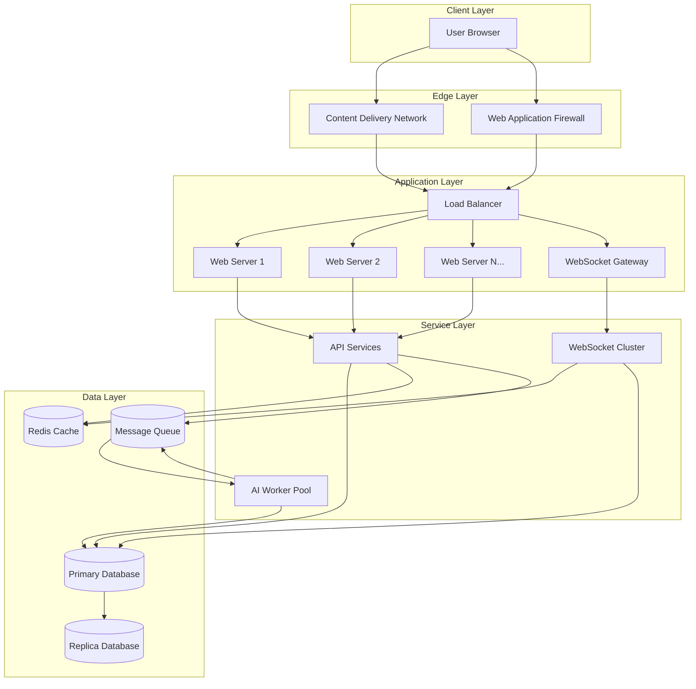

## Cloud Infrastructure Options

The application can be deployed on any of the major cloud providers. Below is a comparison of options:

### AWS Architecture

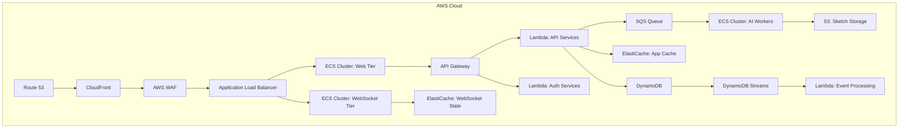

**Key AWS Services:**
- **Compute**: ECS (containers) for web and WebSocket services, Lambda for API functions
- **Database**: DynamoDB for document storage, DynamoDB Streams for event-driven architecture
- **Messaging**: SQS for AI processing queue
- **Caching**: ElastiCache (Redis) for session data and real-time communication
- **Storage**: S3 for sketch code and static assets
- **CDN**: CloudFront for global content distribution
- **Security**: WAF for protecting against common web vulnerabilities

### Google Cloud Platform (GCP) Architecture

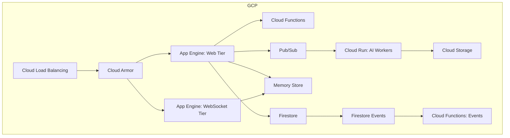

**Key GCP Services:**
- **Compute**: App Engine for web and WebSocket services, Cloud Run for containerized AI workers
- **Database**: Firestore for document storage and real-time syncing
- **Messaging**: Pub/Sub for asynchronous communication
- **Caching**: Memorystore (Redis) for distributed caching
- **Storage**: Cloud Storage for static files and sketch code
- **Security**: Cloud Armor for WAF functionality

### Microsoft Azure Architecture

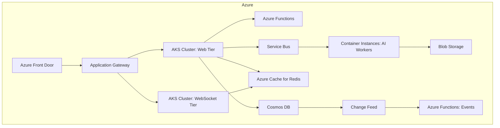

**Key Azure Services:**
- **Compute**: AKS (Kubernetes) for web and WebSocket services, Container Instances for AI workers
- **Database**: Cosmos DB for globally distributed document storage
- **Messaging**: Service Bus for reliable message queuing
- **Caching**: Azure Cache for Redis
- **Storage**: Blob Storage for static files and sketch data
- **Security**: Application Gateway with WAF

## Containerization Strategy

The application will be containerized using Docker to ensure consistent environments across development, testing, and production.

### Container Architecture

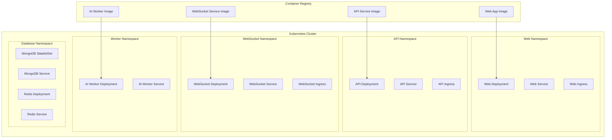

### Docker Compose Setup (Development)

```yaml
# docker-compose.yml
version: '3.8'

services:
  web:
    build: ./frontend
    ports:
      - "3000:3000"
    volumes:
      - ./frontend:/app
      - /app/node_modules
    depends_on:
      - api
    environment:
      - NODE_ENV=development
      - API_URL=http://api:4000
      - WS_URL=ws://websocket:4001

  api:
    build: ./backend
    ports:
      - "4000:4000"
    volumes:
      - ./backend:/app
      - /app/node_modules
    depends_on:
      - mongodb
      - redis
    environment:
      - NODE_ENV=development
      - MONGODB_URI=mongodb://mongodb:27017/promptdesigner
      - REDIS_URI=redis://redis:6379
      - WS_SERVICE_URL=http://websocket:4001

  websocket:
    build: ./websocket
    ports:
      - "4001:4001"
    volumes:
      - ./websocket:/app
      - /app/node_modules
    depends_on:
      - redis
    environment:
      - NODE_ENV=development
      - REDIS_URI=redis://redis:6379

  ai-worker:
    build: ./ai-worker
    volumes:
      - ./ai-worker:/app
      - /app/node_modules
    depends_on:
      - mongodb
      - redis
    environment:
      - NODE_ENV=development
      - MONGODB_URI=mongodb://mongodb:27017/promptdesigner
      - REDIS_URI=redis://redis:6379
      - AI_SERVICE_KEY=${AI_SERVICE_KEY}
      - GITHUB_TOKEN=${GITHUB_TOKEN}
    command: npm run worker

  mongodb:
    image: mongo:5
    ports:
      - "27017:27017"
    volumes:
      - mongodb-data:/data/db

  redis:
    image: redis:6
    ports:
      - "6379:6379"
    volumes:
      - redis-data:/data

volumes:
  mongodb-data:
  redis-data:
```

## Kubernetes Deployment (Production)

For production deployments, we'll use Kubernetes to orchestrate containers with high availability and scalability.

### Key Kubernetes Resources

```yaml
# Example Kubernetes deployment for the API service
apiVersion: apps/v1
kind: Deployment
metadata:
  name: api-deployment
  namespace: api
spec:
  replicas: 3
  selector:
    matchLabels:
      app: api
  template:
    metadata:
      labels:
        app: api
    spec:
      containers:
        - name: api
          image: ${CONTAINER_REGISTRY}/promptdesigner-api:${VERSION}
          ports:
            - containerPort: 4000
          env:
            - name: NODE_ENV
              value: "production"
            - name: MONGODB_URI
              valueFrom:
                secretKeyRef:
                  name: mongodb-secret
                  key: uri
            - name: REDIS_URI
              valueFrom:
                secretKeyRef:
                  name: redis-secret
                  key: uri
          resources:
            requests:
              memory: "256Mi"
              cpu: "100m"
            limits:
              memory: "512Mi"
              cpu: "500m"
          livenessProbe:
            httpGet:
              path: /health
              port: 4000
            initialDelaySeconds: 30
            periodSeconds: 10
          readinessProbe:
            httpGet:
              path: /readiness
              port: 4000
            initialDelaySeconds: 5
            periodSeconds: 5
```

```yaml
# Example Kubernetes deployment for WebSocket service
apiVersion: apps/v1
kind: Deployment
metadata:
  name: websocket-deployment
  namespace: websocket
spec:
  replicas: 3
  selector:
    matchLabels:
      app: websocket
  template:
    metadata:
      labels:
        app: websocket
    spec:
      containers:
        - name: websocket
          image: ${CONTAINER_REGISTRY}/promptdesigner-websocket:${VERSION}
          ports:
            - containerPort: 4001
          env:
            - name: NODE_ENV
              value: "production"
            - name: REDIS_URI
              valueFrom:
                secretKeyRef:
                  name: redis-secret
                  key: uri
          resources:
            requests:
              memory: "256Mi"
              cpu: "100m"
            limits:
              memory: "512Mi"
              cpu: "500m"
          livenessProbe:
            httpGet:
              path: /health
              port: 4001
            initialDelaySeconds: 30
            periodSeconds: 10
```

```yaml
# Example Kubernetes HorizontalPodAutoscaler for AI workers
apiVersion: autoscaling/v2
kind: HorizontalPodAutoscaler
metadata:
  name: ai-worker-hpa
  namespace: worker
spec:
  scaleTargetRef:
    apiVersion: apps/v1
    kind: Deployment
    name: ai-worker-deployment
  minReplicas: 2
  maxReplicas: 10
  metrics:
  - type: Resource
    resource:
      name: cpu
      target:
        type: Utilization
        averageUtilization: 70
  - type: Resource
    resource:
      name: memory
      target:
        type: Utilization
        averageUtilization: 80
  behavior:
    scaleUp:
      stabilizationWindowSeconds: 30
      policies:
      - type: Percent
        value: 50
        periodSeconds: 60
    scaleDown:
      stabilizationWindowSeconds: 300
      policies:
      - type: Percent
        value: 20
        periodSeconds: 60
```

## Real-time Communication Architecture

WebSockets are a critical component for enabling real-time collaboration in the Sketchy Chain application. Below is the architecture for scaling WebSockets:

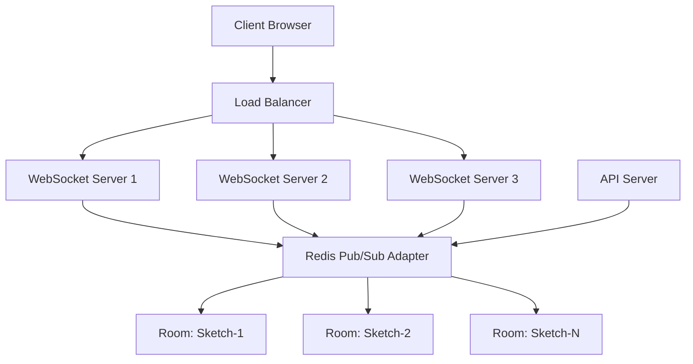

### WebSocket Implementation (Socket.IO)

The application will use Socket.IO for WebSocket communication, which provides automatic reconnection, room-based broadcasting, and fallback to long-polling when WebSockets aren't available.

```javascript
// websocket/server.js
const { createServer } = require('http');
const { Server } = require('socket.io');
const { createAdapter } = require('@socket.io/redis-adapter');
const Redis = require('ioredis');

// Create HTTP server
const httpServer = createServer();

// Create Socket.IO server
const io = new Server(httpServer, {
  cors: {
    origin: process.env.ALLOWED_ORIGINS.split(','),
    methods: ['GET', 'POST'],
    credentials: true
  },
  transports: ['websocket', 'polling'],
  pingInterval: 25000,
  pingTimeout: 20000
});

// Set up Redis adapter for horizontal scaling
const pubClient = new Redis(process.env.REDIS_URI);
const subClient = pubClient.duplicate();

io.adapter(createAdapter(pubClient, subClient));

// Handle connections
io.on('connection', (socket) => {
  console.log(`Client connected: ${socket.id}`);
  
  // Authenticate the connection
  authenticate(socket)
    .then(({ sessionId, userId }) => {
      // Store user data in socket
      socket.data.sessionId = sessionId;
      socket.data.userId = userId;
      
      // Handle room subscriptions
      socket.on('subscribe', ({ room }) => {
        console.log(`User ${socket.data.sessionId} joining room: ${room}`);
        socket.join(room);
        
        // Notify room about new user
        io.to(room).emit('presence:update', {
          event: 'join',
          user: {
            sessionId: socket.data.sessionId,
            nickname: socket.data.nickname || 'Anonymous'
          },
          timestamp: new Date()
        });
      });
      
      // Handle room unsubscriptions
      socket.on('unsubscribe', ({ room }) => {
        console.log(`User ${socket.data.sessionId} leaving room: ${room}`);
        socket.leave(room);
        
        // Notify room about user leaving
        io.to(room).emit('presence:update', {
          event: 'leave',
          user: {
            sessionId: socket.data.sessionId,
            nickname: socket.data.nickname || 'Anonymous'
          },
          timestamp: new Date()
        });
      });
      
      // Handle disconnection
      socket.on('disconnect', () => {
        console.log(`Client disconnected: ${socket.id}`);
        
        // Get all rooms this socket was in
        const rooms = Array.from(socket.rooms).filter(room => room !== socket.id);
        
        // Notify all rooms about user leaving
        rooms.forEach(room => {
          io.to(room).emit('presence:update', {
            event: 'leave',
            user: {
              sessionId: socket.data.sessionId,
              nickname: socket.data.nickname || 'Anonymous'
            },
            timestamp: new Date()
          });
        });
      });
    })
    .catch(err => {
      console.error('Authentication error:', err);
      socket.disconnect(true);
    });
});

// Start the server
const PORT = process.env.PORT || 4001;
httpServer.listen(PORT, () => {
  console.log(`WebSocket server listening on port ${PORT}`);
});
```

### WebSocket Client Integration

```javascript
// frontend/src/services/websocket.service.js
import { io } from 'socket.io-client';

class WebSocketService {
  constructor() {
    this.socket = null;
    this.subscriptions = new Map();
    this.connected = false;
  }
  
  connect() {
    if (this.socket) {
      return Promise.resolve(this.socket);
    }
    
    return new Promise((resolve, reject) => {
      // Initialize socket connection
      this.socket = io(process.env.REACT_APP_WS_URL, {
        transports: ['websocket', 'polling'],
        withCredentials: true,
        reconnection: true,
        reconnectionDelay: 1000,
        reconnectionDelayMax: 5000,
        reconnectionAttempts: 10
      });
      
      this.socket.on('connect', () => {
        console.log('WebSocket connected');
        this.connected = true;
        
        // Resubscribe to rooms after reconnection
        this.resubscribe();
        
        resolve(this.socket);
      });
      
      this.socket.on('disconnect', (reason) => {
        console.log(`WebSocket disconnected: ${reason}`);
        this.connected = false;
      });
      
      this.socket.on('error', (error) => {
        console.error('WebSocket error:', error);
        reject(error);
      });
      
      this.socket.on('reconnect_failed', () => {
        console.error('WebSocket reconnection failed');
        reject(new Error('WebSocket reconnection failed'));
      });
    });
  }
  
  disconnect() {
    if (this.socket) {
      this.socket.disconnect();
      this.socket = null;
      this.connected = false;
      this.subscriptions.clear();
    }
  }
  
  subscribe(room, events) {
    if (!this.socket) {
      throw new Error('WebSocket not connected');
    }
    
    // Subscribe to room
    this.socket.emit('subscribe', { room });
    
    // Store subscription for reconnection
    this.subscriptions.set(room, events);
    
    // Set up event listeners
    Object.entries(events).forEach(([event, handler]) => {
      const eventName = `${event}`;
      this.socket.on(eventName, handler);
    });
  }
  
  unsubscribe(room) {
    if (!this.socket) {
      return;
    }
    
    // Unsubscribe from room
    this.socket.emit('unsubscribe', { room });
    
    // Remove event listeners
    const events = this.subscriptions.get(room) || {};
    Object.keys(events).forEach(event => {
      const eventName = `${event}`;
      this.socket.off(eventName, events[event]);
    });
    
    // Remove subscription
    this.subscriptions.delete(room);
  }
  
  resubscribe() {
    // Resubscribe to all rooms after reconnection
    for (const [room, events] of this.subscriptions.entries()) {
      this.socket.emit('subscribe', { room });
    }
  }
  
  // Send activity update to inform others about user actions
  sendActivity(sketchId, action) {
    if (!this.socket || !this.connected) {
      return;
    }
    
    this.socket.emit('activity', {
      data: {
        sketchId,
        action
      }
    });
  }
}

// Singleton instance
const websocketService = new WebSocketService();
export default websocketService;
```

## Database Scalability

### MongoDB Sharding Strategy

For horizontal scaling of MongoDB:

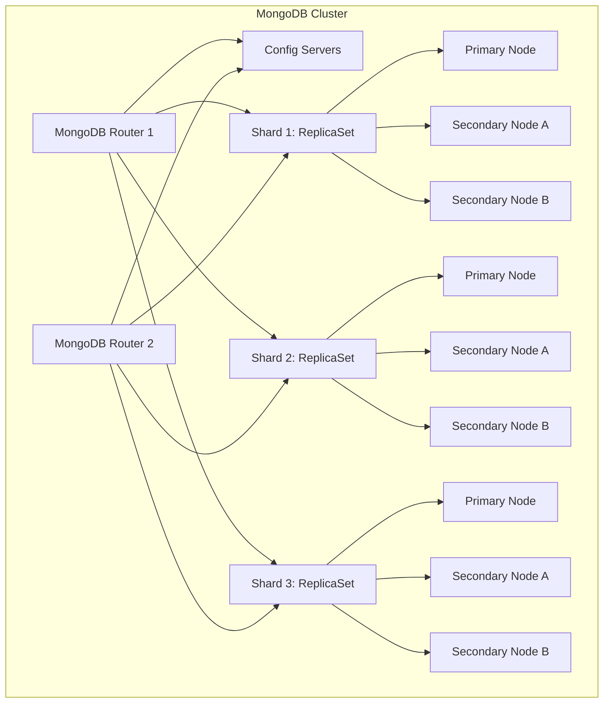

### Sharding Keys

```javascript
// Sharding commands for MongoDB

// Shard the database
sh.enableSharding("promptdesigner")

// Shard the sketches collection by _id
db.sketches.createIndex({ _id: 1 })
sh.shardCollection("promptdesigner.sketches", { _id: 1 })

// Shard the prompts collection by sketchId for data locality
db.prompts.createIndex({ sketchId: 1 })
sh.shardCollection("promptdesigner.prompts", { sketchId: 1 })

// Shard the versions collection by sketchId for data locality
db.versions.createIndex({ sketchId: 1, sequence: 1 })
sh.shardCollection("promptdesigner.versions", { sketchId: 1 })
```

### Redis Cluster Configuration

For scaling Redis cache and pub/sub capabilities:

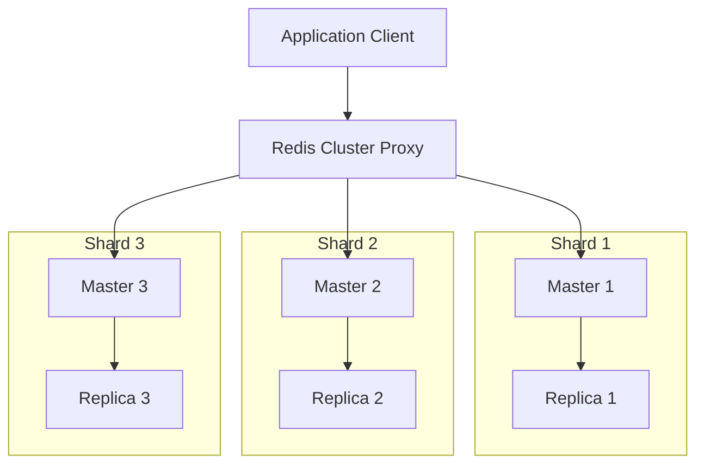

## Auto-Scaling Strategy

### Scaling Triggers

The application implements auto-scaling based on the following metrics:

1. **CPU Utilization**: Scale when average CPU usage exceeds 70%
2. **Memory Usage**: Scale when average memory usage exceeds 80%
3. **Request Rate**: Scale based on requests per second per instance
4. **WebSocket Connections**: Scale WebSocket servers based on active connections
5. **Queue Length**: Scale AI workers based on queue depth

### Scaling Policies

```yaml
# Example AWS Auto Scaling Group policy for API tier
Resources:
  ApiAutoScalingGroup:
    Type: AWS::AutoScaling::AutoScalingGroup
    Properties:
      MinSize: 2
      MaxSize: 20
      DesiredCapacity: 2
      HealthCheckType: ELB
      HealthCheckGracePeriod: 300
      LaunchTemplate:
        LaunchTemplateId: !Ref ApiLaunchTemplate
        Version: !GetAtt ApiLaunchTemplate.LatestVersionNumber
      TargetGroupARNs:
        - !Ref ApiTargetGroup
      VPCZoneIdentifier:
        - !Ref PrivateSubnet1
        - !Ref PrivateSubnet2
      Tags:
        - Key: Name
          Value: api-server
          PropagateAtLaunch: true

  ApiScalingPolicy:
    Type: AWS::AutoScaling::ScalingPolicy
    Properties:
      AutoScalingGroupName: !Ref ApiAutoScalingGroup
      PolicyType: TargetTrackingScaling
      TargetTrackingConfiguration:
        PredefinedMetricSpecification:
          PredefinedMetricType: ASGAverageCPUUtilization
        TargetValue: 70.0
```

## Performance Optimization

### Caching Strategy

The application implements a multi-layered caching strategy:

1. **Browser Cache**: Static assets with appropriate cache headers
2. **CDN Cache**: Static files and common API responses
3. **API Gateway Cache**: Responses for common API requests
4. **Application Cache**: In-memory caching for frequently accessed data
5. **Database Cache**: Redis cache for database query results

```javascript
// Example caching middleware for API responses
const cacheMiddleware = (duration) => {
  return (req, res, next) => {
    const key = `__cache__${req.originalUrl || req.url}`;
    const cachedResponse = redisClient.get(key);
    
    if (cachedResponse) {
      res.send(JSON.parse(cachedResponse));
      return;
    }
    
    // Store the original send method
    const originalSend = res.send;
    
    // Override the send method
    res.send = function(body) {
      // Cache the response
      redisClient.set(key, JSON.stringify(body));
      redisClient.expire(key, duration);
      
      // Call the original send method
      originalSend.call(this, body);
    };
    
    next();
  };
};

// Apply to specific routes
app.get('/api/v1/sketches', cacheMiddleware(60), getSketchesHandler);
```

### Database Query Optimization

```javascript
// Index creation for common query patterns
db.sketches.createIndex({ isActive: 1, lastModified: -1 });
db.sketches.createIndex({ tags: 1, isActive: 1 });
db.sketches.createIndex({ "settings.isPublic": 1, lastModified: -1 });

db.prompts.createIndex({ sketchId: 1, "timestamps.submitted": -1 });
db.prompts.createIndex({ "status.code": 1 });
db.prompts.createIndex({ "contributor.ipAddress": 1, sketchId: 1 });

db.versions.createIndex({ sketchId: 1, sequence: 1 });
```

### API Response Compression

```javascript
// Enable compression for API responses
const compression = require('compression');

// Compress all responses
app.use(compression());

// Custom compression filter
app.use(compression({
  filter: (req, res) => {
    if (req.headers['x-no-compression']) {
      // Don't compress responses with this request header
      return false;
    }
    
    // Compress everything else
    return compression.filter(req, res);
  },
  // Compression level (0-9)
  level: 6
}));
```

## Continuous Integration and Deployment

### CI/CD Pipeline

The application uses a CI/CD pipeline for automated testing, building, and deployment:

```mermaid
graph LR
    Code[Code Repository] --> Build[Build & Test]
    Build --> Test[Automated Tests]
    Test --> Artifact[Create Artifacts]
    Artifact --> DeployDev[Deploy to Development]
    DeployDev --> TestDev[Integration Tests]
    TestDev --> DeployStage[Deploy to Staging]
    DeployStage --> TestStage[Acceptance Tests]
    TestStage --> DeployProd[Deploy to Production]
    DeployProd --> Monitor[Monitor & Feedback]
```

### GitHub Actions Workflow

```yaml
# .github/workflows/ci-cd.yml
name: CI/CD Pipeline

on:
  push:
    branches: [ main, develop ]
  pull_request:
    branches: [ main, develop ]

jobs:
  build:
    runs-on: ubuntu-latest
    
    steps:
    - uses: actions/checkout@v3
    
    - name: Setup Node.js
      uses: actions/setup-node@v3
      with:
        node-version: '16'
        cache: 'npm'
    
    - name: Install dependencies
      run: npm ci
    
    - name: Run linting
      run: npm run lint
    
    - name: Run unit tests
      run: npm test
    
    - name: Build application
      run: npm run build
    
    - name: Upload build artifacts
      uses: actions/upload-artifact@v3
      with:
        name: build-artifacts
        path: build/

  docker:
    needs: build
    runs-on: ubuntu-latest
    if: github.event_name != 'pull_request'
    
    steps:
    - uses: actions/checkout@v3
    
    - name: Download build artifacts
      uses: actions/download-artifact@v3
      with:
        name: build-artifacts
        path: build/
    
    - name: Set up Docker Buildx
      uses: docker/setup-buildx-action@v2
    
    - name: Login to Container Registry
      uses: docker/login-action@v2
      with:
        registry: ${{ secrets.REGISTRY_URL }}
        username: ${{ secrets.REGISTRY_USERNAME }}
        password: ${{ secrets.REGISTRY_PASSWORD }}
    
    - name: Build and push Web image
      uses: docker/build-push-action@v3
      with:
        context: .
        file: ./Dockerfile.web
        push: true
        tags: ${{ secrets.REGISTRY_URL }}/promptdesigner-web:${{ github.sha }}
    
    - name: Build and push API image
      uses: docker/build-push-action@v3
      with:
        context: .
        file: ./Dockerfile.api
        push: true
        tags: ${{ secrets.REGISTRY_URL }}/promptdesigner-api:${{ github.sha }}
    
    - name: Build and push WebSocket image
      uses: docker/build-push-action@v3
      with:
        context: .
        file: ./Dockerfile.websocket
        push: true
        tags: ${{ secrets.REGISTRY_URL }}/promptdesigner-websocket:${{ github.sha }}
    
    - name: Build and push AI Worker image
      uses: docker/build-push-action@v3
      with:
        context: .
        file: ./Dockerfile.worker
        push: true
        tags: ${{ secrets.REGISTRY_URL }}/promptdesigner-worker:${{ github.sha }}

  deploy-dev:
    needs: docker
    runs-on: ubuntu-latest
    if: github.ref == 'refs/heads/develop'
    
    steps:
    - uses: actions/checkout@v3
    
    - name: Set up Kubernetes CLI
      uses: azure/setup-kubectl@v3
    
    - name: Set Kubernetes context
      uses: azure/k8s-set-context@v2
      with:
        kubeconfig: ${{ secrets.DEV_KUBECONFIG }}
    
    - name: Deploy to Development
      run: |
        # Update image tags in Kubernetes manifests
        sed -i 's|image:.*|image: ${{ secrets.REGISTRY_URL }}/promptdesigner-web:${{ github.sha }}|' ./k8s/dev/web-deployment.yaml
        sed -i 's|image:.*|image: ${{ secrets.REGISTRY_URL }}/promptdesigner-api:${{ github.sha }}|' ./k8s/dev/api-deployment.yaml
        sed -i 's|image:.*|image: ${{ secrets.REGISTRY_URL }}/promptdesigner-websocket:${{ github.sha }}|' ./k8s/dev/websocket-deployment.yaml
        sed -i 's|image:.*|image: ${{ secrets.REGISTRY_URL }}/promptdesigner-worker:${{ github.sha }}|' ./k8s/dev/worker-deployment.yaml
        
        # Apply Kubernetes manifests
        kubectl apply -f ./k8s/dev/

  deploy-prod:
    needs: docker
    runs-on: ubuntu-latest
    if: github.ref == 'refs/heads/main'
    environment: production
    
    steps:
    - uses: actions/checkout@v3
    
    - name: Set up Kubernetes CLI
      uses: azure/setup-kubectl@v3
    
    - name: Set Kubernetes context
      uses: azure/k8s-set-context@v2
      with:
        kubeconfig: ${{ secrets.PROD_KUBECONFIG }}
    
    - name: Deploy to Production
      run: |
        # Update image tags in Kubernetes manifests
        sed -i 's|image:.*|image: ${{ secrets.REGISTRY_URL }}/promptdesigner-web:${{ github.sha }}|' ./k8s/prod/web-deployment.yaml
        sed -i 's|image:.*|image: ${{ secrets.REGISTRY_URL }}/promptdesigner-api:${{ github.sha }}|' ./k8s/prod/api-deployment.yaml
        sed -i 's|image:.*|image: ${{ secrets.REGISTRY_URL }}/promptdesigner-websocket:${{ github.sha }}|' ./k8s/prod/websocket-deployment.yaml
        sed -i 's|image:.*|image: ${{ secrets.REGISTRY_URL }}/promptdesigner-worker:${{ github.sha }}|' ./k8s/prod/worker-deployment.yaml
        
        # Apply Kubernetes manifests
        kubectl apply -f ./k8s/prod/
```

## Monitoring and Alerting

### Monitoring Architecture

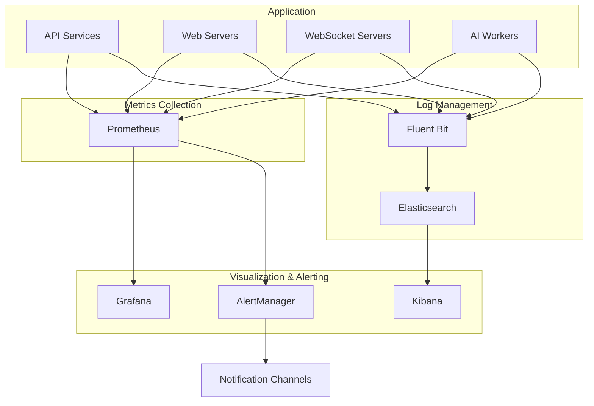

### Prometheus Configuration

```yaml
# prometheus.yml
global:
  scrape_interval: 15s
  evaluation_interval: 15s

alerting:
  alertmanagers:
  - static_configs:
    - targets:
      - alertmanager:9093

rule_files:
  - "alerts.yml"

scrape_configs:
  - job_name: 'prometheus'
    static_configs:
      - targets: ['localhost:9090']
  
  - job_name: 'api-servers'
    kubernetes_sd_configs:
      - role: pod
    relabel_configs:
      - source_labels: [__meta_kubernetes_pod_label_app]
        regex: api
        action: keep
      - source_labels: [__meta_kubernetes_pod_container_port_number]
        regex: 4000
        action: keep
  
  - job_name: 'websocket-servers'
    kubernetes_sd_configs:
      - role: pod
    relabel_configs:
      - source_labels: [__meta_kubernetes_pod_label_app]
        regex: websocket
        action: keep
      - source_labels: [__meta_kubernetes_pod_container_port_number]
        regex: 4001
        action: keep
  
  - job_name: 'ai-workers'
    kubernetes_sd_configs:
      - role: pod
    relabel_configs:
      - source_labels: [__meta_kubernetes_pod_label_app]
        regex: ai-worker
        action: keep
```

### Alert Rules

```yaml
# alerts.yml
groups:
- name: promptdesigner
  rules:
  - alert: HighCPUUsage
    expr: avg(rate(process_cpu_seconds_total[5m]) * 100) > 80
    for: 5m
    labels:
      severity: warning
    annotations:
      summary: "High CPU usage detected"
      description: "CPU usage is above 80% for 5 minutes"
  
  - alert: HighMemoryUsage
    expr: avg(nodejs_heap_size_used_bytes / nodejs_heap_size_total_bytes * 100) > 85
    for: 5m
    labels:
      severity: warning
    annotations:
      summary: "High memory usage detected"
      description: "Memory usage is above 85% for 5 minutes"
  
  - alert: APIHighErrorRate
    expr: sum(rate(http_requests_total{status=~"5.."}[5m])) / sum(rate(http_requests_total[5m])) * 100 > 5
    for: 2m
    labels:
      severity: critical
    annotations:
      summary: "High API error rate detected"
      description: "Error rate is above 5% for 2 minutes"
  
  - alert: LongPromptProcessingTime
    expr: histogram_quantile(0.95, sum(rate(prompt_processing_duration_seconds_bucket[5m])) by (le)) > 10
    for: 5m
    labels:
      severity: warning
    annotations:
      summary: "Long prompt processing time"
      description: "95th percentile of prompt processing time is above 10 seconds for 5 minutes"
```

### Application Health Endpoints

```javascript
// api/routes/health.js
const express = require('express');
const router = express.Router();

// Basic health check
router.get('/health', (req, res) => {
  res.status(200).json({ status: 'ok' });
});

// Readiness probe
router.get('/readiness', async (req, res) => {
  try {
    // Check database connection
    await mongoose.connection.db.admin().ping();
    
    // Check Redis connection
    await redisClient.ping();
    
    res.status(200).json({ status: 'ready' });
  } catch (error) {
    console.error('Health check failed:', error);
    res.status(503).json({ 
      status: 'not ready',
      details: error.message 
    });
  }
});

// Detailed health check with component statuses
router.get('/health/details', async (req, res) => {
  const results = {
    status: 'ok',
    database: 'unknown',
    redis: 'unknown',
    aiService: 'unknown',
    timestamp: new Date()
  };
  
  try {
    // Check database connection
    await mongoose.connection.db.admin().ping();
    results.database = 'ok';
  } catch (error) {
    results.database = 'error';
    results.status = 'degraded';
    results.databaseError = error.message;
  }
  
  try {
    // Check Redis connection
    await redisClient.ping();
    results.redis = 'ok';
  } catch (error) {
    results.redis = 'error';
    results.status = 'degraded';
    results.redisError = error.message;
  }
  
  try {
    // Check AI service status
    const aiStatus = await aiService.checkStatus();
    results.aiService = aiStatus.isAvailable ? 'ok' : 'degraded';
    
    if (!aiStatus.isAvailable) {
      results.status = 'degraded';
      results.aiServiceError = aiStatus.error || 'AI service unavailable';
    }
  } catch (error) {
    results.aiService = 'error';
    results.status = 'degraded';
    results.aiServiceError = error.message;
  }
  
  // Return appropriate HTTP status code
  const httpStatus = results.status === 'ok' ? 200 : 
                     results.status === 'degraded' ? 207 : 503;
  
  res.status(httpStatus).json(results);
});

module.exports = router;
```

## Disaster Recovery and High Availability

### Backup Strategy

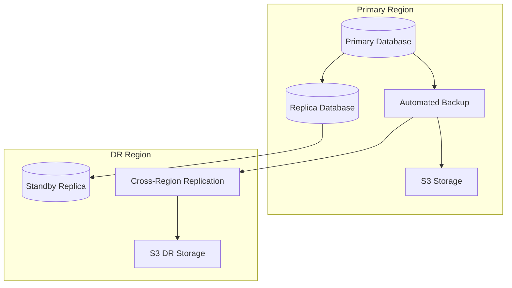

### Database Backup Configuration

```javascript
// MongoDB backup configuration (AWS DocumentDB example)
{
  "BackupDescription": {
    "BackupType": "AUTOMATED",
    "PointInTimeRecoveryEnabled": true,
    "BackupRetentionPeriod": 30,
    "PreferredBackupWindow": "00:00-02:00",
    "PreferredMaintenanceWindow": "sun:03:00-sun:05:00"
  },
  "SnapshotConfiguration": {
    "AutomatedSnapshotStartHour": 0,
    "ManualSnapshotRetentionPeriod": 90
  },
  "ReplicaConfiguration": {
    "ReplicaMode": "REPLICA_SET",
    "ReplicaRegions": [
      {
        "RegionName": "us-west-2",
        "KmsKeyId": "arn:aws:kms:us-west-2:111122223333:key/1234abcd-12ab-34cd-56ef-1234567890ab",
        "ReadCapacity": 5
      }
    ]
  }
}
```

### Disaster Recovery Plan

1. **Regular Backups**: Daily automated backups with 30-day retention
2. **Cross-Region Replication**: Data replicated to standby region
3. **Failover Testing**: Monthly scheduled failover tests
4. **Recovery Time Objective (RTO)**: < 1 hour
5. **Recovery Point Objective (RPO)**: < 5 minutes
6. **Runbooks**: Documented procedures for different failure scenarios

```yaml
# Kubernetes Pod Disruption Budget for high availability
apiVersion: policy/v1
kind: PodDisruptionBudget
metadata:
  name: api-pdb
  namespace: api
spec:
  minAvailable: 2
  selector:
    matchLabels:
      app: api
```

## Cost Optimization

### Cost Optimization Strategies

1. **Auto-scaling**: Scale resources up and down based on demand
2. **Spot Instances**: Use spot instances for non-critical workloads
3. **Reserved Instances**: Purchase reserved instances for baseline capacity
4. **Resource Right-sizing**: Continuously monitor and adjust resource allocations
5. **Caching**: Implement caching to reduce database load
6. **CDN**: Use CDN for static content delivery
7. **Data Lifecycle Management**: Implement policies for data retention and archival

### Resource Requirements

| Component        | Minimum Specs     | Recommended Specs | High Traffic Specs |
|------------------|-------------------|-------------------|-------------------|
| Web Server       | 1 CPU, 1GB RAM    | 2 CPU, 2GB RAM    | 4 CPU, 4GB RAM    |
| API Server       | 1 CPU, 2GB RAM    | 2 CPU, 4GB RAM    | 4 CPU, 8GB RAM    |
| WebSocket Server | 1 CPU, 2GB RAM    | 2 CPU, 4GB RAM    | 4 CPU, 8GB RAM    |
| AI Worker        | 2 CPU, 4GB RAM    | 4 CPU, 8GB RAM    | 8 CPU, 16GB RAM   |
| MongoDB          | 2 CPU, 4GB RAM    | 4 CPU, 8GB RAM    | 8 CPU, 16GB RAM   |
| Redis            | 1 CPU, 2GB RAM    | 2 CPU, 4GB RAM    | 4 CPU, 8GB RAM    |

## Security Considerations

### Infrastructure Security

1. **VPC Configuration**: All resources deployed in private subnets
2. **Network ACLs**: Strict network access control lists
3. **Security Groups**: Fine-grained security group rules
4. **WAF**: Web Application Firewall for protecting against common vulnerabilities
5. **DDoS Protection**: DDoS mitigation services
6. **TLS**: All communication encrypted with TLS 1.2+

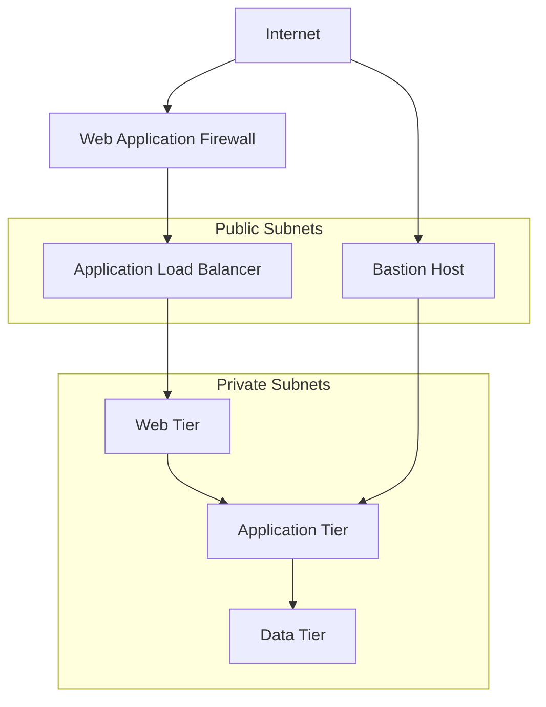

## Domain Name and SSL Configuration

```yaml
# Kubernetes Ingress configuration with TLS
apiVersion: networking.k8s.io/v1
kind: Ingress
metadata:
  name: promptdesigner-ingress
  annotations:
    kubernetes.io/ingress.class: "nginx"
    cert-manager.io/cluster-issuer: "letsencrypt-prod"
    nginx.ingress.kubernetes.io/ssl-redirect: "true"
    nginx.ingress.kubernetes.io/proxy-body-size: "10m"
spec:
  tls:
  - hosts:
    - api.promptdesigner.example.com
    - app.promptdesigner.example.com
    secretName: promptdesigner-tls
  rules:
  - host: app.promptdesigner.example.com
    http:
      paths:
      - path: /
        pathType: Prefix
        backend:
          service:
            name: web-service
            port:
              number: 80
  - host: api.promptdesigner.example.com
    http:
      paths:
      - path: /api
        pathType: Prefix
        backend:
          service:
            name: api-service
            port:
              number: 80
      - path: /ws
        pathType: Prefix
        backend:
          service:
            name: websocket-service
            port:
              number: 80
```

## Conclusion

This deployment and scalability strategy provides a comprehensive approach to deploying, scaling, and maintaining the Sketchy Chain application. By leveraging containerization, Kubernetes orchestration, and cloud-native services, the application can scale seamlessly to handle growing user demands while ensuring high availability and performance.

Key aspects of the strategy include:

1. **Containerized Architecture**: Microservices architecture with Docker containers
2. **Kubernetes Orchestration**: Automated deployment, scaling, and management
3. **Real-time Communication**: Scalable WebSocket implementation with Socket.IO and Redis
4. **Database Scalability**: MongoDB sharding and Redis clustering
5. **Performance Optimization**: Multi-layered caching and query optimization
6. **Monitoring and Alerting**: Comprehensive monitoring with Prometheus and ELK stack
7. **High Availability**: Multiple availability zones and disaster recovery planning
8. **Security**: Network isolation, encryption, and web application firewall
9. **Cost Optimization**: Auto-scaling and resource right-sizing

This strategy enables the application to start small and grow as needed, with the flexibility to scale individual components based on specific requirements and usage patterns.