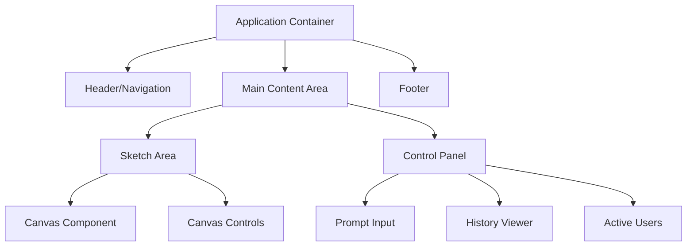
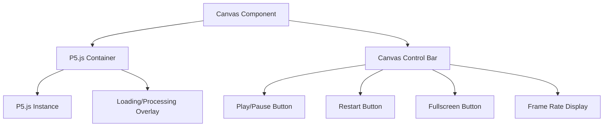
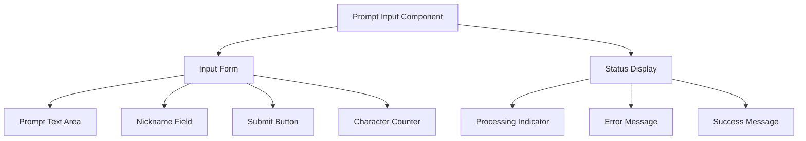
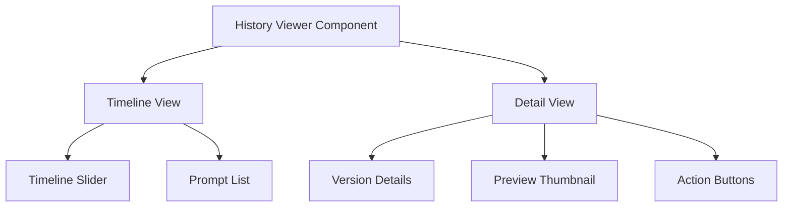
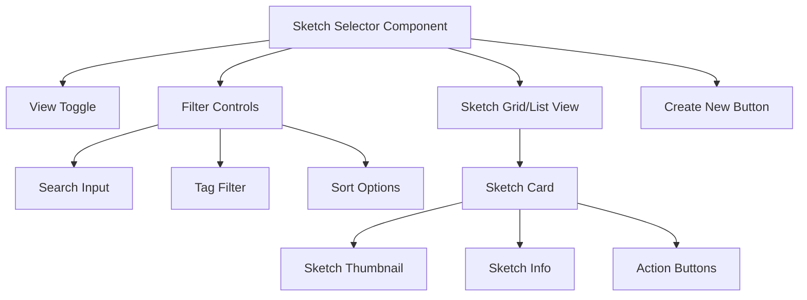

# Frontend Components and UI Design

This document outlines the frontend components and user interface design for the Sketchy Chain application, focusing on providing an intuitive and responsive experience for users collaborating on P5.js sketches.

## Application Layout

The application follows a responsive layout that adapts to different screen sizes while maintaining focus on the P5.js canvas as the primary element.



### Responsive Breakpoints

- **Mobile** (<768px): Stacked layout with canvas at top, controls below
- **Tablet** (768px-1199px): Canvas takes 70% of width, controls panel at 30%
- **Desktop** (≥1200px): Canvas takes 75% of width, controls panel at 25%

## Core Components

### 1. Canvas Component

The Canvas Component is the central element of the application, responsible for displaying the P5.js sketch.

#### Features

- Dynamically creates and manages the P5.js instance
- Isolates drawing code from application code
- Supports responsive resizing while maintaining aspect ratio
- Provides basic canvas controls (play/pause, restart, fullscreen)
- Displays loading/processing states when sketch is updating



#### Visual Design

- Canvas background: Light gray (#f0f0f0) by default
- Canvas border: Subtle shadow for depth
- Canvas controls: Minimal, semi-transparent overlay at bottom of canvas
- Loading overlay: Semi-transparent with animated indicator

#### Accessibility Considerations

- Keyboard shortcuts for canvas controls (spacebar for play/pause, etc.)
- ARIA labels for all control buttons
- High contrast mode support
- Screen reader descriptions of current sketch state

#### Code Structure

```jsx
// Canvas.jsx (React Component)
const Canvas = ({ sketchId, code, isProcessing }) => {
  const canvasRef = useRef(null);
  const p5Instance = useRef(null);
  
  // Initialize P5.js instance when component mounts or code changes
  useEffect(() => {
    if (canvasRef.current && code) {
      // Clean up previous instance if it exists
      if (p5Instance.current) {
        p5Instance.current.remove();
      }
      
      // Create new P5.js instance with the provided code
      const sketch = (p) => {
        // Inject the processed code into the sketch
        const userSetup = new Function('p', `return function() { ${extractSetupCode(code)} }`)(p);
        const userDraw = new Function('p', `return function() { ${extractDrawCode(code)} }`)(p);
        
        p.setup = () => {
          userSetup();
        };
        
        p.draw = () => {
          userDraw();
        };
      };
      
      p5Instance.current = new p5(sketch, canvasRef.current);
    }
    
    return () => {
      if (p5Instance.current) {
        p5Instance.current.remove();
      }
    };
  }, [code]);
  
  return (
    <div className="canvas-wrapper">
      <div ref={canvasRef} className="p5-container" />
      
      {isProcessing && (
        <div className="processing-overlay">
          <div className="spinner" />
          <span>Processing your prompt...</span>
        </div>
      )}
      
      <div className="canvas-controls">
        <button aria-label="Play/Pause Sketch">
          <PlayIcon />
        </button>
        <button aria-label="Restart Sketch">
          <RestartIcon />
        </button>
        <button aria-label="View Fullscreen">
          <FullscreenIcon />
        </button>
        <div className="frame-rate">60 FPS</div>
      </div>
    </div>
  );
};
```

### 2. Prompt Input Component

The Prompt Input Component allows users to enter text prompts that will be processed by the AI to update the sketch.

#### Features

- Clean, focused text input area
- Character counter with limit indicator
- Submit button with loading state
- Error message display for rejected prompts
- Placeholder text with prompt suggestions
- Optional nickname input for anonymous users
- Recent prompts history for quick reuse



#### Visual Design

- Input area: Clean white background with subtle border
- Submit button: Prominent color (brand primary)
- Character counter: Small, unobtrusive, turns warning color near limit
- Processing indicator: Subtle animation showing progress
- Error messages: Red text with appropriate icon
- Success messages: Green text with checkmark icon

#### Interactions

1. User enters prompt text in the input area
2. Character counter updates in real-time
3. User can optionally enter/update their nickname
4. Submit button activates once minimum character requirement is met
5. On submit, input area shows processing state
6. Status changes to success or error based on result
7. On success, input clears and is ready for next prompt
8. On error, input remains with error message for correction

#### Code Structure

```jsx
// PromptInput.jsx (React Component)
const PromptInput = ({ sketchId, onPromptSubmit }) => {
  const [prompt, setPrompt] = useState('');
  const [nickname, setNickname] = useState(localStorage.getItem('user_nickname') || '');
  const [status, setStatus] = useState('idle'); // 'idle', 'submitting', 'success', 'error'
  const [error, setError] = useState(null);
  
  const characterLimit = 500;
  const characterCount = prompt.length;
  const isOverLimit = characterCount > characterLimit;
  const isSubmitDisabled = prompt.length < 3 || isOverLimit || status === 'submitting';
  
  const handleSubmit = async (e) => {
    e.preventDefault();
    
    if (isSubmitDisabled) return;
    
    setStatus('submitting');
    setError(null);
    
    try {
      // Save nickname to local storage
      if (nickname) {
        localStorage.setItem('user_nickname', nickname);
      }
      
      // Submit prompt to API
      await onPromptSubmit({
        text: prompt,
        nickname: nickname || undefined
      });
      
      setStatus('success');
      setPrompt('');
      
      // Reset status after a delay
      setTimeout(() => {
        setStatus('idle');
      }, 3000);
    } catch (err) {
      setStatus('error');
      setError(err.message || 'Failed to submit prompt');
    }
  };
  
  return (
    <div className="prompt-input-container">
      <form onSubmit={handleSubmit}>
        <div className="input-header">
          <label htmlFor="prompt-text">Prompt the AI to modify the sketch</label>
          <div className="character-counter">
            <span className={isOverLimit ? 'over-limit' : ''}>
              {characterCount}/{characterLimit}
            </span>
          </div>
        </div>
        
        <textarea
          id="prompt-text"
          value={prompt}
          onChange={(e) => setPrompt(e.target.value)}
          placeholder="Example: Add a blue circle that follows the mouse"
          disabled={status === 'submitting'}
          aria-describedby="prompt-error prompt-status"
        />
        
        <div className="nickname-field">
          <label htmlFor="nickname">Your nickname (optional)</label>
          <input
            id="nickname"
            type="text"
            value={nickname}
            onChange={(e) => setNickname(e.target.value)}
            placeholder="Anonymous"
            maxLength={30}
            disabled={status === 'submitting'}
          />
        </div>
        
        <button
          type="submit"
          disabled={isSubmitDisabled}
          className={`submit-button ${status}`}
        >
          {status === 'submitting' ? 'Processing...' : 'Submit Prompt'}
        </button>
      </form>
      
      {status === 'error' && (
        <div id="prompt-error" className="error-message">
          <ErrorIcon /> {error}
        </div>
      )}
      
      {status === 'success' && (
        <div id="prompt-status" className="success-message">
          <CheckIcon /> Prompt submitted successfully!
        </div>
      )}
      
      <div className="prompt-guidelines">
        <h4>Guidelines</h4>
        <ul>
          <li>Be specific about what you want to change or add</li>
          <li>Avoid requests that might replace the entire sketch</li>
          <li>Keep it appropriate (no rude or harmful content)</li>
        </ul>
      </div>
    </div>
  );
};
```

### 3. History Viewer Component

The History Viewer Component displays the timeline of prompts and allows users to navigate through the sketch's history.

#### Features

- Chronological list of all prompts
- Thumbnail previews of sketch states
- Timeline navigation slider
- Ability to view any historical state
- Details about each prompt (contributor, timestamp)
- Option to revert to a previous version



#### Visual Design

- Timeline: Vertical scrollable list with visual markers
- Current version: Highlighted with distinct styling
- Thumbnails: Small preview images of each sketch state
- Detail panel: Expands when a history item is selected
- Revert button: Clearly marked but requires confirmation

#### Interactions

1. User scrolls through timeline of prompts
2. Hovering over a prompt shows a tooltip with the prompt text
3. Clicking a prompt selects it and shows details
4. Preview thumbnail shows the sketch state at that point
5. User can click "View" to temporarily display this historical state
6. User can click "Revert" to restore the sketch to this state (with confirmation)
7. Timeline slider allows quick navigation through long histories

#### Code Structure

```jsx
// HistoryViewer.jsx (React Component)
const HistoryViewer = ({ sketchId, currentVersion, onViewVersion, onRevertToVersion }) => {
  const [versions, setVersions] = useState([]);
  const [selectedVersion, setSelectedVersion] = useState(null);
  const [isLoading, setIsLoading] = useState(true);
  const [showConfirmRevert, setShowConfirmRevert] = useState(false);
  
  useEffect(() => {
    // Load version history when component mounts
    const fetchVersions = async () => {
      setIsLoading(true);
      try {
        const response = await fetch(`/api/v1/sketches/${sketchId}/versions`);
        const data = await response.json();
        setVersions(data.versions);
        
        // Select current version by default
        const current = data.versions.find(v => v.sequence === currentVersion);
        if (current) {
          setSelectedVersion(current);
        }
      } catch (error) {
        console.error('Failed to load version history:', error);
      } finally {
        setIsLoading(false);
      }
    };
    
    fetchVersions();
  }, [sketchId, currentVersion]);
  
  const handleVersionSelect = (version) => {
    setSelectedVersion(version);
    setShowConfirmRevert(false);
  };
  
  const handleViewVersion = () => {
    if (selectedVersion) {
      onViewVersion(selectedVersion.sequence);
    }
  };
  
  const handleRevertConfirm = () => {
    setShowConfirmRevert(true);
  };
  
  const handleRevert = () => {
    if (selectedVersion) {
      onRevertToVersion(selectedVersion.sequence);
      setShowConfirmRevert(false);
    }
  };
  
  const handleCancelRevert = () => {
    setShowConfirmRevert(false);
  };
  
  // Format timestamp for display
  const formatTime = (timestamp) => {
    return new Date(timestamp).toLocaleTimeString();
  };
  
  if (isLoading) {
    return <div className="history-loading">Loading version history...</div>;
  }
  
  return (
    <div className="history-viewer">
      <h3>Version History</h3>
      
      <div className="history-timeline">
        {versions.map((version) => (
          <div 
            key={version.sequence}
            className={`history-item ${selectedVersion?.sequence === version.sequence ? 'selected' : ''} ${currentVersion === version.sequence ? 'current' : ''}`}
            onClick={() => handleVersionSelect(version)}
          >
            <div className="version-marker" />
            <div className="version-info">
              <div className="version-number">Version {version.sequence}</div>
              <div className="version-time">{formatTime(version.timestamp)}</div>
              <div className="version-contributor">{version.contributor.nickname || 'Anonymous'}</div>
              <div className="version-prompt" title={version.promptText}>
                {version.promptText.length > 40 ? `${version.promptText.substring(0, 40)}...` : version.promptText}
              </div>
            </div>
          </div>
        ))}
      </div>
      
      {selectedVersion && (
        <div className="version-detail-panel">
          <div className="version-thumbnail">
            
          </div>
          
          <div className="version-details">
            <h4>Version {selectedVersion.sequence}</h4>
            <p className="version-prompt-text">{selectedVersion.promptText}</p>
            <div className="version-metadata">
              <div>Created by: {selectedVersion.contributor.nickname || 'Anonymous'}</div>
              <div>Time: {new Date(selectedVersion.timestamp).toLocaleString()}</div>
            </div>
            
            <div className="version-actions">
              <button 
                className="view-button"
                onClick={handleViewVersion}
              >
                View This Version
              </button>
              
              {selectedVersion.sequence !== currentVersion && (
                <button 
                  className="revert-button"
                  onClick={handleRevertConfirm}
                >
                  Revert to This Version
                </button>
              )}
            </div>
          </div>
          
          {showConfirmRevert && (
            <div className="confirm-revert-dialog">
              <p>Are you sure you want to revert to Version {selectedVersion.sequence}?</p>
              <p>This will create a new version based on this historical state.</p>
              <div className="dialog-actions">
                <button className="cancel-button" onClick={handleCancelRevert}>Cancel</button>
                <button className="confirm-button" onClick={handleRevert}>Confirm Revert</button>
              </div>
            </div>
          )}
        </div>
      )}
    </div>
  );
};
```

### 4. Sketch Selector Component

The Sketch Selector Component allows users to browse available sketches, create new ones, or join existing collaborations.

#### Features

- Grid or list view of available sketches
- Thumbnail previews of each sketch
- Search and filter functionality
- Create new sketch option
- Activity indicators showing active collaborators
- Quick access to recently viewed sketches
- Basic metadata (title, creation date, contributors)



#### Visual Design

- Grid view: Responsive grid of sketch cards
- List view: Compact list with key information
- Create new button: Prominent, positioned at top
- Sketch cards: Consistent size with thumbnail preview
- Active sketches: Special indicator showing real-time activity
- Empty state: Friendly message and create button when no sketches exist

#### Interactions

1. User can toggle between grid and list views
2. Search field filters sketches in real-time
3. Tag filters allow narrowing results by category
4. Sorting options change the display order
5. Clicking a sketch card navigates to that sketch
6. "Create New" button opens sketch creation form
7. Recent sketches section shows user's recently viewed items
8. Pagination or infinite scroll for large collections

#### Code Structure

```jsx
// SketchSelector.jsx (React Component)
const SketchSelector = ({ onSketchSelect, onCreateNew }) => {
  const [sketches, setSketches] = useState([]);
  const [loading, setLoading] = useState(true);
  const [viewMode, setViewMode] = useState('grid'); // 'grid' or 'list'
  const [searchTerm, setSearchTerm] = useState('');
  const [selectedTags, setSelectedTags] = useState([]);
  const [sortBy, setSortBy] = useState('lastModified'); // 'lastModified', 'created', 'title', 'promptCount'
  const [sortOrder, setSortOrder] = useState('desc'); // 'asc' or 'desc'
  
  useEffect(() => {
    // Fetch available sketches when component mounts or filters change
    const fetchSketches = async () => {
      setLoading(true);
      try {
        // Build query parameters
        const queryParams = new URLSearchParams({
          sort: sortBy,
          order: sortOrder,
        });
        
        if (searchTerm) {
          queryParams.append('search', searchTerm);
        }
        
        if (selectedTags.length > 0) {
          queryParams.append('tags', selectedTags.join(','));
        }
        
        const response = await fetch(`/api/v1/sketches?${queryParams}`);
        const data = await response.json();
        setSketches(data.sketches);
      } catch (error) {
        console.error('Failed to load sketches:', error);
      } finally {
        setLoading(false);
      }
    };
    
    // Debounce the search to avoid too many requests
    const debounceTimeout = setTimeout(fetchSketches, 300);
    
    return () => clearTimeout(debounceTimeout);
  }, [searchTerm, selectedTags, sortBy, sortOrder]);
  
  // Handle tag selection
  const toggleTag = (tag) => {
    setSelectedTags(prev => 
      prev.includes(tag) 
        ? prev.filter(t => t !== tag) 
        : [...prev, tag]
    );
  };
  
  return (
    <div className="sketch-selector">
      <div className="selector-header">
        <h2>Available Sketches</h2>
        <button className="create-new-button" onClick={onCreateNew}>
          <PlusIcon /> Create New Sketch
        </button>
      </div>
      
      <div className="filter-controls">
        <div className="search-input">
          <input
            type="text"
            placeholder="Search sketches..."
            value={searchTerm}
            onChange={(e) => setSearchTerm(e.target.value)}
          />
          <SearchIcon />
        </div>
        
        <div className="view-toggle">
          <button
            className={viewMode === 'grid' ? 'active' : ''}
            onClick={() => setViewMode('grid')}
            aria-label="Grid View"
          >
            <GridIcon />
          </button>
          <button
            className={viewMode === 'list' ? 'active' : ''}
            onClick={() => setViewMode('list')}
            aria-label="List View"
          >
            <ListIcon />
          </button>
        </div>
        
        <div className="sort-controls">
          <label htmlFor="sort-select">Sort by:</label>
          <select
            id="sort-select"
            value={sortBy}
            onChange={(e) => setSortBy(e.target.value)}
          >
            <option value="lastModified">Last Modified</option>
            <option value="created">Date Created</option>
            <option value="title">Title</option>
            <option value="promptCount">Most Prompts</option>
          </select>
          
          <button
            className="sort-order"
            onClick={() => setSortOrder(prev => prev === 'asc' ? 'desc' : 'asc')}
            aria-label={`Sort ${sortOrder === 'asc' ? 'Ascending' : 'Descending'}`}
          >
            {sortOrder === 'asc' ? <SortAscIcon /> : <SortDescIcon />}
          </button>
        </div>
      </div>
      
      <div className="tag-filters">
        {['art', 'interactive', 'animation', 'game', 'visualization'].map(tag => (
          <button
            key={tag}
            className={`tag-button ${selectedTags.includes(tag) ? 'active' : ''}`}
            onClick={() => toggleTag(tag)}
          >
            {tag}
          </button>
        ))}
      </div>
      
      {loading ? (
        <div className="loading-sketches">
          <div className="spinner" />
          <span>Loading sketches...</span>
        </div>
      ) : sketches.length === 0 ? (
        <div className="no-sketches">
          <EmptyStateIcon />
          <h3>No sketches found</h3>
          <p>
            {searchTerm || selectedTags.length > 0
              ? 'Try adjusting your search or filters'
              : 'Create your first sketch to get started'}
          </p>
          {!searchTerm && selectedTags.length === 0 && (
            <button className="create-first-button" onClick={onCreateNew}>
              Create Your First Sketch
            </button>
          )}
        </div>
      ) : (
        <div className={`sketches-${viewMode}`}>
          {sketches.map((sketch) => (
            <div 
              key={sketch.id} 
              className={`sketch-card ${viewMode}`}
              onClick={() => onSketchSelect(sketch.id)}
            >
              <div className="sketch-thumbnail">
                
                {sketch.statistics.contributorCount > 0 && (
                  <div className="active-indicator">
                    <UserIcon /> {sketch.statistics.contributorCount}
                  </div>
                )}
              </div>
              
              <div className="sketch-info">
                <h3 className="sketch-title">{sketch.title}</h3>
                {viewMode === 'grid' && (
                  <p className="sketch-description">
                    {sketch.description.length > 100
                      ? `${sketch.description.substring(0, 97)}...`
                      : sketch.description}
                  </p>
                )}
                
                <div className="sketch-meta">
                  <div className="sketch-prompts">
                    <PromptIcon /> {sketch.statistics.promptCount} prompts
                  </div>
                  <div className="sketch-last-modified">
                    <ClockIcon /> {new Date(sketch.lastModified).toLocaleDateString()}
                  </div>
                </div>
                
                <div className="sketch-tags">
                  {sketch.tags.map(tag => (
                    <span key={tag} className="tag">{tag}</span>
                  ))}
                </div>
              </div>
            </div>
          ))}
        </div>
      )}
    </div>
  );
};
```

### 5. Active Users Component

The Active Users Component displays the list of users currently viewing or interacting with the sketch.

#### Features

- List of active users with their nicknames
- Indicator for users currently typing/submitting prompts
- Subtle animations for user actions
- Tooltips showing user session details
- Anonymous user support

```jsx
// ActiveUsers.jsx (React Component)
const ActiveUsers = ({ sketchId }) => {
  const [activeUsers, setActiveUsers] = useState([]);
  
  useEffect(() => {
    // Subscribe to user presence updates via WebSocket
    const socket = getWebSocketConnection();
    
    socket.on('presence:update', (data) => {
      if (data.sketchId === sketchId) {
        setActiveUsers(data.activeUsers);
      }
    });
    
    // Initial fetch of active users
    fetch(`/api/v1/sketches/${sketchId}/users`)
      .then(res => res.json())
      .then(data => setActiveUsers(data.users))
      .catch(err => console.error('Failed to fetch active users:', err));
    
    return () => {
      socket.off('presence:update');
    };
  }, [sketchId]);
  
  return (
    <div className="active-users-panel">
      <h4>
        <UsersIcon /> Active Contributors ({activeUsers.length})
      </h4>
      
      <ul className="user-list">
        {activeUsers.map(user => (
          <li 
            key={user.sessionId}
            className={`user-item ${user.isTyping ? 'typing' : ''}`}
          >
            <div className="user-avatar">
              {user.nickname.charAt(0).toUpperCase()}
            </div>
            <div className="user-name">
              {user.nickname || 'Anonymous'}
              {user.isTyping && <span className="typing-indicator">typing...</span>}
            </div>
          </li>
        ))}
      </ul>
    </div>
  );
};
```

## Additional Components

### 1. Create Sketch Form

```jsx
// CreateSketchForm.jsx (React Component)
const CreateSketchForm = ({ onSubmit, onCancel }) => {
  const [title, setTitle] = useState('');
  const [description, setDescription] = useState('');
  const [canvasWidth, setCanvasWidth] = useState(800);
  const [canvasHeight, setCanvasHeight] = useState(600);
  const [selectedTemplate, setSelectedTemplate] = useState('blank');
  const [tags, setTags] = useState([]);
  const [customTag, setCustomTag] = useState('');
  const [isSubmitting, setIsSubmitting] = useState(false);
  
  // Predefined templates
  const templates = {
    blank: `function setup() {\n  createCanvas(800, 600);\n}\n\nfunction draw() {\n  background(220);\n}`,
    animation: `function setup() {\n  createCanvas(800, 600);\n  angleMode(DEGREES);\n}\n\nfunction draw() {\n  background(220);\n  translate(width/2, height/2);\n  rotate(frameCount);\n  rectMode(CENTER);\n  rect(0, 0, 100, 100);\n}`,
    interactive: `function setup() {\n  createCanvas(800, 600);\n}\n\nfunction draw() {\n  background(220);\n  if (mouseIsPressed) {\n    fill(0);\n  } else {\n    fill(255);\n  }\n  ellipse(mouseX, mouseY, 80, 80);\n}`
  };
  
  const handleSubmit = async (e) => {
    e.preventDefault();
    setIsSubmitting(true);
    
    try {
      await onSubmit({
        title,
        description,
        settings: {
          canvasWidth,
          canvasHeight,
          frameRate: 60,
          isPublic: true,
          allowAnonymous: true
        },
        baseTemplate: templates[selectedTemplate],
        tags
      });
    } catch (error) {
      console.error('Failed to create sketch:', error);
      setIsSubmitting(false);
    }
  };
  
  const handleAddTag = () => {
    if (customTag && !tags.includes(customTag) && tags.length < 5) {
      setTags([...tags, customTag]);
      setCustomTag('');
    }
  };
  
  const handleRemoveTag = (tag) => {
    setTags(tags.filter(t => t !== tag));
  };
  
  return (
    <div className="create-sketch-form">
      <h2>Create New Sketch</h2>
      
      <form onSubmit={handleSubmit}>
        <div className="form-group">
          <label htmlFor="title">Title</label>
          <input
            id="title"
            type="text"
            value={title}
            onChange={(e) => setTitle(e.target.value)}
            placeholder="My Amazing Sketch"
            required
            maxLength={100}
          />
        </div>
        
        <div className="form-group">
          <label htmlFor="description">Description</label>
          <textarea
            id="description"
            value={description}
            onChange={(e) => setDescription(e.target.value)}
            placeholder="Describe your sketch..."
            rows={3}
            maxLength={500}
          />
        </div>
        
        <div className="form-row">
          <div className="form-group">
            <label htmlFor="canvasWidth">Canvas Width</label>
            <input
              id="canvasWidth"
              type="number"
              value={canvasWidth}
              onChange={(e) => setCanvasWidth(parseInt(e.target.value))}
              min={100}
              max={2000}
              required
            />
          </div>
          
          <div className="form-group">
            <label htmlFor="canvasHeight">Canvas Height</label>
            <input
              id="canvasHeight"
              type="number"
              value={canvasHeight}
              onChange={(e) => setCanvasHeight(parseInt(e.target.value))}
              min={100}
              max={2000}
              required
            />
          </div>
        </div>
        
        <div className="form-group">
          <label>Starting Template</label>
          <div className="template-options">
            <div 
              className={`template-card ${selectedTemplate === 'blank' ? 'selected' : ''}`}
              onClick={() => setSelectedTemplate('blank')}
            >
              <div className="template-preview blank-preview" />
              <div className="template-name">Blank Canvas</div>
            </div>
            
            <div 
              className={`template-card ${selectedTemplate === 'animation' ? 'selected' : ''}`}
              onClick={() => setSelectedTemplate('animation')}
            >
              <div className="template-preview animation-preview" />
              <div className="template-name">Basic Animation</div>
            </div>
            
            <div 
              className={`template-card ${selectedTemplate === 'interactive' ? 'selected' : ''}`}
              onClick={() => setSelectedTemplate('interactive')}
            >
              <div className="template-preview interactive-preview" />
              <div className="template-name">Interactive</div>
            </div>
          </div>
        </div>
        
        <div className="form-group">
          <label>Tags (up to 5)</label>
          <div className="tags-input">
            <input
              type="text"
              value={customTag}
              onChange={(e) => setCustomTag(e.target.value)}
              placeholder="Add a tag"
              maxLength={20}
              disabled={tags.length >= 5}
            />
            <button 
              type="button" 
              onClick={handleAddTag}
              disabled={!customTag || tags.length >= 5}
            >
              Add
            </button>
          </div>
          
          <div className="tags-list">
            {tags.map(tag => (
              <span key={tag} className="tag-item">
                {tag}
                <button 
                  type="button" 
                  className="remove-tag"
                  onClick={() => handleRemoveTag(tag)}
                >
                  ×
                </button>
              </span>
            ))}
            
            {tags.length === 0 && (
              <span className="no-tags">No tags added yet</span>
            )}
          </div>
        </div>
        
        <div className="form-actions">
          <button 
            type="button" 
            className="cancel-button"
            onClick={onCancel}
            disabled={isSubmitting}
          >
            Cancel
          </button>
          
          <button 
            type="submit" 
            className="create-button"
            disabled={!title || isSubmitting}
          >
            {isSubmitting ? 'Creating...' : 'Create Sketch'}
          </button>
        </div>
      </form>
    </div>
  );
};
```

### 2. Navigation Header Component

```jsx
// Header.jsx (React Component)
const Header = ({ onNavigateHome, onViewGallery, onToggleHelp, activePage }) => {
  return (
    <header className="app-header">
      <div className="logo" onClick={onNavigateHome}>
        <LogoIcon />
        <span className="app-name">Sketchy Chain</span>
      </div>
      
      <nav className="main-nav">
        <ul>
          <li className={activePage === 'gallery' ? 'active' : ''}>
            <button onClick={onViewGallery}>
              <GalleryIcon />
              Gallery
            </button>
          </li>
          <li className={activePage === 'docs' ? 'active' : ''}>
            <a href="/docs" target="_blank">
              <DocsIcon />
              Documentation
            </a>
          </li>
          <li>
            <button onClick={onToggleHelp}>
              <HelpIcon />
              Help
            </button>
          </li>
        </ul>
      </nav>
    </header>
  );
};
```

## Accessibility Features

The application is designed with accessibility in mind, implementing the following features:

1. **Keyboard Navigation**
   - All interactive elements are focusable and operable via keyboard
   - Logical tab order for all components
   - Keyboard shortcuts for common actions (with key bindings displayed)

2. **Screen Reader Support**
   - ARIA labels and roles for all components
   - Meaningful alt text for images and icons
   - Status announcements for dynamic content changes
   - Live regions for prompt status updates

3. **Visual Accessibility**
   - High contrast mode support
   - Resizable text (respects browser settings)
   - No reliance on color alone for conveying information
   - Sufficient contrast ratios for all text

4. **Cognitive Accessibility**
   - Clear, consistent interface patterns
   - Simple, direct language in instructions and errors
   - Progress indicators for all operations
   - Confirmations for destructive actions

## Responsive Design Considerations

The application adapts to different screen sizes through several layout strategies:

### Mobile View (<768px)

- Stacked layout with collapsible sections
- Canvas takes full width
- Controls appear below canvas
- Simplified history view
- Bottom navigation for main actions

### Tablet View (768px-1199px)

- Split view with canvas taking 70% width
- Controls panel in right sidebar
- Tabs for switching between controls, history, and active users
- Responsive canvas size that maintains aspect ratio

### Desktop View (≥1200px)

- Full layout with canvas taking 75% width
- Controls panel in right sidebar with all sections visible
- Expanded history view with thumbnails
- Additional keyboard shortcuts displayed

## Performance Optimization

To ensure smooth performance, especially with complex sketches:

1. **Canvas Optimization**
   - Proper cleanup of P5.js instances when unmounting
   - Optional frame rate limiting for resource-intensive sketches
   - Throttling of real-time updates when many users are active

2. **State Management**
   - Efficient rendering with React's virtual DOM
   - Memoization of expensive computations
   - Pagination of history data to limit initial load

3. **Asset Loading**
   - Lazy loading for components not immediately visible
   - Efficient thumbnail generation and caching
   - Progressive loading of sketch history

## Theming and Customization

The application supports theming through CSS variables, with default light and dark themes:

```css
:root {
  /* Light Theme (Default) */
  --primary-color: #4a7cff;
  --secondary-color: #6c5ce7;
  --background-color: #ffffff;
  --surface-color: #f8f9fa;
  --text-color: #333333;
  --text-secondary: #666666;
  --border-color: #e0e0e0;
  --error-color: #e74c3c;
  --success-color: #2ecc71;
  --warning-color: #f39c12;
  
  /* Spacing and Sizing */
  --spacing-xs: 4px;
  --spacing-sm: 8px;
  --spacing-md: 16px;
  --spacing-lg: 24px;
  --spacing-xl: 32px;
  
  --border-radius-sm: 4px;
  --border-radius-md: 8px;
  --border-radius-lg: 12px;
  
  /* Typography */
  --font-family: 'Inter', -apple-system, BlinkMacSystemFont, 'Segoe UI', Roboto, Oxygen,
    Ubuntu, Cantarell, 'Open Sans', 'Helvetica Neue', sans-serif;
  --code-font-family: 'Fira Code', 'Cascadia Code', Consolas, monospace;
}

[data-theme="dark"] {
  --primary-color: #7c9fff;
  --secondary-color: #9c8cff;
  --background-color: #121212;
  --surface-color: #222222;
  --text-color: #e0e0e0;
  --text-secondary: #a0a0a0;
  --border-color: #444444;
  --error-color: #ff6b6b;
  --success-color: #5ced73;
  --warning-color: #ffc048;
}