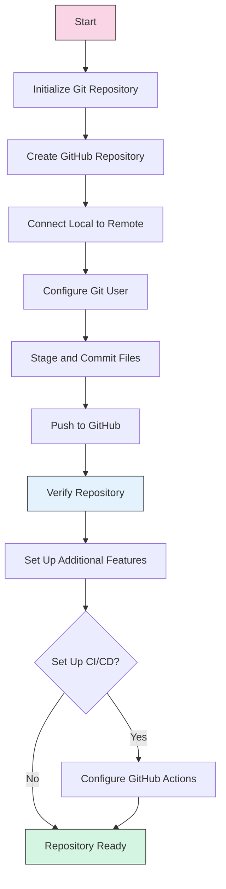

# GitHub Integration Guide for SketchyChain

This document serves as an index to the various GitHub integration resources created for the SketchyChain project.

## Step-by-Step Guides

1. **[GitHub Setup Guide](github-setup-guide.md)**  
   Detailed instructions for initializing git, creating your GitHub repository, and pushing your code.

2. **[GitHub Setup Script](github-setup-script.md)**  
   An automated shell script to streamline the repository initialization process.

3. **[GitHub Actions CI/CD Setup](github-actions-setup.md)**  
   Configuration files and instructions for setting up continuous integration and deployment with GitHub Actions.

## Best Practices & Reference Materials

1. **[GitHub Workflow Practices](github-workflow-practices.md)**  
   Recommended practices for branching strategies, commit messages, pull requests, and repository maintenance.

2. **[GitHub Workflow Diagram](github-workflow-diagram.md)**  
   Visual representations of the recommended Git workflow using Mermaid diagrams.

## Setup Process Overview

## Implementation Checklist

1. ✓ Documentation Preparation
   - ✓ Setup guide created
   - ✓ Workflow practices documented
   - ✓ Workflow diagrams created
   - ✓ Setup script prepared
   - ✓ CI/CD workflows documented

2. □ Repository Creation
   - □ Initialize git locally
   - □ Create GitHub repository
   - □ Connect local to remote
   - □ Configure git user info (if needed)

3. □ Initial Code Push
   - □ Stage files (respecting .gitignore)
   - □ Create initial commit
   - □ Push to GitHub
   - □ Verify upload

4. □ Repository Configuration
   - □ Set description and topics
   - □ Configure branch protection
   - □ Set up additional settings

5. □ CI/CD Setup (Optional)
   - □ Create .github/workflows directory
   - □ Add workflow YAML files
   - □ Configure secrets
   - □ Test workflows

## Next Steps After GitHub Integration

Once your repository is set up, consider:

1. **Collaborative Development**
   - Invite team members
   - Set up issue templates
   - Create project boards

2. **Deployment Pipeline**
   - Connect to hosting services
   - Set up environment secrets
   - Configure deployment workflows

3. **Documentation Hosting**
   - Set up GitHub Pages
   - Configure automated documentation generation

## Recommended GitHub Repository Settings

| Setting | Recommendation |
|---------|----------------|
| Default Branch | `main` |
| Branch Protection | Require pull requests before merging |
| Topics | ai, p5js, collaborative-editing, react, nodejs, websockets |
| Merge Button | Enable squash merging |
| Automatically delete head branches | Enabled |

Follow the detailed guides linked above to complete the GitHub integration process for your SketchyChain project.