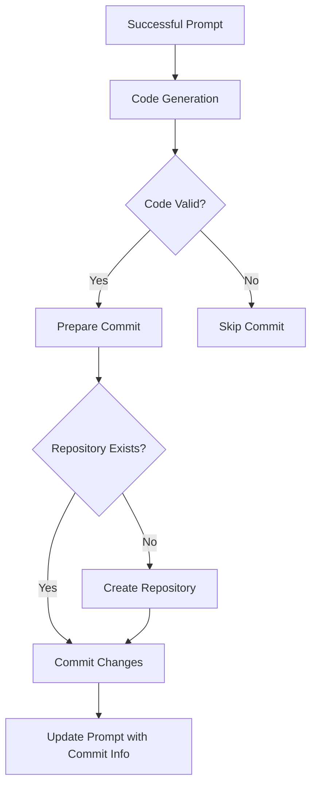
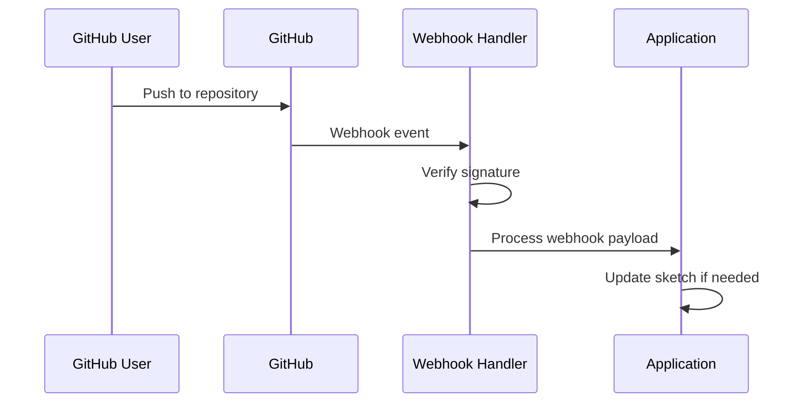
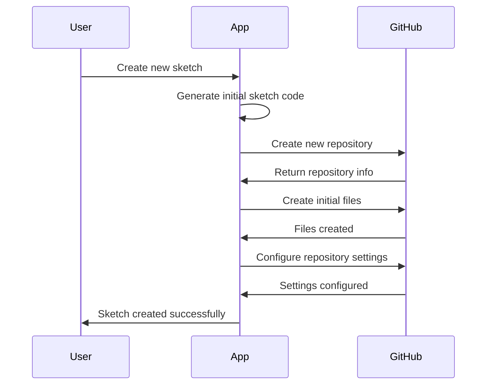
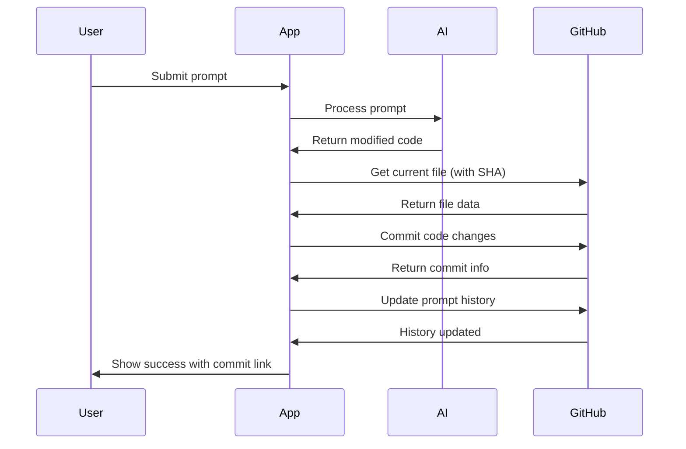
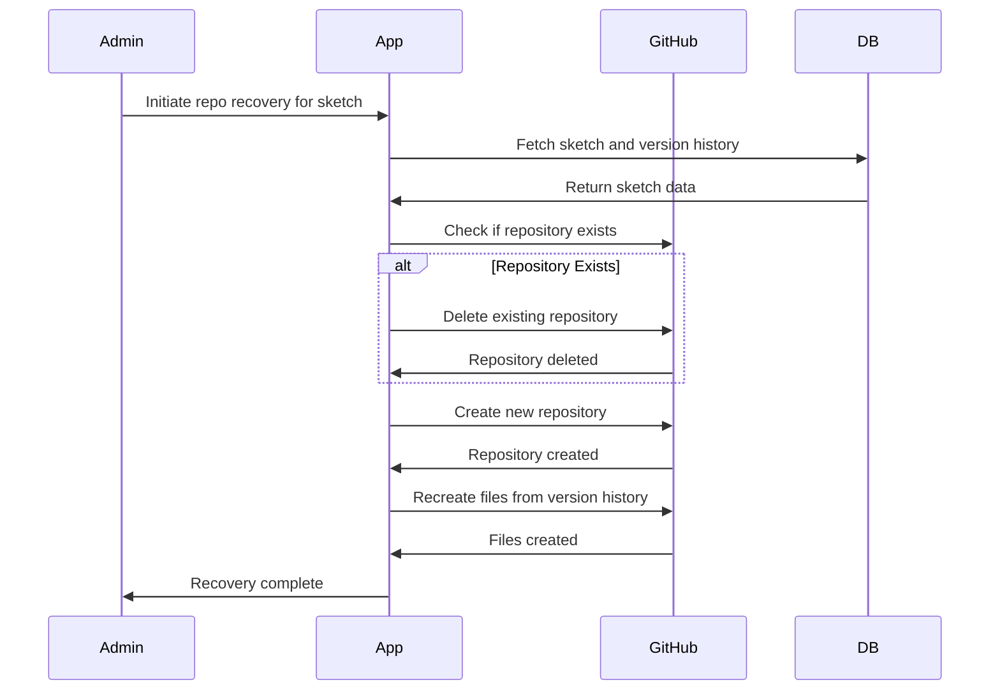

# GitHub Integration Strategy

This document outlines the strategy for integrating the Sketchy Chain application with GitHub for automatic code commits and repository management.

## Overview

The GitHub integration is a key component that enables version control and persistence of P5.js sketches as they evolve through user prompts. The primary goals of this integration are to:

1. Automatically create and manage repositories for sketches
2. Commit code changes whenever a prompt is successfully applied
3. Maintain a clean, searchable commit history
4. Provide traceability between prompts and code changes
5. Enable external collaboration through GitHub's interface



## Authentication and Authorization

### Authentication Approaches

The application supports multiple authentication methods for GitHub integration:

#### 1. Service Account (Primary Method)

For the main application functionality, a dedicated service account with limited permissions is used:

- **Credentials Storage**: Securely stored in environment variables or secrets manager
- **Permissions**: Limited to repository creation and modification within a specific organization
- **Security**: Regular key rotation and audit logging

```javascript
// Service account authentication
const serviceAccountAuth = {
  type: 'token',
  token: process.env.GITHUB_SERVICE_ACCOUNT_TOKEN,
  tokenType: 'oauth'
};

const githubClient = new GitHubClient(serviceAccountAuth);
```

#### 2. User OAuth (Optional Feature)

For advanced features like allowing users to fork sketches to their own GitHub accounts:

- **OAuth Flow**: Standard GitHub OAuth flow with limited scope permissions
- **Token Storage**: Encrypted in database with user association
- **Scope**: Only request minimum required permissions (`repo` for private repos, `public_repo` for public)

```javascript
// OAuth configuration for GitHub
const githubOAuthConfig = {
  clientId: process.env.GITHUB_CLIENT_ID,
  clientSecret: process.env.GITHUB_CLIENT_SECRET,
  redirectUri: `${process.env.APP_URL}/api/v1/auth/github/callback`,
  scope: 'public_repo'
};

// User authentication flow
async function authenticateUserWithGitHub(code) {
  try {
    const tokenResponse = await fetch('https://github.com/login/oauth/access_token', {
      method: 'POST',
      headers: {
        'Content-Type': 'application/json',
        'Accept': 'application/json'
      },
      body: JSON.stringify({
        client_id: githubOAuthConfig.clientId,
        client_secret: githubOAuthConfig.clientSecret,
        code,
        redirect_uri: githubOAuthConfig.redirectUri
      })
    });
    
    const tokenData = await tokenResponse.json();
    
    if (tokenData.error) {
      throw new Error(`GitHub OAuth error: ${tokenData.error}`);
    }
    
    return {
      accessToken: tokenData.access_token,
      tokenType: tokenData.token_type,
      scope: tokenData.scope
    };
  } catch (error) {
    console.error('GitHub authentication error:', error);
    throw error;
  }
}
```

### Authorization Policy

The application implements a clear authorization policy for GitHub operations:

- Service account has full access to all sketch repositories
- Authenticated users can only interact with their own sketch repositories
- Anonymous users' sketches are still committed but they cannot directly access repositories
- Repository visibility follows sketch privacy settings (public/private)

## Repository Management

### Repository Structure

Each sketch gets its own dedicated repository with a consistent structure:

```
sketch-{sketchId}/
├── README.md                 # Auto-generated README with sketch info
├── sketch.js                 # The main P5.js sketch code
├── index.html                # HTML wrapper to view the sketch
├── assets/                   # Static assets (if any)
└── history/                  # JSON files tracking prompt history
    └── prompts.json          # Record of all prompts applied to this sketch
```

### Repository Creation

Repositories are created when a sketch is first created or when the first prompt is applied:

```javascript
async function createSketchRepository(sketch) {
  try {
    // Determine organization/owner to use
    const owner = process.env.GITHUB_ORGANIZATION || process.env.GITHUB_USERNAME;
    
    // Generate repository name
    const repoName = `sketch-${sketch._id}`;
    
    // Create repository
    const repo = await githubClient.repos.createInOrg({
      org: owner,
      name: repoName,
      description: sketch.description || 'P5.js sketch created with Sketchy Chain',
      private: !sketch.settings.isPublic,
      auto_init: true,
      license_template: 'mit'
    });
    
    // Create initial files
    await Promise.all([
      createReadme(owner, repoName, sketch),
      createSketchFile(owner, repoName, sketch),
      createHtmlWrapper(owner, repoName, sketch),
      createPromptHistory(owner, repoName, sketch)
    ]);
    
    // Update sketch with repository information
    await updateSketchWithRepoInfo(sketch._id, {
      owner,
      name: repoName,
      branch: 'main',
      path: 'sketch.js'
    });
    
    return {
      owner,
      name: repoName,
      url: repo.data.html_url
    };
  } catch (error) {
    console.error('Repository creation error:', error);
    throw new Error(`Failed to create GitHub repository: ${error.message}`);
  }
}
```

### File Creation Functions

```javascript
async function createReadme(owner, repoName, sketch) {
  const content = `# ${sketch.title || 'Untitled Sketch'}

A P5.js sketch created with Sketchy Chain.

${sketch.description || ''}

## How to Run

Open index.html in a web browser to view this sketch.

## License

This project is licensed under the MIT License - see the LICENSE file for details.
`;

  return githubClient.repos.createOrUpdateFileContents({
    owner,
    repo: repoName,
    path: 'README.md',
    message: 'Initial commit: Create README',
    content: Buffer.from(content).toString('base64')
  });
}

async function createSketchFile(owner, repoName, sketch) {
  return githubClient.repos.createOrUpdateFileContents({
    owner,
    repo: repoName,
    path: 'sketch.js',
    message: 'Initial commit: Create sketch',
    content: Buffer.from(sketch.currentCode || DEFAULT_SKETCH_TEMPLATE).toString('base64')
  });
}

async function createHtmlWrapper(owner, repoName, sketch) {
  const content = `<!DOCTYPE html>
<html lang="en">
<head>
  <meta charset="UTF-8">
  <meta name="viewport" content="width=device-width, initial-scale=1.0">
  <title>${sketch.title || 'P5.js Sketch'}</title>
  <script src="https://cdnjs.cloudflare.com/ajax/libs/p5.js/1.4.0/p5.min.js"></script>
  <style>
    body { margin: 0; padding: 0; overflow: hidden; }
  </style>
</head>
<body>
  <script src="sketch.js"></script>
</body>
</html>`;

  return githubClient.repos.createOrUpdateFileContents({
    owner,
    repo: repoName,
    path: 'index.html',
    message: 'Initial commit: Create HTML wrapper',
    content: Buffer.from(content).toString('base64')
  });
}

async function createPromptHistory(owner, repoName, sketch) {
  const content = JSON.stringify({
    sketchId: sketch._id.toString(),
    title: sketch.title,
    prompts: []
  }, null, 2);

  return githubClient.repos.createOrUpdateFileContents({
    owner,
    repo: repoName,
    path: 'history/prompts.json',
    message: 'Initial commit: Create prompt history',
    content: Buffer.from(content).toString('base64')
  });
}
```

## Commit Strategy

### When to Commit

The application commits code changes to GitHub under these circumstances:

1. When a sketch is first created
2. When a prompt is successfully processed and applied
3. When a user reverts to a previous version
4. When a sketch's metadata is updated (title, description, settings)

### Commit Message Format

Commit messages follow a consistent format to maintain clarity and traceability:

```
[Action]: Brief description

Prompt: "The exact prompt text"
Contributor: Username or Anonymous (IP hash)
Prompt ID: 507f1f77bcf86cd799439011
```

Example:
```
[Update]: Add bouncing red ball

Prompt: "Add a red circle that bounces around the canvas"
Contributor: ArtistUser123
Prompt ID: 60f7b1c8c9e4d42b3c5a2e20
```

### Implementation

```javascript
async function commitSketchChanges(sketch, prompt, previousCode, newCode) {
  try {
    // Get repository info
    const { owner, name: repo, branch, path } = sketch.repository;
    
    // Get current file to retrieve the SHA
    const fileData = await githubClient.repos.getContent({
      owner,
      repo,
      path,
      ref: branch
    });
    
    const fileSha = fileData.data.sha;
    
    // Format commit message
    const commitMessage = formatCommitMessage(prompt);
    
    // Commit the changes
    const result = await githubClient.repos.createOrUpdateFileContents({
      owner,
      repo,
      path,
      message: commitMessage,
      content: Buffer.from(newCode).toString('base64'),
      sha: fileSha,
      branch
    });
    
    // Update prompt history
    await updatePromptHistory(owner, repo, sketch._id, prompt);
    
    return {
      sha: result.data.commit.sha,
      url: result.data.commit.html_url
    };
  } catch (error) {
    console.error('Commit error:', error);
    throw new Error(`Failed to commit changes to GitHub: ${error.message}`);
  }
}

function formatCommitMessage(prompt) {
  let action = 'Update';
  
  // Determine appropriate action verb based on prompt analysis
  if (prompt.isFirst) {
    action = 'Initial';
  } else if (prompt.isRevert) {
    action = 'Revert';
  }
  
  // Extract a brief description (first 50 chars of prompt text)
  const briefDescription = prompt.text.length > 50 
    ? prompt.text.substring(0, 50) + '...' 
    : prompt.text;
  
  // Format the full message
  return `[${action}]: ${briefDescription}\n\nPrompt: "${prompt.text}"\nContributor: ${prompt.contributor.nickname || 'Anonymous'}\nPrompt ID: ${prompt._id}`;
}
```

### Updating Prompt History

To maintain a complete record of all prompts and their associated commits:

```javascript
async function updatePromptHistory(owner, repo, sketchId, prompt) {
  try {
    // Get current history file
    const historyFile = await githubClient.repos.getContent({
      owner,
      repo,
      path: 'history/prompts.json'
    });
    
    // Parse current content
    const historyContent = JSON.parse(
      Buffer.from(historyFile.data.content, 'base64').toString('utf8')
    );
    
    // Add new prompt to history
    historyContent.prompts.push({
      promptId: prompt._id.toString(),
      text: prompt.text,
      timestamp: prompt.timestamps.applied,
      contributor: prompt.contributor.nickname || 'Anonymous',
      commitSha: prompt.commit.sha,
      commitUrl: prompt.commit.url
    });
    
    // Write updated history back to file
    await githubClient.repos.createOrUpdateFileContents({
      owner,
      repo,
      path: 'history/prompts.json',
      message: 'Update prompt history',
      content: Buffer.from(JSON.stringify(historyContent, null, 2)).toString('base64'),
      sha: historyFile.data.sha
    });
  } catch (error) {
    console.error('Failed to update prompt history:', error);
    // Non-critical error, just log it
  }
}
```

## Error Handling and Retry Mechanism

GitHub operations may fail due to rate limiting, network issues, or other temporary problems. A robust retry mechanism is implemented to handle these cases:

```javascript
class GitHubOperation {
  constructor(operationFn, maxRetries = 3, initialDelay = 1000) {
    this.operationFn = operationFn;
    this.maxRetries = maxRetries;
    this.initialDelay = initialDelay;
  }
  
  async execute(...args) {
    let lastError;
    let delay = this.initialDelay;
    
    for (let attempt = 1; attempt <= this.maxRetries; attempt++) {
      try {
        return await this.operationFn(...args);
      } catch (error) {
        lastError = error;
        
        // Determine if we should retry
        if (!this.isRetryable(error) || attempt >= this.maxRetries) {
          break;
        }
        
        // If rate limited, use GitHub's retry-after header
        if (error.status === 403 && error.headers && error.headers['retry-after']) {
          delay = parseInt(error.headers['retry-after'], 10) * 1000;
        } else {
          // Exponential backoff with jitter
          delay = Math.min(delay * 2, 30000) * (0.8 + Math.random() * 0.4);
        }
        
        console.log(`GitHub operation failed (attempt ${attempt}/${this.maxRetries}), retrying in ${Math.round(delay/1000)}s...`);
        await new Promise(resolve => setTimeout(resolve, delay));
      }
    }
    
    // If we get here, all retries failed
    throw lastError;
  }
  
  isRetryable(error) {
    // Retry on rate limits, network errors, or server errors
    return (
      error.status === 403 || // Rate limit
      error.status === 500 || // Server error
      error.status === 502 || // Bad gateway
      error.status === 503 || // Service unavailable
      error.status === 504 || // Gateway timeout
      error.code === 'ECONNRESET' || // Connection reset
      error.code === 'ETIMEDOUT' || // Timeout
      error.code === 'ENOTFOUND' // DNS resolution failed
    );
  }
}

// Usage example
async function commitWithRetry(sketch, prompt, previousCode, newCode) {
  const commitOperation = new GitHubOperation(
    commitSketchChanges,
    3, // max retries
    2000 // initial delay
  );
  
  try {
    return await commitOperation.execute(sketch, prompt, previousCode, newCode);
  } catch (error) {
    // Handle failure after all retries
    console.error('All commit retries failed:', error);
    await recordFailedCommit(sketch, prompt, error);
    throw error;
  }
}
```

### Handling Failed Commits

If all retry attempts fail, the application records the failure but doesn't block the user experience:

```javascript
async function recordFailedCommit(sketch, prompt, error) {
  // Update prompt record to show commit failure
  await updatePromptCommitStatus(prompt._id, {
    status: 'failed',
    error: error.message
  });
  
  // Add to failed operations queue for later retry by admin/maintenance process
  await failedOperationsQueue.add({
    type: 'commit',
    sketchId: sketch._id,
    promptId: prompt._id,
    timestamp: new Date(),
    error: error.message
  });
  
  // Create alert for admin if needed
  if (shouldAlertAdmin(error)) {
    await createAdminAlert('GitHub commit failure', {
      sketchId: sketch._id,
      promptId: prompt._id,
      error: error.message,
      repository: sketch.repository
    });
  }
}
```

## Webhooks and Event Handling

The application can optionally set up webhooks to be notified of direct changes to the repository:



### Webhook Setup

```javascript
async function setupRepositoryWebhook(owner, repo) {
  try {
    const webhook = await githubClient.repos.createWebhook({
      owner,
      repo,
      config: {
        url: `${process.env.APP_URL}/api/v1/webhooks/github`,
        content_type: 'json',
        secret: process.env.GITHUB_WEBHOOK_SECRET
      },
      events: ['push', 'pull_request']
    });
    
    return webhook.data;
  } catch (error) {
    console.error('Failed to set up repository webhook:', error);
    // Non-blocking error
    return null;
  }
}
```

### Webhook Handler

```javascript
// Express route handler for GitHub webhooks
app.post('/api/v1/webhooks/github', async (req, res) => {
  const signature = req.headers['x-hub-signature-256'];
  
  // Verify webhook signature
  if (!verifyWebhookSignature(req.body, signature)) {
    return res.status(403).json({ error: 'Invalid signature' });
  }
  
  const event = req.headers['x-github-event'];
  
  if (event === 'push') {
    await handlePushEvent(req.body);
  } else if (event === 'pull_request') {
    await handlePullRequestEvent(req.body);
  }
  
  return res.status(200).json({ status: 'received' });
});

function verifyWebhookSignature(payload, signature) {
  const hmac = crypto.createHmac('sha256', process.env.GITHUB_WEBHOOK_SECRET);
  const digest = 'sha256=' + hmac.update(JSON.stringify(payload)).digest('hex');
  return crypto.timingSafeEqual(
    Buffer.from(digest),
    Buffer.from(signature)
  );
}
```

## Repository Management Features

### Forking Support

Allow users to fork sketches to their own GitHub accounts:

```javascript
async function forkSketchRepository(sketch, userGithubToken) {
  // Create GitHub client with user token
  const userGithubClient = new GitHubClient({
    type: 'token',
    token: userGithubToken,
    tokenType: 'oauth'
  });
  
  try {
    const { owner, name: repo } = sketch.repository;
    
    // Fork the repository to user's account
    const fork = await userGithubClient.repos.createFork({
      owner,
      repo
    });
    
    return {
      success: true,
      owner: fork.data.owner.login,
      name: fork.data.name,
      url: fork.data.html_url
    };
  } catch (error) {
    console.error('Fork error:', error);
    throw new Error(`Failed to fork repository: ${error.message}`);
  }
}
```

### Pull Request Support

Optionally, implement functionality to create pull requests from users' forks back to the original sketch:

```javascript
async function createPullRequest(sketch, userFork, userGithubToken, title, description) {
  // Create GitHub client with user token
  const userGithubClient = new GitHubClient({
    type: 'token',
    token: userGithubToken,
    tokenType: 'oauth'
  });
  
  try {
    const { owner, name: repo, branch } = sketch.repository;
    
    // Create pull request
    const pr = await userGithubClient.pulls.create({
      owner,
      repo,
      title,
      body: description,
      head: `${userFork.owner}:${branch}`,
      base: branch
    });
    
    return {
      success: true,
      number: pr.data.number,
      url: pr.data.html_url
    };
  } catch (error) {
    console.error('Pull request error:', error);
    throw new Error(`Failed to create pull request: ${error.message}`);
  }
}
```

## Security Considerations

### Token Security

GitHub tokens must be securely stored and handled:

1. **Environment Variables**: Store tokens in environment variables, never in code
2. **Scope Limitation**: Use the minimum required scope for each token
3. **Token Rotation**: Regularly rotate service account tokens
4. **Revocation Procedures**: Have clear procedures for token revocation in case of compromise

### Repository Security

Ensure repositories have appropriate security settings:

1. **Visibility**: Match repository visibility to sketch privacy settings
2. **Branch Protection**: Enable branch protection on main branches
3. **Code Scanning**: Enable automated security scanning for public repositories
4. **Dependency Updates**: Configure Dependabot for security updates

```javascript
async function configureRepositorySecurity(owner, repo, isPublic) {
  // Set branch protection for the main branch
  await githubClient.repos.updateBranchProtection({
    owner,
    repo,
    branch: 'main',
    required_status_checks: null,
    enforce_admins: true,
    restrictions: null,
    required_pull_request_reviews: null
  });
  
  // For public repositories, enable additional security features
  if (isPublic) {
    // Enable Dependabot alerts
    await githubClient.repos.enableVulnerabilityAlerts({
      owner,
      repo
    });
    
    // Enable automated security fixes
    await githubClient.repos.enableAutomatedSecurityFixes({
      owner,
      repo
    });
  }
}
```

### Content Validation

All content must be validated before committing to GitHub:

1. **Sketch Code**: Validate all P5.js code for security issues
2. **Commit Messages**: Sanitize commit messages to prevent injection
3. **File Names**: Validate all file names for security
4. **Prompt History**: Sanitize prompt text before storing in history

## Integration Workflows

### New Sketch Creation



### Prompt Application with Commit



### Repository Recovery

In case of repository deletion or corruption:



## Implementation Example: GitHub Service

A modular service for handling GitHub operations:

```javascript
// github.service.js
class GitHubService {
  constructor(config) {
    this.config = config;
    this.client = new GitHubClient(config.serviceAccount);
  }
  
  async createRepository(sketch) {
    const operation = new GitHubOperation(
      this._createRepositoryImpl.bind(this),
      this.config.maxRetries,
      this.config.initialDelay
    );
    
    return operation.execute(sketch);
  }
  
  async commitChanges(sketch, prompt, previousCode, newCode) {
    const operation = new GitHubOperation(
      this._commitChangesImpl.bind(this),
      this.config.maxRetries,
      this.config.initialDelay
    );
    
    return operation.execute(sketch, prompt, previousCode, newCode);
  }
  
  async getFileContent(owner, repo, path, ref) {
    const operation = new GitHubOperation(
      this._getFileContentImpl.bind(this),
      this.config.maxRetries,
      this.config.initialDelay
    );
    
    return operation.execute(owner, repo, path, ref);
  }
  
  async createFork(repositoryDetails, userToken) {
    // Create a client with user token
    const userClient = new GitHubClient({
      type: 'token',
      token: userToken,
      tokenType: 'oauth'
    });
    
    const operation = new GitHubOperation(
      this._createForkImpl.bind(this, userClient),
      this.config.maxRetries,
      this.config.initialDelay
    );
    
    return operation.execute(repositoryDetails);
  }
  
  // Implementation methods (with retries handled by GitHubOperation)
  async _createRepositoryImpl(sketch) {
    // Implementation details...
  }
  
  async _commitChangesImpl(sketch, prompt, previousCode, newCode) {
    // Implementation details...
  }
  
  async _getFileContentImpl(owner, repo, path, ref) {
    // Implementation details...
  }
  
  async _createForkImpl(client, repositoryDetails) {
    // Implementation details...
  }
}

module.exports = GitHubService;
```

## GitHub API Rate Limiting Considerations

GitHub API has rate limits that must be managed carefully:

### Rate Limit Management

```javascript
class RateLimitManager {
  constructor(client) {
    this.client = client;
    this.limits = {
      core: { limit: 5000, remaining: 5000, reset: Date.now() },
      search: { limit: 30, remaining: 30, reset: Date.now() }
    };
  }
  
  async checkRateLimit() {
    try {
      const response = await this.client.rateLimit.get();
      this.limits = response.data.resources;
      return this.limits;
    } catch (error) {
      console.error('Failed to check rate limits:', error);
      return this.limits; // Return cached limits on error
    }
  }
  
  async waitForReset(resource = 'core') {
    // Check current limits
    await this.checkRateLimit();
    
    const resourceLimits = this.limits[resource];
    
    // If we have remaining calls, proceed
    if (resourceLimits.remaining > 0) {
      return true;
    }
    
    // Calculate wait time until reset
    const resetTime = new Date(resourceLimits.reset * 1000);
    const now = new Date();
    const waitTime = resetTime - now + 1000; // Add 1 second buffer
    
    if (waitTime <= 0) {
      // Already reset, recheck limits
      return this.waitForReset(resource);
    }
    
    console.log(`Rate limit reached for ${resource}, waiting ${Math.round(waitTime/1000)} seconds until reset`);
    
    // Wait until reset time
    await new Promise(resolve => setTimeout(resolve, waitTime));
    
    // Recheck limits after waiting
    return this.waitForReset(resource);
  }
}
```

## Testing and Quality Assurance

Thorough testing of GitHub integration is essential:

### Unit Tests

```javascript
// github.service.test.js
describe('GitHubService', () => {
  let githubService;
  let mockClient;
  
  beforeEach(() => {
    mockClient = {
      repos: {
        createInOrg: jest.fn(),
        createOrUpdateFileContents: jest.fn(),
        getContent: jest.fn()
      }
    };
    
    githubService = new GitHubService({
      serviceAccount: { type: 'token', token: 'test-token' },
      maxRetries: 3,
      initialDelay: 100
    });
    
    // Override the client with mock
    githubService.client = mockClient;
  });
  
  describe('createRepository', () => {
    it('should create a repository for a sketch', async () => {
      // Mock implementation and test...
    });
    
    it('should retry on rate limit errors', async () => {
      // Mock rate limit error and test retry...
    });
    
    it('should throw after max retries', async () => {
      // Test failure after max retries...
    });
  });
  
  // More test cases...
});
```

### Integration Tests

Integration tests should use a dedicated test GitHub organization:

```javascript
// github.integration.test.js
describe('GitHub Integration', () => {
  let githubService;
  let testRepos = [];
  
  beforeAll(async () => {
    // Create real GitHub client with test token
    githubService = new GitHubService({
      serviceAccount: { 
        type: 'token', 
        token: process.env.GITHUB_TEST_TOKEN 
      },
      maxRetries: 3,
      initialDelay: 100
    });
  });
  
  afterAll(async () => {
    // Clean up test repositories
    for (const repo of testRepos) {
      try {
        await githubService.client.repos.delete({
          owner: process.env.GITHUB_TEST_ORG,
          repo: repo
        });
        console.log(`Deleted test repo: ${repo}`);
      } catch (error) {
        console.error(`Failed to delete test repo ${repo}:`, error);
      }
    }
  });
  
  it('should create a repository and commit changes', async () => {
    // Test repository creation and commit workflow...
  });
  
  // More integration tests...
});
```

## Conclusion

The GitHub integration strategy provides a robust foundation for version control of sketches within the Sketchy Chain application. By implementing automatic repository creation, consistent commit practices, and proper error handling, the application ensures reliable persistence of sketch versions while providing a clean audit trail of changes.

Key aspects implemented include:

1. Secure authentication using service accounts and optional user OAuth
2. Well-structured repositories with consistent file organization
3. Clear, informative commit messages that reference prompts
4. Robust error handling with retry mechanisms
5. Rate limit awareness to prevent API throttling
6. Security best practices for repository configuration

This integration allows the application to leverage GitHub's powerful version control features while maintaining a seamless user experience for both anonymous and authenticated users.