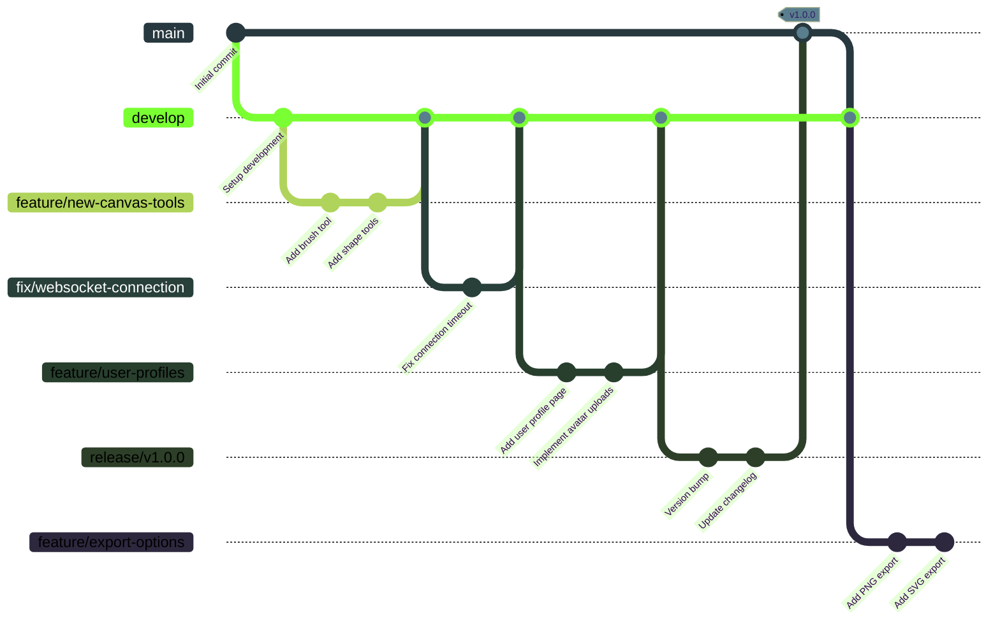
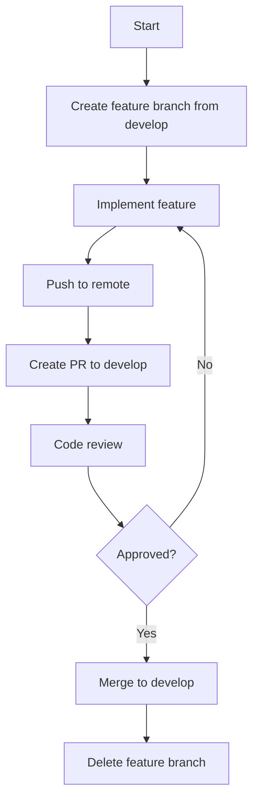
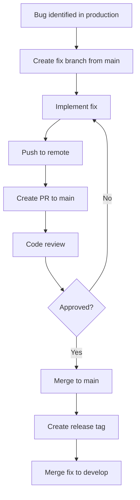
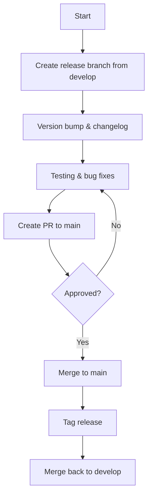

# GitHub Workflow Diagram

The following diagram illustrates the recommended Git branching and workflow strategy for the SketchyChain project:



## Key Workflows

### Feature Development



### Hotfix Process



### Release Process



## CI/CD Pipeline

```mermaid
flowchart LR
    A[Push to repository] --> B[GitHub Actions]
    B --> C{Branch?}
    C -->|feature/*| D[Run tests & lint]
    C -->|develop| E[Deploy to staging]
    C -->|main| F[Deploy to production]
    D --> G{Pass?}
    G -->|Yes| H[Ready for PR]
    G -->|No| I[Fix issues]
    I --> A
    E --> J[Integration testing]
    F --> K[Monitoring]