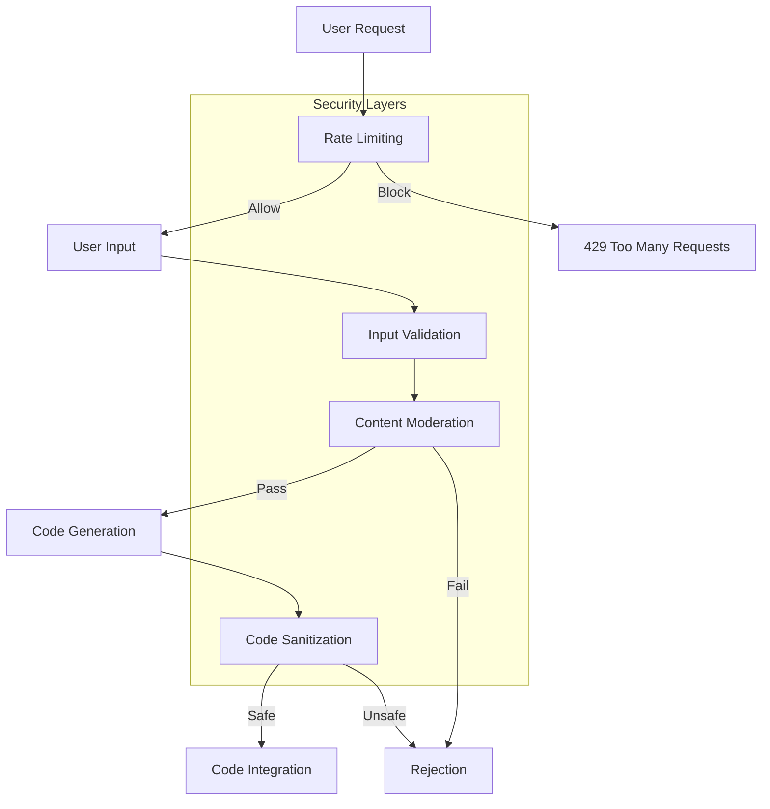
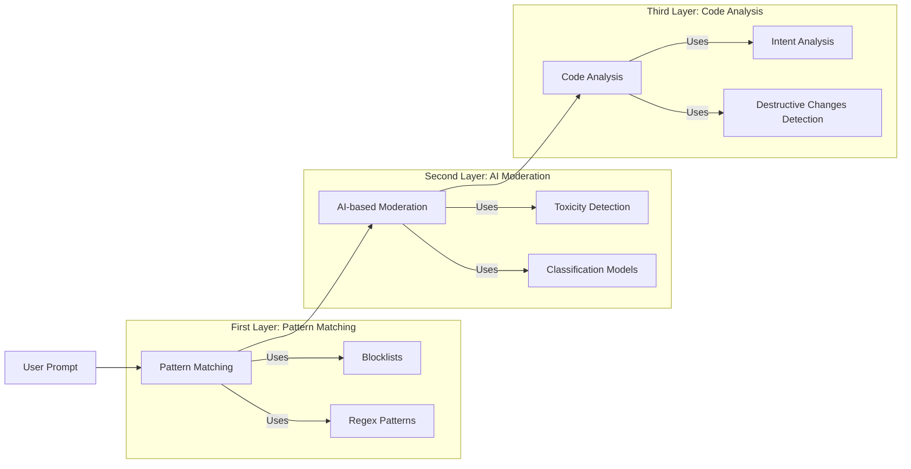
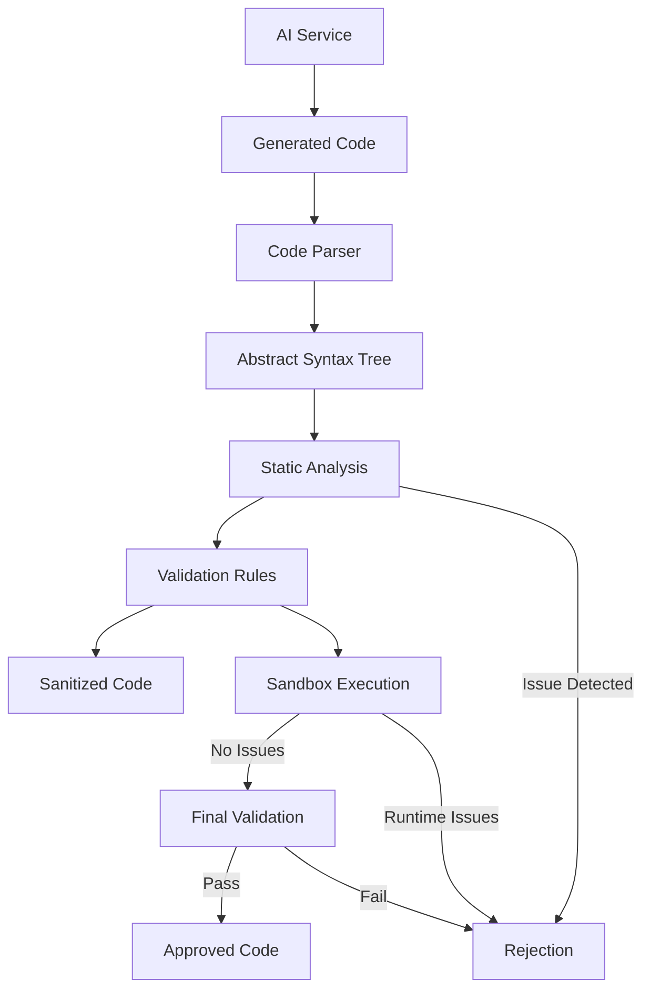
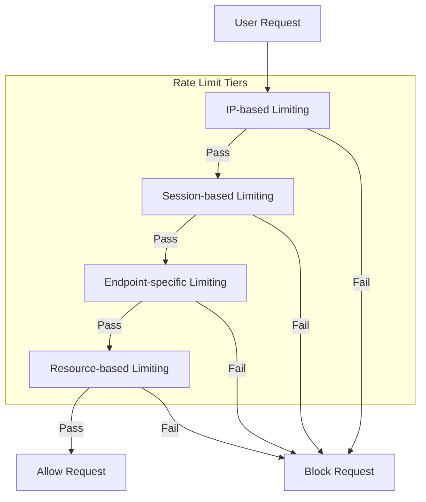

# Security and Content Moderation

This document outlines the security and content moderation strategies for the Sketchy Chain application, focusing on preventing abuse, protecting user safety, and ensuring the integrity of the collaborative creative environment.

## Overview

The application faces several security and content moderation challenges:

1. **Prompt Filtering**: Preventing inappropriate, offensive, or harmful prompt submissions
2. **Code Sanitization**: Ensuring generated code cannot execute malicious operations
3. **Rate Limiting**: Preventing abuse through excessive usage
4. **Input Validation**: Ensuring all user inputs are properly validated and sanitized
5. **Real-time Monitoring**: Detecting and addressing problematic content in a collaborative environment



## Prompt Filtering

### Multi-layered Content Moderation Approach

The application implements a multi-layered approach to content moderation:



### Pattern Matching and Blocklists

The first line of defense uses efficient pattern matching:

```javascript
class PatternMatcher {
  constructor() {
    // Blocklists for different categories
    this.profanityList = new Set([/* list of profane terms */]);
    this.dangerousCodePatterns = [
      /eval\s*\(/i,
      /Function\s*\(/i,
      /document\.cookie/i,
      /localStorage/i,
      /sessionStorage/i,
      /indexedDB/i,
      /fetch\s*\(/i,
      /XMLHttpRequest/i,
      /WebSocket/i,
      /navigator\.sendBeacon/i,
      /window\.open/i,
      /window\.location/i,
      /document\.location/i
    ];
    
    this.sensitiveCommands = [
      /drop\s+table/i,
      /delete\s+from/i,
      /insert\s+into/i,
      /exec\s*\(/i,
      /system\s*\(/i,
      /child_process/i
    ];
  }
  
  checkPrompt(prompt) {
    // Check for profanity
    for (const word of prompt.toLowerCase().split(/\s+/)) {
      if (this.profanityList.has(word.replace(/[^a-z]/g, ''))) {
        return {
          isAccepted: false,
          reason: 'Prompt contains inappropriate language'
        };
      }
    }
    
    // Check for dangerous code patterns
    for (const pattern of this.dangerousCodePatterns) {
      if (pattern.test(prompt)) {
        return {
          isAccepted: false,
          reason: 'Prompt contains potentially unsafe code patterns'
        };
      }
    }
    
    // Check for sensitive commands
    for (const pattern of this.sensitiveCommands) {
      if (pattern.test(prompt)) {
        return {
          isAccepted: false,
          reason: 'Prompt contains sensitive commands'
        };
      }
    }
    
    return { isAccepted: true };
  }
}
```

### AI-based Content Moderation

For more nuanced content detection, we integrate with specialized AI moderation services:

```javascript
class AIContentModerator {
  constructor(config) {
    this.moderationService = config.service; // e.g., OpenAI Moderation API
    this.thresholds = config.thresholds || {
      sexual: 0.5,
      hate: 0.5,
      harassment: 0.5,
      violence: 0.6,
      selfHarm: 0.6,
      toxicity: 0.7
    };
  }
  
  async moderateContent(text) {
    try {
      const result = await this.moderationService.analyze(text);
      
      // Check each category against thresholds
      const violations = [];
      
      for (const [category, score] of Object.entries(result.categories)) {
        const threshold = this.thresholds[category] || 0.5;
        if (score > threshold) {
          violations.push({
            category,
            score,
            threshold
          });
        }
      }
      
      if (violations.length > 0) {
        return {
          isAccepted: false,
          reason: 'Content flagged by moderation service',
          violations
        };
      }
      
      return { isAccepted: true };
    } catch (error) {
      console.error('AI moderation error:', error);
      
      // Fail open or closed, depending on configuration
      return this.config.failOpen 
        ? { isAccepted: true, warning: 'Moderation service unavailable' }
        : { isAccepted: false, reason: 'Unable to verify content safety' };
    }
  }
}
```

### Intent Analysis

We analyze prompts to detect destructive intent:

```javascript
class IntentAnalyzer {
  constructor(currentSketch) {
    this.currentSketch = currentSketch;
    this.destructivePatterns = [
      /delete everything/i,
      /remove all/i,
      /start over/i,
      /from scratch/i,
      /erase everything/i,
      /completely different/i
    ];
  }
  
  analyzeIntent(prompt) {
    // Check for explicitly destructive patterns
    for (const pattern of this.destructivePatterns) {
      if (pattern.test(prompt)) {
        return {
          isAccepted: false,
          reason: 'Prompt appears to request destructive changes to the sketch'
        };
      }
    }
    
    // Calculate how much of the sketch is likely to be modified
    const impactScore = this.calculateImpactScore(prompt);
    
    if (impactScore > 0.8) {
      return {
        isAccepted: false,
        reason: 'Prompt would likely replace too much of the existing sketch'
      };
    }
    
    return { isAccepted: true };
  }
  
  calculateImpactScore(prompt) {
    // Use heuristics or ML to estimate how much of the sketch would change
    // This is a simplified placeholder implementation
    let score = 0;
    
    // Count mentions of global changes
    if (/background|canvas|everything|all/i.test(prompt)) {
      score += 0.2;
    }
    
    // Count mentions of specific elements vs. new elements
    const currentElements = this.extractElementsFromSketch(this.currentSketch);
    const mentionedElements = this.extractElementsFromPrompt(prompt);
    
    const newElements = mentionedElements.filter(e => !currentElements.includes(e));
    
    // Higher score if mostly adding new elements rather than modifying existing ones
    score += newElements.length / Math.max(mentionedElements.length, 1) * 0.6;
    
    return Math.min(score, 1.0);
  }
  
  extractElementsFromSketch(sketch) {
    // Parse sketch to identify visual elements
    // Simplified implementation
    return ['circle', 'rectangle', 'line'];
  }
  
  extractElementsFromPrompt(prompt) {
    // Extract mentioned visual elements from prompt
    // Simplified implementation
    const elements = [];
    const patterns = {
      'circle': /circle|ellipse|ball|sphere/i,
      'rectangle': /rect|rectangle|square|box/i,
      'line': /line|path|stroke/i,
      'triangle': /triangle/i,
      'text': /text|write|font/i
    };
    
    for (const [element, pattern] of Object.entries(patterns)) {
      if (pattern.test(prompt)) {
        elements.push(element);
      }
    }
    
    return elements;
  }
}
```

### Moderation Workflow

The moderation workflow combines these different approaches:

```javascript
async function moderatePrompt(prompt, sketch) {
  // First layer: Pattern matching (fast, catches obvious violations)
  const patternMatcher = new PatternMatcher();
  const patternResult = patternMatcher.checkPrompt(prompt);
  
  if (!patternResult.isAccepted) {
    return patternResult;
  }
  
  // Second layer: Intent analysis (checks for destructive intent)
  const intentAnalyzer = new IntentAnalyzer(sketch.currentCode);
  const intentResult = intentAnalyzer.analyzeIntent(prompt);
  
  if (!intentResult.isAccepted) {
    return intentResult;
  }
  
  // Third layer: AI-based moderation (more nuanced, but slower)
  const aiModerator = new AIContentModerator({
    service: moderationService,
    thresholds: {
      sexual: 0.6,
      hate: 0.6,
      harassment: 0.7,
      violence: 0.7,
      selfHarm: 0.8,
      toxicity: 0.7
    },
    failOpen: false
  });
  
  const aiResult = await aiModerator.moderateContent(prompt);
  
  if (!aiResult.isAccepted) {
    return aiResult;
  }
  
  // All checks passed
  return { isAccepted: true };
}
```

## Code Sanitization

### Secure Code Generation Pipeline



### Static Code Analysis

We perform static analysis to identify potentially malicious code:

```javascript
class CodeAnalyzer {
  constructor() {
    this.dangerousNodes = [
      // JavaScript nodes that might indicate malicious intent
      'CallExpression[callee.name="eval"]',
      'CallExpression[callee.name="Function"]',
      'CallExpression[callee.name="setTimeout"][arguments.length=1]',
      'CallExpression[callee.name="setInterval"][arguments.length=1]',
      'MemberExpression[object.name="document"][property.name="cookie"]',
      'MemberExpression[object.name="window"][property.name="location"]',
      'MemberExpression[object.name="document"][property.name="location"]',
      'MemberExpression[object.name="localStorage"]',
      'MemberExpression[object.name="sessionStorage"]',
      'NewExpression[callee.name="XMLHttpRequest"]',
      'NewExpression[callee.name="WebSocket"]',
      'NewExpression[callee.name="Worker"]',
      'NewExpression[callee.name="SharedWorker"]'
    ];
    
    this.allowedP5jsFunctions = new Set([
      // Core P5.js drawing functions
      'createCanvas', 'background', 'fill', 'stroke', 'rect', 'ellipse',
      'line', 'point', 'triangle', 'quad', 'arc', 'circle', 'square',
      'text', 'textSize', 'textFont', 'image', 'loadImage',
      'push', 'pop', 'translate', 'rotate', 'scale', 'shearX', 'shearY',
      'frameRate', 'noStroke', 'noFill', 'strokeWeight', 'colorMode',
      'random', 'noise', 'map', 'constrain', 'lerp',
      'mouseX', 'mouseY', 'pmouseX', 'pmouseY', 'mousePressed', 'mouseIsPressed',
      'keyIsPressed', 'key', 'keyCode',
      'width', 'height', 'frameCount',
      'sin', 'cos', 'tan', 'atan2', 'degrees', 'radians'
      // ... more allowed functions
    ]);
  }
  
  async analyzeCode(code) {
    try {
      // Parse code into AST
      const ast = await parseJavaScript(code);
      
      // Look for dangerous patterns
      const issues = [];
      
      // Check for dangerous nodes
      for (const selector of this.dangerousNodes) {
        const matches = findInAST(ast, selector);
        if (matches.length > 0) {
          issues.push({
            type: 'dangerous_api',
            description: `Detected potentially dangerous API: ${selector}`,
            severity: 'high',
            locations: matches.map(node => ({
              line: node.loc.start.line,
              column: node.loc.start.column
            }))
          });
        }
      }
      
      // Check for non-P5.js function calls
      const allFunctionCalls = findInAST(ast, 'CallExpression[callee.type="Identifier"]');
      for (const call of allFunctionCalls) {
        const functionName = call.callee.name;
        if (!this.allowedP5jsFunctions.has(functionName) && !this.isLocalFunction(ast, functionName)) {
          issues.push({
            type: 'non_p5js_function',
            description: `Called non-P5.js function: ${functionName}`,
            severity: 'medium',
            locations: [{
              line: call.loc.start.line,
              column: call.loc.start.column
            }]
          });
        }
      }
      
      // Check for network requests
      const networkPatterns = findInAST(ast, 'Identifier[name="fetch"]');
      if (networkPatterns.length > 0) {
        issues.push({
          type: 'network_request',
          description: 'Detected network request attempt',
          severity: 'high',
          locations: networkPatterns.map(node => ({
            line: node.loc.start.line,
            column: node.loc.start.column
          }))
        });
      }
      
      // Return analysis results
      return {
        isSecure: issues.length === 0,
        issues
      };
    } catch (error) {
      console.error('Code analysis error:', error);
      return {
        isSecure: false,
        issues: [{
          type: 'parse_error',
          description: `Failed to parse code: ${error.message}`,
          severity: 'high'
        }]
      };
    }
  }
  
  isLocalFunction(ast, functionName) {
    // Check if the function is defined in the code
    const functionDefinitions = findInAST(ast, `FunctionDeclaration[id.name="${functionName}"]`);
    return functionDefinitions.length > 0;
  }
}
```

### Sandbox Execution

For an additional layer of security, we test the code in a sandboxed environment:

```javascript
class CodeSandbox {
  constructor() {
    this.executionTimeout = 5000; // 5 seconds
    this.memoryLimit = 50 * 1024 * 1024; // 50 MB
    this.functionCallLimit = 1000; // Maximum function call count
  }
  
  async testCode(code) {
    return new Promise((resolve) => {
      // Create a sandboxed iframe
      const sandbox = document.createElement('iframe');
      sandbox.style.display = 'none';
      document.body.appendChild(sandbox);
      
      let hasErrors = false;
      let errorMessage = null;
      let executionTimedOut = false;
      
      // Set timeout for long-running code
      const timeout = setTimeout(() => {
        executionTimedOut = true;
        cleanup();
        resolve({
          isSuccessful: false,
          error: 'Execution timed out'
        });
      }, this.executionTimeout);
      
      // Setup error handler
      sandbox.contentWindow.onerror = (message, source, line, col, error) => {
        hasErrors = true;
        errorMessage = message;
      };
      
      // Inject P5.js and the code
      const doc = sandbox.contentWindow.document;
      doc.open();
      doc.write(`
        <script src="https://cdn.jsdelivr.net/npm/p5@1.4.0/lib/p5.js"></script>
        <script>
          // Override potentially dangerous functions
          window.fetch = null;
          window.XMLHttpRequest = null;
          window.WebSocket = null;
          window.Worker = null;
          window.SharedWorker = null;
          window.localStorage = null;
          window.sessionStorage = null;
          window.indexedDB = null;
          window.navigator.sendBeacon = null;
          
          // Override window.open and location changes
          window.open = function() { 
            console.error('window.open is disabled');
            return null;
          };
          
          // Count function calls for infinite loop detection
          let functionCallCount = 0;
          const MAX_FUNCTION_CALLS = ${this.functionCallLimit};
          
          // Setup function call counter
          const originalFunctionCall = Function.prototype.call;
          Function.prototype.call = function() {
            functionCallCount++;
            if (functionCallCount > MAX_FUNCTION_CALLS) {
              throw new Error('Maximum function call limit exceeded');
            }
            return originalFunctionCall.apply(this, arguments);
          };
          
          // Monitor memory usage
          const memoryLimit = ${this.memoryLimit};
          
          // Test code
          try {
            ${code}
            
            // Signal completion after a short delay
            setTimeout(() => {
              window.parent.postMessage({
                hasErrors: false,
                setupDefined: typeof setup === 'function',
                drawDefined: typeof draw === 'function',
                functionCalls: functionCallCount
              }, '*');
            }, 100);
          } catch (error) {
            window.parent.postMessage({
              hasErrors: true,
              errorMessage: error.message,
              functionCalls: functionCallCount
            }, '*');
          }
        </script>
      `);
      doc.close();
      
      // Listen for results
      window.addEventListener('message', (event) => {
        if (executionTimedOut) return;
        
        clearTimeout(timeout);
        const result = event.data;
        
        cleanup();
        
        if (result.hasErrors) {
          resolve({
            isSuccessful: false,
            error: result.errorMessage || 'Unknown error during execution'
          });
        } else if (!result.setupDefined || !result.drawDefined) {
          resolve({
            isSuccessful: false,
            error: 'Missing required setup() or draw() functions'
          });
        } else if (result.functionCalls >= this.functionCallLimit) {
          resolve({
            isSuccessful: false,
            error: 'Code appears to contain an infinite loop'
          });
        } else {
          resolve({
            isSuccessful: true,
            functionCalls: result.functionCalls
          });
        }
      }, { once: true });
      
      // Cleanup function
      function cleanup() {
        clearTimeout(timeout);
        if (sandbox && sandbox.parentNode) {
          document.body.removeChild(sandbox);
        }
      }
    });
  }
}
```

### Complete Code Validation Pipeline

```javascript
async function validateCode(generatedCode) {
  // Step 1: Static analysis
  const codeAnalyzer = new CodeAnalyzer();
  const analysisResult = await codeAnalyzer.analyzeCode(generatedCode);
  
  if (!analysisResult.isSecure) {
    return {
      isValid: false,
      reason: 'Security issues detected in the generated code',
      issues: analysisResult.issues
    };
  }
  
  // Step 2: Structure validation
  if (!generatedCode.includes('function setup()') || !generatedCode.includes('function draw()')) {
    return {
      isValid: false,
      reason: 'Generated code is missing required P5.js structure'
    };
  }
  
  // Step 3: Sandbox testing
  const sandbox = new CodeSandbox();
  const sandboxResult = await sandbox.testCode(generatedCode);
  
  if (!sandboxResult.isSuccessful) {
    return {
      isValid: false,
      reason: `Runtime error in generated code: ${sandboxResult.error}`
    };
  }
  
  // All validations passed
  return {
    isValid: true
  };
}
```

## Rate Limiting

### Multi-tiered Rate Limiting Strategy

The application implements a multi-tiered approach to rate limiting:



### Implementation

```javascript
class RateLimiter {
  constructor(redisClient) {
    this.redis = redisClient;
    this.limiters = {
      ip: {
        windowMs: 60 * 60 * 1000, // 1 hour
        maxRequests: 1000 // 1000 requests per hour per IP
      },
      session: {
        windowMs: 60 * 60 * 1000, // 1 hour
        maxRequests: 500 // 500 requests per hour per session
      },
      prompt: {
        windowMs: 60 * 60 * 1000, // 1 hour
        maxRequests: {
          anonymous: 5, // 5 prompts per hour for anonymous users
          authenticated: 20 // 20 prompts per hour for authenticated users
        }
      },
      sketch: {
        windowMs: 10 * 60 * 1000, // 10 minutes
        maxRequests: 3 // 3 new sketches per 10 minutes
      }
    };
  }
  
  async checkLimit(type, identifier, increment = true) {
    const limiter = this.limiters[type];
    if (!limiter) {
      throw new Error(`Unknown rate limiter type: ${type}`);
    }
    
    const key = `ratelimit:${type}:${identifier}`;
    const now = Date.now();
    const windowStartTime = now - limiter.windowMs;
    
    // Clean up old entries and get current count
    const multi = this.redis.multi();
    multi.zremrangebyscore(key, 0, windowStartTime);
    multi.zcard(key);
    
    if (increment) {
      multi.zadd(key, now, `${now}-${Math.random()}`);
      multi.expire(key, Math.ceil(limiter.windowMs / 1000));
    }
    
    const results = await multi.exec();
    const currentCount = results[1][1];
    
    // Determine max requests based on type
    let maxRequests = limiter.maxRequests;
    if (typeof maxRequests === 'object') {
      // For types with different limits based on auth status
      maxRequests = maxRequests[identifier.includes(':auth:') ? 'authenticated' : 'anonymous'];
    }
    
    const remaining = Math.max(0, maxRequests - currentCount);
    const resetTime = now + limiter.windowMs;
    
    return {
      isAllowed: currentCount < maxRequests,
      limit: maxRequests,
      remaining,
      reset: resetTime,
      retryAfter: remaining > 0 ? 0 : Math.ceil((resetTime - now) / 1000)
    };
  }
  
  async limitRequest(req, res, next) {
    const ip = req.ip || req.connection.remoteAddress;
    const sessionId = req.session?.id || 'anonymous';
    const userId = req.user?.id || 'anonymous';
    
    // Check IP-based limit
    const ipResult = await this.checkLimit('ip', ip);
    if (!ipResult.isAllowed) {
      return sendRateLimitResponse(res, ipResult, 'Too many requests from your IP address');
    }
    
    // Check session-based limit
    const sessionResult = await this.checkLimit('session', sessionId);
    if (!sessionResult.isAllowed) {
      return sendRateLimitResponse(res, sessionResult, 'Too many requests from your session');
    }
    
    // For specific endpoints, check additional limits
    if (req.path.includes('/api/v1/sketches') && req.method === 'POST') {
      // New sketch creation
      const sketchResult = await this.checkLimit('sketch', `${userId}:sketch`);
      if (!sketchResult.isAllowed) {
        return sendRateLimitResponse(res, sketchResult, 'You\'re creating sketches too quickly');
      }
    } else if (req.path.includes('/prompts') && req.method === 'POST') {
      // Prompt submission
      const promptResult = await this.checkLimit('prompt', `${userId}:auth:${!!req.user}`);
      if (!promptResult.isAllowed) {
        return sendRateLimitResponse(res, promptResult, 'You\'ve submitted too many prompts recently');
      }
    }
    
    // Set rate limit headers and continue
    setRateLimitHeaders(res, ipResult);
    next();
  }
}

function sendRateLimitResponse(res, limitResult, message) {
  setRateLimitHeaders(res, limitResult);
  
  return res.status(429).json({
    error: {
      code: 'rate_limited',
      message: message || 'Too many requests',
      details: {
        retryAfter: limitResult.retryAfter,
        reset: new Date(limitResult.reset).toISOString()
      }
    }
  });
}

function setRateLimitHeaders(res, limitResult) {
  res.set({
    'X-RateLimit-Limit': limitResult.limit,
    'X-RateLimit-Remaining': limitResult.remaining,
    'X-RateLimit-Reset': Math.ceil(limitResult.reset / 1000),
    'Retry-After': limitResult.retryAfter > 0 ? limitResult.retryAfter : null
  });
}
```

### Burst Control and Token Bucket Implementation

For more granular control, we can implement a token bucket algorithm:

```javascript
class TokenBucket {
  constructor(redis, options) {
    this.redis = redis;
    this.capacity = options.capacity || 10;
    this.refillRate = options.refillRate || 1; // tokens per second
    this.refillTime = options.refillTime || 1; // refill interval in seconds
    this.tokensPerRefill = this.refillRate * this.refillTime;
  }
  
  async consume(key, tokens = 1) {
    const now = Date.now();
    const bucketKey = `tokenbucket:${key}`;
    
    // Get current bucket state
    const bucket = await this.redis.hgetall(bucketKey) || {
      tokens: this.capacity,
      lastRefill: now
    };
    
    // Convert string values to numbers
    bucket.tokens = parseFloat(bucket.tokens) || this.capacity;
    bucket.lastRefill = parseInt(bucket.lastRefill) || now;
    
    // Calculate tokens to refill based on time elapsed
    const elapsedSeconds = (now - bucket.lastRefill) / 1000;
    const tokensToRefill = Math.floor(elapsedSeconds / this.refillTime) * this.tokensPerRefill;
    
    // Refill the bucket, but don't exceed capacity
    if (tokensToRefill > 0) {
      bucket.tokens = Math.min(bucket.tokens + tokensToRefill, this.capacity);
      bucket.lastRefill = now - (elapsedSeconds % this.refillTime) * 1000;
    }
    
    // Check if enough tokens are available
    if (bucket.tokens < tokens) {
      // Not enough tokens
      const waitTime = Math.ceil(((tokens - bucket.tokens) / this.refillRate) * 1000);
      
      return {
        isAllowed: false,
        tokens: bucket.tokens,
        waitTime
      };
    }
    
    // Consume tokens and update bucket
    bucket.tokens -= tokens;
    
    // Save bucket state
    await this.redis.hmset(bucketKey, {
      tokens: bucket.tokens,
      lastRefill: bucket.lastRefill
    });
    
    // Set expiry to avoid memory leaks
    await this.redis.expire(bucketKey, Math.ceil(this.capacity / this.refillRate) * 2);
    
    return {
      isAllowed: true,
      tokens: bucket.tokens,
      waitTime: 0
    };
  }
}
```

## Input Validation and Sanitization

### Request Validation Framework

For all API requests, we implement a comprehensive validation framework:

```javascript
const Joi = require('joi');

// Define validation schemas for different API endpoints
const validationSchemas = {
  '/api/v1/sketches': {
    POST: Joi.object({
      title: Joi.string().min(3).max(100).required(),
      description: Joi.string().max(500).allow(''),
      settings: Joi.object({
        canvasWidth: Joi.number().integer().min(100).max(2000).default(800),
        canvasHeight: Joi.number().integer().min(100).max(2000).default(600),
        frameRate: Joi.number().integer().min(1).max(60).default(60),
        isPublic: Joi.boolean().default(true),
        allowAnonymous: Joi.boolean().default(true)
      }).default(),
      baseTemplate: Joi.string().max(100000),
      tags: Joi.array().items(Joi.string().min(1).max(30)).max(5)
    })
  },
  '/api/v1/sketches/:sketchId/prompts': {
    POST: Joi.object({
      text: Joi.string().min(3).max(500).required(),
      nickname: Joi.string().max(30).allow('')
    })
  },
  '/api/v1/sketches/:sketchId': {
    PATCH: Joi.object({
      title: Joi.string().min(3).max(100),
      description: Joi.string().max(500).allow(''),
      settings: Joi.object({
        isPublic: Joi.boolean(),
        allowAnonymous: Joi.boolean()
      }),
      tags: Joi.array().items(Joi.string().min(1).max(30)).max(5)
    }).min(1)
  }
};

// Validation middleware
function validateRequest(req, res, next) {
  // Determine the schema to use
  const path = req.route.path;
  const method = req.method;
  
  const schema = validationSchemas[path]?.[method];
  
  if (!schema) {
    return next();
  }
  
  // Validate the request body
  const { error, value } = schema.validate(req.body, {
    abortEarly: false,
    stripUnknown: true
  });
  
  if (error) {
    const validationErrors = error.details.map(detail => ({
      field: detail.path.join('.'),
      message: detail.message
    }));
    
    return res.status(400).json({
      error: {
        code: 'validation_error',
        message: 'Invalid request data',
        details: validationErrors
      }
    });
  }
  
  // Replace the request body with validated data
  req.body = value;
  next();
}
```

### HTML and JavaScript Sanitization

For any user-generated content that might be displayed in the UI:

```javascript
const DOMPurify = require('dompurify');
const { JSDOM } = require('jsdom');

const window = new JSDOM('').window;
const purify = DOMPurify(window);

function sanitizeHtml(html) {
  return purify.sanitize(html, {
    ALLOWED_TAGS: ['b', 'i', 'em', 'strong', 'a', 'p', 'br'],
    ALLOWED_ATTR: ['href', 'title', 'target'],
    FORBID_TAGS: ['script', 'style', 'iframe', 'form', 'input'],
    FORBID_ATTR: ['style', 'onerror', 'onload', 'onclick']
  });
}

function sanitizeUserInput(input) {
  // Basic sanitization for plain text inputs
  return String(input)
    .replace(/&/g, '&amp;')
    .replace(/</g, '&lt;')
    .replace(/>/g, '&gt;')
    .replace(/"/g, '&quot;')
    .replace(/'/g, '&#039;');
}

// For code examples/snippets that should be displayed but not executed
function sanitizeCodeExample(code) {
  return String(code)
    .replace(/</g, '&lt;')
    .replace(/>/g, '&gt;');
}
```

## User Blocking and Reporting

### Abuse Detection and Prevention

We implement mechanisms to detect and prevent abuse:

```javascript
class AbuseDetector {
  constructor(db) {
    this.db = db;
    this.thresholds = {
      rejectedPrompts: {
        count: 5,
        timeWindow: 60 * 60 * 1000 // 1 hour
      },
      reportedContent: {
        count: 3,
        timeWindow: 24 * 60 * 60 * 1000 // 24 hours
      }
    };
  }
  
  async checkUserStatus(identifier) {
    // Check if user is already banned
    const bannedUser = await this.db.collection('blockedUsers').findOne({
      identifier,
      expiresAt: { $gt: new Date() }
    });
    
    if (bannedUser) {
      return {
        isAllowed: false,
        reason: 'User is temporarily blocked',
        expiresAt: bannedUser.expiresAt
      };
    }
    
    return { isAllowed: true };
  }
  
  async recordRejectedPrompt(identifier, promptId, reason) {
    await this.db.collection('rejectedPrompts').insertOne({
      identifier,
      promptId,
      reason,
      timestamp: new Date()
    });
    
    // Check if threshold is exceeded
    const rejectionCount = await this.db.collection('rejectedPrompts').countDocuments({
      identifier,
      timestamp: {
        $gt: new Date(Date.now() - this.thresholds.rejectedPrompts.timeWindow)
      }
    });
    
    if (rejectionCount >= this.thresholds.rejectedPrompts.count) {
      await this.blockUser(identifier, 'Too many rejected prompts', 24 * 60 * 60 * 1000); // 24 hour block
      return true; // User was blocked
    }
    
    return false; // User was not blocked
  }
  
  async recordReportedContent(identifier, contentId, contentType, reportReason) {
    await this.db.collection('contentReports').insertOne({
      identifier,
      contentId,
      contentType,
      reportReason,
      timestamp: new Date(),
      status: 'pending'
    });
    
    // Check if threshold is exceeded
    const reportCount = await this.db.collection('contentReports').countDocuments({
      identifier,
      timestamp: {
        $gt: new Date(Date.now() - this.thresholds.reportedContent.timeWindow)
      },
      status: { $in: ['pending', 'confirmed'] }
    });
    
    if (reportCount >= this.thresholds.reportedContent.count) {
      await this.blockUser(identifier, 'Multiple content reports', 48 * 60 * 60 * 1000); // 48 hour block
      return true; // User was blocked
    }
    
    return false; // User was not blocked
  }
  
  async blockUser(identifier, reason, duration) {
    await this.db.collection('blockedUsers').insertOne({
      identifier,
      reason,
      createdAt: new Date(),
      expiresAt: new Date(Date.now() + duration)
    });
    
    // Log the action for admin review
    await this.db.collection('adminLogs').insertOne({
      action: 'userBlocked',
      identifier,
      reason,
      duration,
      timestamp: new Date()
    });
    
    // Remove user's active sessions
    await this.db.collection('sessions').updateMany(
      { ipAddress: identifier },
      { $set: { isActive: false } }
    );
  }
}
```

### User Reporting System

We implement a system for users to report inappropriate content:

```javascript
async function reportContent(req, res) {
  const { contentId, contentType, reason } = req.body;
  const reporter = req.user?.id || req.ip;
  
  try {
    // Validate report data
    if (!['prompt', 'sketch', 'user'].includes(contentType)) {
      return res.status(400).json({
        error: {
          code: 'invalid_content_type',
          message: 'Invalid content type'
        }
      });
    }
    
    // Create report record
    const report = {
      contentId,
      contentType,
      reason,
      reporter,
      timestamp: new Date(),
      status: 'pending',
      adminReviewed: false
    };
    
    await db.collection('reports').insertOne(report);
    
    // Check if this content has multiple reports
    const reportCount = await db.collection('reports').countDocuments({
      contentId,
      contentType,
      status: 'pending'
    });
    
    // If content has multiple reports, flag for priority review
    if (reportCount >= 3) {
      await db.collection('contentFlags').updateOne(
        { contentId, contentType },
        { 
          $set: {
            flagged: true,
            reportCount,
            updatedAt: new Date()
          }
        },
        { upsert: true }
      );
      
      // Notify administrators
      await notificationService.notifyAdmins('content_flagged', {
        contentId,
        contentType,
        reportCount
      });
    }
    
    return res.status(200).json({
      success: true,
      message: 'Report submitted successfully'
    });
  } catch (error) {
    console.error('Error reporting content:', error);
    return res.status(500).json({
      error: {
        code: 'server_error',
        message: 'An error occurred while processing your report'
      }
    });
  }
}
```

## Cross-Site Scripting (XSS) Protection

### CSP Configuration

We implement a strong Content Security Policy:

```javascript
// Express middleware for setting CSP headers
function setupCSP(app) {
  app.use((req, res, next) => {
    // Base CSP directives
    const directives = {
      'default-src': ["'self'"],
      'script-src': [
        "'self'",
        'https://cdn.jsdelivr.net', // For P5.js
        'https://cdnjs.cloudflare.com' // For libraries
      ],
      'style-src': ["'self'", 'https://fonts.googleapis.com'],
      'font-src': ["'self'", 'https://fonts.gstatic.com'],
      'img-src': ["'self'", 'data:', 'blob:'],
      'connect-src': ["'self'"],
      'frame-src': ["'none'"],
      'object-src': ["'none'"],
      'base-uri': ["'self'"],
      'form-action': ["'self'"],
      'frame-ancestors': ["'none'"],
      'block-all-mixed-content': true,
      'upgrade-insecure-requests': true
    };
    
    // Allow inline scripts only in development
    if (process.env.NODE_ENV === 'development') {
      directives['script-src'].push("'unsafe-eval'");
      directives['script-src'].push("'unsafe-inline'");
    } else {
      // In production, use nonce for any inline scripts
      const nonce = crypto.randomBytes(16).toString('base64');
      directives['script-src'].push(`'nonce-${nonce}'`);
      res.locals.cspNonce = nonce;
    }
    
    // Build the CSP header value
    const cspString = Object.entries(directives)
      .map(([key, values]) => {
        if (values === true) return key;
        return `${key} ${values.join(' ')}`;
      })
      .join('; ');
    
    // Set headers
    res.setHeader('Content-Security-Policy', cspString);
    res.setHeader('X-Content-Type-Options', 'nosniff');
    res.setHeader('X-Frame-Options', 'DENY');
    res.setHeader('X-XSS-Protection', '1; mode=block');
    res.setHeader('Referrer-Policy', 'strict-origin-when-cross-origin');
    
    next();
  });
}
```

## Cross-Site Request Forgery (CSRF) Protection

```javascript
const csrf = require('csurf');

// CSRF protection middleware
const csrfProtection = csrf({
  cookie: {
    httpOnly: true,
    secure: process.env.NODE_ENV === 'production',
    sameSite: 'strict'
  }
});

// Apply CSRF protection to all state-changing routes
app.post('/api/v1/sketches', csrfProtection, createSketch);
app.post('/api/v1/sketches/:sketchId/prompts', csrfProtection, submitPrompt);
app.patch('/api/v1/sketches/:sketchId', csrfProtection, updateSketch);
app.post('/api/v1/sketches/:sketchId/archive', csrfProtection, archiveSketch);

// Provide CSRF token to frontend
app.get('/api/v1/csrf-token', csrfProtection, (req, res) => {
  res.json({ csrfToken: req.csrfToken() });
});
```

## Security Monitoring and Alerting

### Activity Monitoring

```javascript
class SecurityMonitor {
  constructor(db, notificationService) {
    this.db = db;
    this.notifications = notificationService;
    
    // Thresholds for different security events
    this.thresholds = {
      rejectedPrompts: {
        timeWindow: 10 * 60 * 1000, // 10 minutes
        count: 10
      },
      failedLogins: {
        timeWindow: 10 * 60 * 1000, // 10 minutes
        count: 5
      },
      rateLimitExceeded: {
        timeWindow: 5 * 60 * 1000, // 5 minutes
        count: 20
      }
    };
  }
  
  async recordSecurityEvent(eventType, details) {
    const event = {
      type: eventType,
      details,
      timestamp: new Date()
    };
    
    await this.db.collection('securityEvents').insertOne(event);
    
    // Check for threshold breaches
    if (this.thresholds[eventType]) {
      await this.checkThreshold(eventType);
    }
  }
  
  async checkThreshold(eventType) {
    const threshold = this.thresholds[eventType];
    const timeWindow = new Date(Date.now() - threshold.timeWindow);
    
    const count = await this.db.collection('securityEvents').countDocuments({
      type: eventType,
      timestamp: { $gt: timeWindow }
    });
    
    if (count >= threshold.count) {
      // Threshold exceeded, create alert
      const alert = {
        type: `${eventType}_threshold_exceeded`,
        count,
        threshold: threshold.count,
        timeWindow: threshold.timeWindow,
        timestamp: new Date()
      };
      
      await this.db.collection('securityAlerts').insertOne(alert);
      
      // Notify administrators
      await this.notifications.notifyAdmins('security_alert', alert);
    }
  }
  
  async getRecentAlerts(hours = 24) {
    const timeWindow = new Date(Date.now() - hours * 60 * 60 * 1000);
    
    return this.db.collection('securityAlerts')
      .find({ timestamp: { $gt: timeWindow } })
      .sort({ timestamp: -1 })
      .toArray();
  }
}
```

## Integration with External Security Services

### Example: Integration with reCAPTCHA

```javascript
const axios = require('axios');

class ReCaptchaService {
  constructor(config) {
    this.secretKey = config.secretKey;
    this.verifyUrl = 'https://www.google.com/recaptcha/api/siteverify';
    this.scoreThreshold = config.scoreThreshold || 0.5;
  }
  
  async verifyToken(token, action, ip) {
    try {
      const response = await axios.post(
        this.verifyUrl,
        null,
        {
          params: {
            secret: this.secretKey,
            response: token,
            remoteip: ip
          }
        }
      );
      
      const data = response.data;
      
      if (!data.success) {
        return {
          isValid: false,
          reason: `reCAPTCHA verification failed: ${data['error-codes'].join(', ')}`
        };
      }
      
      // Verify the action matches
      if (data.action !== action) {
        return {
          isValid: false,
          reason: 'reCAPTCHA action mismatch'
        };
      }
      
      // Check the score
      if (data.score < this.scoreThreshold) {
        return {
          isValid: false,
          reason: `reCAPTCHA score too low: ${data.score}`,
          score: data.score
        };
      }
      
      return {
        isValid: true,
        score: data.score
      };
    } catch (error) {
      console.error('reCAPTCHA verification error:', error);
      
      // In case of API failure, decide whether to fail open or closed
      return {
        isValid: false,
        reason: 'reCAPTCHA verification service unavailable'
      };
    }
  }
}

// Example usage in an Express route
async function submitPrompt(req, res) {
  const { text, nickname, recaptchaToken } = req.body;
  const ip = req.ip || req.connection.remoteAddress;
  
  // Verify reCAPTCHA first
  const recaptcha = new ReCaptchaService({
    secretKey: process.env.RECAPTCHA_SECRET_KEY,
    scoreThreshold: 0.5
  });
  
  const recaptchaResult = await recaptcha.verifyToken(recaptchaToken, 'submit_prompt', ip);
  
  if (!recaptchaResult.isValid) {
    return res.status(403).json({
      error: {
        code: 'recaptcha_failed',
        message: 'reCAPTCHA verification failed',
        details: { reason: recaptchaResult.reason }
      }
    });
  }
  
  // If recaptcha score is suspicious but above threshold, apply stricter content moderation
  const moderationThreshold = recaptchaResult.score < 0.7 ? 'strict' : 'normal';
  
  // Continue with prompt processing...
}
```

## Incident Response Plan

The application includes a formalized security incident response plan:

1. **Detection**: Security monitoring tools identify potential incidents
2. **Containment**: Immediate steps to limit damage and isolate affected components
3. **Analysis**: Investigation to understand the nature and extent of the incident
4. **Eradication**: Removal of malicious content and security vulnerabilities
5. **Recovery**: Restoration of normal operations
6. **Post-incident review**: Documentation and improvement of security measures

```javascript
class SecurityIncidentHandler {
  constructor(services) {
    this.db = services.db;
    this.notifications = services.notifications;
    this.rateLimit = services.rateLimit;
    this.contentModerator = services.contentModerator;
  }
  
  async handleIncident(incident) {
    // Record the incident
    const incidentRecord = {
      type: incident.type,
      source: incident.source,
      details: incident.details,
      status: 'detected',
      timestamp: new Date(),
      containmentActions: [],
      analysisNotes: [],
      eradicationActions: [],
      recoveryActions: [],
      resolved: false
    };
    
    const result = await this.db.collection('securityIncidents').insertOne(incidentRecord);
    const incidentId = result.insertedId;
    
    // Implement containment based on incident type
    switch (incident.type) {
      case 'inappropriate_content_detected':
        await this.containInappropriateContent(incidentId, incident);
        break;
      case 'suspicious_user_activity':
        await this.containSuspiciousUser(incidentId, incident);
        break;
      case 'rate_limit_abuse':
        await this.containRateLimitAbuse(incidentId, incident);
        break;
      default:
        await this.logIncidentNote(incidentId, 'No automatic containment available for this incident type');
    }
    
    // Notify security team
    await this.notifications.notifySecurityTeam('security_incident', {
      incidentId,
      type: incident.type,
      timestamp: incidentRecord.timestamp
    });
    
    return incidentId;
  }
  
  // Containment methods
  async containInappropriateContent(incidentId, incident) {
    const { contentId, contentType } = incident.details;
    
    // Hide the content
    await this.db.collection(contentType + 's').updateOne(
      { _id: contentId },
      { $set: { hidden: true, hiddenReason: 'Security incident' } }
    );
    
    // Log the containment action
    await this.logContainmentAction(incidentId, `${contentType} content hidden from public view`);
  }
  
  async containSuspiciousUser(incidentId, incident) {
    const { userId, ipAddress, sessionId } = incident.details;
    
    // Block the user temporarily
    if (userId) {
      await this.db.collection('users').updateOne(
        { _id: userId },
        { $set: { status: 'suspended', suspendedReason: 'Security investigation' } }
      );
      
      await this.logContainmentAction(incidentId, `User ${userId} suspended`);
    }
    
    // Invalidate sessions
    if (sessionId) {
      await this.db.collection('sessions').updateMany(
        { $or: [{ _id: sessionId }, { ipAddress }] },
        { $set: { isActive: false } }
      );
      
      await this.logContainmentAction(incidentId, `Sessions from IP ${ipAddress} invalidated`);
    }
    
    // Add to stricter rate limiting
    if (ipAddress) {
      await this.rateLimit.addToStrictList(ipAddress, 24 * 60 * 60 * 1000); // 24 hours
      await this.logContainmentAction(incidentId, `IP ${ipAddress} added to strict rate limiting`);
    }
  }
  
  // Logging methods
  async logContainmentAction(incidentId, action) {
    await this.db.collection('securityIncidents').updateOne(
      { _id: incidentId },
      { 
        $push: { containmentActions: { action, timestamp: new Date() } },
        $set: { status: 'contained' }
      }
    );
  }
  
  async logIncidentNote(incidentId, note) {
    await this.db.collection('securityIncidents').updateOne(
      { _id: incidentId },
      { $push: { analysisNotes: { note, timestamp: new Date() } } }
    );
  }
}
```

## Summary

This comprehensive security and content moderation strategy addresses the key risks and requirements for the Sketchy Chain application:

1. **Multi-layered Content Moderation**: Combining pattern matching, AI-based moderation, and code analysis
2. **Code Sanitization Pipeline**: Ensuring generated code is safe through static analysis and sandboxed testing
3. **Intelligent Rate Limiting**: Preventing abuse while allowing legitimate users to collaborate
4. **Input Validation**: Thorough validation of all user inputs
5. **XSS and CSRF Protection**: Implementing strong web security headers and CSRF tokens
6. **Security Monitoring**: Detecting and responding to security incidents

By implementing these measures, we create a secure, collaborative environment where users can safely explore creative coding with P5.js while protecting against potential abuse or security vulnerabilities.