# Sketchy Chain - Technical Specifications

## Executive Summary

The Sketchy Chain is a collaborative web application that enables multiple users to create and modify P5.js sketches through text prompts processed by AI. The application integrates real-time collaboration, version history tracking, and automatic code commits to GitHub. This document provides comprehensive technical specifications for the system, detailing the architecture, data models, workflows, and integration points.

## System Overview

The Sketchy Chain is built on a modern, scalable architecture that integrates several key technologies:

- **Frontend**: React.js with P5.js for canvas rendering
- **Backend**: Node.js RESTful API services
- **Real-time Communication**: WebSocket-based collaboration using Socket.IO
- **Database**: MongoDB for document storage with Redis for caching
- **AI Integration**: Processing natural language prompts into P5.js code modifications
- **Version Control**: Automatic GitHub integration for code persistence and history
- **Security**: Multi-layered content moderation and code sanitization

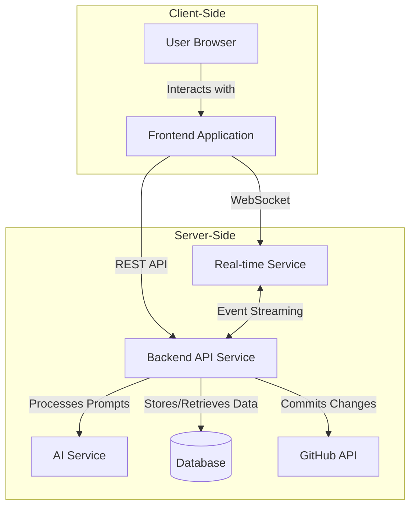

## Core Workflows

### Sketch Creation Workflow

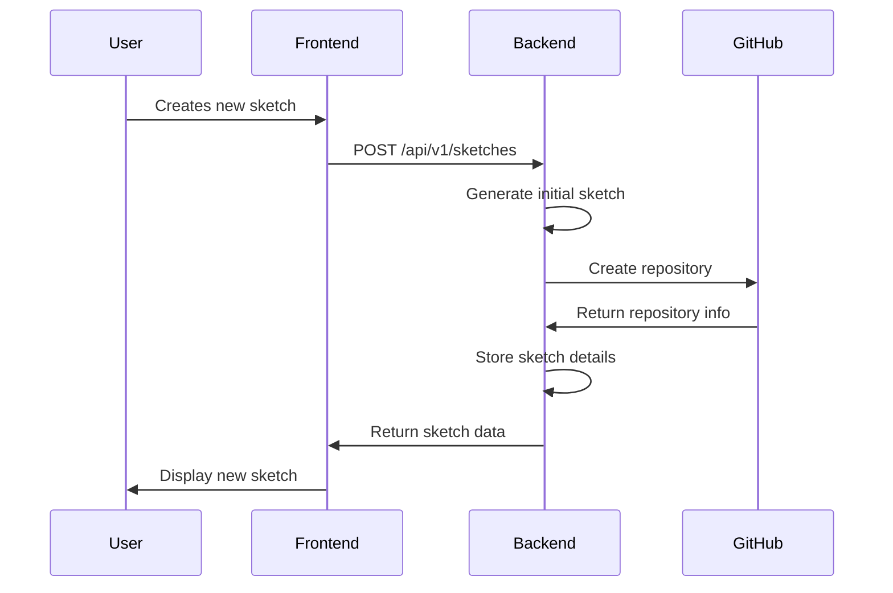

### Prompt Submission and Processing Workflow

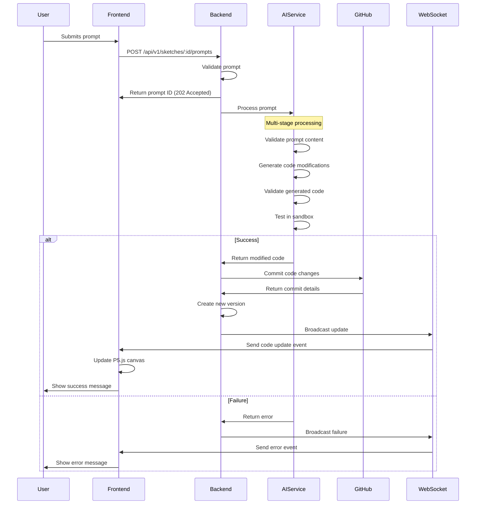

### Real-time Collaboration Workflow

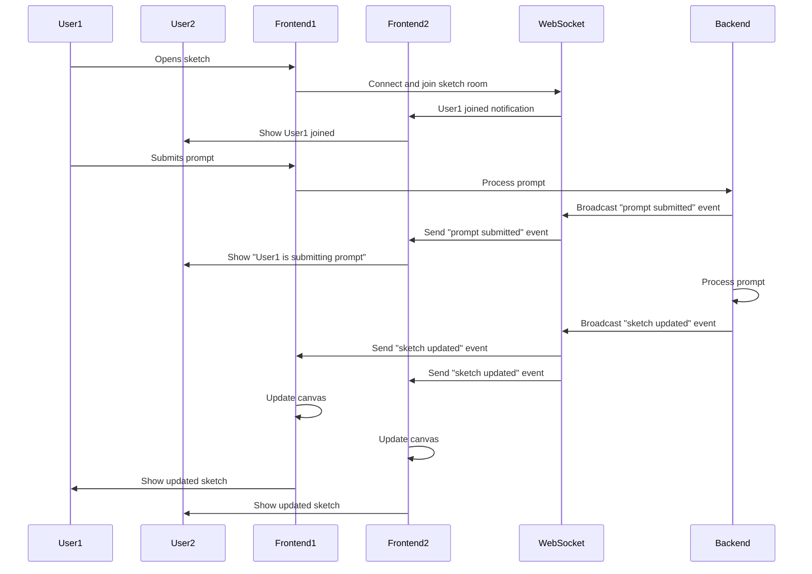

### History Navigation Workflow

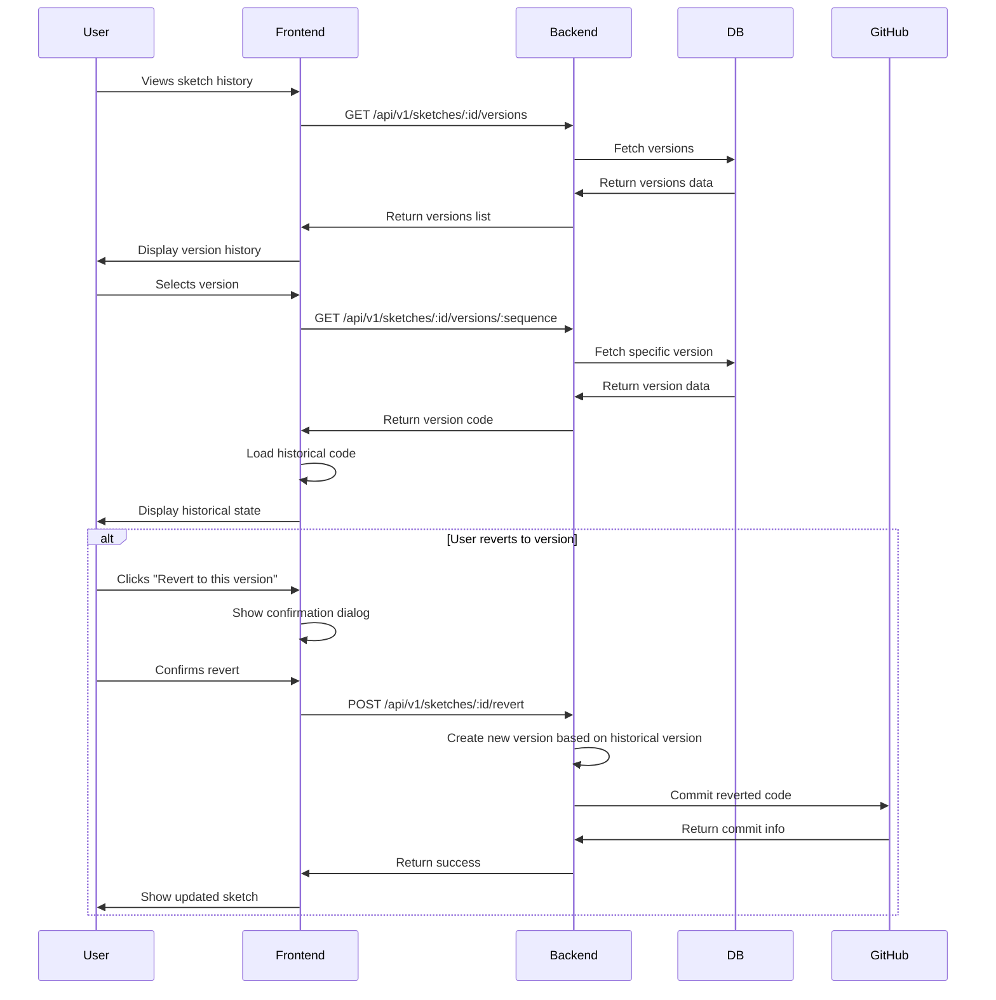

## Component Architecture Details

### Frontend Component Hierarchy

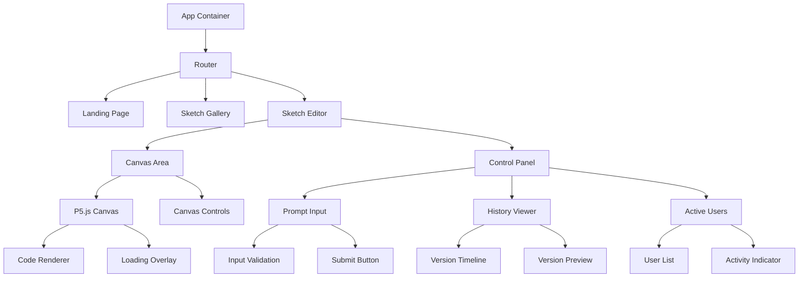

### Backend Service Structure

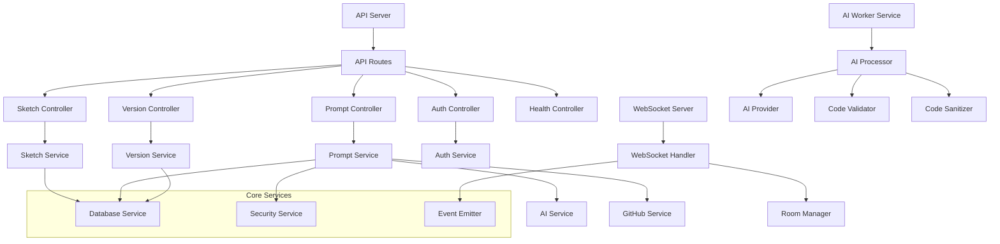

## Data Flow and Integration Points

### AI Integration Flow

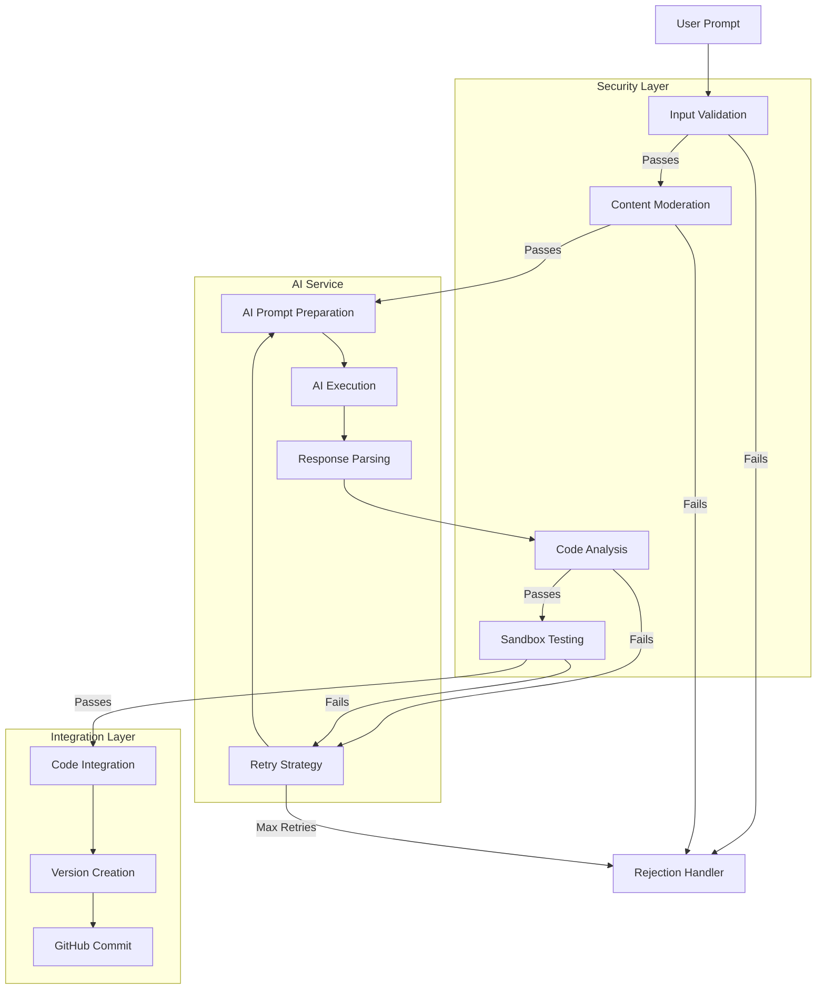

### GitHub Integration Flow

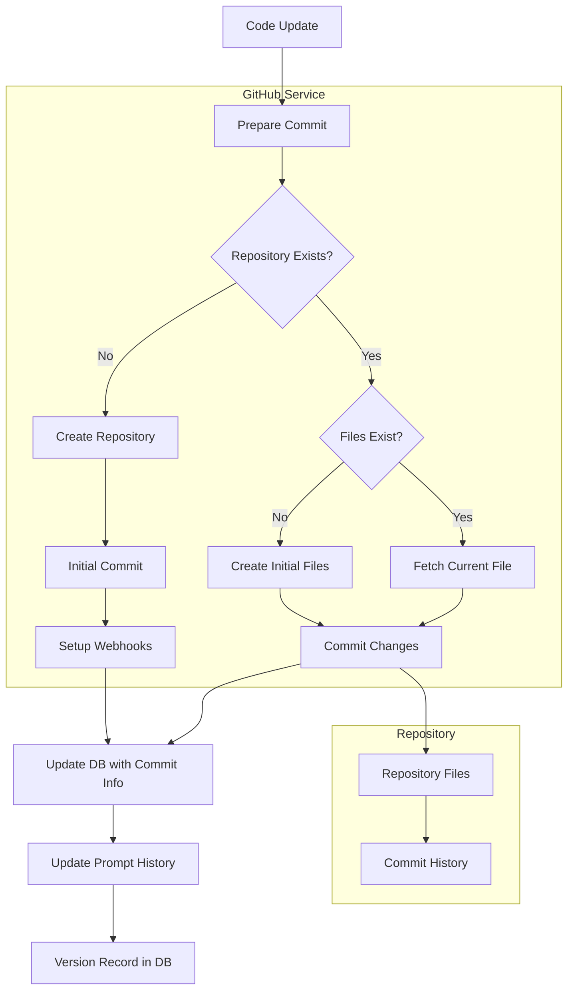

### WebSocket Communication Flow

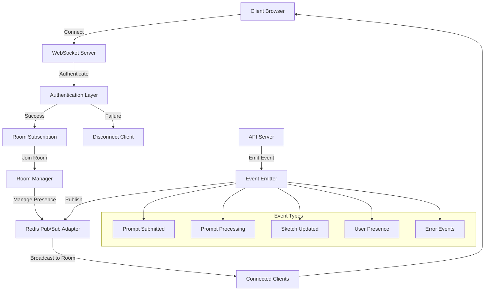

## Security and Content Moderation

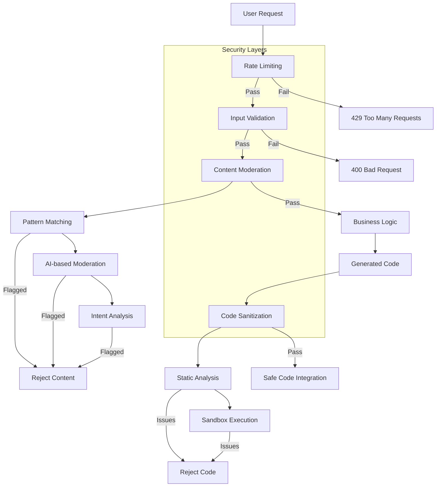

## Database Schema and Relationships

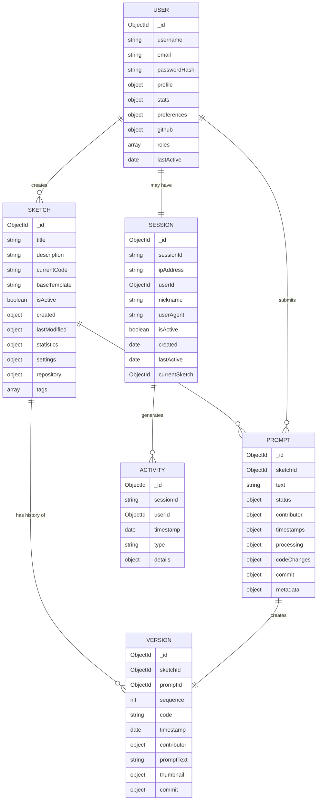

## Deployment Architecture

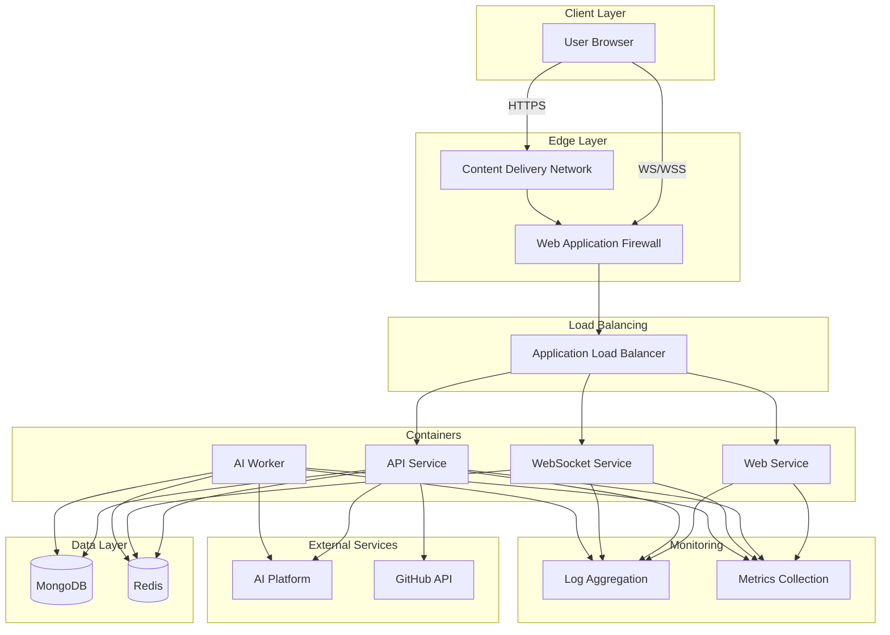

## API Endpoint Reference

| Method | Endpoint | Description | 
|--------|----------|-------------|
| `POST` | `/api/v1/sketches` | Create a new sketch |
| `GET` | `/api/v1/sketches` | List available sketches |
| `GET` | `/api/v1/sketches/:sketchId` | Get sketch details |
| `PATCH` | `/api/v1/sketches/:sketchId` | Update sketch metadata |
| `POST` | `/api/v1/sketches/:sketchId/archive` | Archive a sketch |
| `POST` | `/api/v1/sketches/:sketchId/prompts` | Submit a new prompt |
| `GET` | `/api/v1/prompts/:promptId` | Get prompt status |
| `GET` | `/api/v1/sketches/:sketchId/prompts` | List prompts for a sketch |
| `GET` | `/api/v1/sketches/:sketchId/versions` | Get version history |
| `GET` | `/api/v1/sketches/:sketchId/versions/:sequence` | Get specific version |
| `POST` | `/api/v1/sessions` | Start a new session |
| `PATCH` | `/api/v1/sessions/:sessionId` | Update session information |

## WebSocket Events

| Event Type | Direction | Description |
|------------|-----------|-------------|
| `subscribe` | Client → Server | Subscribe to sketch room |
| `unsubscribe` | Client → Server | Unsubscribe from sketch room |
| `prompt:submitted` | Server → Client | Notify when a prompt is submitted |
| `prompt:status_update` | Server → Client | Update on prompt processing status |
| `sketch:updated` | Server → Client | Notify when sketch is updated |
| `presence:update` | Server → Client | User joined/left notification |
| `activity` | Client → Server | User activity update |
| `heartbeat` | Client → Server | Connection keepalive |

## Technical Decisions and Rationale

### Architecture Decisions

1. **Microservices Approach**
   - **Decision**: Split functionality into separate services (API, WebSocket, AI Workers)
   - **Rationale**: Allows independent scaling, fault isolation, and technology flexibility
   - **Alternative Considered**: Monolithic application (rejected due to scaling limitations)

2. **MongoDB for Data Storage**
   - **Decision**: Use MongoDB as the primary database
   - **Rationale**: Document structure matches application data model; supports scaling via sharding
   - **Alternative Considered**: PostgreSQL (rejected due to need for flexible schema evolution)

3. **Redis for Real-time and Caching**
   - **Decision**: Use Redis for caching, session storage, and WebSocket communication
   - **Rationale**: High performance, pub/sub capabilities, and distributed state management
   - **Alternative Considered**: In-memory caching (rejected due to multi-server deployment)

4. **Containerization with Docker and Kubernetes**
   - **Decision**: Package all services in Docker containers, orchestrate with Kubernetes
   - **Rationale**: Consistent environments, scalability, and deployment flexibility
   - **Alternative Considered**: VM-based deployment (rejected due to resource inefficiency)

### AI Integration Decisions

1. **Multi-Model Support**
   - **Decision**: Support multiple AI models (OpenAI, Anthropic, Llama)
   - **Rationale**: Avoid vendor lock-in, optimize for cost/performance
   - **Alternative Considered**: Single model integration (rejected for reliability/cost reasons)

2. **Sandbox Testing**
   - **Decision**: Test all generated code in an isolated sandbox before integration
   - **Rationale**: Critical security requirement to prevent malicious code execution
   - **Alternative Considered**: Relying solely on static analysis (rejected as insufficient)

3. **Retry Strategy with Adaptive Prompts**
   - **Decision**: Implement retry mechanism with prompts refined based on error patterns
   - **Rationale**: Improves success rate and handles AI service variability
   - **Alternative Considered**: Simple retry without refinement (rejected due to lower success rate)

### Real-time Collaboration Decisions

1. **Socket.IO with Redis Adapter**
   - **Decision**: Use Socket.IO with Redis adapter for WebSocket communication
   - **Rationale**: Reliable, scalable real-time communication with fallback transport
   - **Alternative Considered**: Raw WebSockets (rejected due to lack of reconnection handling)

2. **Room-Based Collaboration Model**
   - **Decision**: Organize collaboration around "rooms" for each sketch
   - **Rationale**: Natural organization unit that scales well for targeted updates
   - **Alternative Considered**: Global broadcast (rejected due to unnecessary message volume)

## Development Roadmap

### Phase 1: MVP Implementation (8 weeks)

1. Core Infrastructure Setup
   - Set up development environment and CI/CD pipeline
   - Implement basic API architecture and database models
   - Create frontend application shell with routing

2. Basic P5.js Integration
   - Implement P5.js canvas component
   - Create sketch creation and viewing functionality
   - Build initial sketch management screens

3. Prompt Processing
   - Integrate with AI service for basic prompt processing
   - Implement code generation and validation
   - Create prompt submission UI

4. Version History
   - Implement version tracking and storage
   - Create history viewer component
   - Add ability to view historical sketch states

### Phase 2: Collaboration and Integration (6 weeks)

1. Real-time Collaboration
   - Implement WebSocket server with room-based communication
   - Create presence indicators and real-time updates
   - Develop active users component

2. GitHub Integration
   - Implement repository creation and management
   - Add automatic code commit functionality
   - Create commit history tracking

3. Enhanced Security
   - Implement content moderation pipeline
   - Add code sanitization and sandbox testing
   - Create rate limiting and input validation

### Phase 3: Refinement and Scale (4 weeks)

1. Performance Optimization
   - Implement caching strategy
   - Optimize database queries and indexes
   - Add frontend performance improvements

2. Deployment Architecture
   - Configure container orchestration
   - Set up monitoring and logging
   - Implement auto-scaling

3. User Experience Enhancements
   - Add responsive design improvements
   - Implement accessibility features
   - Create onboarding and help resources

## Implementation Guidelines

### Coding Standards

1. **JavaScript/TypeScript**
   - Use ES6+ features with TypeScript for type safety
   - Follow Airbnb style guide with customizations
   - Implement proper error handling and logging

2. **React Components**
   - Use functional components with hooks
   - Implement component composition over inheritance
   - Follow container/presentational pattern where appropriate

3. **API Design**
   - Follow RESTful principles for resource endpoints
   - Use consistent error response format
   - Include proper documentation with OpenAPI/Swagger

### Testing Strategy

1. **Unit Testing**
   - Target 80%+ code coverage
   - Focus on business logic and utility functions
   - Use Jest for JavaScript/TypeScript testing

2. **Integration Testing**
   - Test API endpoints with supertest
   - Verify database interactions
   - Ensure proper error handling

3. **UI Testing**
   - Component testing with React Testing Library
   - User flow testing with Cypress
   - Accessibility testing with axe-core

### Documentation Requirements

1. **API Documentation**
   - OpenAPI/Swagger specifications for all endpoints
   - Include example requests and responses
   - Document error codes and handling

2. **Component Documentation**
   - Document component props and usage
   - Include example implementations
   - Note accessibility considerations

3. **Deployment Documentation**
   - Environment setup instructions
   - Configuration options and defaults
   - Monitoring and troubleshooting guides

## Conclusion

The Sketchy Chain application is a sophisticated system that combines modern web technologies, AI capabilities, and real-time collaboration features. This technical specification provides a comprehensive blueprint for implementation, covering all major components and their interactions.

The design prioritizes:
- Scalability through containerization and microservices
- Security through multi-layered content moderation and code sanitization
- Performance through caching and optimization strategies
- Collaboration through real-time WebSocket communication
- Maintainability through clear component boundaries and well-defined interfaces

By following this technical specification, development teams can implement a robust, scalable, and secure application that enables creative collaboration through AI-assisted P5.js sketch creation.